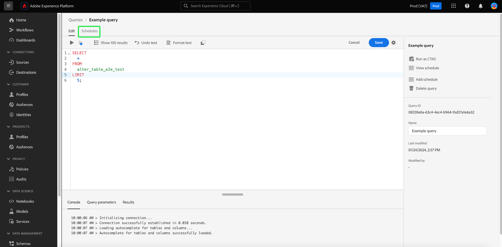

# Programaciones de consultas

Puede automatizar las ejecuciones de consultas creando programaciones de consultas. Las consultas programadas se ejecutan en una cadencia personalizada para administrar los datos en función de la frecuencia, la fecha y la hora. También puede elegir un conjunto de datos de salida para los resultados si es necesario. Las consultas que se han guardado como plantilla se pueden programar desde el Editor de consultas.

>[!IMPORTANT]
>
>Solo puede agregar una programación a una consulta que ya se ha creado, guardado y ejecutado.

Todas las consultas programadas se agregan a la lista de la [!UICONTROL Consultas programadas] pestaña. Desde ese espacio de trabajo, puede monitorizar el estado de todos los trabajos de consulta programados a través de la interfaz de usuario. En el [!UICONTROL Consultas programadas] pestaña puede encontrar información importante sobre las ejecuciones de consultas y suscribirse a alertas. La información disponible incluye el estado, los detalles de la programación y los mensajes/códigos de error en caso de que falle una ejecución. Consulte la [Documento de supervisión de consultas programadas](./monitor-queries.md) para obtener más información.

Este flujo de trabajo cubre el proceso de programación en la interfaz de usuario del servicio de consultas. Para obtener información sobre cómo añadir programaciones mediante la API, lea la [guía de extremo de consultas programadas](../api/scheduled-queries.md).

## Creación de una programación de consultas {#create-schedule}

Para programar una consulta, seleccione una plantilla de consulta de la [!UICONTROL Plantillas] o la pestaña [!UICONTROL Plantilla] de la columna [!UICONTROL Consultas programadas] pestaña. Al seleccionar el nombre de la plantilla, accederá al Editor de consultas.

Si accede a una consulta guardada desde el Editor de consultas, puede crear una programación para la consulta o ver la programación de la consulta desde el panel de detalles.

>[!TIP]
>
>Seleccionar **[!UICONTROL Ver programación]** para desplazarse al espacio de trabajo programaciones y ver si alguna consulta programada se ejecuta de un vistazo.

![El editor de consultas con [!UICONTROL Ver programación] y [!UICONTROL Agregar programación] resaltado.](../images/ui/query-schedules/view-add-schedule.png)

Seleccionar **[!UICONTROL Agregar programación]** para ir al [página de detalles de programación](#schedule-details).

Como alternativa, seleccione la **[!UICONTROL Horarios]** debajo del nombre de la consulta.

Aparecerá el espacio de trabajo programaciones. La interfaz de usuario muestra una lista de las ejecuciones programadas a las que está asociada la plantilla. Seleccionar **[!UICONTROL Agregar programación]** para crear una programación.

### Añadir detalles de programación {#schedule-details}

Aparecerá la página de detalles de la programación. En esta página, puede editar diversos detalles para la consulta programada. Los detalles incluyen [frecuencia y día de la semana de la consulta programada](#scheduled-query-frequency) ejecutar, la fecha de inicio y finalización, el conjunto de datos al que exportar los resultados y [alertas de estado de consulta](#alerts-for-query-status).

#### Frecuencia de consulta programada {#scheduled-query-frequency}

Puede elegir las siguientes opciones para **[!UICONTROL Frecuencia]**:

- **[!UICONTROL Por hora]**: la consulta programada se ejecutará cada hora para el período de fecha seleccionado.
- **[!UICONTROL Diario]**: la consulta programada se ejecutará cada X días a la hora y en el periodo de fecha seleccionados. Tenga en cuenta que la hora seleccionada es **UTC**, y no su zona horaria local.
- **[!UICONTROL Semanalmente]**: la consulta seleccionada se ejecutará los días de la semana, la hora y el período de fecha que haya seleccionado. Tenga en cuenta que la hora seleccionada es **UTC**, y no su zona horaria local.
- **[!UICONTROL Mensual]**: la consulta seleccionada se ejecutará cada mes en el día, la hora y el período de fecha que haya seleccionado. Tenga en cuenta que la hora seleccionada es **UTC**, y no su zona horaria local.
- **[!UICONTROL Anual]**: la consulta seleccionada se ejecutará cada año en el día, el mes, la hora y el período de fecha que haya seleccionado. Tenga en cuenta que la hora seleccionada es **UTC**, y no su zona horaria local.

### Proporcionar detalles del conjunto de datos {#dataset-details}

Administre los resultados de la consulta añadiendo los datos a un conjunto de datos existente o creando un nuevo conjunto de datos y anexándole los datos.

Seleccionar **[!UICONTROL Crear y anexar a un nuevo conjunto de datos]** para crear un conjunto de datos al ejecutar una consulta por primera vez. Las ejecuciones posteriores siguen insertando datos en ese conjunto de datos. Por último, proporcione un nombre y una descripción para el conjunto de datos.

>[!IMPORTANT]
>
> Dado que está utilizando un conjunto de datos existente o está creando uno nuevo, puede hacer lo siguiente **no** debe incluir lo siguiente `INSERT INTO` o `CREATE TABLE AS SELECT` como parte de la consulta, ya que los conjuntos de datos ya están configurados. Incluyendo cualquiera `INSERT INTO` o `CREATE TABLE AS SELECT` como parte de las consultas programadas, producirá un error.

![El panel Detalles de programación con detalles del conjunto de datos y la variable [!UICONTROL Crear y anexar a un nuevo conjunto de datos] opciones resaltadas.](../images/ui/query-schedules/dataset-details-create-and-append.png)

Como alternativa, seleccione **[!UICONTROL Anexar a un conjunto de datos existente]** seguido del icono del conjunto de datos ().

El **[!UICONTROL Seleccionar conjunto de datos de salida]** aparece el cuadro de diálogo.

A continuación, examine los conjuntos de datos existentes o utilice el campo de búsqueda para filtrar las opciones. Seleccione la fila del conjunto de datos que desee utilizar. Los detalles del conjunto de datos se muestran en el panel de la derecha. Seleccionar **[!UICONTROL Listo]** para confirmar su elección.

### Poner en cuarentena las consultas si fallan continuamente {#quarantine}

Al crear una programación, puede inscribir la consulta en la función de cuarentena para salvaguardar los recursos del sistema y evitar posibles interrupciones. La función de cuarentena identifica y aísla automáticamente las consultas que fallan repetidamente colocándolas en una [!UICONTROL En Cuarentena] estado. Al poner en cuarentena las consultas después de diez errores consecutivos, puede intervenir, revisar y corregir los problemas antes de permitir más ejecuciones. Esto contribuye a mantener la eficacia operativa y la integridad de los datos.

![El espacio de trabajo Horarios de consultas con [!UICONTROL Cuarentena de consultas] resaltado y Sí seleccionado.](../images/ui/query-schedules/quarantine-enroll.png)

Una vez que una consulta está inscrita para la función de cuarentena, puede suscribirse a alertas para este cambio de estado de consulta. Si una consulta programada no está inscrita en cuarentena, no aparece como una opción en [el cuadro de diálogo Alertas](./monitor-queries.md#alert-subscription).

También puede inscribir una consulta programada en la función de cuarentena desde las acciones en línea del [!UICONTROL Consultas programadas] pestaña. Consulte la [documentación de supervisión de consultas](./monitor-queries.md#alert-subscription) para obtener más información.

### Definir alertas para un estado de consulta programado {#alerts-for-query-status}

También puede suscribirse a alertas de consulta como parte de la configuración de consultas programadas. Esto significa que recibe notificaciones cuando cambia el estado de la consulta. Las alertas se pueden recibir como notificaciones emergentes o correos electrónicos. Las opciones de alerta de estado de consulta disponibles incluyen inicio, éxito y error. Seleccione la casilla de verificación para suscribirse a las alertas de ese estado de consulta programada.

Para obtener una descripción general de las alertas de Adobe Experience Platform, incluida la estructura de cómo se definen las reglas de alerta, consulte la [información general sobre alertas](../../observability/alerts/overview.md). Para obtener instrucciones sobre la administración de alertas y reglas de alerta dentro de la interfaz de usuario de Adobe Experience Platform, consulte [Guía de IU de alertas](../../observability/alerts/ui.md).

### Definir parámetros para una consulta parametrizada programada {#set-parameters}

>[!IMPORTANT]
>
>La función de IU de consulta parametrizada está disponible actualmente en un **solo versión limitada** y no está disponible para todos los clientes. Si no tiene acceso a las consultas parametrizadas, continúe con el [eliminar o deshabilitar una programación](#delete-schedule) sección.

Si está creando una consulta programada para una consulta parametrizada, debe establecer los valores de parámetro para estas ejecuciones de consulta.

Después de confirmar los detalles de la programación, seleccione **[!UICONTROL Guardar]** para crear una programación. Volverá a la pestaña de programaciones de la plantilla. Esta área de trabajo muestra detalles de la programación recién creada, incluido el ID de programación, la propia programación y el conjunto de datos de salida de la programación.

## Ver ejecuciones de consulta programadas {#scheduled-query-runs}

Desde el de la plantilla [!UICONTROL Horarios] pestaña, seleccione el ID de programación para navegar a la lista de ejecuciones de consulta para la consulta recién programada.

Alternativamente, para ver una lista de las ejecuciones programadas de una plantilla de consulta, vaya a **[!UICONTROL Consultas programadas]** y seleccione un nombre de plantilla de la lista disponible.

Aparecerá la lista de ejecuciones de consulta para esa consulta programada.

Consulte la [guía de monitorización de consultas programadas](./monitor-queries.md#inline-actions) para obtener información completa sobre cómo monitorizar el estado de todos los trabajos de consulta a través de la interfaz de usuario.

Seleccione una **[!UICONTROL ID de ejecución de consulta]** en la lista, vaya a la información general de ejecución de consultas. Para obtener un desglose completo de la información disponible en la [introducción a la ejecución de consultas](./monitor-queries.md#query-run-overview), consulte la documentación de monitorización de consultas programadas.

Para supervisar las consultas programadas mediante la API del servicio de consultas, consulte la [guía de extremos de ejecución de consulta programada](../api/runs-scheduled-queries.md).

## Habilitar, deshabilitar o eliminar una programación {#delete-schedule}

Puede activar, desactivar o eliminar una programación del espacio de trabajo de programaciones de una consulta concreta o del [!UICONTROL Consultas programadas] espacio de trabajo que enumera todas las consultas programadas.

Para acceder a [!UICONTROL Horarios] de la consulta elegida, debe seleccionar el nombre de una plantilla de consulta de la [!UICONTROL Plantillas] o la pestaña [!UICONTROL Consultas programadas] pestaña. Se desplaza al Editor de consultas de esa consulta. En el Editor de consultas, seleccione **[!UICONTROL Horarios]** para acceder al espacio de trabajo programaciones.

Seleccione una programación de las filas de programaciones disponibles para rellenar el panel de detalles. Utilice el conmutador para desactivar (o activar) la consulta programada.

### Eliminar consultas deshabilitadas

>[!IMPORTANT]
>
>Debe deshabilitar la programación para poder eliminar una programación de una consulta.

Aparecerá un cuadro de diálogo de confirmación. Seleccionar **[!UICONTROL Deshabilitar]** para confirmar la acción.

Seleccionar **[!UICONTROL Eliminar una programación]** para eliminar la programación deshabilitada.

Alternativamente, la variable [!UICONTROL Consultas programadas] ofrece una colección de acciones en línea para cada consulta programada. Las acciones en línea disponibles incluyen [!UICONTROL Desactivar programación] o [!UICONTROL Habilitar programación], [!UICONTROL Eliminar programación], y [!UICONTROL Suscribirse] a alertas para la consulta programada. Para obtener instrucciones completas sobre cómo eliminar o deshabilitar una consulta programada a través de la pestaña Consultas programadas, consulte la [guía de monitorización de consultas programadas](./monitor-queries.md#inline-actions).
