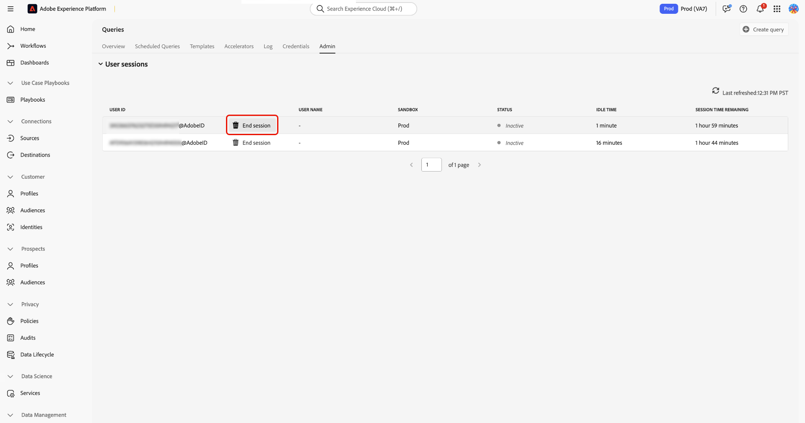
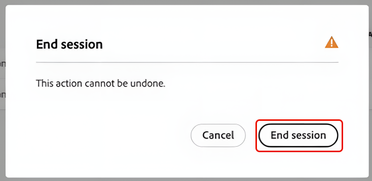

# Administrar sesiones del servicio de consultas

Utilice esta guía para administrar sesiones del servicio de consultas activas desde la interfaz de usuario de Adobe Experience Platform. La administración de sesiones ayuda a los administradores a monitorizar las sesiones simultáneas del Editor de consultas en entornos limitados y a liberar capacidad cuando los usuarios dejan las sesiones abiertas.

## Permisos necesarios para la administración de sesiones {#permissions}

>[!AVAILABILITY]
>
>La administración de sesiones solo está disponible para organizaciones con derechos de Data Distiller.

>[!IMPORTANT]
>
>Esta función está destinada a administradores. Los usuarios finales que ejecutan consultas no pueden administrar sesiones.

Para ver y finalizar sesiones, debe pertenecer a una organización con acceso a Data Distiller y tener asignado el permiso **[!UICONTROL Manage Query Session]**. Los usuarios sin los permisos necesarios pueden acceder al servicio de consultas, pero no pueden ver ni administrar las sesiones activas.

## Ver sesiones activas {#view-active-sessions}

Los administradores pueden ver todas las sesiones activas del servicio de consultas en los entornos limitados de su organización. En Experience Platform, seleccione **[!UICONTROL Queries]** en el panel de navegación izquierdo para abrir el área de trabajo del servicio de consultas y, a continuación, seleccione la pestaña **[!UICONTROL Admin]** para acceder a la administración de sesiones.

La tabla de administración de sesiones se actualiza automáticamente en tiempo real y enumera todas las sesiones que actualmente consumen la capacidad de sesión simultánea del servicio de consultas asignada a su organización. Cada fila representa una sola sesión abierta en el Editor de consultas.

## Estado de la sesión y tiempo de inactividad {#session-status}

La tabla de sesiones proporciona información que le ayudará a decidir si una sesión puede finalizar de forma segura.

| Columna | Descripción |
| --- | --- |
| ID de usuario | El Adobe ID del usuario propietario de la sesión |
| Nombre de usuario | El nombre asociado con el Adobe ID |
| Zona protegida | Indica la zona protegida donde se está ejecutando la sesión |
| Estado de sesión | Muestra si la sesión es **[!UICONTROL Active]** o **[!UICONTROL Inactive]** |
| Tiempo de inactividad | Muestra cuánto tiempo ha estado abierta la sesión sin interacción |
| Tiempo de sesión restante | Indica cuánto tiempo puede permanecer abierta la sesión antes de la caducidad automática |

### Estado de sesión

**[!UICONTROL Inactive]** indica que el usuario no está ejecutando una consulta de forma activa; estas sesiones se pueden finalizar. **[!UICONTROL Active]** indica que se está ejecutando una consulta; el control **[!UICONTROL End session]** no está disponible hasta que finalice la ejecución de la consulta.

### Tiempo de inactividad y tiempo restante de la sesión

El tiempo de inactividad muestra cuánto tiempo se ha abierto una sesión sin interacción del usuario. El tiempo de sesión restante indica cuánto tiempo puede permanecer abierta la sesión antes de que el sistema la cierre automáticamente. Las sesiones caducan automáticamente después de la duración máxima permitida (dos horas de inactividad). Esta duración está definida por el sistema y no se puede configurar.

## Finalizar sesiones inactivas {#end-idle-sessions}

Puede finalizar sesiones inactivas para liberar la capacidad de sesión simultánea de otros usuarios. Considere la posibilidad de finalizar las sesiones con un tiempo de inactividad elevado cuando los usuarios ya no trabajen de forma activa.

En la tabla de administración de sesiones, seleccione **[!UICONTROL End session]** para elegir la sesión inactiva que desea finalizar.

Aparecerá un cuadro de diálogo de confirmación para evitar la terminación accidental. Seleccione **[!UICONTROL End session]** en el cuadro de diálogo para confirmar la acción.

Una vez finalizada la sesión, la sesión se elimina de la tabla, la capacidad está disponible inmediatamente y la acción se registra para la auditoría.

>[!NOTE]
>
>No se pueden finalizar las sesiones con el estado **[!UICONTROL Active]**. Esta protección evita la interrupción de las cargas de trabajo en curso.

## Comportamiento de la sesión tras finalizarla {#session-behavior-after-termination}

Cuando un administrador finaliza una sesión, el código del usuario afectado permanece en el editor sin perder trabajo. Si el usuario intenta ejecutar una consulta después de la finalización, el sistema detecta la sesión finalizada, restablece la conexión automáticamente y mantiene intacto el contenido del Editor de consultas.

Este comportamiento garantiza que los usuarios no pierdan el trabajo escrito en el editor y que puedan continuar una vez establecida una nueva sesión.

## Registros de auditoría para la administración de sesiones {#audit-logs}

El sistema registra las acciones de administración de sesiones para proporcionar visibilidad y responsabilidad. Los registros de auditoría registran el ID de sesión, el usuario cuya sesión ha finalizado, el administrador que ha realizado la acción y la hora de la acción.

Utilice registros de auditoría para revisar el historial de finalización de la sesión e investigar las desconexiones inesperadas.

Para obtener más información sobre cómo ver los registros de auditoría, consulte la [guía de registro de auditoría del servicio de consultas](../data-governance/audit-log-guide.md).

## Próximos pasos {#next-steps}

Tenga en cuenta los siguientes recursos para ampliar el uso del servicio de consultas y el Distiller de datos:

* [Obtenga información sobre cómo los usuarios crean y ejecutan consultas en la guía del usuario del Editor de consultas](user-guide.md)
* [Monitorización de cargas de trabajo programadas mediante la documentación de monitorización de consultas programadas](monitor-queries.md)

