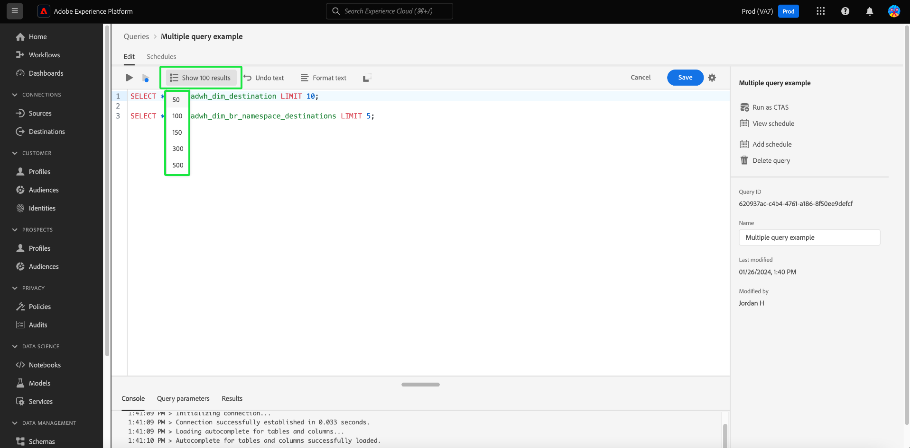

# [!DNL Query Editor] Guía de IU

[!DNL Query Editor] es una herramienta interactiva que proporciona Adobe Experience Platform [!DNL Query Service], que le permite escribir, validar y ejecutar consultas para datos de experiencia del cliente dentro de [!DNL Experience Platform] interfaz de usuario. [!DNL Query Editor] admite el desarrollo de consultas para análisis y exploración de datos, y permite ejecutar consultas interactivas con fines de desarrollo, así como consultas no interactivas para rellenar conjuntos de datos en [!DNL Experience Platform].

Para obtener más información acerca de los conceptos y características de [!DNL Query Service], consulte la [Introducción al servicio de consultas](../home.md). Para obtener más información sobre cómo navegar por la interfaz de usuario del servicio de consultas en [!DNL Platform], consulte la [Introducción a IU del servicio de consultas](./overview.md).

>[!NOTE]
>
>La versión heredada del Editor de consultas no proporciona determinada funcionalidad del Servicio de consultas. Las capturas de pantalla utilizadas en este documento se toman con la versión mejorada del Editor de consultas a menos que se indique lo contrario. Consulte la sección en la [Editor de consultas mejorado](#enhanced-editor-toggle) para obtener más información.

## Introducción {#getting-started}

[!DNL Query Editor] proporciona una ejecución flexible de consultas conectándose a [!DNL Query Service]Las consultas y solo se ejecutan mientras esta conexión está activa.

## Acceso a [!DNL Query Editor] {#accessing-query-editor}

En el [!DNL Experience Platform] IU, seleccione **[!UICONTROL Consultas]** en el menú de navegación de la izquierda para abrir [!DNL Query Service] workspace. A continuación, para empezar a escribir consultas, seleccione **[!UICONTROL Crear consulta]** en la parte superior derecha de la pantalla. Este vínculo está disponible en cualquiera de las páginas del [!DNL Query Service] workspace.

### Conectando con [!DNL Query Service] {#connecting-to-query-service}

El Editor de consultas tarda unos segundos en inicializarse y conectarse al Servicio de consultas cuando se abre. La consola le indica cuándo está conectada, como se muestra a continuación. Si intenta ejecutar una consulta antes de que el editor se haya conectado, retrasará la ejecución hasta que se complete la conexión.

### Ejecución de consultas desde [!DNL Query Editor] {#run-a-query}

Consultas ejecutadas desde [!DNL Query Editor] ejecutar de forma interactiva, lo que significa que si cierra el explorador o sale, la consulta se cancela. Lo mismo ocurre con las consultas realizadas para generar conjuntos de datos a partir de resultados de consultas.

La edición mejorada del Editor de consultas le permite escribir más de una consulta en el Editor de consultas y ejecutar todas las consultas secuencialmente. Consulte la sección sobre [ejecución de varias consultas secuenciales](#execute-multiple-sequential-queries) para obtener más información.

## Creación de consultas mediante [!DNL Query Editor] {#query-authoring}

Uso de [!DNL Query Editor], puede escribir, ejecutar y guardar consultas para datos de experiencia del cliente. Todas las consultas ejecutadas o guardadas en [!DNL Query Editor] están disponibles para todos los usuarios de su organización con acceso a [!DNL Query Service].

>[!IMPORTANT]
>
>El editor anterior se eliminará el 1 de abril de 2024 y ya no estará disponible para su uso.

## Alternancia del editor de consultas mejorado {#enhanced-editor-toggle}

>[!CONTEXTUALHELP]
>id="platform_queryService_queryEditor_enhancedEditorToggle"
>title="Alternativa del editor mejorada"
>abstract="Alterne entre la versión heredada y la mejorada del Editor de consultas. La versión heredada está habilitada de forma predeterminada, aunque la versión mejorada proporciona una mejor accesibilidad y compatibilidad con varios temas. Para obtener más información sobre estos cambios, consulte la documentación."

Un conmutador de interfaz de usuario le permite alternar entre la versión heredada y la mejorada del Editor de consultas. La versión heredada está habilitada de forma predeterminada, aunque la versión mejorada proporciona una mejor accesibilidad y compatibilidad con varios temas. Habilite la versión mejorada para acceder a la configuración del Editor de consultas.

Al activar la opción, el editor cambia al tema claro y mejora la legibilidad de la sintaxis. También aparece un icono de configuración encima del campo de entrada del Editor de consultas que incorpora la opción de autocompletar. Desde el icono de configuración, puede habilitar el tema oscuro o deshabilitar/habilitar el autocompletado.

>[!TIP]
>
>Con el Editor de consultas mejorado, puede [!UICONTROL Deshabilitar autocompletar sintaxis] durante la creación de una consulta sin perder el progreso. Normalmente, si desactiva la función de autocompletar al editar, se perderán todos los cambios en la consulta.

Para habilitar los temas oscuros o claros, seleccione el icono de configuración () seguido de la opción en el menú desplegable que aparece.

### Ejecutar varias consultas secuenciales {#execute-multiple-sequential-queries}

La edición mejorada del Editor de consultas permite escribir más de una consulta en el Editor de consultas y ejecutar todas las consultas de forma secuencial.

La ejecución de varias consultas en una secuencia genera cada una una una entrada de registro. Sin embargo, solo se muestran los resultados de la primera consulta en la consola del Editor de consultas. Consulte el registro de consultas si necesita solucionar problemas o confirmar las consultas que se ejecutaron. Consulte la [documentación de registros de consultas](./query-logs.md) para obtener más información.

>[!NOTE]
> 
>Si se ejecuta una consulta CTAS después de la primera consulta en el Editor de consultas, se seguirá creando una tabla, pero no habrá resultados en la consola del Editor de consultas.

### Ejecutar consulta seleccionada {#execute-selected-query}

Si ha escrito varias consultas pero sólo necesita ejecutar una, puede resaltar la consulta elegida y seleccionar
[!UICONTROL Ejecutar consulta seleccionada] icono. Este icono está desactivado de forma predeterminada hasta que seleccione una sintaxis de consulta en el editor.

![El editor de consultas con [!UICONTROL Ejecutar consulta seleccionada] icono resaltado.](../images/ui/query-editor/run-selected-query.png)

### Recuento de resultados {#result-count}

El Editor de consultas tiene un resultado máximo de 50 000 filas. Puede elegir el número de filas que se muestran a la vez en la consola del Editor de consultas. Para cambiar el número de filas que se muestran en la consola, seleccione la **[!UICONTROL Recuento de resultados]** y seleccione entre las opciones 50, 100, 150, 300 y 500.

## Escritura de consultas {#writing-queries}

[!UICONTROL Editor de consultas] está organizado para que la escritura de consultas sea lo más sencilla posible. La captura de pantalla siguiente muestra cómo aparece el editor en la interfaz de usuario, con el campo de entrada SQL y **Reproducir** resaltado.

Para minimizar el tiempo de desarrollo, se recomienda desarrollar las consultas con límites en la cantidad de filas devueltas. Por ejemplo, `SELECT fields FROM table WHERE conditions LIMIT number_of_rows`. Después de comprobar que la consulta produce el resultado esperado, quite los límites y ejecute la consulta con `CREATE TABLE tablename AS SELECT` para generar un conjunto de datos con la salida.

## Herramientas de escritura en [!DNL Query Editor] {#writing-tools}

- **Resaltado automático de sintaxis:** Facilita la lectura y organización de SQL.

- **Palabra clave SQL autocompletada:** Empiece a escribir la consulta y, a continuación, utilice las teclas de flecha para desplazarse hasta el término deseado y pulse **Entrar**.

- **Autocompletar tabla y campo:** Empiece a escribir el nombre de tabla que desea `SELECT` en, utilice las teclas de flecha para desplazarse a la tabla que está buscando y pulse **Entrar**. Una vez seleccionada una tabla, el completado automático reconoce los campos de esa tabla.

### Dar formato al texto {#format-text}

El [!UICONTROL Dar formato al texto] Esta función hace que la consulta sea más legible al agregar un estilo de sintaxis estandarizado. Seleccionar **[!UICONTROL Dar formato al texto]** para estandarizar todo el texto dentro del Editor de consultas.

![El editor de consultas con [!UICONTROL Dar formato al texto] y las sentencias SQL resaltadas.](../images/ui/query-editor/format-text.png)

<!-- ### Undo text {#undo-text}

If you format your SQL in the Query Editor, you can undo the formatting applied by the [!UICONTROL Format text] feature. To return your SQL back to its original form, select **[!UICONTROL Undo text]**.

![The Query Editor with [!UICONTROL Undo text] and the SQL statements highlighted.](../images/ui/query-editor/undo-text.png) -->

### Copiar SQL {#copy-sql}

Seleccione el icono Copiar para copiar SQL desde el Editor de consultas al portapapeles. Esta función de copia está disponible tanto para plantillas de consulta como para consultas recién creadas en el Editor de consultas.

### Opción de configuración de IU de autocompletar {#auto-complete}

El [!DNL Query Editor] sugiere automáticamente palabras clave SQL potenciales junto con detalles de tabla o columna para la consulta a medida que la escribe. La función de autocompletar está habilitada de forma predeterminada y se puede deshabilitar o habilitar en cualquier momento seleccionando la opción [!UICONTROL Sintaxis autocompletada] en la parte superior derecha del Editor de consultas.

La configuración de autocompletar es por usuario y se recuerda por los inicios de sesión consecutivos de ese usuario.

>[!NOTE]
>
>La opción de autocompletar sintaxis solo está disponible para la versión heredada del Editor de consultas.

Al deshabilitar esta función, se detienen varios comandos de metadatos y se proporcionan recomendaciones que generalmente benefician la velocidad del autor al editar consultas.

Al utilizar la opción para habilitar la función de autocompletar, las sugerencias recomendadas para nombres de tablas y columnas, así como las palabras clave SQL, están disponibles después de una breve pausa. Un mensaje de éxito en la consola debajo del Editor de consultas indica que la función está activa.

Si deshabilita la característica de autocompletar, se requiere una actualización de la página para que la característica surta efecto. Aparecerá un cuadro de diálogo de confirmación con tres opciones cuando desactive la [!UICONTROL Sintaxis autocompletada] alternar :

- [!UICONTROL Cancelar]
- [!UICONTROL Guardar cambios y actualizar]
- [!UICONTROL Actualizar sin guardar los cambios]

>[!IMPORTANT]
>
>Si está escribiendo o editando una consulta al deshabilitar esta función, debe guardar los cambios realizados en la consulta antes de actualizar la página o se perderá todo el progreso.

Para deshabilitar la función de autocompletar, seleccione la opción de confirmación adecuada.

### Detección de errores {#error-detection}

[!DNL Query Editor] valida automáticamente una consulta a medida que la escribe, proporcionando validación SQL genérica y validación de ejecución específica. Si aparece una línea roja de subrayado debajo de la consulta (como se muestra en la imagen siguiente), representa un error dentro de la consulta.

<!-- ... Image below needs updating couldn't replicate the effect -->

Cuando se detectan errores, puede ver los mensajes de error específicos pasando el ratón por encima del código SQL.

<!-- ... Image below needs updating couldn't replicate the effect -->

### Detalles de consulta {#query-details}

Para ver una consulta en el Editor de consultas, seleccione cualquier plantilla guardada de la [!UICONTROL Plantillas] pestaña. El panel de detalles de la consulta proporciona más información y herramientas para administrar la consulta seleccionada. También muestra metadatos útiles, como la última vez que se modificó la consulta y quién la modificó, si corresponde.

>[!NOTE]
>
>El [!UICONTROL Ver programación], [!UICONTROL Agregar programación] y [!UICONTROL Eliminar consulta] Las opciones de solo están disponibles después de que la consulta se haya guardado como plantilla. El [!UICONTROL Agregar programación] le lleva directamente al Generador de programaciones desde el Editor de consultas. El [!UICONTROL Ver programación] lleva directamente al inventario programado para esa consulta. Consulte la documentación de programaciones de consultas para obtener información sobre cómo [crear programaciones de consultas en la interfaz de usuario](./query-schedules.md#create-schedule).

Desde el panel de detalles puede generar un conjunto de datos de salida directamente desde la interfaz de usuario, eliminar o asignar un nombre a la consulta mostrada, ver la programación de ejecución de la consulta y agregar la consulta a una programación.

Para generar un conjunto de datos de salida, seleccione **[!UICONTROL Ejecutar como CTAS]**. El **[!UICONTROL Introducir detalles del conjunto de datos de salida]** aparece el cuadro de diálogo. Introduzca un nombre y una descripción y, a continuación, seleccione **[!UICONTROL Ejecutar como CTAS]**. El nuevo conjunto de datos se muestra en la **[!UICONTROL Conjuntos de datos]** Ficha Examinar. Consulte [la documentación ver conjuntos de datos](../../catalog/datasets/user-guide.md#view-datasets) para obtener más información sobre los conjuntos de datos disponibles para su organización.

>[!NOTE]
>
>El [!UICONTROL Ejecutar como CTAS] La opción solo está disponible si la consulta tiene **no** se ha programado.

![El [!UICONTROL Introducir detalles del conjunto de datos de salida] diálogo.](../images/ui/query-editor/output-dataset-details.png)

Después de ejecutar el **[!UICONTROL Ejecutar como CTAS]** acción, aparece un mensaje de confirmación para notificarle la acción correcta. Este mensaje emergente contiene un vínculo que proporciona una forma cómoda de desplazarse al espacio de trabajo de registros de consultas. Consulte la [documentación de registros de consultas](./query-logs.md) para obtener más información sobre los registros de consultas.

### Guardar consultas {#saving-queries}

El [!DNL Query Editor] proporciona una función de guardado que le permite guardar una consulta y trabajar en ella más adelante. Para guardar una consulta, seleccione **[!UICONTROL Guardar]** en la esquina superior derecha de [!DNL Query Editor]. Para poder guardar una consulta, debe proporcionar un nombre para la consulta utilizando **[!UICONTROL Detalles de consulta]** panel.

>[!NOTE]
>
>Las consultas con nombre y guardadas en mediante el Editor de consultas están disponibles como plantillas en el panel de consultas [!UICONTROL Plantillas] pestaña. Consulte la [documentación de plantillas](./query-templates.md) para obtener más información.

Al guardar una consulta en el Editor de consultas, aparece un mensaje de confirmación para notificarle que la acción se ha realizado correctamente. Este mensaje emergente contiene un vínculo que proporciona una forma cómoda de desplazarse al espacio de trabajo de programación de consultas. Consulte la [documentación de consultas de programación](./query-schedules.md) para aprender a ejecutar consultas en una cadencia personalizada.

### Consultas programadas {#scheduled-queries}

Las consultas que se han guardado como plantilla se pueden programar desde el Editor de consultas. La programación de consultas permite automatizar las ejecuciones de consultas en una cadencia personalizada. Puede programar consultas en función de la frecuencia, la fecha y la hora, y también elegir un conjunto de datos de salida para los resultados si es necesario. Las programaciones de consultas también se pueden deshabilitar o eliminar a través de la interfaz de usuario.

Las programaciones se establecen en el Editor de consultas. Al utilizar el Editor de consultas, sólo puede agregar una programación a una consulta que ya se ha creado, guardado y ejecutado. La misma limitación no se aplica al [!DNL Query Service] API:

Consulte la documentación de programaciones de consultas para obtener información sobre cómo [crear programaciones de consultas en la interfaz de usuario](./query-schedules.md). Como alternativa, para aprender a añadir programaciones mediante la API, lea la [guía de extremo de consultas programadas](../api/scheduled-queries.md).

Todas las consultas programadas se agregan a la lista de la [!UICONTROL Consultas programadas] pestaña. Desde ese espacio de trabajo, puede monitorizar el estado de todos los trabajos de consulta programados a través de la interfaz de usuario. En el [!UICONTROL Consultas programadas] , puede encontrar información importante sobre las ejecuciones de consultas y suscribirse a alertas. La información disponible incluye el estado, los detalles de la programación y los mensajes/códigos de error si falla una ejecución. Consulte la [Documento de supervisión de consultas programadas](./monitor-queries.md) para obtener más información.

### Cómo encontrar consultas anteriores {#previous-queries}

Todas las consultas ejecutadas desde [!DNL Query Editor] se capturan en la Tabla de registro. Puede utilizar la funcionalidad de búsqueda en la **[!UICONTROL Registro]** para buscar ejecuciones de consulta. Las consultas guardadas se enumeran en la variable **[!UICONTROL Plantillas]** pestaña.

Si se ha programado una consulta, la variable [!UICONTROL Consultas programadas] proporciona una visibilidad mejorada a través de la interfaz de usuario para esos trabajos de consulta. Consulte la [documentación de monitorización de consultas](./monitor-queries.md) para obtener más información.

>[!NOTE]
>
>El registro no guarda las consultas que no se ejecutan. Para que la consulta esté disponible en [!DNL Query Service], debe ejecutarse o guardarse en [!DNL Query Editor].

## Ejecución de consultas mediante el Editor de consultas {#executing-queries}

Para ejecutar una consulta en [!DNL Query Editor], puede introducir SQL en el editor o cargar una consulta anterior desde el **[!UICONTROL Registro]** o **[!UICONTROL Plantillas]** y seleccione. **Reproducir**. El estado de ejecución de la consulta se muestra en la variable **[!UICONTROL Consola]** , los datos de salida se muestran en la pestaña **[!UICONTROL Resultados]** pestaña.

### Consola {#console}

La consola proporciona información sobre el estado y el funcionamiento de [!DNL Query Service]. La consola muestra el estado de la conexión a [!DNL Query Service], las operaciones de consulta que se están ejecutando y los mensajes de error resultantes de esas consultas.

>[!NOTE]
>
>La consola solo muestra los errores resultantes de la ejecución de una consulta. No muestra los errores de validación de consultas que se producen antes de ejecutar una consulta.

### Resultados de consulta {#query-results}

Una vez completada la consulta, los resultados se muestran en la variable **[!UICONTROL Resultados]** , junto a la pestaña **[!UICONTROL Consola]** pestaña. Esta vista muestra el resultado tabular de la consulta y muestra entre 50 y 500 filas de resultados según el resultado elegido [recuento de resultados](#result-count). Esta vista le permite comprobar que la consulta produce el resultado esperado. Para generar un conjunto de datos con la consulta, quite los límites de las filas devueltas y ejecute la consulta con `CREATE TABLE tablename AS SELECT` para generar un conjunto de datos con la salida. Consulte la [tutorial de generación de conjuntos de datos](./create-datasets.md) para obtener instrucciones sobre cómo generar un conjunto de datos a partir de los resultados de la consulta en [!DNL Query Editor].

## Ejecutar consultas con [!DNL Query Service] tutorial en vídeo {#query-tutorial-video}

El siguiente vídeo muestra cómo ejecutar consultas en la interfaz de Adobe Experience Platform y en un cliente SQL. En el vídeo también se muestra el uso de propiedades individuales en un objeto XDM, funciones definidas por el Adobe y cómo utilizar CREATE TABLE AS SELECT (CTAS).

>[!VIDEO](https://video.tv.adobe.com/v/29796?quality=12&learn=on)

## Pasos siguientes

Ahora que sabe qué funciones están disponibles en [!DNL Query Editor] y cómo navegar por la aplicación, puede empezar a crear sus propias consultas directamente en [!DNL Platform]. Para obtener más información sobre la ejecución de consultas SQL en conjuntos de datos en [!DNL Data Lake], consulte la guía de [ejecución de consultas](../best-practices/writing-queries.md).
