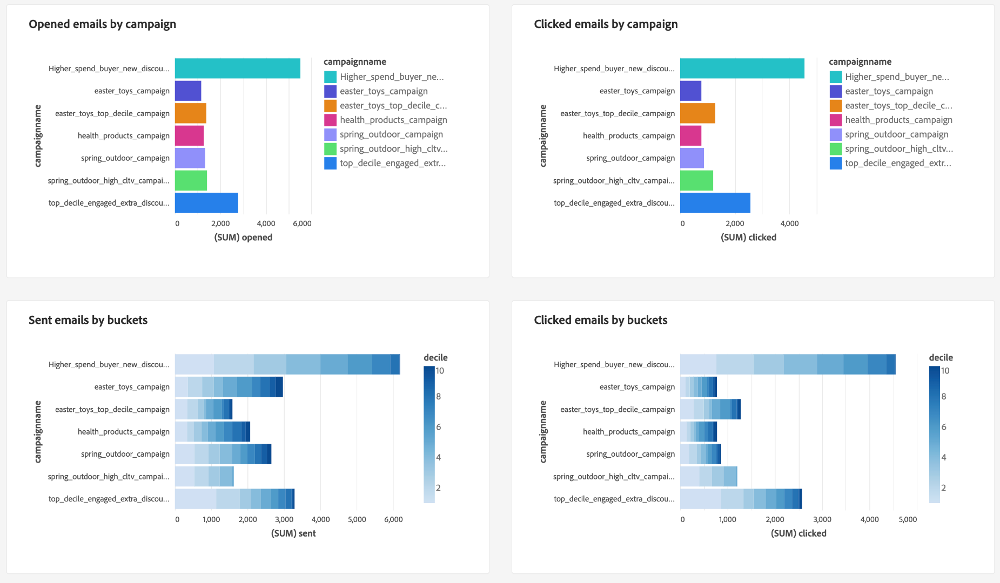

# Seguimiento de señales de datos para generar el valor de duración del cliente

Puede utilizar Real-time Customer Data Platform para hacer un seguimiento del valor de duración del cliente (CLV) y visualizar esa métrica con paneles definidos por el usuario. Gracias al uso de Data Distiller y a los paneles definidos por el usuario, puede medir el valor que tiene un cliente para su empresa en toda su relación. Conocer el CLV puede ayudarle a desarrollar las estrategias de su empresa para adquirir nuevos clientes, manteniendo los existentes y manteniendo los márgenes de beneficio.

La siguiente infografía muestra el ciclo de recopilación, manipulación, análisis y activación de datos que genera datos de alto rendimiento para mejorar sus campañas de marketing.

Este caso de uso de extremo a extremo muestra cómo se pueden capturar y modificar las señales de datos para calcular el atributo derivado del valor de duración del cliente. Estos conjuntos de datos derivados se pueden aplicar a los datos de perfil de Real-Time CDP y están disponibles para su uso con paneles definidos por el usuario para crear un panel para el análisis de perspectivas. A través de Data Distiller, puede ampliar el modelo de datos de perspectivas de Real-Time CDP y utilizar los conjuntos de datos derivados de CLV y las perspectivas de panel para crear una nueva audiencia y activarla en un destino deseado. Estas audiencias de alto rendimiento se pueden usar para impulsar la próxima campaña de marketing.

Esta guía se ha diseñado para ayudarle a comprender mejor la experiencia del cliente mediante la medición de señales de datos en puntos de contacto clave que controlan el CLV y la implementación de un caso de uso similar en su entorno. Todo el proceso se resume en la siguiente imagen.

## Introducción {#getting-started}

Esta guía requiere una comprensión práctica de los siguientes componentes de Adobe Experience Platform:

* [Servicio de consultas](../home.md): Proporciona una interfaz de usuario y una API RESTful donde puede usar consultas SQL para analizar y enriquecer los datos.
* [Servicio de segmentación](../../segmentation/home.md): permite generar audiencias a partir de los datos del perfil del cliente en tiempo real.

## Requisitos previos

Esta guía requiere que tenga el SKU [Data Distiller](../data-distiller/overview.md) como parte de la oferta de paquetes. Si no está seguro de si lo tiene, póngase en contacto con su representante de servicios de Adobe.

## Crear un conjunto de datos derivado {#create-derived-dataset}

El primer paso para establecer el CLV es crear un conjunto de datos derivado a partir de las señales de datos capturadas de las acciones del usuario. Este caso de uso concreto se recoge en un documento independiente sobre un plan de fidelización de aerolínea. Consulte la guía para obtener información sobre cómo [usar el servicio de consulta para crear conjuntos de datos derivados basados en deciles que se utilizarán con los datos de perfil](./deciles-use-case.md). En el documento se proporcionan ejemplos completos y explicaciones que explican los siguientes pasos:

* Cree un esquema para permitir el agrupamiento de deciles.
* Utilice el servicio de consulta para crear deciles.
* Generar conjuntos de datos de deciles.
* Habilite el esquema para utilizarlo en el Perfil del cliente en tiempo real.
* Cree un área de nombres de identidad y márquela como identificador principal.
* Cree una consulta para calcular los deciles en un período retroactivo.

## Ampliación del modelo de datos de perspectivas y programación de actualizaciones {#extend-data-model-and-set-refresh-schedule}

Adobe Real-Time CDP A continuación, debe crear un modelo de datos personalizado o ampliar uno existente para que se involucre con las perspectivas de creación de informes de CLV. Consulte la documentación para aprender a [crear un modelo de datos de perspectivas de informes a través del servicio de consultas para usarlo con datos de almacenamiento acelerados y paneles definidos por el usuario](../data-distiller/customizable-insights/reporting-insights-data-model.md#build-a-reporting-insights-data-model). El tutorial cubre los siguientes pasos:

* Cree un modelo para informar sobre perspectivas con Data Distiller.
* Crear tablas, relaciones y rellenar datos.
* Consulte el modelo de datos de perspectiva de informes.
* Amplíe el modelo de datos con el modelo de datos de perspectivas de Real-Time CDP.
* Cree tablas de dimensiones para ampliar el modelo de perspectivas de creación de informes.
* Consulte el modelo de datos de perspectivas de informes de tienda acelerados extendidos

Consulte la documentación del modelo de datos de Real-time Customer Data Platform Insights para obtener información sobre cómo [personalizar las plantillas de consultas SQL para crear informes de Real-Time CDP para los casos de uso de los indicadores clave de rendimiento (KPI) y marketing](../../dashboards/data-models/cdp-insights-data-model-b2c.md).

Asegúrese de establecer una programación para actualizar el modelo de datos personalizado en una cadencia normal. Esto garantiza que los datos regresen como parte de su canalización de ingesta según sea necesario y rellene los paneles definidos por el usuario. Consulte la [guía de consultas de programación](../ui/query-schedules.md#create-schedule) para obtener información sobre cómo configurar la programación.

## Crear un tablero para capturar información {#build-a-custom-dashboard}

Ahora que ha creado su modelo de datos personalizado, está listo para visualizar los datos con consultas personalizadas y paneles definidos por el usuario. Consulte la información general sobre los paneles definidos por el usuario para obtener instrucciones completas sobre cómo [crear un panel personalizado](../../dashboards/user-defined-dashboards.md). La guía de la interfaz de usuario incluye detalles sobre:

* Cómo crear un widget.
* Cómo usar el compositor de widgets.

A continuación se muestran ejemplos de widgets de CLV personalizados que utilizan contenedores de deciles.

## Crear y activar audiencias de alto rendimiento {#create-and-activate-audiences}

El siguiente paso es crear una definición de segmento y generar audiencias a partir de los datos del perfil del cliente en tiempo real. Consulte la guía de la interfaz de usuario del Generador de segmentos para obtener información sobre cómo [crear y activar audiencias en la plataforma](../../segmentation/ui/segment-builder.md). La guía proporciona secciones sobre cómo:

* Cree definiciones de segmentos utilizando una combinación de atributos, eventos y audiencias existentes como componentes básicos.
* Utilice el lienzo y los contenedores del generador de reglas para controlar el orden en que se ejecutan las reglas de segmentación.
* Vea estimaciones de su audiencia potencial, lo que le permite ajustar sus definiciones de segmento según sea necesario.
* Habilite todas las definiciones de segmentos para la segmentación programada.
* Habilite las definiciones de segmento especificadas para la segmentación de flujo continuo.

También hay un [tutorial en vídeo del generador de segmentos](https://experienceleague.adobe.com/docs/platform-learn/tutorials/audiences/create-segments.html) disponible para obtener más información.

## Activar la audiencia para una campaña de correo electrónico {#activate-audience-for-campaign}

Una vez creada la audiencia, está listo para activarla en un destino. Platform admite una variedad de proveedores de servicios de correo electrónico (ESP) que le permiten administrar sus actividades de marketing por correo electrónico, como enviar campañas de correo electrónico promocionales.

Consulte la [descripción general de los destinos de marketing por correo electrónico](../../destinations/catalog/email-marketing/overview.md#connect-destination) para obtener una lista de los destinos admitidos a los que desea exportar datos (por ejemplo, la página [Oracle Eloqua](../../destinations/catalog/email-marketing/oracle-eloqua-api.md)).

## Ver los datos de análisis devueltos de la campaña {#post-campaign-data-analysis}

Ahora, los datos de las fuentes se pueden [procesar de manera incremental](../key-concepts/incremental-load.md) como parte de una actualización programada del modelo de datos en el almacén de datos acelerado. Cualquier evento de respuesta de los clientes se puede ingerir en Adobe Experience Platform a medida que se produce o por lotes. El modelo de datos se puede actualizar una o varias veces al día, según la configuración o los conectores de origen. Consulte la [descripción general de la API de ingesta por lotes](../../ingestion/batch-ingestion/api-overview.md) o la [descripción general de la ingesta por transmisión](../../ingestion/streaming-ingestion/overview.md) para obtener más información.

Una vez actualizado el modelo de datos, los widgets de panel personalizados proporcionan señales significativas que le permiten medir y visualizar el valor de duración del cliente.

Se proporcionan varias opciones de visualización para el análisis personalizado.

Estas perspectivas pueden, a su vez, ayudarle a desarrollar sus estrategias empresariales para campañas posteriores.

## Pasos siguientes

Al leer este documento, debería comprender mejor cómo puede usar Real-time Customer Data Platform para rastrear y visualizar la métrica de valor de duración del cliente (CLV). Para obtener más información sobre los numerosos casos de uso empresariales disponibles mediante el servicio de consultas y el Experience Platform, se recomienda leer los siguientes documentos:

* [Ejemplo completo de un caso de uso de exploración abandonado que demuestra la versatilidad y las ventajas del servicio de consulta.](./abandoned-browse.md)
* [Cómo utilizar el servicio de consultas y el aprendizaje automático para determinar y filtrar la actividad de bots del tráfico de visitantes de sitios web en línea genuinos](./bot-filtering.md)
* [Cómo hacer una coincidencia en los datos de Platform que combina resultados de varios conjuntos de datos haciendo coincidir aproximadamente una cadena de su elección.](./fuzzy-match.md)

<!-- "Data signals are actions taken by consumers while online that offer clues about intent that can be acted upon. This includes anything from visiting a website to filling out a change of address or clicking an ad."  -->

<!-- "Customer touchpoints are your brand's points of customer contact, from start to finish." -->
