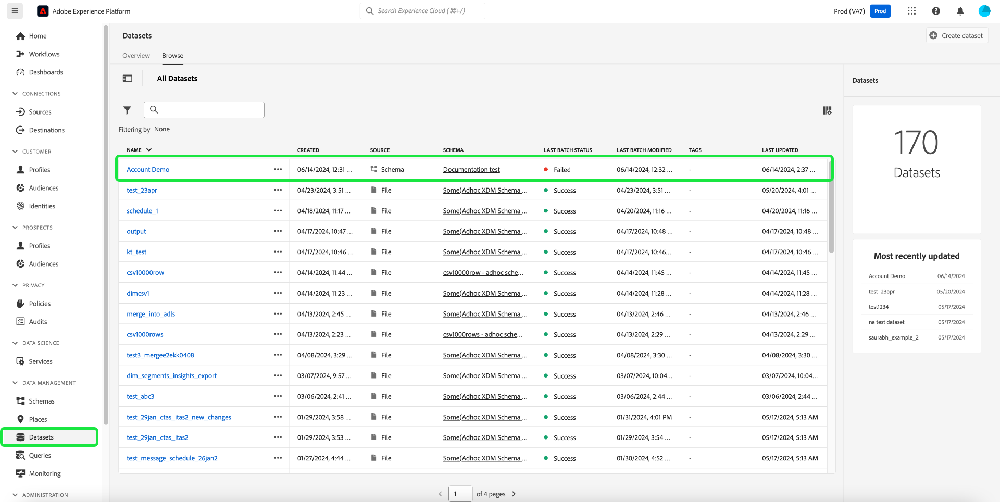

# Explore, solucione problemas y verifique la ingesta por lotes con SQL

En este documento se explica cómo comprobar y validar registros en lotes ingeridos con SQL. Este documento le enseña cómo:

- Acceder a metadatos por lotes
- Solucione problemas y garantice la integridad de los datos consultando lotes

>[!NOTE]
>
>Algunas capturas de pantalla de esta guía se tomaron de [!DNL DBVisualizer]. Para obtener información sobre cómo [conectar el servicio de consultas con DBVisualizer](../clients/dbvisulaizer.md) u otras [herramientas de BI de terceros](../clients/overview.md), consulte la documentación vinculada.

## Requisitos previos

Para facilitar su comprensión de los conceptos mencionados en este documento, debe conocer los siguientes temas:

- **Ingesta de datos**: consulte la [descripción general de la ingesta de datos](../../ingestion/home.md) para conocer los conceptos básicos de cómo se incorporan los datos en Experience Platform, incluidos los diferentes métodos y procesos involucrados.
- **Ingesta por lotes**: Consulte la [descripción general de la API de ingesta por lotes](../../ingestion/batch-ingestion/overview.md) para conocer los conceptos básicos de la ingesta por lotes. En concreto, qué es un &quot;lote&quot; y cómo funciona dentro del proceso de ingesta de datos de Experience Platform.
- **Metadatos del sistema en conjuntos de datos**: consulte la [descripción general del servicio de catálogo](../../catalog/home.md) para obtener información sobre cómo se utilizan los campos de metadatos del sistema para realizar el seguimiento y consultar los datos ingeridos.
- **Modelo de datos de experiencia (XDM)**: Consulte la [descripción general de la interfaz de usuario de esquemas](../../xdm/ui/overview.md) y los [&#39;conceptos básicos de la composición de esquemas&#39;](../../xdm/schema/composition.md) para obtener información sobre los esquemas XDM y cómo representan y validan la estructura y el formato de los datos ingeridos en Experience Platform.

## Acceder a metadatos por lotes {#access-dataset-batch-metadata}

Para asegurarse de que las columnas del sistema (columnas de metadatos) se incluyen en los resultados de la consulta, utilice el comando SQL `set drop_system_columns=false` en el Editor de consultas. Esto configura el comportamiento de la sesión de consulta SQL. Esta entrada debe repetirse si se inicia una nueva sesión.

A continuación, para ver los campos del sistema del conjunto de datos, ejecute una instrucción SELECT all para mostrar los resultados del conjunto de datos, por ejemplo `select * from movie_data`. Los resultados incluyen dos nuevas columnas en el lado derecho `_acp_system_metadata` y `_ACP_BATCHID`. Las columnas de metadatos `_acp_system_metadata` y `_ACP_BATCHID` ayudan a identificar las particiones lógicas y físicas de los datos ingeridos.


Cuando se incorporan datos en Experience Platform, se les asigna una partición lógica basada en los datos entrantes. Esta partición lógica está representada por `_acp_system_metadata.sourceBatchId`. Este ID ayuda a agrupar e identificar los lotes de datos de forma lógica antes de procesarlos y almacenarlos.

Una vez que los datos se procesan e incorporan en el lago de datos, se les asigna una partición física representada por `_ACP_BATCHID`. Este ID refleja la partición de almacenamiento real del lago de datos en el que residen los datos introducidos.

### Utilice SQL para comprender las particiones lógicas y físicas {#understand-partitions}

Para comprender mejor cómo se agrupan y distribuyen los datos después de la ingesta, utilice la siguiente consulta para contar el número de particiones físicas distintas (`_ACP_BATCHID`) para cada partición lógica (`_acp_system_metadata.sourceBatchId`).

```SQL
SELECT  _acp_system_metadata, COUNT(DISTINCT _ACP_BATCHID) FROM movie_data
GROUP BY _acp_system_metadata
```

Los resultados de esta consulta se muestran en la siguiente imagen.


Estos resultados demuestran que el número de lotes de entrada no coincide necesariamente con el número de lotes de salida, ya que el sistema determina la forma más eficaz de procesar por lotes y almacenar los datos en el lago de datos.

Para el propósito de este ejemplo, se supone que ha ingerido un archivo CSV en Experience Platform y ha creado un conjunto de datos denominado `drug_checkout_data`.

El archivo `drug_checkout_data` es un conjunto de 35.000 registros profundamente anidados. Utilice la instrucción SQL `SELECT * FROM drug_orders;` para obtener una vista previa del primer conjunto de registros en el conjunto de datos `drug_orders` basado en JSON.

La siguiente imagen muestra una previsualización del archivo y sus registros.


### Utilice SQL para generar perspectivas sobre el proceso de ingesta por lotes {#sql-insights-on-batch-ingestion}

Utilice la siguiente instrucción SQL para proporcionar información sobre cómo el proceso de ingesta de datos ha agrupado y procesado los registros de entrada en lotes.

```sql
SELECT _acp_system_metadata,
       Count(DISTINCT _acp_batchid) AS numoutputbatches,
       Count(_acp_batchid)          AS recordcount
FROM   drug_orders
GROUP  BY _acp_system_metadata 
```

Los resultados de la consulta se ven en la siguiente imagen.


Los resultados demuestran la eficiencia y el comportamiento del proceso de ingesta de datos. Aunque se crearon tres lotes de entrada (cada uno con 2000, 24000 y 9000 registros) cuando se combinaron y deduplicaron los registros, solo quedó un lote único.

>[!NOTE]
>
>Todos los registros visibles dentro de un conjunto de datos son los que se ingirieron correctamente. Una ingesta por lotes correcta no significa que estén presentes todos los registros enviados desde la entrada de origen. Debe comprobar si se han producido errores en la ingesta de datos para encontrar los lotes o registros que no llegaron a procesarse.

## Validación de un lote con SQL {#validate-a-batch-with-SQL}

A continuación, valide y compruebe los registros que se han introducido en el conjunto de datos con SQL.

>[!TIP]
>
>Para recuperar el ID de lote y los registros de consulta asociados a dicho ID de lote, primero debe crear un lote en Experience Platform. Si desea probar el proceso usted mismo, puede introducir datos CSV en Experience Platform. Lea la guía sobre cómo [asignar un archivo CSV a un esquema XDM existente mediante recomendaciones generadas por IA](../../ingestion/tutorials/map-csv/recommendations.md).

Una vez que haya ingerido un lote, debe navegar a la [!UICONTROL pestaña de actividad Conjuntos de datos] para el conjunto de datos en el que ha ingerido los datos.

En la interfaz de usuario de Experience Platform, seleccione **[!UICONTROL Conjuntos de datos]** en el panel de navegación izquierdo para abrir el panel [!UICONTROL Conjuntos de datos]. A continuación, seleccione el nombre del conjunto de datos en la pestaña [!UICONTROL Examinar] para acceder a la pantalla [!UICONTROL Actividad del conjunto de datos].



Aparece la vista [!UICONTROL Actividad del conjunto de datos]. Esta vista contiene detalles del conjunto de datos seleccionado. Incluye todos los lotes introducidos que se muestran en formato de tabla.

Seleccione un lote de la lista de lotes disponibles y copie el [!UICONTROL ID de lote] en el panel de detalles de la derecha.


A continuación, utilice la siguiente consulta para recuperar todos los registros incluidos en el conjunto de datos como parte de ese lote:

```sql
SELECT * FROM movie_data
WHERE  _acp_batchid='01H00BKCTCADYRFACAAKJTVQ8P' 
LIMIT 1;
```

La palabra clave `_ACP_BATCHID` se usa para filtrar [!UICONTROL ID de lote].

>[!TIP]
>
>La cláusula `LIMIT` es útil si desea restringir el número de filas mostradas, pero una condición de filtro es más deseable.

Al ejecutar esta consulta en el Editor de consultas, los resultados se truncan a 100 filas. El editor de consultas está diseñado para obtener previsualizaciones e investigaciones rápidas. Para recuperar hasta 50 000 filas, puede utilizar una herramienta de terceros como DBVisualizer o DBeaver.

## Pasos siguientes {#next-steps}

Al leer este documento, ha aprendido los aspectos básicos de la verificación y validación de registros en lotes ingeridos como parte del proceso de ingesta de datos. También obtuvo información sobre el acceso a los metadatos por lotes del conjunto de datos, la comprensión de las particiones lógicas y físicas y la consulta de lotes específicos mediante comandos SQL. Estos conocimientos pueden ayudarle a garantizar la integridad de los datos y optimizar su almacenamiento de datos en Experience Platform.

A continuación, debe practicar la ingesta de datos para aplicar los conceptos aprendidos. Introduzca un conjunto de datos de ejemplo en Experience Platform con los archivos de ejemplo proporcionados o con sus propios datos. Si aún no lo ha hecho, lea el tutorial sobre cómo [introducir datos en Adobe Experience Platform](../../ingestion/tutorials/ingest-batch-data.md).

Como alternativa, podría aprender a [conectar y verificar el servicio de consultas con diversas aplicaciones cliente de escritorio](../clients/overview.md) para mejorar sus capacidades de análisis de datos.
