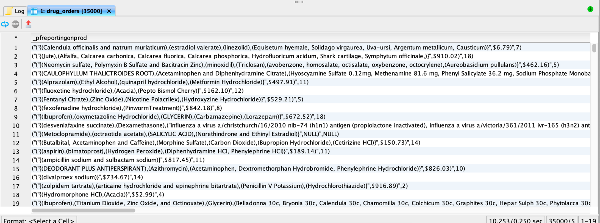
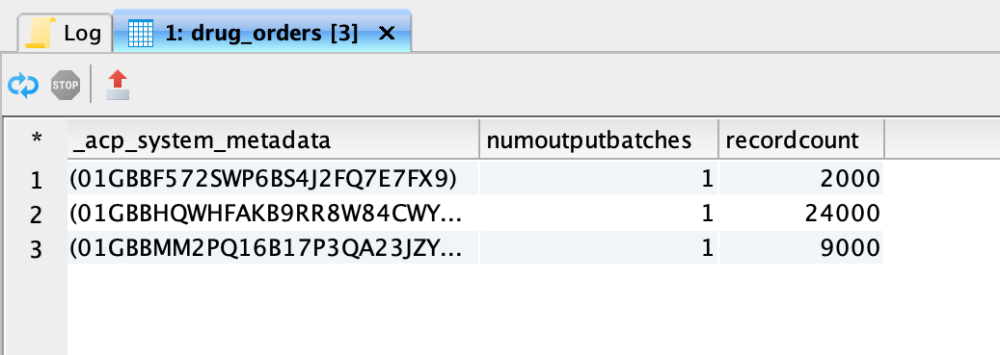
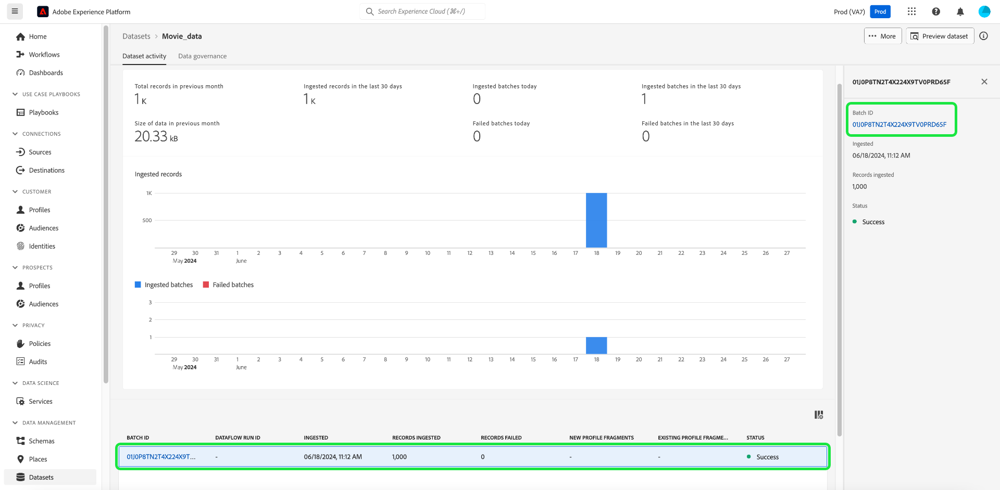

# Explore, troubleshoot, and verify batch ingestion with SQL

This document explains how to verify and validate records in ingested batches with SQL. This document teaches you how to:

- Access dataset batch metadata
- Troubleshoot and ensure data integrity by querying batches

>[!NOTE]
>
>Some screenshots in this guide are taken from [!DNL DBVisualizer]. To learn how to [connect Query Service with DBVisualizer](../clients/dbvisulaizer.md) or other [third-party BI tools](../clients/overview.md), see the linked documentation.

## Requisitos previos

To help your understanding of the concepts discussed in this document, you should have knowledge of the following topics:

- **Data ingestion**: See the [data ingestion overview](../../ingestion/home.md) to learn the basics of how data is ingested into the Experience Platform, including the different methods and processes involved.
- **Batch ingestion**: See the [batch ingestion API overview](../../ingestion/batch-ingestion/overview.md) to learn the basic concepts of batch ingestion. Specifically, what a &quot;batch&quot; is and how it functions within Experience Platform&#39;s data ingestion process.
- **System metadata in datasets**: See the [Catalog Service overview](../../catalog/home.md) to learn how system metadata fields are used to track and query ingested data.
- **Experience Data Model (XDM)**: See the [schemas UI overview](../../xdm/ui/overview.md) and the [&#39;basics of schema composition&#39;](../../xdm/schema/composition.md) to learn about XDM schemas and how they represent and validate the structure and format of data ingested into Experience Platform.

## Access dataset batch metadata {#access-dataset-batch-metadata}

To ensure that system columns (metadata columns) are included in the query results, use the SQL command `set drop_system_columns=false` in your Query Editor. This configures the behavior of your SQL query session. This input must be repeated if you start a new session.

Next, to view the system fields of the dataset, execute a SELECT all statement to display the results from the dataset, for example `select * from movie_data`. The results include two new columns on the right-hand side `_acp_system_metadata` and `_ACP_BATCHID`. The metadata columns `_acp_system_metadata` and `_ACP_BATCHID` help identify the logical and physical partitions of ingested data.


When data is ingested into Experience Platform, it is assigned a logical partition based on the incoming data. Esta partición lógica está representada por `_acp_system_metadata.acp_sourceBatchId`. Este ID ayuda a agrupar e identificar los lotes de datos de forma lógica antes de procesarlos y almacenarlos.

Una vez que los datos se procesan e incorporan en el lago de datos, se les asigna una partición física representada por `_ACP_BATCHID`. Este ID refleja la partición de almacenamiento real del lago de datos en el que residen los datos introducidos.

### Utilice SQL para comprender las particiones lógicas y físicas {#understand-partitions}

Para comprender mejor cómo se agrupan y distribuyen los datos después de la ingesta, utilice la siguiente consulta para contar el número de particiones físicas distintas (`_ACP_BATCHID`) para cada partición lógica (`_acp_system_metadata.acp_sourceBatchId`).

```SQL
SELECT  _acp_system_metadata, COUNT(DISTINCT _ACP_BATCHID) FROM movie_data
GROUP BY _acp_system_metadata
```

Los resultados de esta consulta se muestran en la siguiente imagen.


Estos resultados demuestran que el número de lotes de entrada no coincide necesariamente con el número de lotes de salida, ya que el sistema determina la forma más eficaz de procesar por lotes y almacenar los datos en el lago de datos.

Para el propósito de este ejemplo, se supone que ha ingerido un archivo CSV en Experience Platform y ha creado un conjunto de datos denominado `drug_checkout_data`.

El archivo `drug_checkout_data` es un conjunto de 35.000 registros profundamente anidados. Utilice la instrucción SQL `SELECT * FROM drug_orders;` para obtener una vista previa del primer conjunto de registros en el conjunto de datos `drug_orders` basado en JSON.

La siguiente imagen muestra una previsualización del archivo y sus registros.



### Utilice SQL para generar perspectivas sobre el proceso de ingesta por lotes {#sql-insights-on-batch-ingestion}

Utilice la siguiente instrucción SQL para proporcionar información sobre cómo el proceso de ingesta de datos ha agrupado y procesado los registros de entrada en lotes.

```sql
SELECT _acp_system_metadata,
       Count(DISTINCT _acp_batchid) AS numoutputbatches,
       Count(_acp_batchid)          AS recordcount
FROM   drug_orders
GROUP  BY _acp_system_metadata 
```

Los resultados de la consulta se ven en la siguiente imagen.



Los resultados demuestran la eficiencia y el comportamiento del proceso de ingesta de datos. Aunque se crearon tres lotes de entrada (cada uno con 2000, 24000 y 9000 registros) cuando se combinaron y deduplicaron los registros, solo quedó un lote único.

>[!NOTE]
>
>Todos los registros visibles dentro de un conjunto de datos son los que se ingirieron correctamente. Una ingesta por lotes correcta no significa que estén presentes todos los registros enviados desde la entrada de origen. Debe comprobar si se han producido errores en la ingesta de datos para encontrar los lotes o registros que no llegaron a procesarse.

## Validación de un lote con SQL {#validate-a-batch-with-SQL}

A continuación, valide y compruebe los registros que se han introducido en el conjunto de datos con SQL.

>[!TIP]
>
>Para recuperar el ID de lote y los registros de consulta asociados a dicho ID de lote, primero debe crear un lote en Experience Platform. Si desea probar el proceso usted mismo, puede introducir datos CSV en Experience Platform. Lea la guía sobre cómo [asignar un archivo CSV a un esquema XDM existente mediante recomendaciones generadas por IA](../../ingestion/tutorials/map-csv/recommendations.md).

Una vez que haya ingerido un lote, debe navegar a [!UICONTROL Datasets activity tab] para el conjunto de datos en el que ha ingerido los datos.

En la interfaz de usuario de Experience Platform, seleccione **[!UICONTROL Datasets]** en el panel de navegación izquierdo para abrir el panel [!UICONTROL Datasets]. A continuación, seleccione el nombre del conjunto de datos en la pestaña [!UICONTROL Browse] para acceder a la pantalla [!UICONTROL Dataset activity].


Aparecerá la vista [!UICONTROL Dataset activity]. Esta vista contiene detalles del conjunto de datos seleccionado. Incluye todos los lotes introducidos que se muestran en formato de tabla.

Seleccione un lote de la lista de lotes disponibles y copie [!UICONTROL Batch ID] del panel de detalles de la derecha.



A continuación, utilice la siguiente consulta para recuperar todos los registros incluidos en el conjunto de datos como parte de ese lote:

```sql
SELECT * FROM movie_data
WHERE  _acp_batchid='01H00BKCTCADYRFACAAKJTVQ8P' 
LIMIT 1;
```

La palabra clave `_ACP_BATCHID` se usa para filtrar [!UICONTROL Batch ID].

>[!TIP]
>
>La cláusula `LIMIT` es útil si desea restringir el número de filas mostradas, pero una condición de filtro es más deseable.

Al ejecutar esta consulta en el Editor de consultas, los resultados se truncan a 100 filas. El editor de consultas está diseñado para obtener previsualizaciones e investigaciones rápidas. Para recuperar hasta 50 000 filas, puede utilizar una herramienta de terceros como DBVisualizer o DBeaver.

## Próximos pasos {#next-steps}

Al leer este documento, ha aprendido los aspectos básicos de la verificación y validación de registros en lotes ingeridos como parte del proceso de ingesta de datos. También obtuvo información sobre el acceso a los metadatos por lotes del conjunto de datos, la comprensión de las particiones lógicas y físicas y la consulta de lotes específicos mediante comandos SQL. Estos conocimientos pueden ayudarle a garantizar la integridad de los datos y optimizar su almacenamiento de datos en Experience Platform.

A continuación, debe practicar la ingesta de datos para aplicar los conceptos aprendidos. Introduzca un conjunto de datos de ejemplo en Experience Platform con los archivos de ejemplo proporcionados o con sus propios datos. Si aún no lo ha hecho, lea el tutorial sobre cómo [introducir datos en Adobe Experience Platform](../../ingestion/tutorials/ingest-batch-data.md).

Como alternativa, podría aprender a [conectar y verificar el servicio de consultas con diversas aplicaciones cliente de escritorio](../clients/overview.md) para mejorar sus capacidades de análisis de datos.
