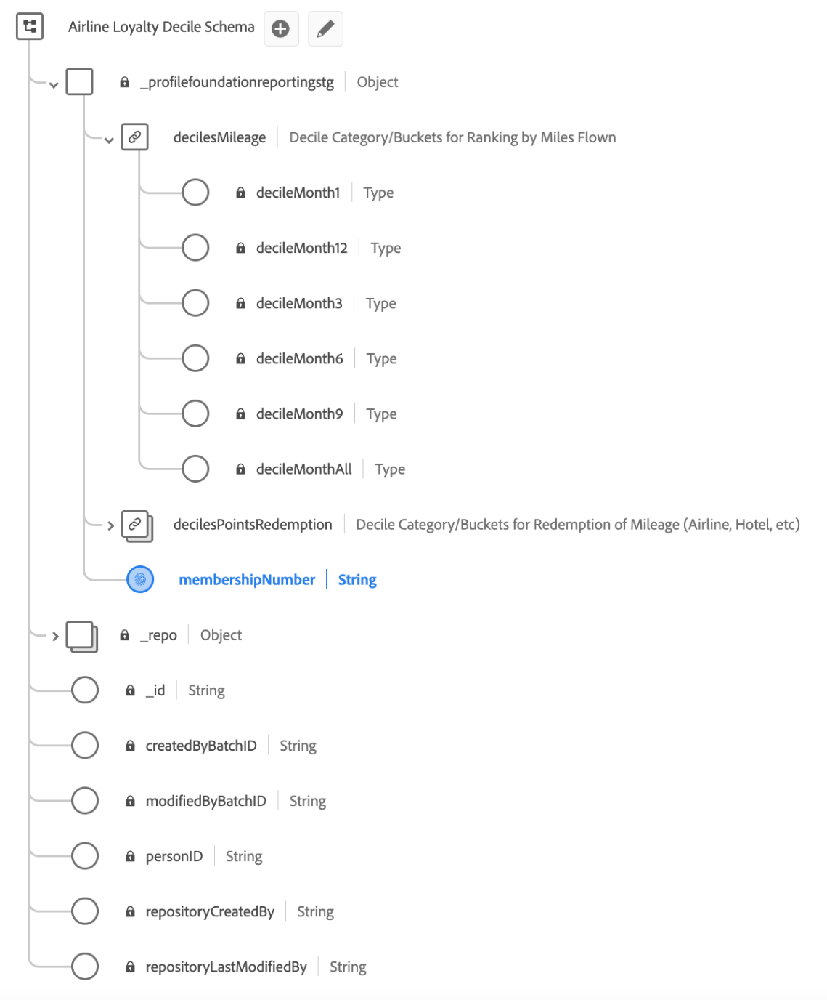

# Caso de uso de conjuntos de datos derivados basados en deciles

Los conjuntos de datos derivados facilitan casos de uso complicados para analizar datos del lago de datos que se pueden utilizar con otros servicios de Platform secundarios o publicar en los datos del perfil del cliente en tiempo real.

Este ejemplo de caso de uso muestra cómo crear conjuntos de datos derivados basados en deciles para utilizarlos con los datos del perfil del cliente en tiempo real. Con un escenario de lealtad de las aerolíneas como ejemplo, esta guía le informa cómo crear un conjunto de datos que utilice deciles categóricos para segmentar y crear audiencias en función de atributos de clasificación.

Se ilustran los siguientes conceptos clave:

* Creación de esquemas para la agrupación de deciles.
* Creación categórica de decilos.
* Creación de conjuntos de datos derivados complejos.
* Cálculo de deciles durante un periodo retroactivo.
* Una consulta de ejemplo para demostrar la agregación, la clasificación y la adición de identidades únicas que permiten que las audiencias se generen en función de estos bloques de deciles.

## Introducción

Esta guía requiere una comprensión práctica de [ejecución de consultas en el servicio de consultas](../best-practices/writing-queries.md) y los siguientes componentes de Adobe Experience Platform:

* [Resumen del perfil del cliente en tiempo real](../../profile/home.md): Proporciona un perfil de consumidor unificado y en tiempo real basado en los datos agregados de varias fuentes.
* [Conceptos básicos de composición de esquemas](../../xdm/schema/composition.md): Introducción a los esquemas XDM (Experience Data Model) y a los componentes básicos, principios y prácticas recomendadas para componer esquemas.
* [Activación de un esquema para el perfil del cliente en tiempo real](../../profile/tutorials/add-profile-data.md): Este tutorial describe los pasos necesarios para agregar datos al Perfil del cliente en tiempo real.
* [Cómo definir un tipo de datos personalizado](../../xdm/api/data-types.md): los tipos de datos se utilizan como campos de tipo de referencia en clases o grupos de campos de esquema y permiten el uso coherente de una estructura de varios campos que se puede incluir en cualquier parte del esquema.

## Objetivos

El ejemplo que se muestra en este documento utiliza deciles para crear conjuntos de datos derivados para clasificar los datos de un esquema de lealtad de aerolínea. Los conjuntos de datos derivados le permiten maximizar la utilidad de los datos al identificar una audiencia en función del porcentaje &quot;n&quot; superior de una categoría elegida.

## Generar conjuntos de datos derivados basados en deciles

Para definir la clasificación de los deciles en función de una dimensión en particular y una métrica correspondiente, se debe diseñar un esquema para permitir la agrupación de deciles.

Esta guía utiliza un conjunto de datos de lealtad de la aerolínea para demostrar cómo utilizar el servicio de consulta para crear deciles basados en las millas voladas a lo largo de varios períodos retrospectivos.

## Usar el servicio de consulta para crear deciles

Con el servicio de consulta, puede crear un conjunto de datos que contenga deciles categóricos, que luego se pueden segmentar para crear audiencias basadas en la clasificación de atributos. Los conceptos mostrados en los siguientes ejemplos se pueden aplicar para crear otros conjuntos de datos de bloque de deciles, siempre y cuando se defina una categoría y haya una métrica disponible.

El ejemplo de datos de lealtad de la aerolínea utiliza un [clase XDM ExperienceEvents](../../xdm/classes/experienceevent.md). Cada evento es un registro de una transacción comercial por kilometraje, ya sea acreditado o adeudado, y el estado de fidelidad de membresía de &quot;Volante&quot;, &quot;Frecuente&quot;, &quot;Plata&quot;, o &quot;Oro&quot;. El campo de identidad principal es `membershipNumber`.

### Conjuntos de datos de muestra

El conjunto de datos de lealtad de la aerolínea inicial para este ejemplo es &quot;Datos de lealtad de la aerolínea&quot; y tiene el esquema siguiente. Tenga en cuenta que la identidad principal del esquema es `_profilefoundationreportingstg.membershipNumber`.


**Datos de muestra**

La siguiente tabla muestra los datos de ejemplo contenidos en la variable `_profilefoundationreportingstg` objeto utilizado para este ejemplo. Proporciona contexto para el uso de bloques de deciles para crear conjuntos de datos derivados complejos.

>[!NOTE]
>
>Para obtener más información, consulte el ID de inquilino `_profilefoundationreportingstg` se ha omitido desde el principio del área de nombres en los títulos de columna y en las menciones posteriores de todo el documento.

| `.membershipNumber` | `.emailAddress.address` | `.transactionDate` | `.transactionType` | `.transactionDetails` | `.mileage` | `.loyaltyStatus` |
|---|---|---|---|---|---|---|
| C435678623 | sfeldmark1vr@studiopress.com | 01-01-2022 | STATUS_MILES | Nuevo miembro | 5000 | VOLANTE |
| B789279247 | pgalton32n@barnesandnoble.com | 01-02-2022 | AWARD_MILES | JFK-FRA | 7500 | PLATA |
| B789279247 | pgalton32n@barnesandnoble.com | 01-02-2022 | STATUS_MILES | JFK-FRA | 7500 | PLATA |
| B789279247 | pgalton32n@barnesandnoble.com | 10-02-2022 | AWARD_MILES | FRA-JFK | 5000 | PLATA |
| A123487284 | rritson1zn@sciencedaily.com | 07-01-2022 | STATUS_MILES | Nueva tarjeta de crédito | 10 000 | VOLANTE |

{style="table-layout:auto"}

## Generar conjuntos de datos de deciles

En los datos de fidelidad de la aerolínea vistos arriba, la variable `.mileage` El valor contiene el número de millas voladas por un miembro para cada vuelo individual realizado. Estos datos se utilizan para crear deciles para el número de millas voladas sobre retrospectivas de duración y una variedad de períodos retrospectivos. Para ello, se crea un conjunto de datos que contiene deciles en un tipo de datos de asignación para cada periodo retroactivo y un decil adecuado para cada periodo retroactivo asignado en `membershipNumber`.

Cree un &quot;Esquema decimal de fidelidad de aerolínea&quot; para crear un conjunto de datos de deciles mediante el servicio de consulta.



### Habilitar el esquema para el perfil del cliente en tiempo real

Los datos que se están ingiriendo en el Experience Platform para que los use el perfil del cliente en tiempo real deben cumplir con [un esquema del Modelo de datos de experiencia (XDM) habilitado para el perfil](../../xdm/ui/resources/schemas.md). Para que un esquema se habilite para el perfil, debe implementar la clase XDM Individual Profile o XDM ExperienceEvent.

[Habilite el esquema para utilizarlo en el perfil del cliente en tiempo real mediante la API de registro de esquemas](../../xdm/tutorials/create-schema-api.md) o el [Interfaz de usuario del Editor de esquemas](../../xdm/tutorials/create-schema-ui.md).  Encontrará instrucciones detalladas sobre cómo habilitar un esquema para el perfil en su documentación correspondiente.

A continuación, cree un tipo de datos para reutilizarlo para todos los grupos de campos relacionados con deciles. La creación del grupo de campos de deciles es un paso único por zona protegida. También se puede reutilizar para todos los esquemas relacionados con decilos.

### Cree un área de nombres de identidad y márquela como identificador principal {#identity-namespace}

Cualquier esquema creado para su uso con deciles debe tener asignada una identidad principal. Puede [defina un campo de identidad en la interfaz de usuario de Adobe Experience Platform Schemas](../../xdm/ui/fields/identity.md#define-an-identity-field), o a través de [API de Registro de esquemas](../../xdm/api/descriptors.md#create).

Query Service también permite establecer una identidad o una identidad principal para los campos de conjuntos de datos de esquemas ad hoc directamente a través de SQL. Consulte la documentación sobre [configuración de una identidad secundaria y una identidad principal en identidades de esquema ad hoc](../data-governance/ad-hoc-schema-identities.md) para obtener más información.

### Creación de una consulta para calcular deciles durante un período retroactivo {#create-a-query}

En el siguiente ejemplo se muestra la consulta SQL para calcular un decil en un período retrospectivo.

Se puede crear una plantilla mediante el Editor de consultas en la interfaz de usuario o a través del [API del servicio de consultas](../api/query-templates.md#create-a-query-template).

```sql
CREATE TABLE AS airline_loyality_decile 
{  WITH summed_miles_1 AS (
        SELECT _profilefoundationreportingstg.membershipNumber AS membershipNumber,
            _profilefoundationreportingstg.loyaltyStatus AS loyaltyStatus,
            SUM(_profilefoundationreportingstg.mileage) AS totalMiles
        FROM airline_loyalty_data
        WHERE _profilefoundationreportingstg.transactionDate < (MAKE_DATE(YEAR(CURRENT_DATE), MONTH(CURRENT_DATE), 1) - MAKE_YM_INTERVAL(0, 0))
    GROUP BY 1,2
    ),
    summed_miles_3 AS (
        SELECT _profilefoundationreportingstg.membershipNumber AS membershipNumber,
            _profilefoundationreportingstg.loyaltyStatus AS loyaltyStatus,
            SUM(_profilefoundationreportingstg.mileage) AS totalMiles
        FROM airline_loyalty_data
        WHERE _profilefoundationreportingstg.transactionDate < (MAKE_DATE(YEAR(CURRENT_DATE), MONTH(CURRENT_DATE), 1) - MAKE_YM_INTERVAL(0, 1))
    GROUP BY 1,2
    ),
    summed_miles_6 AS (
        SELECT _profilefoundationreportingstg.membershipNumber AS membershipNumber,
            _profilefoundationreportingstg.loyaltyStatus AS loyaltyStatus,
            SUM(_profilefoundationreportingstg.mileage) AS totalMiles
        FROM airline_loyalty_data
        WHERE _profilefoundationreportingstg.transactionDate < (MAKE_DATE(YEAR(CURRENT_DATE), MONTH(CURRENT_DATE), 1) - MAKE_YM_INTERVAL(0, 4))
    GROUP BY 1,2
    ),
    rankings_1 AS (
        SELECT membershipNumber,
            loyaltyStatus,
            totalMiles,
            NTILE(10) OVER (PARTITION BY loyaltyStatus ORDER BY totalMiles DESC) AS decileBucket
        FROM summed_miles_1
    ),
    rankings_3 AS (
        SELECT membershipNumber,
            loyaltyStatus,
            totalMiles,
            NTILE(10) OVER (PARTITION BY loyaltyStatus ORDER BY totalMiles DESC) AS decileBucket
        FROM summed_miles_3
    ),
    rankings_6 AS (
        SELECT membershipNumber,
            loyaltyStatus,
            totalMiles,
            NTILE(10) OVER (PARTITION BY loyaltyStatus ORDER BY totalMiles DESC) AS decileBucket
        FROM summed_miles_6
    ),
    map_1 AS (
        SELECT membershipNumber,
            MAP_FROM_ARRAYS(COLLECT_LIST(loyaltyStatus), COLLECT_LIST(decileBucket)) AS decileMonth1
        FROM rankings_1
        GROUP BY membershipNumber
    ),
    map_3 AS (
        SELECT membershipNumber,
            MAP_FROM_ARRAYS(COLLECT_LIST(loyaltyStatus), COLLECT_LIST(decileBucket)) AS decileMonth3
        FROM rankings_3
        GROUP BY membershipNumber
    ),
    map_6 AS (
        SELECT membershipNumber,
            MAP_FROM_ARRAYS(COLLECT_LIST(loyaltyStatus), COLLECT_LIST(decileBucket)) AS decileMonth6
        FROM rankings_6
        GROUP BY membershipNumber
    ),
    all_memberships AS (
        SELECT DISTINCT _profilefoundationreportingstg.membershipNumber AS membershipNumber FROM airline_loyalty_data
    )
    SELECT STRUCT(
            all_memberships.membershipNumber AS membershipNumber,
            STRUCT(
                    map_1.decileMonth1 AS decileMonth1,
                    map_3.decileMonth3 AS decileMonth3,
                    map_6.decileMonth6 AS decileMonth6
            ) AS decilesMileage
        ) AS _profilefoundationreportingstg
    FROM all_memberships
        LEFT JOIN map_1 ON  (all_memberships.membershipNumber = map_1.membershipNumber)
        LEFT JOIN map_3 ON  (all_memberships.membershipNumber = map_3.membershipNumber)
        LEFT JOIN map_6 ON  (all_memberships.membershipNumber = map_6.membershipNumber)
    }
```

### Revisión de consulta

Las secciones de la consulta de ejemplo se examinan con mayor detalle a continuación.

#### Períodos retroactivos

El tipo de datos decile contiene un bloque para 1, 3, 6, 9, 12 y retrospectivas de duración. La consulta utiliza períodos retrospectivos de 1, 3 y 6 meses, por lo que cada sección contendrá algunas consultas &quot;repetidas&quot; para crear tablas temporales para cada período retrospectivo.

>[!NOTE]
>
>Si los datos de origen no tienen una columna que pueda utilizarse para determinar un período de retrospectiva, todas las clasificaciones de clases de deciles se realizarán en `decileMonthAll`.

#### Agregación

Utilice expresiones de tabla comunes (CTE) para acumular el kilometraje antes de crear contenedores de deciles. Proporciona las millas totales para un período retrospectivo específico. Los CTE existen temporalmente y solo se pueden utilizar dentro del ámbito de la consulta más grande.

```sql
summed_miles_1 AS (
    SELECT _profilefoundationreportingstg.membershipNumber AS membershipNumber,
           _profilefoundationreportingstg.loyaltyStatus AS loyaltyStatus,
           SUM(_profilefoundationreportingstg.mileage) AS totalMiles
    FROM airline_loyalty_data
    WHERE _profilefoundationreportingstg.transactionDate < (MAKE_DATE(YEAR(CURRENT_DATE), MONTH(CURRENT_DATE), 1) - MAKE_YM_INTERVAL(0, 0))
    GROUP BY 1,2
)
```

El bloque se repite dos veces en la plantilla (`summed_miles_3` y `summed_miles_6`) con un cambio en el cálculo de fecha para generar los datos de los demás periodos retrospectivos.

Es importante tener en cuenta las columnas de identidad, dimensión y métrica para la consulta (`membershipNumber`, `loyaltyStatus` y `totalMiles` respectivamente).

#### Clasificación

Los deciles permiten realizar bloques categóricos. Para crear el número de clasificación, la variable `NTILE` se utiliza con un parámetro de `10` dentro de una VENTANA agrupada por `loyaltyStatus` field. Esto da como resultado una clasificación del 1 al 10. Configure las variables `ORDER BY` de la cláusula `WINDOW` hasta `DESC` para garantizar que un valor de clasificación de `1` se da al **mayor** métrica dentro de la dimensión.

```sql
rankings_1 AS (
    SELECT membershipNumber,
           loyaltyStatus,
           totalMiles,
           NTILE(10) OVER (PARTITION BY loyaltyStatus ORDER BY totalMiles DESC) AS decileBucket
    FROM summed_miles_1
)
```

#### Agregación de mapas

Con varios períodos retrospectivos, debe crear los mapas de contenedor de decilos por adelantado utilizando `MAP_FROM_ARRAYS` y `COLLECT_LIST` funciones. En el fragmento de ejemplo, `MAP_FROM_ARRAYS` crea un mapa con un par de claves (`loyaltyStatus`) y valores (`decileBucket`) matrices. `COLLECT_LIST` devuelve una matriz con todos los valores de la columna especificada.

```sql
map_1 AS (
    SELECT membershipNumber,
           MAP_FROM_ARRAYS(COLLECT_LIST(loyaltyStatus), COLLECT_LIST(decileBucket)) AS decileMonth1
    FROM rankings_1
    GROUP BY membershipNumber
)
```

>[!NOTE]
>
>La agregación de mapas no es necesaria si la clasificación de decilos solo es necesaria para un período de duración.

#### Identidades únicas

La lista de identidades únicas (`membershipNumber`) es necesario para crear una lista única de todas las suscripciones.

```sql
all_memberships AS (
    SELECT DISTINCT _profilefoundationreportingstg.membershipNumber AS membershipNumber FROM airline_loyalty_data
)
```

>[!NOTE]
>
>Si la clasificación de decilos solo es necesaria para un período de duración, este paso se puede omitir y la agregación se puede realizar de la siguiente manera `membershipNumber` se puede realizar en el paso final.

#### Unir todos los datos temporales

El paso final es unir todos los datos temporales en un formulario idéntico a la estructura de los deciles del grupo de campos.

```sql
SELECT STRUCT(
           all_memberships.membershipNumber AS membershipNumber,
           STRUCT(
                map_1.decileMonth1 AS decileMonth1,
                map_3.decileMonth3 AS decileMonth3,
                map_6.decileMonth6 AS decileMonth6
           ) AS decilesMileage
       ) AS _profilefoundationreportingstg
FROM all_memberships
    LEFT JOIN map_1 ON  (all_memberships.membershipNumber = map_1.membershipNumber)
    LEFT JOIN map_3 ON  (all_memberships.membershipNumber = map_3.membershipNumber)
    LEFT JOIN map_6 ON  (all_memberships.membershipNumber = map_6.membershipNumber)
```

Si solo están disponibles los datos de duración, la consulta aparecerá de la siguiente manera:

```sql
SELECT STRUCT(
           rankings.membershipNumber AS membershipNumber,
           STRUCT(
                MAP_FROM_ARRAYS(COLLECT_LIST(loyaltyStatus), COLLECT_LIST(decileBucket)) AS decileMonthAll
           ) AS decilesMileage
       ) AS _profilefoundationreportingstg
FROM rankings
GROUP BY rankings.membershipNumber
```

En los resultados de la consulta se garantiza una correlación entre el número de clasificación y el percentil debido al uso de deciles. Cada clasificación equivale al 10 %, por lo que la identificación de una audiencia basada en el 30 % superior solo debe dirigirse a los rangos 1, 2 y 3.

### Ejecutar la plantilla de consulta

Ejecute la consulta para rellenar el conjunto de datos de deciles. También puede guardar la consulta como plantilla y programarla para que se ejecute a una cadencia. Cuando se guarda como plantilla, la consulta también se puede actualizar para utilizar el patrón de creación e inserción que hace referencia al `table_exists` comando. Más información sobre cómo utilizar el `table_exists`El comando se encuentra en [Guía de sintaxis SQL](../sql/syntax.md#table-exists).

## Pasos siguientes

El caso de uso de ejemplo proporcionado anteriormente resalta los pasos para que los conjuntos de datos derivados basados en deciles estén disponibles en el Perfil del cliente en tiempo real. Esto permite que el servicio de segmentación, ya sea a través de una interfaz de usuario o de la API RESTful, pueda generar audiencias basadas en estos contenedores de deciles. Consulte la [Resumen del servicio de segmentación](../../segmentation/home.md) para obtener información sobre cómo crear, evaluar y acceder a segmentos.
