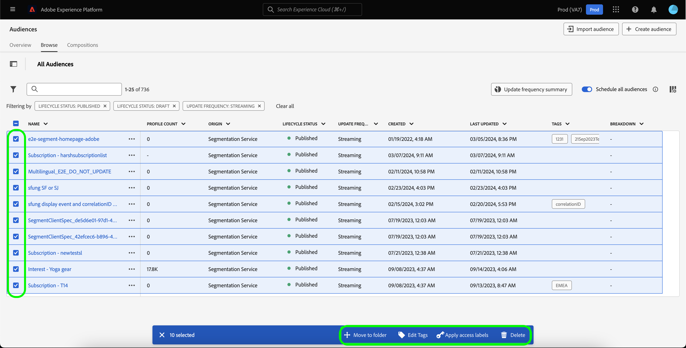

# Notas de la versión de Adobe Experience Platform

**Fecha de la versión: miércoles, 19 de marzo de 2024**

>[!TIP]
>
>Utilice el [Glosario de Adobe Experience Platform](/help/landing/glossary.md) para familiarizarse con la terminología utilizada en Real-time Customer Data Platform y Adobe Experience Platform. Si no encuentra un término específico que esté buscando, utilice las opciones de comentarios de la página para solicitar que se añadan nuevos términos al glosario.

Actualizaciones de funciones existentes en Experience Platform:

- [Servicio de catálogo](#catalog-service)
- [Preparación de los datos](#data-prep)
- [Destinos](#destinations)
- [Modelo de datos de experiencia (XDM)](#xdm)
- [Servicio de segmentación](#segmentation)
- [Fuentes](#sources)

## Servicio de catálogo {#catalog-service}

El servicio de catálogo es el sistema de registro para la ubicación y el linaje de datos dentro de Adobe Experience Platform. Mientras que todos los datos que se incorporan al Experience Platform se almacenan en el lago de datos como archivos y directorios, el catálogo contiene los metadatos y la descripción de esos archivos y directorios para fines de búsqueda y monitorización.

| Función | Descripción |
| --- | --- |
| Más acciones | Para que las operaciones sean más flexibles y le ayuden a administrar sus datos, ahora puede utilizar la función &quot;Más acciones&quot; de la vista de detalles para realizar tareas adicionales en un conjunto de datos. Puede eliminar el conjunto de datos o habilitarlo para utilizarlo con el perfil del cliente en tiempo real desde la página de detalles de un conjunto de datos elegido. **Nota:** si habilita un conjunto de datos para la ingesta de perfiles, el esquema del conjunto de datos debe ser compatible con el perfil del cliente en tiempo real. ![El espacio de trabajo Conjuntos de datos con [!UICONTROL ... Más] menú desplegable resaltado.](../2024/assets/march/more-actions.png "Espacio de trabajo Conjuntos de datos con el menú desplegable Más resaltado."){width="100" zoomable="yes"}. Lea el [guía del usuario de conjuntos de datos](../../catalog/datasets/user-guide.md) para obtener más información. |

{style="table-layout:auto"}

Para obtener más información sobre el servicio de consultas, consulte la [información general del servicio de catálogo](../../catalog/home.md).

## Preparación de los datos {#data-prep}

La preparación de datos permite a los ingenieros de datos asignar, transformar y validar datos desde y hacia el modelo de datos de experiencia (XDM).

**Funciones nuevas o actualizadas**

| Función | Descripción |
| --- | --- |
| Nuevas funciones de asignación para Adobe Analytics | Ahora puede utilizar las siguientes funciones para extraer datos de evento de Adobe Analytics: <ul><li>`aa_get_event_id`</li><li>`aa_get_event_value`</li><li>`aa_get_product_categories`</li><li>`aa_get_product_names`</li><li>`aa_get_product_quantities`</li><li>`aa_get_product_prices`</li><li>`aa_get_product_event_values`</li><li>`aa_get_product_evars`</li></ul> Para obtener más información sobre estas funciones, lea la [Guía de funciones de preparación de datos](../../data-prep/functions.md#analytics-functions) |

{style="table-layout:auto"}

Para obtener más información sobre la preparación de datos, lea la [Resumen de preparación de datos](../../data-prep/home.md).

## Destinos {#destinations}

[!DNL Destinations] son integraciones generadas previamente con plataformas de destino que permiten la activación perfecta de datos de Adobe Experience Platform. Puede utilizar los destinos para activar los datos conocidos y desconocidos para campañas de marketing entre canales, campañas por correo electrónico, publicidad segmentada y muchos otros casos de uso.

**Destinos nuevos y actualizados** {#new-updated-destinations}

| Destino | Tipo | Descripción |
| ----------- | --------- | ----------- |
| [(Beta) Conexión de mejora de datos de Acxiom](../../destinations/catalog/data-partner/acxiom-data-enhancement.md) | Nuevo | Utilice este conector para activar perfiles de origen de Real-Time CDP a Acxiom para el enriquecimiento de datos y su uso en todos los canales de marketing. A continuación, puede utilizar la fuente Acxiom para importar los perfiles con datos mejorados y trabajar con ellos en Real-Time CDP. |
| [(Beta) Conexión de Acxiom Prospect Suppression](../../destinations/catalog/data-partner/acxiom-prospect-suppression.md) | Nuevo | Exporte sus audiencias de origen al destino de Acxiom para permitir que Acxiom elimine clientes conocidos o convertidos. A continuación, utilice el [Importación de datos de prospección Acxiom](../../sources/connectors/data-partners/acxiom-prospecting-data-import.md) conector de origen para introducir y activar listas de clientes potenciales de Acxiom, con sus clientes conocidos o convertidos eliminados. |
| [Conexión de Amazon Ads](../../destinations/catalog/advertising/amazon-ads.md) | Actualización | Al exportar datos al destino de Amazon Ads, ahora puede enrutar los datos al destino de Amazon o al Marketing Cloud de DSP Amazon (nuevo). |

{style="table-layout:auto"}

<!--

**New or updated functionality** {#destinations-new-updated-functionality}

-->

Para obtener información más general sobre los destinos, consulte la [información general sobre destinos](../../destinations/home.md).

## Modelo de datos de experiencia (XDM) {#xdm}

XDM es una especificación de código abierto que proporciona estructuras y definiciones comunes (esquemas) para los datos que se incorporan a Adobe Experience Platform. Al adherirse a los estándares XDM, todos los datos de experiencia del cliente se pueden incorporar en una representación común para ofrecer perspectivas de una manera más rápida e integrada. Puede obtener información valiosa de las acciones de los clientes, definir sus públicos mediante segmentos y utilizar sus atributos para fines de personalización.

**Nuevas funciones**

| Función | Descripción |
| --- | --- |
| Compatibilidad con tipos de datos de mapa de IU de Experience Platform | Personalice aún más la estructura de datos del Modelo de datos de experiencia (XDM) definiendo campos de asignación en la IU de Platform. Ahora puede crear campos de asignación en el Editor de esquemas para modelar estructuras de datos flexibles o almacenar de forma eficaz pares clave-valor. Seleccione &quot;Asignar&quot; en el menú desplegable Tipo al definir un nuevo campo para configurar subcampos y asignarlos a grupos de campos. Los tipos de valores de mapa admitidos son cadena y entero. {width="100" zoomable="yes"}  Para obtener información sobre cómo [definición de campos de asignación en la IU](../../xdm/ui/fields/map.md), consulte la guía de IU. |

{style="table-layout:auto"}

Para obtener más información sobre XDM en Platform, consulte la [Información general del sistema XDM](../../xdm/home.md).

## Servicio de segmentación {#segmentation}

[!DNL Segmentation Service] le permite segmentar los datos almacenados en [!DNL Experience Platform] que se relacionan con personas (como clientes, clientes potenciales, usuarios u organizaciones) en públicos. Puede crear públicos a través de definiciones de segmentos u otras fuentes a partir de sus datos de [!DNL Real-Time Customer Profile]. Estos públicos se configuran de forma centralizada y se mantienen en [!DNL Platform] y son fácilmente accesibles desde cualquier solución de Adobe.

**Nueva funcionalidad**

| Función | Descripción |
| ------- | ----------- |
| Acciones masivas | El inventario de audiencias ahora admite acciones masivas. Con las acciones por lotes, puede seleccionar rápidamente varias audiencias para moverlas a una carpeta, aplicar etiquetas, aplicar etiquetas de acceso o eliminar.   {width="100" zoomable="yes"}  Para obtener más información acerca de esta función, lea la [Guía de IU del servicio de segmentación](../../segmentation/ui/overview.md#bulk-actions). |

{style="table-layout:auto"}

Para obtener más información sobre el Servicio de segmentación, lea la [Resumen del servicio de segmentación](../../segmentation/home.md).

## Fuentes {#sources}

Experience Platform proporciona una API RESTful y una IU interactiva que le permite configurar conexiones de origen para varios proveedores de datos con facilidad. Estas conexiones de origen le permiten autenticarse y conectarse a sistemas de almacenamiento externos y servicios CRM, establecer tiempos para ejecuciones de ingesta y administrar el rendimiento de ingesta de datos.

**Fuentes nuevas y actualizadas**

| Función | Tipo | Descripción |
| --- | --- | --- |
| [!BADGE Beta]{type=Informative} [!DNL Acxiom Data Ingestion] | Nuevo | Utilice el [[!DNL Acxiom Data Ingestion] origen](../../sources/tutorials/ui/create/data-partners/acxiom-data-ingestion.md) para la ingesta [!DNL Acxiom] datos en Real-time Customer Data Platform y enriquecer perfiles de origen. A continuación, puede utilizar su [!DNL Acxiom]: perfiles de origen enriquecidos para mejorar las audiencias y activarse en todos los canales de marketing.   {width="100" zoomable="yes"}   Lea el [[!DNL Acxiom Data Ingestion] descripción general](../../sources/connectors/data-partners/acxiom-data-ingestion.md) para obtener información sobre cómo empezar. |
| [!BADGE Beta]{type=Informative} [!DNL Stripe] | Nuevo | Utilice el [[!DNL Stripe] origen](../../sources/connectors/payments/stripe.md) para introducir en Experience Platform los datos capturados durante el flujo de compra por sus clientes. Una vez introducidos, puede utilizar estos datos para crear ofertas personalizadas y desbloquear perspectivas comerciales más enriquecidas.   {width="100" zoomable="yes"}   Lea el [[!DNL Stripe] descripción general](../../sources/connectors/payments/stripe.md) para obtener información sobre cómo empezar. |
| Compatibilidad con IU para [!DNL Snowflake Streaming] | Nuevo | Ahora puede utilizar la variable [[!DNL Snowflake Streaming] origen](../../sources/tutorials/ui/create/databases/snowflake-streaming.md) en la interfaz de usuario de Experience Platform, para transmitir datos desde su [!DNL Snowflake] base de datos.   {width="100" zoomable="yes"}   Lea el [[!DNL Snowflake Streaming] descripción general](../../sources/connectors/databases/snowflake-streaming.md) para obtener información sobre cómo empezar. |

{style="table-layout:auto"}

Para obtener más información sobre las fuentes, lea la [información general de orígenes](../../sources/home.md).

