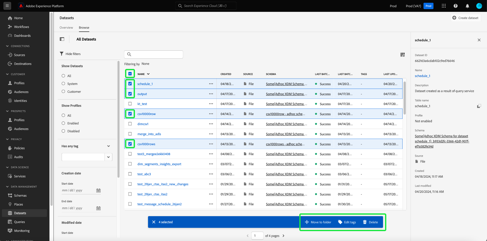

# Notas de la versión de Adobe Experience Platform

**Fecha de versión: miércoles, 21 de mayo de 2024**

>[!TIP]
>
>El [Documentación de API de Experience Platform](https://developer.adobe.com/experience-platform-apis/) es ahora interactivo. Explore los extremos de la API directamente desde las páginas de documentación para obtener comentarios inmediatos y acelerar la implementación técnica. [Más información](#interactive-api-documentation) sobre la nueva funcionalidad.

Actualizaciones de funciones existentes en Experience Platform:

- [Servicio de catálogo](#catalog-service)
- [Tableros](#dashboards)
- [Gobierno de datos](#governance)
- [Destinos](#destinations)
- [Servicio de consultas](#query-service)
- [Servicio de segmentación](#segmentation)
- [Fuentes](#sources)

Otras actualizaciones en Adobe Experience Platform:

- [Actualizaciones de la documentación](#documentation-updates)

## Servicio de catálogo {#catalog-service}

El servicio de catálogo es el sistema de registro para la ubicación y el linaje de datos dentro de Adobe Experience Platform. Mientras que todos los datos que se incorporan al Experience Platform se almacenan en el lago de datos como archivos y directorios, el catálogo contiene los metadatos y la descripción de esos archivos y directorios para fines de búsqueda y monitorización.

**Funciones nuevas o actualizadas**

| Función | Descripción |
| --- | --- |
| Acciones masivas | El inventario de conjuntos de datos ahora admite acciones masivas. Optimice sus procesos de administración de datos y garantice la administración eficiente de sus conjuntos de datos con acciones masivas. Utilice acciones masivas para ahorrar tiempo al realizar varias acciones en varios conjuntos de datos simultáneamente.  Las acciones masivas incluyen [Mover a carpeta](../../catalog/datasets/user-guide.md#move-to-folders), [Editar etiquetas](../../catalog/datasets/user-guide.md#manage-tags), y [Eliminar](../../catalog/datasets/user-guide.md#delete) conjuntos de datos.   {width="100" zoomable="yes"}   Para obtener más información acerca de esta función, lea la [Guía de IU de conjuntos de datos](../../catalog/datasets/user-guide.md#bulk-actions). |

{style="table-layout:auto"}

## Paneles {#dashboards}

Adobe Experience Platform proporciona varios paneles a través de los cuales puede ver información importante acerca de los datos de su organización, tal y como se captura durante las instantáneas diarias.

**Funciones nuevas o actualizadas**
| Función | Descripción | | — | — | | Perspectivas personalizables para informes de aplicaciones ampliados | Perfecto [transición del resultado del análisis SQL a formatos visuales comprensibles y fáciles de usar](../../dashboards/data-distiller/customizable-insights/overview.md). Utilice consultas SQL personalizadas para la manipulación de datos precisa y la creación de gráficos dinámicos a partir de diversos conjuntos de datos estructurados. Puede utilizar el modo query pro para realizar análisis complejos con SQL y luego compartir este análisis con usuarios no técnicos a través de gráficos en su panel personalizado o exportarlos en archivos CSV. |

{style="table-layout:auto"}

## Control de datos {#governance}

La gobernanza de datos de Adobe Experience Platform es una serie de estrategias y tecnologías que se utilizan para administrar los datos de los clientes y garantizar el cumplimiento de las regulaciones, restricciones y políticas aplicables al uso de datos. Desempeña un papel clave dentro de [!DNL Experience Platform] en varios niveles, incluida la catalogación, el linaje de datos, el etiquetado del uso de datos, las políticas de acceso a datos y el control de acceso a los datos para acciones de marketing.

**Nuevas funciones**

| Función | Descripción |
| --- | --- |
| Compatibilidad con mTLS para destinos de API HTTP y acciones personalizadas de Adobe Journey Optimizer | Genere confianza en los clientes con las medidas de seguridad reforzadas del protocolo de seguridad de la capa de transporte mutuo (mTLS). El [Destino de API HTTP de Experience Platform](../../destinations/catalog/streaming/http-destination.md#mtls-protocol-support) y [Acciones personalizadas de Adobe Journey Optimizer](https://experienceleague.adobe.com/en/docs/journey-optimizer/using/orchestrate-journeys/about-journey-building/using-custom-actions) ahora admite el protocolo mTLS al enviar datos a puntos de conexión configurados. No se requiere ninguna configuración adicional en la acción personalizada o en el destino de la API HTTP para activar mTLS; este proceso se produce automáticamente cuando se detecta un punto de conexión habilitado para mTLS. Puede [descargue el certificado público de Adobe Journey Optimizer aquí](../../landing/governance-privacy-security/encryption.md#download-certificates) y el [Certificado público del servicio de destinos aquí](../../landing/governance-privacy-security/encryption.md#download-certificates). Consulte la [Documentación de cifrado de datos de Experience Platform](../../landing/governance-privacy-security/encryption.md#mtls-protocol-support) para obtener más información sobre los protocolos de conexión de red al exportar datos a sistemas de terceros. |

{style="table-layout:auto"}

## Destinos {#destinations}

[!DNL Destinations] son integraciones generadas previamente con plataformas de destino que permiten la activación perfecta de datos de Adobe Experience Platform. Puede utilizar los destinos para activar los datos conocidos y desconocidos para campañas de marketing entre canales, campañas por correo electrónico, publicidad segmentada y muchos otros casos de uso.

**Funcionalidad nueva o actualizada** {#destinations-new-updated-functionality}

| Funcionalidad | Descripción |
| ----------- | ----------- |
| Reordenar los campos de asignación para destinos por lotes | Ahora puede cambiar el orden de las columnas en las exportaciones CSV arrastrando y soltando los campos de asignación en la [paso de asignación](../../destinations/ui/activate-batch-profile-destinations.md#mapping). El orden de los campos asignados en la interfaz de usuario se refleja en el orden de las columnas del archivo CSV exportado, de arriba a abajo, siendo la fila superior la columna situada más a la izquierda en el archivo CSV. |
| Programaciones de exportación predeterminadas preseleccionadas para destinos por lotes | Experience Platform ahora establece automáticamente una programación predeterminada para cada exportación de archivo. Consulte la documentación sobre [programación de exportaciones de audiencia](../../destinations/ui/activate-batch-profile-destinations.md#scheduling) para aprender a modificar la programación predeterminada. |
| Editar varias programaciones de activación de audiencia para destinos por lotes | Ahora puede editar la programación de activación para varias audiencias desde el [página de detalles de destino](../../destinations/ui/destination-details-page.md#bulk-edit-schedule). |
| Exportar varias audiencias bajo demanda a destinos por lotes | Ahora puede seleccionar y exportar varias audiencias a destinos por lotes mediante el [exportar archivos bajo demanda](../../destinations/ui/export-file-now.md) funcionalidad. |

{style="table-layout:auto"}

Para obtener información más general sobre los destinos, consulte la [información general sobre destinos](../../destinations/home.md).

## Servicio de consultas {#query-service}

El servicio de consulta le permite utilizar SQL estándar para consultar datos en el [!DNL Data Lake] de Adobe Experience Platform. Puede unir cualquier conjunto de datos de [!DNL Data Lake] y capturan los resultados de la consulta como un nuevo conjunto de datos para usar en sistema de informes, espacio de trabajo de ciencia de datos o para su inserción en el perfil del cliente en tiempo real.

**Funciones actualizadas**

| Función | Descripción |
| --- | --- |
| Editor heredado en desuso | El editor anterior ha quedado obsoleto y ya no se puede acceder a él. En su lugar, puede utilizar la variable [funciones mejoradas del Editor de consultas](../../query-service/ui/user-guide.md#query-authoring) para escribir, validar y ejecutar las consultas. |
| Retraso de ejecución de consulta | Mantenga el control de las horas del equipo mediante la configuración de alertas para los retrasos en las ejecuciones de consultas. Puede elegir recibir alertas si el estado de una consulta no cambia después de un período de tiempo específico. Solo tiene que establecer el tiempo de retraso deseado en la interfaz de usuario de Platform para mantenerse informado sobre el progreso de la consulta. Para obtener información sobre cómo establecer esta alerta en la interfaz de usuario, consulte [documentación de programaciones de consultas](../../query-service/ui/query-schedules.md#alerts-for-query-status) o el [guía para acciones de consulta en línea](../../query-service/ui/monitor-queries.md#query-run-delay). |
| Inventario de registro de consultas optimizado | Ahora puede utilizar una eficacia mejorada en la resolución de problemas y la monitorización de tareas con una [IU de registros de consulta optimizada](../../query-service/ui/query-logs.md#filter-logs): <ul><li> La IU de Platform ahora excluye todas las &quot;Consultas del sistema&quot; de la pestaña Registros de forma predeterminada. </li><li> Ver consultas del sistema desmarcando **Excluir consultas del sistema**. </li></ul>   {width="100" zoomable="yes"}   Utilice la interfaz de usuario de registros de consulta optimizada para obtener una vista más enfocada que le ayude a identificar y analizar rápidamente los registros relevantes. |
| Selector de base de datos | Utilice el nuevo menú desplegable selector de base de datos para [Acceda fácilmente a las vistas de datos de Customer Journey Analytics desde Power BI o Tableau](../../query-service/ui/credentials.md#connect-to-customer-journey-analytics). Ahora puede seleccionar la base de datos deseada directamente desde la interfaz de usuario de Platform para lograr una integración más fluida de las herramientas de BI.   {width="100" zoomable="yes"}   |

{style="table-layout:auto"}

## Servicio de segmentación {#segmentation}

[!DNL Segmentation Service] le permite segmentar los datos almacenados en [!DNL Experience Platform] que se relacionan con personas (como clientes, clientes potenciales, usuarios u organizaciones) en públicos. Puede crear públicos a través de definiciones de segmentos u otras fuentes a partir de sus datos de [!DNL Real-Time Customer Profile]. Estos públicos se configuran de forma centralizada y se mantienen en [!DNL Platform] y son fácilmente accesibles desde cualquier solución de Adobe.

**Función actualizada**

| Función | Descripción |
| --- | --- |
| Importación de audiencias generadas externamente | La importación de audiencias generadas externamente ahora requiere el permiso Importar audiencia. Para obtener más información sobre los permisos, lea la [guía de IU de permissions](../../access-control/home.md#permissions). |

{style="table-layout:auto"}

## Fuentes {#sources}

Experience Platform proporciona una API RESTful y una IU interactiva que le permite configurar conexiones de origen para varios proveedores de datos con facilidad. Estas conexiones de origen le permiten autenticarse y conectarse a sistemas de almacenamiento externos y servicios CRM, establecer tiempos para ejecuciones de ingesta y administrar el rendimiento de ingesta de datos.

Utilice fuentes en Experience Platform para introducir datos de una aplicación de Adobe o una fuente de datos de terceros.

**Funciones nuevas o actualizadas**

| Función | Descripción |
| --- | --- |
| Autenticación de credenciales de cliente de OAuth2 para [!DNL Salesforce] origen | Ahora puede utilizar la credencial de cliente de OAuth2 para autenticar su [!DNL Salesforce] cuenta en el Experience Platform. Lea el [!DNL Salesforce] origen [Guía de API](../../sources/tutorials/api/create/crm/salesforce.md) y [Guía de IU](../../sources/tutorials/ui/create/crm/salesforce.md) para obtener más información. |
| Compatibilidad con el flujo de datos de ejemplo para [!DNL Marketo Engage] origen | El [!DNL Marketo Engage] El origen de ahora admite flujos de datos de ejemplo. Habilite la configuración del flujo de datos de ejemplo para limitar la tasa de ingesta y luego probar las funciones del Experience Platform sin tener que ingerir grandes cantidades de datos. Para obtener más información, lea la guía de [creación de un flujo de datos para [!DNL Marketo Engage] en la IU de](../../sources/tutorials/ui/create/adobe-applications/marketo.md). |
| Actualizaciones en la lista de permitidos de direcciones IP | Según la ubicación, debe agregar un conjunto de nuevas direcciones IP a la lista de permitidos para utilizar correctamente las fuentes de flujo continuo. Para obtener una lista completa de las nuevas direcciones IP, lea la [Guía de lista de permitidos de direcciones IP](../../sources/ip-address-allow-list.md). |

{style="table-layout:auto"}

**Documentación nueva o actualizada**

| Documentación actualizada | Descripción |
| --- | --- |
| Actualizaciones de documentación para [!DNL Google PubSub] | El [!DNL Google PubSub] La documentación de origen de se ha actualizado con una guía completa de requisitos previos. Utilice la nueva sección de requisitos previos para aprender a crear su cuenta de servicio, conceder permisos en el nivel de tema o suscripción y definir configuraciones para optimizar el uso del [!DNL Google PubSub] origen. Lea el [[!DNL Google PubSub] descripción general](../../sources/connectors/cloud-storage/google-pubsub.md) para obtener más información. |

{style="table-layout:auto"}

Para obtener más información sobre las fuentes, lea la [información general de orígenes](../../sources/home.md).

## Actualizaciones de la documentación {#documentation-updates}

### Documentación de API de Experience Platform interactiva {#interactive-api-documentation}

El [Documentación de API de Experience Platform](https://developer.adobe.com/experience-platform-apis/) es ahora interactivo. Todas las páginas de referencia de la API ahora tienen un **Pruébelo.** que puede utilizar para probar llamadas a la API directamente en la página del sitio web de documentación. [Obtenga las credenciales de autenticación requeridas](/help/landing/api-authentication.md) y empiece a utilizar la funcionalidad para explorar los extremos de la API.

Utilice esta nueva funcionalidad para explorar las solicitudes a y las respuestas de los extremos de la API, obtener comentarios inmediatos y acelerar la implementación técnica. Por ejemplo, visite la [API del servicio de identidad](https://developer.adobe.com/experience-platform-apis/references/identity-service/) o el [API de Registro de esquemas](https://developer.adobe.com/experience-platform-apis/references/schema-registry/) puntos finales para explorar la nueva **Pruébelo.** en el carril derecho.

>[!CAUTION]
>
>Tenga en cuenta que al utilizar la funcionalidad de API interactiva en las páginas de documentación de, está realizando llamadas de API reales a los extremos de. Tenga esto en cuenta al experimentar con entornos limitados de producción.

### Perspectivas y participación personalizadas {#personalized-insights-engagement}

Una nueva página de documentación de casos de uso de extremo a extremo para [evolución del valor único al valor de duración](/help/rtcdp/use-case-guides/evolve-one-time-value-lifetime-value/evolve-one-time-value-to-lifetime-value.md) ahora está activo. Lea esta documentación para comprender cómo puede utilizar Real-Time CDP y Adobe Journey Optimizer para convertir visitantes esporádicos en sus propiedades web para clientes fieles.
