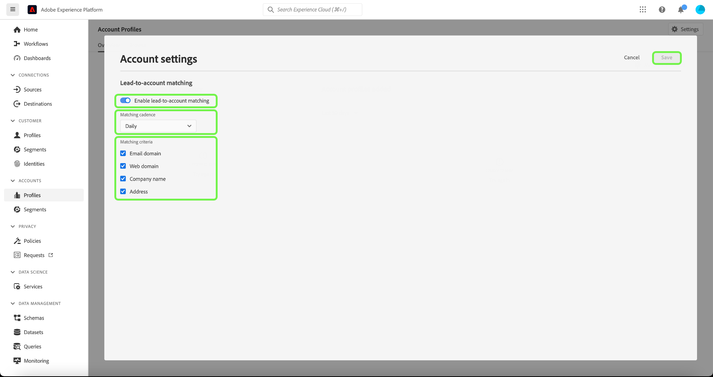

# Guía de IU del perfil de cuenta

>[!NOTE]
>
>Los perfiles de cuenta solo están disponibles para los clientes de Real-time Customer Data Platform B2B Edition. Para obtener más información acerca de Real-Time CDP, incluidas las funciones y características disponibles para cada tipo de licencia, comience por leer el [Información general de Real-Time CDP](../overview.md).

Los perfiles de cuenta permiten unificar la información de la cuenta de varias fuentes. Esta vista unificada de una cuenta reúne datos de sus numerosos canales de marketing y de los diversos sistemas que su organización utiliza actualmente para almacenar la información de la cuenta de cliente. Este documento proporciona una guía para interactuar con perfiles de cuenta mediante las funciones de Real-Time CDP, B2B Edition disponibles en la interfaz de usuario (IU) de Adobe Experience Platform.

Para obtener más información sobre cómo se crean los perfiles de cuenta como parte del flujo de trabajo B2B, consulte la [tutorial de extremo a extremo](../b2b-tutorial.md).

## Resumen de perfiles de cuenta {#account-profiles-overview}

Seleccionar **[!UICONTROL Perfiles]** bajo [!UICONTROL Cuentas] en la barra de navegación izquierda para ver la descripción general de los perfiles de cuenta. En el [!UICONTROL Información general] , el tablero muestra un gráfico o un gráfico que muestra los widgets en un solo punto de entrada.

Consulte la documentación de la [[!UICONTROL Perfiles de cuenta]](../../dashboards/guides/account-profiles.md) tablero para obtener más información. Consulte la documentación sobre [Real-time Customer Data Platform Insights Data Model B2B Edition](../../dashboards/data-models/cdp-insights-data-model-b2b.md) para obtener más información sobre cómo se pueden utilizar los modelos de datos de insights para crear gráficos personalizados para los paneles.

## Configurar coincidencia de cliente potencial con cuenta {#configure-lead-to-account-matching}

>[!IMPORTANT]
>
> Solo los administradores de IA B2B pueden habilitar, deshabilitar y configurar el servicio de coincidencia de clientes potenciales con cuentas. Al deshabilitar el servicio, los resultados coincidentes se eliminarán en un plazo de 24 horas.

Para configurar la coincidencia de cliente potencial con cuenta, seleccione **[!UICONTROL Perfiles]** bajo [!UICONTROL Cuentas] en el panel de navegación izquierdo. En el **[!UICONTROL Información general]** pestaña, seleccione **[!UICONTROL Configuración]** en la parte superior derecha.

El **[!UICONTROL Configuración de cuenta]** se abre. Desde aquí, seleccione la **[!UICONTROL Habilitar coincidencia de cliente potencial con cuenta]** para activar la función. Utilice el menú desplegable para seleccionar **[!UICONTROL Diario]** para el **[!UICONTROL Cadencia coincidente]** configuración. Finalmente, seleccione el **[!UICONTROL Criterios coincidentes]** opciones seguidas de **[!UICONTROL Guardar]** para confirmar la configuración y volver a la **[!UICONTROL Perfiles de cuenta]** pantalla.

>[!NOTE]
>
> La dirección no puede utilizarse como único criterio coincidente. Se deben seleccionar uno o más de los otros criterios coincidentes.

Para obtener más información sobre la coincidencia de clientes potenciales con cuentas, consulte la [Coincidencia de clientes potenciales con cuentas en la descripción general de Real-Time CDP B2B](../../rtcdp/b2b-ai-ml-services/lead-to-account-matching.md).

## Examinar perfiles de cuenta {#browse-account-profiles}

Para examinar los perfiles de cuenta, comience seleccionando **[!UICONTROL Perfiles]** bajo [!UICONTROL Cuentas] en el panel de navegación izquierdo.

En el **[!UICONTROL Examinar]** , puede explorar perfiles de cuenta utilizando un ID de cuenta de una fuente empresarial conectada o introduciendo directamente los detalles de la fuente.

### Examinar por [!UICONTROL Origen empresarial conectado] {#browse-by-connected-enterprise-source}

Para examinar los perfiles de cuenta de un origen empresarial conectado, seleccione **[!UICONTROL Origen empresarial conectado]** desde el **[!UICONTROL Examinar por]** y, a continuación, elija una fuente conectada mediante el botón de selección situado junto a la **[!UICONTROL Origen]** field.

Esto abre el **[!UICONTROL Seleccionar origen]** , donde puede seleccionar un origen basado en las conexiones que su organización ha establecido.

>[!NOTE]
>
>Su organización puede tener varios orígenes configurados para el mismo proveedor de servicios (por ejemplo, Marketo), por lo que es importante revisar el nombre de la conexión, el sistema de origen y la instancia del sistema de origen para asegurarse de que está buscando por la instancia de origen correcta.

Para obtener más información sobre la conexión de orígenes empresariales, consulte la [información general de orígenes](../sources/sources-overview.md).

Para elegir un origen, seleccione el botón de opción situado junto al nombre de la conexión y, a continuación, utilice **[!UICONTROL Seleccionar]** para volver a la [!UICONTROL Examinar] pestaña.

Con un origen seleccionado, ahora debe introducir un **[!UICONTROL ID de cuenta]** relacionado con el origen. Por ejemplo, si selecciona un origen de Salesforce, deberá introducir un ID de cuenta desde la instancia de Salesforce para ver el perfil de cuenta vinculado a ese ID.

>[!NOTE]
>
>Para los ID de cuenta de Marketo, hay dos posibles tablas de cuentas a las que se puede hacer referencia; por lo tanto, debe utilizar una sintaxis específica para asegurarse de que está viendo la cuenta correcta.
>
>La sintaxis estándar más común es el ID de cuenta de Marketo anexado por `.mkto_org` (por ejemplo, `1234567.mkto_org`). Los clientes de Marketo Account-Based Marketing pueden tener valores adicionales que se pueden encontrar utilizando el ID de cuenta de Marketo anexado por `.mkto_account`. Si no está seguro de qué sintaxis utilizar, consúltelo con su administrador de Marketo.

### Examinar por [!UICONTROL Otros] {#browse-by-others}

Real-Time CDP, B2B Edition admite la capacidad de realizar una búsqueda directa al permitirle introducir una **[!UICONTROL Nombre de origen]**, **[!UICONTROL Instancia de origen]**, y **[!UICONTROL ID de cuenta]** para una cuenta que desee ver. Al introducir el nombre de origen y la instancia directamente, proporciona el contexto necesario para que el Experience Platform busque y muestre los datos de perfil de cuenta correctos.

La capacidad de realizar una búsqueda directa es útil en circunstancias en las que no es posible establecer una conexión de origen directamente con los datos. Por ejemplo, si su organización tiene políticas de gobernanza de datos que impiden la conexión directa a un CRM, puede exportar esos datos a un sistema de almacenamiento en la nube y luego introducirlos en Experience Platform.

Otro ejemplo podría ser que está realizando una transformación de los datos entre el momento en que abandona un sistema y entra en Platform. Puede utilizar la funcionalidad de búsqueda directa para proporcionar contexto a los datos (como especificar que son datos de Marketo, a pesar de que provienen de un bloque de Amazon S3, por ejemplo) para que el sistema sepa dónde buscar los datos y cómo procesarlos correctamente.

Para comenzar una búsqueda directa, seleccione **[!UICONTROL Otros]** desde el **[!UICONTROL Examinar por]** y, a continuación, introduzca un **[!UICONTROL Nombre de origen]**, **[!UICONTROL Instancia de origen]**, y **[!UICONTROL ID de cuenta]** para la cuenta que desea ver.

## Ver detalles del perfil de la cuenta {#view-account-profile-details}

Después de usar el **[!UICONTROL Examinar]** para localizar un perfil de cuenta, seleccionando la pestaña **[!UICONTROL ID de perfil]** abre el **[!UICONTROL Detalle]** para el perfil de cuenta. La información de perfil mostrada en la **[!UICONTROL Detalle]** se ha combinado desde varios fragmentos de perfil para formar una sola vista de la cuenta individual. Esto incluye detalles de la cuenta, como atributos básicos y datos de medios sociales.

Los campos predeterminados mostrados también se pueden cambiar en el nivel organizativo para mostrar los atributos de perfil de cuenta preferidos.

>[!NOTE]
>
>Hay una funcionalidad similar disponible para los perfiles del cliente y se ha creado una guía paso a paso con instrucciones para añadir y eliminar atributos, cambiar el tamaño de los paneles, etc. Lea el [guía de personalización de detalles de perfil](../../profile/ui/profile-customization.md) para obtener más información.

Puede ver detalles adicionales relacionados con la cuenta seleccionando otra de las pestañas disponibles. Estas pestañas incluyen atributos, personas y la pestaña de oportunidades que muestra las oportunidades abiertas y cerradas relacionadas con la cuenta en los sistemas de la empresa. Consulte las secciones siguientes para obtener más información sobre cada pestaña.

## Pestaña Atributos {#attributes-tab}

El **[!UICONTROL Atributos]** La pestaña enumera toda la información de registro relacionada con la cuenta. Esto incluye datos de atributos procedentes de varias fuentes que se han combinado para formar una sola vista de la cuenta.

Además de poder ver los datos en una lista, puede utilizar la barra de búsqueda para buscar atributos específicos o ver los datos de registro como JSON.

## Pestaña Personas {#people-tab}

El **[!UICONTROL People]** proporciona una lista de personas individuales asociadas a la cuenta. Estas personas pueden ser contactos y posibles clientes de diferentes sistemas empresariales administrados por diferentes equipos dentro de su organización, pero en Real-Time CDP, B2B Edition se presentan juntas como una sola lista que le permite ver una vista más integral de los contactos de su cuenta.

>[!NOTE]
>
>El [!UICONTROL People] La pestaña muestra una lista de hasta 25 personas asociadas con la cuenta. Para cuentas con más de 25 personas asociadas, el sistema muestra un muestreo aleatorio de 25 registros.

Además de mostrar una instantánea de la información del contacto, cada persona incluida en la lista también incluye un **[!UICONTROL ID de perfil]**, que es un vínculo en el que se puede hacer clic que le permite explorar el perfil del cliente en tiempo real de esa persona. Para obtener más información sobre la visualización de perfiles de clientes individuales relacionados con sus cuentas, visite la guía de [explorar perfiles en Real-Time CDP, edición B2B](../profile/profile-browse.md).

## Pestaña Oportunidades {#opportunities-tab}

El **[!UICONTROL Oportunidades]** proporciona información sobre las oportunidades abiertas y cerradas relacionadas con la cuenta. Estas oportunidades se pueden ingerir en Experience Platform desde varias fuentes, pero Real-Time CDP, B2B Edition facilita a los especialistas en marketing la visualización de todas estas oportunidades juntas en un solo lugar.

>[!NOTE]
>
>El [!UICONTROL Oportunidades] La pestaña muestra una lista de hasta 25 oportunidades asociadas con la cuenta. Para las cuentas con más de 25 oportunidades asociadas, el sistema muestra un muestreo aleatorio de 25 registros.

Cada oportunidad incluye información como el nombre de la oportunidad, su cantidad, fase y si la oportunidad está abierta, cerrada, ganada o perdida.

## Pestaña Cuentas relacionadas {#related-accounts-tab}

El **[!UICONTROL Cuentas relacionadas]** proporciona información sobre otras cuentas que pueden estar relacionadas con la cuenta que está explorando. Para obtener información detallada acerca de la funcionalidad, lea la [información general sobre cuentas relacionadas](/help/rtcdp/b2b-ai-ml-services/related-accounts.md).

>[!NOTE]
>
>* Un grupo de cuentas relacionadas puede tener un máximo de 30 perfiles de cuenta. Si se encuentran relacionados más de 30 perfiles de cuenta, se dividen arbitrariamente en varios grupos, cada uno de los cuales no tiene más de 30 miembros. El grupo Cuentas relacionadas de un perfil de cuenta siempre se incluye a sí mismo.
>* El [!UICONTROL Cuentas relacionadas] Esta pestaña muestra actualmente una lista de hasta 25 cuentas relacionadas asociadas con la cuenta que está explorando. Esta es una limitación que se abordará en una actualización futura. A pesar de esta limitación de la interfaz de usuario, cuando se utilizan cuentas relacionadas en las definiciones de segmentos, para grupos de 30 perfiles de cuenta relacionados, todos los perfiles se utilizan para la segmentación.

Cada cuenta relacionada incluye información como el ID y el nombre del perfil de la cuenta, su clave de origen de la cuenta y más información relacionada con la página principal, la dirección, la cuenta principal, el teléfono, el sector y los ingresos anuales.

Puede utilizar las cuentas relacionadas de esta lista con fines de segmentación. Consulte un [ejemplo de segmentación](/help/rtcdp/segmentation/b2b.md#related-account) para comprender cómo utilizar cuentas relacionadas con el fin de ampliar su alcance en las definiciones de segmentos.