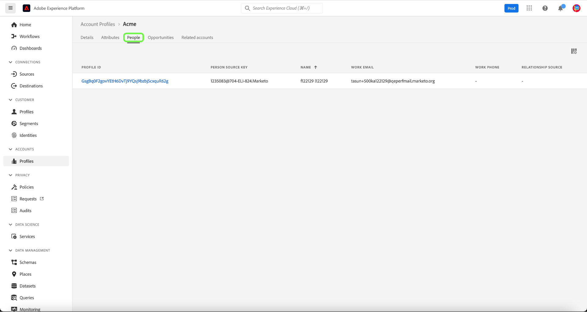

# Guía de la interfaz de usuario del perfil de la cuenta

>[!NOTE]
>
>Los perfiles de cuenta solo están disponibles para los clientes de Real-time Customer Data Platform B2B Edition. Para obtener más información sobre Real-Time CDP, incluidas las funciones y funcionalidades disponibles para cada tipo de licencia, lea la [Información general de Real-Time CDP](../overview.md).

Los perfiles de cuenta permiten unificar la información de la cuenta de varias fuentes. Esta vista unificada de una cuenta aúna datos de sus muchos canales de marketing y los diversos sistemas que está utilizando su organización para almacenar información de cuentas de clientes. Este documento proporciona una guía para interactuar con perfiles de cuenta mediante las funciones de Real-Time CDP, B2B Edition disponibles en la interfaz de usuario (IU) de Adobe Experience Platform.

Para obtener más información sobre cómo se crean los perfiles de cuenta como parte del flujo de trabajo B2B, consulte la [tutorial completo](../b2b-tutorial.md).

## Información general sobre perfiles de cuenta {#account-profiles-overview}

Select **[!UICONTROL Perfiles]** under [!UICONTROL Cuentas] en el panel de navegación izquierdo para ver la descripción general de los perfiles de cuenta. En el [!UICONTROL Información general] , el tablero muestra un gráfico o un gráfico con las utilidades en un solo punto de entrada.

Consulte la documentación de [[!UICONTROL Perfiles de la cuenta]](../../dashboards/guides/account-profiles.md) tablero para obtener más información.

## Configurar la coincidencia de posibles clientes con cuentas {#configure-lead-to-account-matching}

>[!IMPORTANT]
>
> Solo los administradores de B2B AI pueden habilitar, deshabilitar y configurar el servicio de coincidencia de cuentas de posibles clientes. Al desactivar el servicio, los resultados coincidentes se eliminarán en un plazo de 24 horas.

Para configurar la coincidencia de posibles clientes con cuentas, seleccione **[!UICONTROL Perfiles]** under [!UICONTROL Cuentas] en el panel de navegación izquierdo. En el **[!UICONTROL Información general]** , seleccione **[!UICONTROL Configuración]** en la parte superior derecha.

La variable **[!UICONTROL Configuración de la cuenta]** se abre. Seleccione la **[!UICONTROL Habilitar la coincidencia de cliente potencial a cuenta]** para habilitar la función. Utilice el menú desplegable para seleccionar **[!UICONTROL Diario]** para el **[!UICONTROL Coincidencia de cadencia]** configuración. Finalmente, seleccione el **[!UICONTROL Criterios de coincidencia]** opciones seguidas de **[!UICONTROL Guardar]** para confirmar la configuración y volver a la **[!UICONTROL Perfiles de la cuenta]** en el Navegador.

>[!NOTE]
>
> La dirección no se puede usar como los únicos criterios coincidentes. Se debe seleccionar uno o más de los demás criterios coincidentes.

Para obtener más información sobre la coincidencia de cuentas de posibles clientes, consulte la [Resumen de la coincidencia de posibles clientes con cuentas en Real-Time CDP B2B](../../rtcdp/b2b-ai-ml-services/lead-to-account-matching.md).

## Explorar perfiles de cuenta {#browse-account-profiles}

Para examinar los perfiles de cuenta, comience por seleccionar **[!UICONTROL Perfiles]** under [!UICONTROL Cuentas] en el panel de navegación izquierdo.

En el **[!UICONTROL Examinar]** , puede explorar perfiles de cuenta mediante un ID de cuenta de un origen empresarial conectado o introduciendo directamente los detalles del origen.

### Examinar por [!UICONTROL Origen empresarial conectado] {#browse-by-connected-enterprise-source}

Para examinar los perfiles de cuenta por un origen de empresa conectado, seleccione **[!UICONTROL Origen empresarial conectado]** de la variable **[!UICONTROL Examinar por]** lista desplegable y, a continuación, elija un origen conectado con el botón de selección situado junto al **[!UICONTROL Fuente]** campo .

Esto abre el **[!UICONTROL Seleccionar origen]** , donde puede seleccionar un origen basado en las conexiones que ha establecido su organización.

>[!NOTE]
>
>Su organización puede tener varias fuentes configuradas para el mismo proveedor de servicios (por ejemplo, Marketo), por lo que es importante revisar el nombre de la conexión, el sistema de origen y la instancia del sistema de origen para asegurarse de que está buscando por la instancia de origen correcta.

Para obtener más información sobre la conexión de orígenes empresariales, consulte la [información general sobre fuentes](../sources/sources-overview.md).

Para elegir una fuente, seleccione el botón de opción situado junto al nombre de la conexión y, a continuación, utilice **[!UICONTROL Select]** para volver a la [!UICONTROL Examinar] pestaña .

Con un origen seleccionado, ahora debe introducir un **[!UICONTROL ID de cuenta]** relacionado con el origen. Por ejemplo, si selecciona un origen de Salesforce, tendrá que introducir un ID de cuenta de la instancia de Salesforce para poder ver el perfil de cuenta vinculado a dicho ID.

>[!NOTE]
>
>Para los ID de cuenta de Marketo, hay dos tablas de cuenta posibles a las que se puede hacer referencia, por lo que debe utilizar una sintaxis específica para asegurarse de que está viendo la cuenta correcta.
>
>La sintaxis estándar más común es el ID de cuenta de Marketo anexado por `.mkto_org` (por ejemplo, `1234567.mkto_org`). Los clientes de Marketo Account-Based Marketing pueden tener valores adicionales que se pueden encontrar utilizando el ID de cuenta de Marketo anexado por `.mkto_account`. Si no está seguro de qué sintaxis utilizar, consulte con su administrador de Marketo.

### Examinar por [!UICONTROL Otros] {#browse-by-others}

Real-Time CDP, B2B Edition es compatible con la capacidad de realizar una búsqueda directa al permitirle introducir una **[!UICONTROL Nombre de origen]**, **[!UICONTROL Instancia de origen]** y **[!UICONTROL ID de cuenta]** para una cuenta que desee ver. Al introducir el nombre de origen y la instancia directamente, se proporciona el contexto necesario para que el Experience Platform busque y muestre los datos de perfil de cuenta correctos.

La capacidad de realizar una búsqueda directa es útil en circunstancias en las que no es posible establecer una conexión de origen directamente a los datos. Por ejemplo, si su organización cuenta con políticas de control de datos que impiden la conexión directa a un CRM, puede exportar esos datos a un sistema de almacenamiento en la nube y luego incorporarlos a un Experience Platform.

Otro ejemplo podría ser que está realizando una transformación en los datos entre el momento en que deja un sistema e ingresa en Platform. Puede utilizar la funcionalidad de búsqueda directa para proporcionar contexto a los datos (como especificar que son datos de Marketo, a pesar de que provienen de un bucket de Amazon S3, por ejemplo), de modo que el sistema sepa dónde buscar y cómo procesar correctamente los datos.

Para comenzar una búsqueda directa, seleccione **[!UICONTROL Otros]** de la variable **[!UICONTROL Examinar por]** lista desplegable y, a continuación, introduzca un **[!UICONTROL Nombre de origen]**, **[!UICONTROL Instancia de origen]** y **[!UICONTROL ID de cuenta]** para la cuenta que desee ver.

## Ver detalles del perfil de la cuenta {#view-account-profile-details}

Después de usar la variable **[!UICONTROL Examinar]** para localizar un perfil de cuenta, seleccione la **[!UICONTROL ID de perfil]** abre el **[!UICONTROL Detalle]** para el perfil de cuenta. La información de perfil mostrada en la variable **[!UICONTROL Detalle]** se ha combinado desde varios fragmentos de perfil para formar una sola vista de la cuenta individual. Esto incluye detalles de la cuenta, como atributos básicos y datos de medios sociales.

Los campos predeterminados mostrados también se pueden cambiar en el nivel de organización para mostrar los atributos de perfil de cuenta preferidos.

>[!NOTE]
>
>Hay funciones similares disponibles para perfiles de clientes y se ha creado una guía paso a paso con instrucciones para añadir y eliminar atributos, cambiar el tamaño de los paneles, etc. Lea el [guía de personalización de detalles de perfil](../../profile/ui/profile-customization.md) para obtener más información.

Puede ver detalles adicionales relacionados con la cuenta seleccionando otra de las pestañas disponibles. Estas pestañas incluyen atributos, personas y la pestaña de oportunidades que muestra las oportunidades abiertas y cerradas relacionadas con la cuenta en los sistemas empresariales. Consulte las secciones siguientes para obtener más información sobre cada pestaña.

## Ficha Atributos {#attributes-tab}

La variable **[!UICONTROL Atributos]** enumera toda la información de registro relacionada con la cuenta. Esto incluye los datos de atributos procedentes de varios orígenes que se han combinado para formar una sola vista de la cuenta.

Además de poder ver los datos en una lista, puede utilizar la barra de búsqueda para buscar atributos específicos o ver los datos de registro como JSON.

## Pestaña Personas {#people-tab}

La variable **[!UICONTROL People]** proporciona una lista de personas individuales asociadas a la cuenta. Estas personas pueden ser contactos y posibles clientes de diferentes sistemas empresariales gestionados por diferentes equipos de su organización, pero en Real-Time CDP, B2B Edition se presentan juntos como una lista única que le permite ver una vista más holística de los contactos de su cuenta.

>[!NOTE]
>
>La variable [!UICONTROL People] muestra una lista de hasta 25 personas asociadas a la cuenta. Para cuentas con más de 25 personas asociadas, el sistema muestra un muestreo aleatorio de 25 registros.

Además de mostrarle una instantánea de la información del contacto, cada persona incluida también incluye un **[!UICONTROL ID de perfil]**, que es un vínculo en el que se puede hacer clic y que le permite explorar el perfil del cliente en tiempo real de ese individuo. Para obtener más información sobre la visualización de perfiles de cliente individuales relacionados con sus cuentas, visite la guía para [exploración de perfiles en Real-Time CDP, B2B Edition](../profile/profile-browse.md).

## Ficha Oportunidades {#opportunities-tab}

La variable **[!UICONTROL Oportunidades]** proporciona información sobre las oportunidades abiertas y cerradas relacionadas con la cuenta. Estas oportunidades pueden ser incorporadas en Experience Platform de múltiples fuentes, sin embargo, Real-Time CDP, B2B Edition facilita a los especialistas en marketing ver todas estas oportunidades juntas en un solo lugar.

>[!NOTE]
>
>La variable [!UICONTROL Oportunidades] muestra una lista de hasta 25 oportunidades asociadas con la cuenta. Para cuentas con más de 25 oportunidades asociadas, el sistema muestra un muestreo aleatorio de 25 registros.

Cada oportunidad incluye información como el nombre de la oportunidad, su cantidad, etapa y si la oportunidad está abierta, cerrada, ganada o perdida.

## Ficha Cuentas relacionadas {#related-accounts-tab}

La variable **[!UICONTROL Cuentas relacionadas]** proporciona información sobre otras cuentas que pueden estar relacionadas con la cuenta que está explorando. Para obtener información detallada sobre la funcionalidad, lea la [información general sobre cuentas relacionadas](/help/rtcdp/b2b-ai-ml-services/related-accounts.md).

>[!NOTE]
>
>* Un grupo de cuentas relacionadas puede tener un máximo de 30 perfiles de cuenta. Si se encontraron relacionados más de 30 perfiles de cuenta, se dividen arbitrariamente en varios grupos, cada uno de los cuales tiene no más de 30 miembros. El grupo Cuentas relacionadas de un perfil de cuenta siempre se incluye a sí mismo.
>* La variable [!UICONTROL Cuentas relacionadas] actualmente muestra una lista de hasta 25 cuentas relacionadas con la cuenta que está explorando. Se trata de una limitación que se solucionará en una actualización futura. A pesar de esta limitación de la IU, cuando utiliza cuentas relacionadas en definiciones de segmentos, para grupos de 30 perfiles de cuenta relacionados, todos los perfiles se utilizan para la segmentación.

Cada cuenta relacionada incluye información como el ID y el nombre del perfil de la cuenta, su clave de fuente de la cuenta e información adicional relacionada con la página principal, la dirección, la cuenta principal, el teléfono, el sector y los ingresos anuales.

Puede utilizar las cuentas relacionadas en esta lista con fines de segmentación. Consulte una [ejemplo de segmentación](/help/rtcdp/segmentation/b2b.md#related-account) para comprender cómo usar cuentas relacionadas para expandir el alcance en definiciones de segmentos.