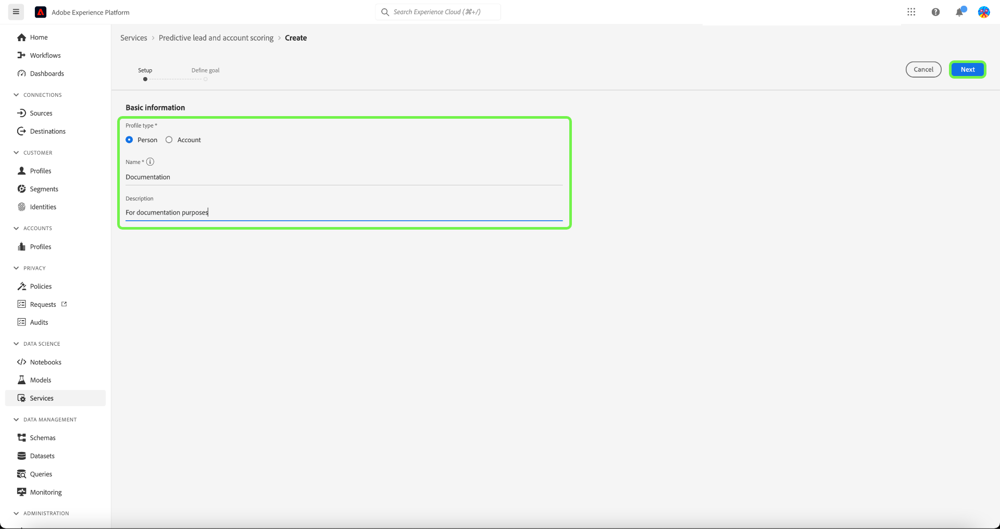
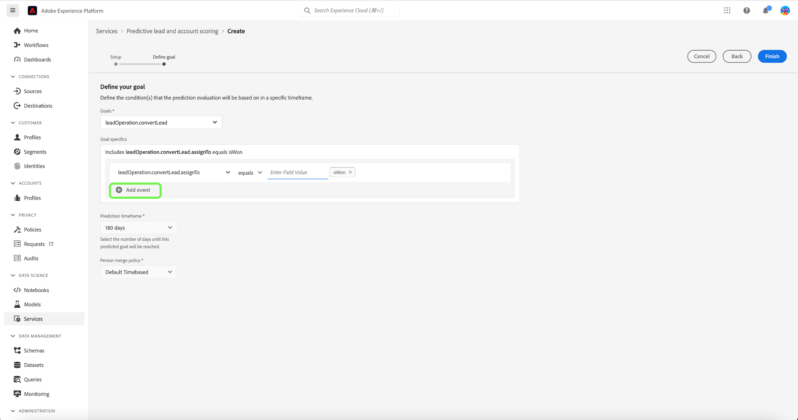

# Administre la puntuación predictiva de posibles clientes y cuentas en Adobe Real-time Customer Data Platform, B2B Edition

>[!NOTE]
>
>Solo los usuarios con permiso Administrar IA B2B pueden crear, cambiar y eliminar objetivos de puntuación.

Este tutorial le guía por los pasos para administrar los objetivos de puntuación del posible cliente predictivo y el servicio de puntuación de cuenta. Los objetivos de puntuación pueden ser para perfil de persona o perfil de cuenta

## Crear una nueva puntuación

Para crear una nueva puntuación, seleccione la opción **[!UICONTROL Servicios]** en la barra lateral y seleccione **[!UICONTROL Crear puntuación]**.

La variable **[!UICONTROL Información básica]** , solicitándole que seleccione un tipo de perfil, escriba un nombre y una descripción opcional. Cuando termine, seleccione **[!UICONTROL Siguiente]**.

La variable **[!UICONTROL Defina su objetivo]** se abre. Seleccione la flecha desplegable y, a continuación, seleccione un tipo de objetivo en la ventana desplegable que aparece.

La variable **[!UICONTROL Detalles del objetivo]** se abre. Seleccione la flecha desplegable y, a continuación, seleccione el nombre del campo de objetivo en la ventana desplegable que aparece.

La variable **[!UICONTROL Condiciones del objetivo]** aparece. Seleccione la flecha desplegable y, a continuación, seleccione condición en la ventana desplegable que aparece.

La variable **[!UICONTROL Valor de objetivo]** aparece. A continuación, configure el [!UICONTROL Detalles del objetivo]. Seleccione el [!UICONTROL Introducir valor de campo] e introduzca su valor de objetivo.

>[!NOTE]
>
>Se pueden agregar varios valores de objetivo.

Para añadir campos adicionales, seleccione **[!UICONTROL Añadir campo]**.

Para configurar el intervalo de tiempo de predicción, seleccione la flecha desplegable y, a continuación, seleccione el intervalo de tiempo que desee.

La política de combinación seleccionada determina cómo se seleccionan los valores de campo de un perfil de persona. Con la flecha desplegable, seleccione la política de combinación que desee y, a continuación, seleccione **[!UICONTROL Finalizar]**.

La variable **[!UICONTROL Se completó la configuración de puntuación]** aparece el cuadro de diálogo confirmando que se ha creado la nueva puntuación. Select **[!UICONTROL OK]**.

>[!NOTE]
>
>Cada proceso de puntuación puede tardar hasta 24 horas en completarse.

Volverá a la **[!UICONTROL Servicios]** , donde puede ver la nueva puntuación creada en la lista de puntuaciones.

Seleccione la puntuación para ver los detalles e información adicional sobre los detalles de la última ejecución.

Para obtener información más detallada sobre los códigos de error que se pueden ver en los detalles de la última ejecución, consulte la sección de [posibles códigos de error de canalización de IA](#leads-ai-pipeline-error-codes) en este documento.

## Editar una puntuación

Para editar una puntuación, seleccione una de las **[!UICONTROL Servicios]** y seleccione **[!UICONTROL Editar]** en el panel de detalles adicionales del lado derecho de la pantalla.

La variable **[!UICONTROL Editar instancia]** , donde puede editar la descripción de la puntuación. Realice los cambios y seleccione **[!UICONTROL Guardar]**.

>[!NOTE]
>
>La configuración de puntuación no se puede cambiar, ya que esto déclencheur el reciclaje y la repuntuación del modelo. Equivale a eliminar la puntuación y crear una nueva. Para editar la configuración de la puntuación, deberá clonar esta puntuación o crear una nueva.

Volverá a la **[!UICONTROL Servicios]** pestaña . Seleccione la puntuación para ver los detalles de la descripción actualizada en el panel de detalles adicionales del lado derecho de la pantalla.

## Clonar una puntuación

Para clonar una puntuación, seleccione una de las **[!UICONTROL Servicios]** y seleccione **[!UICONTROL Clonar]** en el panel de detalles adicionales del lado derecho de la pantalla.

La variable **[!UICONTROL Información básica]** se abre. El tipo de perfil, el nombre y la descripción se clonan a partir de la puntuación original. Modifique estos detalles y seleccione **[!UICONTROL Siguiente]**.

La variable **[!UICONTROL Defina su objetivo]** se abre. Complete la sección de objetivos como lo haría al crear una nueva puntuación y seleccione **[!UICONTROL Finalizar]**.

Volverá a la **[!UICONTROL Servicios]** , donde puede ver la puntuación recién clonada en la lista.

>[!NOTE]
>
>La variable **[!UICONTROL Defina su objetivo]** no se clona a partir de la puntuación original.

## Eliminar una puntuación

Para eliminar una puntuación, seleccione una de las **[!UICONTROL Servicios]** y seleccione **[!UICONTROL Eliminar]** en el panel de detalles adicionales del lado derecho de la pantalla.

La variable **[!UICONTROL Eliminar documentación]** aparece el cuadro de diálogo de confirmación. Seleccione **[!UICONTROL Delete]**.

>[!NOTE]
>
>Al eliminar la definición de puntuación también se eliminarían todas las puntuaciones predichas del perfil de persona o del perfil de cuenta, pero no el grupo de campos creado para la definición de puntuación. El grupo de campos se dejará &quot;huérfano&quot; en el modelo de datos.

Volverá a la **[!UICONTROL Servicios]** en la que ya no puede ver la puntuación en la lista.

## Posibles clientes: Códigos de error de canalización de IA

| Código de error | Mensaje de error |
| --- | --- |
| 401 | ERROR 401. Se detuvo la canalización de IA de posibles clientes: no hay suficientes cuentas válidas para la puntuación de cuentas. Recuento de cuentas: {}. |
| 402 | ERROR 402. Se detuvo la canalización de IA de posibles clientes: no hay suficientes contactos válidos para la puntuación de contacto. Recuento de contactos: {}. |
| 403 | ERROR 403. Se detuvo la canalización de IA de posibles clientes: no hay suficiente volumen de actividad para la formación del modelo. Recuento de eventos: {}. |
| 404 | ERROR 404. Se detuvo la canalización de IA de posibles clientes: no hay suficientes conversiones para la formación de modelos. Recuento de conversiones: {}. |
| 405 | ERROR 405. Se detuvo la canalización de IA de posibles clientes: actividad demasiado dispersa para una formación de modelo válida. Solo el {} por ciento de las cuentas tiene actividad. |
| 406 | ERROR 406. Se detuvo la canalización de IA de posibles clientes: actividad demasiado dispersa para una formación de modelo válida. Solo el {} por ciento de los contactos tiene actividad. |
| 407 | ERROR 407. Se detuvo la canalización de IA de posibles clientes: los tipos de actividad de datos de puntuación no coinciden con los datos de capacitación. |
| 408 | ERROR 408. Se detuvo la canalización de IA de posibles clientes: la tasa que falta es demasiado alta para las funciones de actividad. Tasa que falta: {}. |
| 409 | ERROR 409. Se detuvo la canalización de IA de posibles clientes: el auc de prueba es demasiado bajo. Prueba auc: {}. |
| 410 | ERROR 410. Se detuvo la canalización de IA de posibles clientes: el auc de prueba es demasiado bajo después del ajuste del parámetro. Prueba auc: {}. |
| 411 | ERROR 411. Se detuvo la canalización de IA de posibles clientes: los datos de capacitación no tienen suficientes conversiones para producir un modelo fiable. Conversiones: {}. |
| 412 | ERROR 412. Se detuvo la canalización de IA de posibles clientes: los datos de las pruebas no tienen conversión alguna para calcular el AUC-ROC. |

| Código de advertencia/información | Mensaje |
| --- | --- |
| 100 | INFORMACIÓN 100. Comprobación de la calidad de la IA de posibles clientes: el recuento de cuentas es: {}. |
| 101 | INFORMACIÓN 101. Comprobación de la calidad de la IA de posibles clientes: el recuento de contactos es: {}. |
| 102 | INFORMACIÓN 102. Comprobación de la calidad de la IA de posibles clientes: el recuento de oportunidades es: {}. |
| 103 | INFORMACIÓN 103. Comprobación de la calidad de la IA de posibles clientes: prueba de auc es baja. Inicie el ajuste de parámetros. Prueba de auc: {}. |
| 200 | ADVERTENCIA 200. Comprobación de la calidad de la IA de posibles clientes: la tasa de ausencia de características firmográficas es: {}. |
| 201 | ADVERTENCIA 201. Comprobación de la calidad de la IA de posibles clientes: la tasa de funciones de actividad que faltan es: {}. |

## Pasos siguientes

Al seguir este tutorial, ahora puede crear y administrar puntuaciones correctamente. Consulte los siguientes documentos para obtener más información:

* [Puntuación de posible cliente y cuenta predictiva](/help/rtcdp/b2b-ai-ml-services/predictive-lead-and-account-scoring.md)
* [Supervisar los trabajos predictivos de puntuación de cuentas y posibles clientes](/help/dataflows/ui/b2b/monitor-profile-enrichment.md)
