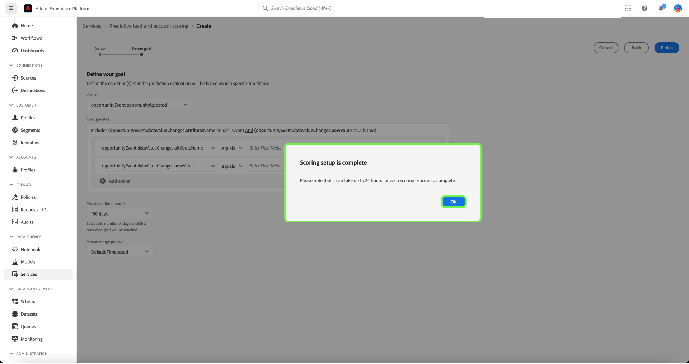

# Administre la puntuación predictiva de clientes potenciales y cuentas en Adobe Real-time Customer Data Platform, edición B2B

>[!NOTE]
>
>Solo los usuarios con permiso Administrar IA B2B pueden crear, cambiar y eliminar objetivos de puntuación.

Este tutorial le guiará por los pasos para administrar los objetivos de puntuación del servicio de puntuación de cuenta y posible cliente predictivo. Los objetivos de puntuación pueden ser para un perfil de persona o de cuenta

## Crear una nueva puntuación

Para crear una puntuación nueva, selecciona **[!UICONTROL Servicios]** en la barra lateral y selecciona **[!UICONTROL Crear puntuación]**.

Aparece la pantalla **[!UICONTROL Información básica]**, que le solicita que seleccione un tipo de perfil, escriba un nombre y una descripción opcional. Cuando termine, seleccione **[!UICONTROL Siguiente]**.

Aparecerá la pantalla **[!UICONTROL Definir el objetivo]**. Seleccione la flecha desplegable y, a continuación, seleccione un tipo de objetivo en la ventana desplegable que aparece.

Se abre el cuadro de diálogo **[!UICONTROL Detalles de la meta]**. Seleccione la flecha desplegable y, a continuación, seleccione el nombre del campo de objetivo en la ventana desplegable que aparece.

Aparecerá la selección **[!UICONTROL Condiciones de la meta]**. Seleccione la flecha desplegable y, a continuación, seleccione condición en la ventana desplegable que aparece.

Aparece el campo **[!UICONTROL Valor de la meta]**. A continuación, configure [!UICONTROL Detalles de la meta]. Seleccione el panel [!UICONTROL Introducir valor de campo] e introduzca su valor de objetivo.

>[!NOTE]
>
>Se pueden añadir varios valores de objetivo.

Para agregar campos adicionales, seleccione **[!UICONTROL Agregar campo]**.

Para configurar el periodo de tiempo de predicción, seleccione la flecha desplegable y, a continuación, el periodo de tiempo que desee.

La política de combinación seleccionada determina cómo se seleccionan los valores de campo de un perfil de persona. En la flecha desplegable, seleccione la política de combinación que desee y, a continuación, seleccione **[!UICONTROL Finalizar]**.

La configuración de puntuación **[!UICONTROL ha finalizado]** aparece el cuadro de diálogo que confirma que se ha creado la nueva puntuación. Seleccione **[!UICONTROL Aceptar]**.

>[!NOTE]
>
>Cada proceso de puntuación puede tardar hasta 24 horas en completarse.

Vuelve a la ficha **[!UICONTROL Servicios]**, donde podrás ver la nueva puntuación creada en la lista de puntuaciones.

Seleccione la puntuación para ver detalles e información adicional sobre los detalles de la última ejecución.

Para obtener información más detallada sobre los códigos de error que se pueden ver en los detalles de la última ejecución, consulte la sección sobre [códigos de error de canalización de IA de posibles clientes](#leads-ai-pipeline-error-codes) en este documento.

## Editar una puntuación

Para editar una puntuación, selecciónela en la pestaña **[!UICONTROL Servicios]** y seleccione **[!UICONTROL Editar]** en el panel de detalles adicionales que hay a la derecha de la pantalla.

Aparecerá el cuadro de diálogo **[!UICONTROL Editar instancia]**, donde podrá editar la descripción de la puntuación. Realice los cambios y seleccione **[!UICONTROL Guardar]**.

>[!NOTE]
>
>La configuración de puntuación no se puede cambiar, ya que esto generará un déclencheur en el reciclaje y la nueva puntuación del modelo. Equivale a eliminar la puntuación y crear una nueva puntuación. Para editar la configuración de la puntuación, deberá clonar esta puntuación o crear una nueva puntuación.

Ha vuelto a la ficha **[!UICONTROL Servicios]**. Seleccione la puntuación para ver los detalles de la descripción actualizada en el panel de detalles adicionales situado en la parte derecha de la pantalla.

## Clonar una puntuación

Para clonar una puntuación, selecciónela en la pestaña **[!UICONTROL Servicios]** y seleccione **[!UICONTROL Clonar]** en el panel de detalles adicionales que hay a la derecha de la pantalla.

Aparecerá la pantalla **[!UICONTROL Información básica]**. El tipo, el nombre y la descripción del perfil se clonan a partir de la puntuación original. Modifica estos detalles y selecciona **[!UICONTROL Siguiente]**.

Aparecerá la pantalla **[!UICONTROL Definir el objetivo]**. Complete la sección de metas como lo haría al crear una nueva puntuación y seleccione **[!UICONTROL Finalizar]**.

Vuelve a la ficha **[!UICONTROL Servicios]**, donde podrás ver la puntuación recién clonada en la lista.

>[!NOTE]
>
>La sección **[!UICONTROL Define your goal]** no se clona desde la puntuación original.

## Eliminar una puntuación

Para eliminar una puntuación, selecciónela en la ficha **[!UICONTROL Servicios]** y seleccione **[!UICONTROL Eliminar]** del panel de detalles adicionales que aparece a la derecha de la pantalla.

Aparecerá el cuadro de diálogo de confirmación **[!UICONTROL Eliminar documentación]**. Seleccione **[!UICONTROL Eliminar]**.

>[!NOTE]
>
>Si se elimina la definición de puntuación, también se eliminarán todas las puntuaciones previstas en el perfil de la persona o el perfil de cuenta, pero no el grupo de campos creado para la definición de puntuación. El grupo de campos quedará &quot;huérfano&quot; en el modelo de datos.

Vuelve a la ficha **[!UICONTROL Servicios]**, donde ya no podrás ver la puntuación en la lista.

## Códigos de error de canalización de IA de posibles clientes

| Código de error | Mensaje de error |
| --- | --- |
| 401 | ERROR 401. Canalización de IA de posibles clientes detenida: no hay suficientes cuentas válidas para la puntuación de cuentas. Recuento de cuentas: {}. |
| 402 | ERROR 402. Canalización de IA de posibles clientes detenida: no hay suficientes contactos válidos para la puntuación de contactos. Recuento de contactos: {}. |
| 403 | ERROR 403. Canalización de IA de posibles clientes detenida: no hay suficiente volumen de actividad para la formación de modelos. Recuento de eventos: {}. |
| 404 | ERROR 404. Canalización de IA de posibles clientes detenida: no hay suficientes conversiones para la formación de modelos. Recuento de conversiones: {}. |
| 405 | ERROR 405. Canalización de IA de posibles clientes detenida: actividad demasiado dispersa para una formación de modelo válida. Solo el {} por ciento de las cuentas tiene actividad. |
| 406 | ERROR 406. Canalización de IA de posibles clientes detenida: actividad demasiado dispersa para una formación de modelo válida. Solo el {} por ciento de los contactos tiene actividad. |
| 407 | ERROR 407. Canalización de IA de posibles clientes detenida: los tipos de actividad de datos de puntuación no coinciden con los datos de formación. |
| 408 | ERROR 408. Canalización de IA de posibles clientes detenida: la tasa de falta es demasiado alta para las funciones de actividad. Falta la tarifa: {}. |
| 409 | ERROR 409. Canalización de IA de posibles clientes detenida: el auc de prueba es demasiado bajo. Probar auc: {}. |
| 410 | ERROR 410. Canalización de IA de posibles clientes detenida: el auc de prueba es demasiado bajo después de ajustar los parámetros. Probar auc: {}. |
| 411 | ERROR 411. Canalización de IA de posibles clientes detenida: los datos de formación no tienen suficientes conversiones para producir un modelo fiable. Conversiones: {}. |
| 412 | ERROR 412. Canalización de IA de posibles clientes detenida: los datos de prueba no tienen ninguna conversión para calcular el AUC-ROC. |

| Código de información/advertencia | Mensaje |
| --- | --- |
| 100 | INFORMACIÓN 100. Comprobación de calidad de IA de posibles clientes: el recuento de cuentas es: {}. |
| 101 | INFORMACIÓN 101. Comprobación de calidad de IA de posibles clientes: el número de contactos es: {}. |
| 102 | INFORMACIÓN 102. Comprobación de calidad de IA de posibles clientes: el recuento de oportunidades es: {}. |
| 103 | INFORMACIÓN 103. Comprobación de calidad de IA de posibles clientes: el auc de prueba es bajo. Iniciar ajuste de parámetros. Probando auc: {}. |
| 200 | AVISO 200. Comprobación de calidad de IA de posibles clientes: la tasa de falta de características firmográficas es: {}. |
| 201 | AVISO 201. Comprobación de calidad de IA de posibles clientes: la tasa de falta de características de actividad es: {}. |

## Pasos siguientes

Al seguir este tutorial, ahora puede crear y administrar correctamente las puntuaciones. Consulte los siguientes documentos para obtener más información:

* [Puntuación predictiva de posibles clientes y cuentas](/help/rtcdp/b2b-ai-ml-services/predictive-lead-and-account-scoring.md)
* [Monitorización de trabajos predictivos de puntuación de clientes potenciales y cuentas](/help/dataflows/ui/b2b/monitor-profile-enrichment.md)
