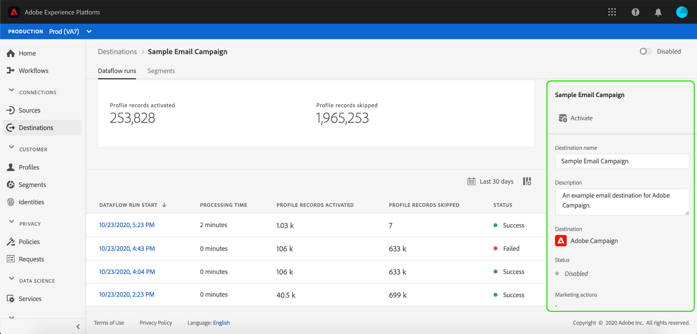

# Página de detalles de destino

En la interfaz de usuario de Adobe Experience Platform, puede realizar vistas y controlar los atributos y actividades de los destinos. Estos detalles incluyen el nombre y la ID del destino, los controles para activar o desactivar los destinos, etc. Los detalles de los destinos de lote también incluyen métricas de registros de perfil activados y un historial de ejecuciones de flujo de datos.

>[!NOTE]
>
>La página de detalles de destinos forma parte del espacio de trabajo [!UICONTROL Destinos] de la interfaz de usuario de la plataforma. Consulte la descripción general [[!UICONTROL del espacio de trabajo] Destinos](./destinations-workspace.md) para obtener más información.

En el espacio de trabajo **[!UICONTROL Destinos]** de la interfaz de usuario de la plataforma, vaya a la ficha **[!UICONTROL Examinar]** y seleccione el nombre de un destino de lote que desee vista.

Aparece la página de detalles del destino, que muestra los controles disponibles. Si está viendo los detalles de un destino de lote, también aparece un panel de supervisión.

## Carril derecho

El carril derecho muestra la información básica sobre el destino.

El cuadro siguiente abarca los controles y detalles facilitados por el carril derecho:

| Elemento del carril derecho | Descripción |
| --- | --- |
| [!UICONTROL Activar] | Seleccione este control para editar qué segmentos están asignados al destino. Consulte la guía sobre la [activación de segmentos en un destino](/help/rtcdp/destinations/activate-destinations.md) para obtener más información. |
| [!UICONTROL Nombre de destino] | Este campo se puede editar para actualizar el nombre del destino. |
| [!UICONTROL Descripción] | Este campo se puede editar para actualizar o agregar una descripción opcional al destino. |
| [!UICONTROL Destino] | Representa la plataforma de destino a la que se envían las audiencias. Consulte el catálogo [de](./destinations-catalog.md) destinos para obtener más información. |
| [!UICONTROL Estado] | Indica si el destino está habilitado o deshabilitado. |
| [!UICONTROL Acciones de mercadotecnia] | Indica las acciones de mercadotecnia (casos de uso) que se aplican a este destino para fines de administración de datos. |
| [!UICONTROL Categoría] | Indica el tipo de destino. Consulte el catálogo [de](./destinations-catalog.md) destinos para obtener más información. |
| [!UICONTROL Tipo de conexión] | Indica el formulario mediante el cual se envían las audiencias al destino. Los valores posibles incluyen &quot;[!UICONTROL Cookie]&quot; y &quot;Basado en[!UICONTROL Perfiles]&quot;. |
| [!UICONTROL Frecuencia] | Indica la frecuencia con la que se envían las audiencias al destino. Los valores posibles incluyen &quot;[!UICONTROL Streaming]&quot; y &quot;[!UICONTROL Batch]&quot;. |
| [!UICONTROL Identidad] | Representa la Área de nombres de identidad aceptada por el destino, como `GAID`, `IDFA`o `email`. Para obtener más información sobre las Áreas de nombres de identidad aceptadas, consulte la información general [sobre la Área de nombres de](../../identity-service/namespaces.md)identidad. |
| [!UICONTROL Creado por] | Indica el usuario que creó este destino. |
| [!UICONTROL Creado] | Indica la fecha y hora UTC en que se creó este destino. |

## [!UICONTROL Alternador habilitado]/[!UICONTROL deshabilitado]

Puede utilizar la opción **[!UICONTROL Habilitado]/[!UICONTROL Deshabilitado]** para el inicio y pausar todas las exportaciones de datos al destino.

## [!UICONTROL Ejecuciones de flujo de datos]

La ficha Ejecuciones [!UICONTROL de flujo de] datos proporciona datos de métricas sobre las ejecuciones de flujo de datos a destinos por lotes. Se muestra una lista de ejecuciones individuales y sus métricas específicas, junto con los siguientes totales para los registros de perfiles:

* **[!UICONTROL Registros de perfil activados]**: Recuento total de registros de perfiles que se crearon o actualizaron para la activación.
* **[!UICONTROL Se omitieron]** los registros de perfil:  Recuento total de registros de perfiles que se omiten para la activación en función de las salidas de perfiles o los atributos que faltan.

>[!NOTE]
>
>Las ejecuciones de flujo de datos se generan en función de la frecuencia de programación del flujo de datos de destino. Se realiza una ejecución de flujo de datos independiente para cada directiva de combinación aplicada a un segmento.

Para vista de los detalles de una ejecución de flujo de datos concreta, seleccione la hora de inicio de la ejecución en la lista. La página de detalles de una ejecución de flujo de datos contiene información adicional, como el tamaño de los datos procesados y una lista de los errores que se han producido con detalles de los diagnósticos de error.

## [!UICONTROL Segmentos]

La ficha [!UICONTROL Segmentos] muestra una lista de segmentos que se han asignado al destino, incluyendo la fecha de inicio y la fecha de finalización (si corresponde). Para vista de los detalles de un segmento en particular, seleccione su nombre en la lista.

>[!NOTE]
>
>Para obtener más información sobre cómo explorar la página de detalles de un segmento, consulte la descripción general [de la interfaz de usuario de](../../segmentation/ui/overview.md#segment-details)segmentación.

## Pasos siguientes

Este documento abarcaba las funciones de la página de detalles de destino. Para obtener más información sobre la administración de destinos en la interfaz de usuario, consulte la descripción general del espacio de trabajo [[!UICONTROL Destinations]](./destinations-workspace.md).