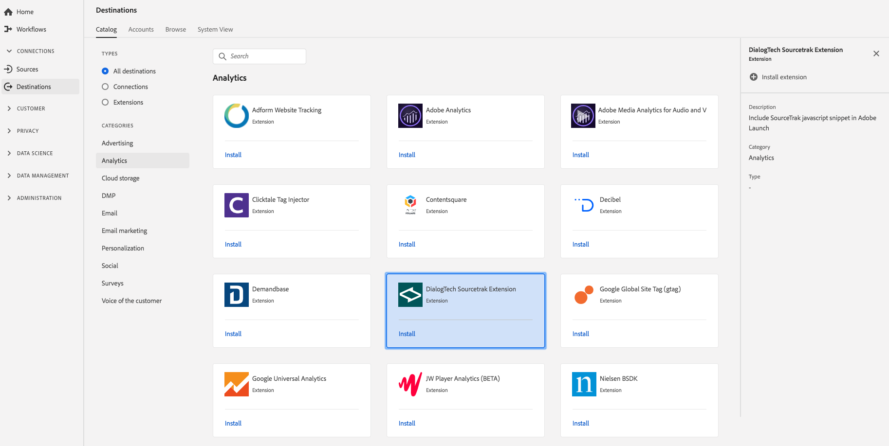

# [!DNL DialogTech] Extensión {#dialogtech-extension}

## Información general {#overview}

Incluir el fragmento de [!DNL DialogTech SourceTrak] javascript en Inicio de Adobe

[!DNL DialogTech] es una extensión de análisis en la plataforma de datos del cliente en tiempo real. Para obtener más información sobre la funcionalidad de extensión, consulte el sitio web [Dialogtech](https://www.dialogtech.com/).

Este destino es una extensión de Adobe Experience Platform Launch. Para obtener más información sobre cómo funcionan las extensiones de Launch de plataforma en Adobe Real-time CDP, consulte Visión general [de las extensiones de](/help/rtcdp/destinations/experience-platform-launch-extensions.md)Adobe Experience Platform Launch.

## Requisitos previos  {#prerequisites}

Esta extensión está disponible en el catálogo de destinos para todos los clientes que han adquirido CDP en tiempo real de Adobe.

Para utilizar esta extensión, necesita acceder a Adobe Experience Platform Launch. Platform Launch se ofrece a los clientes de Adobe Experience Cloud como una función de valor añadido incluida. Póngase en contacto con el administrador de su organización para obtener acceso a Inicio de plataforma y pídale que le conceda el permiso **[!UICONTROL manage_properties]** para poder instalar extensiones.

## Instalar extensión {#install-extension}

Para instalar la [!DNL DialogTech] extensión:

1. En la interfaz [CDP en tiempo real de](http://platform.adobe.com/)Adobe, vaya a **[!UICONTROL Destinos]** > **[!UICONTROL Catálogo]**.
2. Seleccione la extensión del catálogo o utilice la barra de búsqueda.
3. Haga clic en el destino para resaltarlo y, a continuación, seleccione **[!UICONTROL Configurar]** en el carril derecho. Si el control **[!UICONTROL Configurar]** está atenuado, le falta el permiso **[!UICONTROL manage_properties]** . Consulte [Requisitos previos](#prerequisites).
4. En la ventana de la propiedad **** Seleccionar inicio de plataforma disponible, seleccione la propiedad Inicio de plataforma en la que desea instalar la extensión. También tiene la opción de crear una nueva propiedad en Inicio de plataforma. Una propiedad es una colección de reglas, elementos de datos, extensiones configuradas, entornos y bibliotecas. Obtenga información sobre las propiedades en la sección [de la página](https://docs.adobe.com/content/help/en/launch/using/reference/admin/companies-and-properties.html#properties-page) Propiedades de la documentación de Inicio de plataforma.
5. El flujo de trabajo lo lleva al inicio de plataforma para completar la instalación.

También puede instalar la extensión directamente en la interfaz [de](https://launch.adobe.com/)Adobe Experience Platform Launch. Consulte [Añadir una nueva extensión](https://docs.adobe.com/content/help/en/launch/using/reference/manage-resources/extensions/overview.html#add-a-new-extension) en la documentación de Launch de plataforma.

## Cómo usar la extensión {#how-to-use}

Una vez instalada la extensión, puede configurar inicios directamente en Inicio de plataforma.

En Inicio de plataforma, puede configurar reglas para las extensiones instaladas a fin de enviar datos de evento al destino de la extensión únicamente en determinadas situaciones. Para obtener más información sobre la configuración de reglas para las extensiones, consulte la documentación Reglas.

## Configurar, actualizar y eliminar extensiones {#configure-upgrade-delete}

Puede configurar, actualizar y eliminar extensiones en la interfaz de inicio de plataforma.

>[!TIP]
>
>Si la extensión ya está instalada en una de sus propiedades, la interfaz de usuario de CDP en tiempo real de Adobe seguirá mostrando **[!UICONTROL Instalar]** para la extensión. Inicie el flujo de trabajo de instalación tal como se describe en [Instalar extensión](#install-extension) para acceder a Inicio de plataforma y configurar o eliminar la extensión.

Para actualizar la extensión, consulte Actualización [de extensiones](https://docs.adobe.com/content/help/en/launch/using/reference/manage-resources/extensions/extension-upgrade.html) en la documentación de inicio de plataforma.

