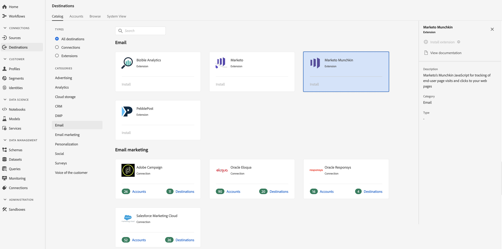

# Extensión de [!DNL Marketo Munchkin] {#marketo-munchkin-extension}

## Información general {#overview}

Desde la administración de posibles clientes hasta la mercadotecnia basada en cuentas, [!DNL Marketo Engagement Platform] simplifica la forma en que planifica, organiza y mide la participación con clientes y clientes potenciales en cada etapa de su experiencia.

El JavaScript de [!DNL Marketo’s Munchkin][!DNL Marketo] permite rastrear las visitas y los clics de la página del usuario final en las páginas de aterrizaje de y en las páginas web externas.

[!DNL Marketo Munchkin] es una extensión de correo electrónico en Adobe Real-time Customer Data Platform. Para obtener más información sobre la funcionalidad de extensión, consulte la página de extensión en [Adobe Exchange](https://exchange.adobe.com/experiencecloud.details.101054.marketo-munchkin.html).

Este destino es una extensión de Experience Platform Launch. Para obtener más información sobre cómo funcionan las extensiones de Launch en Adobe Real-time CDP, consulte Descripción general [de las extensiones de](/help/rtcdp/destinations/experience-platform-launch-extensions.md)Experience Platform Launch.

## Requisitos previos {#prerequisites}

Esta extensión está disponible en el [!DNL Destinations] catálogo para todos los clientes que han adquirido CDP en tiempo real de Adobe.

Para utilizar esta extensión, necesita acceder al Experience Platform Launch. Experience Platform Launch se ofrece a los clientes de Adobe Experience Cloud como una función de valor añadido incluida. Póngase en contacto con el administrador de su organización para obtener acceso a Launch y pídale que le conceda el permiso **[!UICONTROL manage_properties]** para poder instalar extensiones.

## Instalar extensión {#install-extension}

Para instalar la [!DNL Marketo Munchkin] extensión:

1. En la interfaz [CDP en tiempo real de](http://platform.adobe.com/)Adobe, vaya a **[!UICONTROL Destinos > Catálogo]**.
2. Seleccione la extensión del catálogo o utilice la barra de búsqueda.
3. Haga clic en el destino para resaltarlo y, a continuación, seleccione **[!UICONTROL Instalar extensión]** en el carril derecho. Si el control **[!UICONTROL Instalar extensión]** está atenuado, le falta el permiso **[!UICONTROL manage_properties]** . Consulte [Requisitos previos](#prerequisites).
4. En la ventana **[!UICONTROL Seleccionar la propiedad]** Launch disponible, seleccione la propiedad Launch en la que desea instalar la extensión. También tiene la opción de crear una nueva propiedad en Launch. Una propiedad es una colección de reglas, elementos de datos, extensiones configuradas, entornos y bibliotecas. Obtenga información sobre las propiedades en la sección [de la página](https://docs.adobe.com/content/help/en/launch/using/reference/admin/companies-and-properties.html#properties-page) Propiedades de la documentación de Launch.
5. El flujo de trabajo le lleva a Iniciar para completar la instalación.

Para obtener información sobre las opciones de configuración de la extensión y la compatibilidad con la instalación, consulte la página [Marketo Munchkin en Adobe Exchange](https://exchange.adobe.com/experiencecloud.details.101054.marketo-munchkin.html).

También puede instalar la extensión directamente en la interfaz del [Experience Platform Launch](https://launch.adobe.com/). Consulte [Añadir una nueva extensión](https://docs.adobe.com/content/help/en/launch/using/reference/manage-resources/extensions/overview.html#add-a-new-extension) en la documentación de Launch.

## Cómo usar la extensión {#how-to-use}

Una vez instalada la extensión, puede configurar inicios para ella directamente en Launch.

En Launch, puede configurar reglas para las extensiones instaladas a fin de enviar datos de evento al destino de la extensión únicamente en determinadas situaciones. Para obtener más información sobre la configuración de reglas para las extensiones, consulte la documentación Reglas.

## Configurar, actualizar y eliminar extensiones {#configure-upgrade-delete}

Puede configurar, actualizar y eliminar extensiones en la interfaz de Launch.

>[!TIP]
>
>Si la extensión ya está instalada en una de sus propiedades, la interfaz de usuario de CDP en tiempo real de Adobe seguirá mostrando **[!UICONTROL Instalar]** para la extensión. Inicie el flujo de trabajo de instalación como se describe en [Instalar extensión](#install-extension) para llegar a Iniciar y configurar o eliminar la extensión.

Para actualizar la extensión, consulte Actualización [de](https://docs.adobe.com/content/help/en/launch/using/reference/manage-resources/extensions/extension-upgrade.html) Extension en la documentación de Launch.