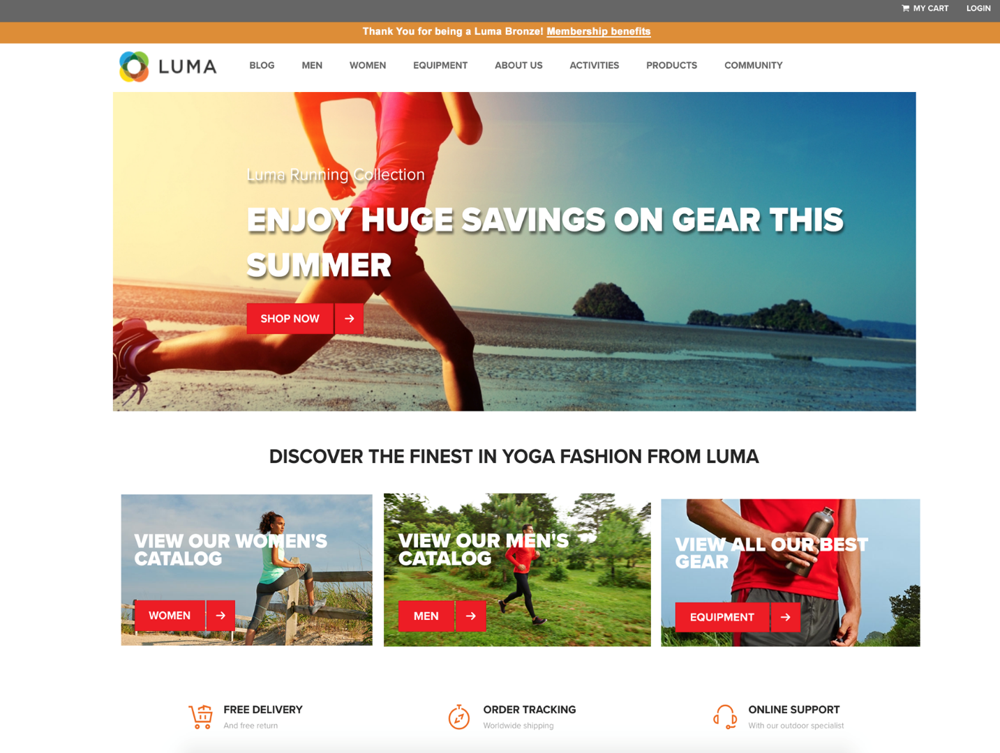

# Introducción a la plataforma de datos del cliente en tiempo real de Adobe

Esta guía de introducción le guía a través de una implementación de muestra de la Plataforma de datos del cliente en tiempo real de Adobe (CDP en tiempo real). Puede utilizarlo como ejemplo al configurar su propia implementación. Aunque esta guía muestra ejemplos específicos, vincula a información adicional que puede utilizar al crear la configuración.

Este ejemplo muestra el poder de la plataforma de datos del cliente en tiempo real de Adobe, con tecnología de Adobe Experience Platform, para:

* Ingestar datos de varias fuentes
* Combinarlos en un único perfil de cliente en tiempo real
* Ofrezca una experiencia coherente, relevante y personalizada en todos los dispositivos.

## Caso de uso

Luma, una compañía de ropa deportiva, siempre está tratando de mejorar su experiencia con los clientes. Tienen una nueva iniciativa para aumentar las ventas relacionadas con regalos. También desean reducir la sobreexposición, como los anuncios molestos que siguen a los clientes.

Actualmente, están gastando demasiado en medios que se vuelven a destinar a elementos que el visitante no va a comprar para avanzar. Por ejemplo, Luma no quiere redirigirse a alguien con un artículo que fue diseñado como una compra única para otra persona.

En este momento, los datos de Luma están dispersos en múltiples fuentes. Como resultado, se enfrentan a importantes desafíos:

* La organización de marketing debe trabajar con varios equipos que poseen una fuente de datos, incluidos un sitio web, una aplicación móvil, sistemas de fidelidad, CRM, etc.
* Para cuando el equipo de mercadotecnia obtiene acceso a los datos, a menudo están obsoletos y ya no son relevantes para su campaña que diferencia el tiempo.
* Necesitan unificar los datos para dirigirse a una persona, no a los canales.

Como resultado, Luma tiene los siguientes objetivos comerciales:

* Cree una vista única en tiempo real de sus consumidores a partir de sus distintas fuentes de datos.
* Personalice las campañas de marketing con mensajes relevantes en distintos canales y dispositivos.

Para alcanzar estos objetivos, el equipo de mercadotecnia debe poder administrar los datos de los clientes a escala.

Con CDP en tiempo real, con tecnología de Adobe Experience Platform, la organización de marketing de Luma puede:

1. Recopile datos de plataformas diferentes y asegúrese de que esté disponible en el flujo descendente para otras actividades de marketing.
1. Cree una sola vista en tiempo real de sus consumidores, independientemente de dónde se originen los datos.
1. Impulse una experiencia coherente, relevante y personalizada en todos los puntos de contacto.

## Pasos

Este tutorial incluye los siguientes pasos:

1. Genere el perfil [](#customer-profile)del cliente.
1. [Personalice](#personalizing-the-user-experience) la experiencia del usuario.
1. Utilice [varias fuentes](#using-multiple-data-sources)de datos.
1. [Configure un origen](#configuring-a-data-source)de datos.
1. [Recopilar los datos](#bringing-the-data-together-for-a-specific-customer) de un cliente específico.
1. Configure [segmentos](#segments).
1. Configure [los destinos](#destinations).
1. [Ajuste el perfil entre dispositivos](#cross-device-identity-stitching).
1. [Analizar el perfil](#analyzing-the-profile).

## Perfil del cliente

Cuando los clientes visitan el sitio por primera vez, usted no sabe nada de ellos.


A medida que navegan, los datos se capturan en tiempo real y se envían no solo a un grupo de informes de Adobe Analytics, sino también directamente a Adobe Experience Platform. A medida que se recopilan los datos, se empieza a formar una sola vista del consumidor, basada en datos de comportamiento en el perfil de cliente en tiempo real de la plataforma de experiencia.

Es probable que muchos visitantes del sitio web sean clientes habituales que ya han comprado en Luma.  Es importante que Luma personalice los mensajes y las ofertas para dirigirse tanto a los visitantes nuevos como a los repetidos, así como a los clientes conocidos.

### Primera visita del nuevo cliente

Por ejemplo, un visitante no identificado navega a la sección Hombres del sitio Luma y ve un par de sudaderas que llevan camisas.


A medida que el cliente hace clic para obtener más información sobre estos productos, estas vistas de productos se recopilan en Adobe Analytics y se envían a la plataforma de experiencias.

<!---->

Luma puede asignar el comportamiento del visitante a un perfil de usuario en la plataforma Adobe Experience y empezar a generar una vista más rica del comportamiento de ese consumidor.

### Obtener una vista más detallada del cliente

A medida que el cliente continúa interactuando con el sitio web, surge una imagen más clara. Por ejemplo: supongamos que el visitante agrega un producto al carro de compras e inicia sesión.

Cuando el cliente inicia sesión, ella se identifica como Sarah Rose.


Se combinan dos identidades:

* Los datos de exploración anónimos
* Los datos existentes asociados con la cuenta de Sarah Rose

Ambas identidades se combinan en un único perfil en la plataforma de experiencia. Luma tiene ahora una visión unificada de este consumidor.

Según el comportamiento de navegación del visitante anónimo en la sección Hombres del sitio, se podría haber asumido que el cliente era un hombre. Ahora que ha iniciado sesión, Luma reconoce a Sarah Rose. Luma utiliza el poder del perfil del cliente en tiempo real para refinar los mensajes que se le envían a través de los canales.

## Personalización de la experiencia del usuario

Sarah es bienvenida con un mensaje de lealtad y agradecida por ser miembro del Bronce con más información sobre beneficios y cómo aumentar su estatus y puntos.

Ella hace clic en la página principal para explorar un poco más.



Sarah recibe una experiencia personalizada de la página principal que se distribuye de forma dinámica, en función de su perfil de cliente en tiempo real en Adobe Experience Platform.

Ella ve contenido relevante, gracias a la personalización con tecnología Adobe Sensei en Adobe Target, que tiene en cuenta sus compras anteriores y su afinidad por usar ropa y equipo. Luma también adapta el contenido del catálogo masculino a los engranajes en marcha para los hombres según su última exploración.

Más abajo de la página, se muestran productos destacados a Sarah, así como una nueva bandeja de recomendaciones basada en los artículos que ha visto más recientemente.

Este contenido personalizado ayuda a Sarah a encontrar artículos relevantes rápidamente. Esto aumenta las conversiones y proporciona una experiencia de cliente más agradable.

### Devolver al cliente

Sarah se distrae y abandona el sitio, terminando su sesión. Luma puede utilizar sus datos en Adobe Experience Platform para ayudarle a regresar al sitio.

La plataforma de datos del cliente en tiempo real de Adobe, con tecnología de Adobe Experience Platform, está diseñada para la gestión de la experiencia del cliente. Permite a las organizaciones:

* Simplifique la integración y activación de datos
* Administrar el uso de datos conocidos y desconocidos
* Acelerar los casos de uso de mercadotecnia a escala

## Uso de varias fuentes de datos

El equipo de Luma tiene todos sus datos de comportamiento y de clientes en un solo lugar.


Pueden ingestar datos de todas las fuentes siguientes:

* Datos de soluciones de Adobe Experience Cloud existentes
* Fuentes que no son de Adobe, como el programa de fidelidad de Luma, el centro de llamadas y los datos del sistema de puntos de venta
* Datos de flujo continuo en tiempo real de fuentes de datos Luma
* Datos en tiempo real de soluciones de Adobe (no se requieren etiquetas nuevas)

Todos estos datos de fuentes diferentes se combinan en un único perfil de cliente unificado.

## Configuración de un origen de datos

Utilice la plataforma de datos del cliente en tiempo real para incorporar nuevas fuentes de datos a la plataforma. CDP en tiempo real incluye un catálogo de fuentes de datos que se pueden agregar al perfil en tan solo unos clics.


Por ejemplo, para ingestar datos CRM de Luma, filtre el catálogo por *CRM* y se muestran todos los conectores listos para usar que contienen *CRM* . Para agregar datos de Microsoft Dynamics CRM:

1. Autorice la conexión.

   

1. Elija lo que desea importar de una lista recomendada de tablas XDM preasignadas.

   <!--     -->

   Por ejemplo, seleccione **[!UICONTROL Contacts]**. Se carga automáticamente una vista previa de los datos de los contactos para asegurarse de que todo se ve como se espera.

   La plataforma Adobe Experience elimina mucho del trabajo manual de este proceso mediante la asignación automática de campos estándar al esquema de perfil del Modelo de datos de experiencia (XDM).

1. Revise las asignaciones de campos.

   <!--     -->

   Por ejemplo, compruebe si el campo de correo electrónico de los contactos está correctamente asignado.\
   Tiene la opción de obtener una vista previa de los datos y realizar asignaciones avanzadas.

1. Configure una programación.

   

Ya está hecho. Acaba de agregar Microsoft CRM como fuente de datos en la plataforma de experiencia.

### Etiquetado de datos ingestados para directivas de uso

Luma tiene muchas políticas internas que restringen el uso de ciertos tipos de información recopilada, y también debe cumplir con las preocupaciones legales y relacionadas con la privacidad con respecto al uso de datos. Con el uso de la Administración de datos de la plataforma Adobe Experience, las etiquetas de uso de datos predefinidas se pueden aplicar a conjuntos de datos (y a campos específicos dentro de dichos conjuntos de datos), lo que permite a la Luma categorizar sus datos según restricciones de uso específicas.


Una vez que se han aplicado las etiquetas de uso de datos, Luma puede utilizar la Administración de datos para crear políticas de uso de datos. Las políticas de uso de datos son reglas que describen los tipos de acciones que se le permite realizar en datos que contienen ciertas etiquetas. Al intentar realizar una acción en tiempo real de CDP que constituye una infracción de política, se evita la acción y se proporciona una alerta para mostrar qué política se violó y por qué.

## Reunir los datos para un cliente específico

En este escenario, busque perfiles para Sarah Rose. Aparece su perfil, con el correo electrónico en el que solía iniciar sesión.

<!--  -->

Toda la información de perfil que Luma tiene sobre Sarah muestra. Esto incluye su información personal como dirección y número de teléfono, preferencias de comunicación y los segmentos para los que califica.

| Categoría | Descripción |
|---|---|
| Identidades | Muestra las identidades que se han vinculado en Plataforma a partir de las interacciones de Sarah con Luma a través de canales y dispositivos. Se muestra su ECID del sitio web. Su identidad también incluye el ECID de su aplicación móvil, su ID de correo electrónico, un ID de CRM del conjunto de datos de Microsoft Dynamics recientemente agregado y un ID de fidelidad que se pasa a Adobe Experience Platform desde el sistema de fidelidad a Luma. |
| Eventos | Muestra todos los datos de interacción de Sarah con la marca Luma. Esto incluye el artículo que acaba de ver, cualquier cosa que haya visto en el pasado, los correos electrónicos que ha recibido, sus interacciones con el centro de llamadas y en qué canal y dispositivo han sucedido cada una de esas interacciones. |

El perfil CDP en tiempo real reduce el flujo de trabajo del equipo de mercadotecnia Luma de semanas a minutos y desbloquea las posibilidades de personalización basadas en esta vista de cliente de 360 grados. El perfil combina los datos de comportamiento de cuando exploró el sitio antes de iniciar sesión, con su perfil de cliente existente, creando una vista completa de Sarah.

El equipo de mercadotecnia puede utilizar este perfil mejorado de cliente en tiempo real para personalizar mejor la experiencia de Sarah y aumentar su lealtad de marca con Luma.

## Segmentos

Las potentes funciones de segmentación de Adobe Experience Platform permiten a los especialistas en marketing combinar atributos, eventos y segmentos existentes, en función de los datos capturados en el perfil del cliente en tiempo real.

<!--  -->

En este escenario, las recientes interacciones de Sarah en el sitio muestran un comportamiento diferente al de sus acciones pasadas. Ella generalmente compra ropa de mujer. Sin embargo, el artículo en su carro es una camisa grande para hombres.

El equipo de ciencia de datos Luma ha creado modelos en torno a la propensión a comprar. Un modelo identifica un cambio repentino en la categoría de vestimenta (como hombres/mujeres) o el tamaño para el consumidor existente. El cambio de Sarah en el comportamiento de compra sugiere que no está comprándose por sí misma.

<!--  -->

### Definición de un segmento

Modifique o cree un segmento que represente a los abandonadores del carro de compras que parecen estar en proceso de comprar un regalo:

```
Profile: Category != Preferred Category 
AND 
Product Size != Preferred Size 
in last 7 days.  
AND 
Abandoned Cart 
AND 
Loyalty member 
```

<!-- -->

Como Sarah agregó un artículo de regalo aparente en el carro y lo abandonó, Luma puede atacarla con una oferta gratuita de envoltura de regalo.

## Destinos

Cuando agregó el segmento &quot;Abandonadores de carro de compras de regalos&quot;, puede ver aproximadamente cuántas personas forman parte de este segmento. Puede realizar acciones al respecto y hacer que esté disponible para su personalización en todos los canales.

Haga clic en **[!UICONTROL Send to destinations]**.

En CDP en tiempo real de Adobe, Luma puede actuar sin problemas en sus segmentos de audiencia para su personalización.\
Aquí vemos todos los destinos disponibles para que Luma envíe este destino, tanto a las soluciones Adobe como a las que no son de Adobe:


### Selección de destinos

En este escenario, Luma quiere redirigirse a esta audiencia con personalización en todos estos destinos:

* Google, para visualización
   <!--* Facebook -->
* Adobe Campaign, para correo electrónico

<!--  -->

### Destinos de programación

También puede programar el inicio o el final del segmento en un momento determinado. El segmento se publicará y se actualizará automáticamente en las plataformas configuradas en las fechas programadas.

>[!NOTE]
>De forma opcional, si hace clic en el campo de fecha, automáticamente se programan 90 días de espera.

Haga clic **[!UICONTROL Save]** para ir a la página siguiente.

Cuando un cliente de esta audiencia realiza una compra, su pertenencia a esta audiencia se suprime en tiempo real. Ya no cumplen los requisitos porque su estado ha cambiado.

Esto ahorra al director del equipo de medios de Luma cientos de miles de dólares al no usar el inventario para una audiencia que no está calificada.

### Aplicación de directivas de uso de datos para destinos

Adobe Experience Platform incluye controles de privacidad y seguridad para determinar si un segmento está disponible para activarse en un destino determinado. La activación está habilitada o restringida en función de los fines de mercadotecnia asignados al destino cuando se creó, así como de las políticas de uso de datos definidas por su organización.

Si la actividad infringe la política, aparece una advertencia. Esta advertencia contiene información de linaje de datos que puede ayudarle a identificar por qué se violó la política y qué puede hacer para resolver la infracción.

Con estos controles, Experience Platform ayuda a Luma a cumplir con las regulaciones y comercializar de manera responsable. Estos controles son flexibles y pueden modificarse para cumplir con los requisitos de los equipos de seguridad y gobernanza de Luma, permitiéndoles abordar con confianza los requisitos regionales y organizativos para administrar datos conocidos y desconocidos de los clientes.

### Lienzo del flujo de datos

Al guardar, un lienzo de flujo de datos visual muestra el segmento asignado desde el perfil unificado a los tres destinos seleccionados.


## Vinculación de identidad entre dispositivos

Sarah explora un sitio de medios sociales en su dispositivo móvil, y ve un anuncio de Luma. Le recuerda el artículo que dejó en su carro.

Más tarde, abre su correo electrónico y ve los mensajes dirigidos a otro objetivo. Ella hace clic en un vínculo a Luma desde un correo electrónico.

El vínculo lleva a Sarah a la página de inicio de Luma móvil, donde ve una experiencia altamente personalizada con Adobe Target.

* Ella es bienvenida como miembro del Bronce.
* Ella ve el mensaje de &quot;Regalo&quot;.
* También ve el mensaje &quot;Free Gift Wrap&quot; (Envolver regalos gratis), que es parte de sus beneficios de membresía en bronce.
* Todavía está en la imagen de la heroína basada en su afinidad por correr.

Ella compra el jersey, agrega envoltura de regalo y escribe una nota de regalo. También tiene la opción de recordar este evento y recibir un recordatorio el próximo año para recibir un regalo en este momento. Ella dice que sí, y está programada en una campaña de correo electrónico el año siguiente para recordarle que compre otro regalo.

Gracias a las capacidades de supresión de público, Sarah no será el objetivo de que el jersey de los hombres avance.

## Análisis del perfil

Los especialistas en mercadotecnia de luminancia utilizan Adobe Experience Platform para ver el segmento de los proveedores de regalos en el panel CDP en tiempo real. Ellos ven los resultados de esta iniciativa a lo largo del tiempo y ven que está creciendo. Los clientes están respondiendo a las ofertas y gastando más dinero.

Estas perspectivas permiten a los especialistas en mercadotecnia tomar medidas sobre esta señal, que se alimentó con la disponibilidad de estos datos en CDP y con clientes como Sarah conectados al segmento.

Luma utiliza estos datos CDP para aumentar la lealtad y la satisfacción del cliente.
