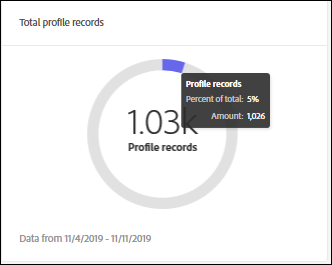

# [!DNL Real-time Customer Data Platform] página de inicio y paneles

La página de inicio de la Plataforma de datos del cliente en tiempo real (CDP en tiempo real), que incluye un panel de métricas, aparece cuando inicia sesión en CDP en tiempo real.

La página de inicio es sólo uno de los lugares en los que aparecen las tarjetas de métricas. CDP en tiempo real proporciona tarjetas de métricas a lo largo de toda la experiencia. Estas métricas le informan sobre las audiencias de datos, perfiles y segmentos del sistema.

Si no hay datos en el sistema cuando inicia sesión en CDP en tiempo real, no aparece el panel en la página de inicio. En este caso, la página de inicio proporciona material de aprendizaje para una primera experiencia de usuario. A medida que se recopilan los datos (es decir, cuando se crean <!--sources-->conjuntos de datos, perfiles, segmentos y destinos y los datos fluyen al sistema), el panel se actualiza automáticamente para mostrar información sobre esos datos<!-- in metric cards-->.

## Vista de panel de página de inicio

<!--The dashboard shows information in several areas. Each category of information displays for the time range shown beneath the data.-->

El panel se divide en<!-- two areas.-->:

* **El** líder se encuentra en la parte superior del panel. La tabla de clasificación muestra el número de conjuntos de datos, perfiles, segmentos y destinos del sistema.

   

<!-- * **Metric cards** display beneath the leaderboard. Metric cards show additional information, such as percentages or trends. Metric cards appear as data is collected.
    
Some information is shown in different ways on both the leaderboard and metric cards. -->
* **Los** elementos recientes muestran los cinco conjuntos de datos, fuentes, segmentos y destinos más recientes agregados al sistema.

   

Hay métricas adicionales, por ejemplo para perfiles y segmentos, disponibles en otras partes de la Plataforma de datos del cliente en tiempo real.

### Conjuntos de datos

El contador **[!UICONTROL Datasets]** muestra el número de datasets en el sistema y la cantidad de datos en [!DNL Platform]. Este contador se actualiza cuando se crea un conjunto de datos.

Para obtener más información acerca de los conjuntos de datos, consulte la [información general de los conjuntos de datos](../catalog/datasets/overview.md).

### Perfiles

El recuento de **[!UICONTROL Perfiles]** muestra el número total de personas con perfiles en [!DNL Real-time Customer Profile]. No incluye fragmentos de perfil. Ésta es su audiencia total a la que puede dirigirse.

Este recuento utiliza la [directiva de combinación](profile/merge-policies.md) predeterminada como se establece en la configuración de directiva de combinación en Perfil unificado.

El número de perfiles se actualiza una vez cada 24 horas.

Para obtener más información acerca de los perfiles, consulte [Una vista unificada de su cliente en tiempo real CDP](profile/profile-overview.md).

### Segmentos

**** Segmentos muestra el número total de segmentos creados para la organización. Este número se actualiza cuando se crean nuevos segmentos.

Para obtener más información sobre los segmentos, consulte [Visión general del servicio de segmentación](segmentation/segmentation-overview.md).

### Destinos

**** Destinos muestra el número total de destinos creados para la organización. Este número se actualiza cuando se crean nuevos destinos.

Para obtener más información sobre los destinos, consulte [Descripción general de los destinos](destinations/overview.md).

<!-- ### Successful profile records

In the leaderboard **[!UICONTROL Successful profile records]** shows the total number of records that have been successfully processed into the profile.

There is also a metric card that shows the percentage of successful records. Select **[!UICONTROL View datasets]** to see more details about the profile records. Hover over the colored area of the graph to see additional details:

The number of successful profile records is updated hourly. 

For more information about profiles, see [A unified view of your customer in Real-time CDP](profile/profile-overview.md).

### Total profile records

The **[!UICONTROL Total profile records]** metric card shows the total number of data records enabled to feed into the profiles, and the percentage that are successful, updated once per day. This does not include all data in the data lake, because some data might not be enabled to feed into the profiles.

 Hover over the colored area of the graph to see additional details about the successful profiles:

Select **[!UICONTROL View profiles]** to see more details about the profile records.

For more information about profiles, see [A unified view of your customer in Real-time CDP](profile/profile-overview.md).

For more information about viewing a specific profile, see [Profile viewer](profile/profile-viewer.md).

### Failed profile records

In the leaderboard, **[!UICONTROL Failed profile records]** counts the number of records that failed to process into the profile.

The **[!UICONTROL Failed profile records]** metric card shows this count, and includes a graphical representation that helps you see how failures have trended during the time shown below the graphic. This chart is updated hourly. Select **[!UICONTROL View datasets]** to see more details about the profile records.

The number of failed profile records is updated hourly. -->

### datasets recientes

La tarjeta **[!UICONTROL datasets recientes]** muestra los cinco datasets más recientes creados dentro de la organización. Esta lista se actualiza cuando se crea un nuevo conjunto de datos.

Seleccione un conjunto de datos para la vista de los detalles de ese elemento o **[!UICONTROL Vista de todo]** para ver la lista de los conjuntos de datos. Desde allí, puede seleccionar una fuente específica para obtener más detalles.

Para obtener más información acerca de los conjuntos de datos, consulte la [información general de los conjuntos de datos](../catalog/datasets/overview.md).

### Fuentes recientes

La tarjeta de métrica **[!UICONTROL Fuentes recientes]** muestra las cinco fuentes más recientes creadas dentro de la organización. Esta lista se actualiza cuando se crea un nuevo origen.

Seleccione un origen para la vista de los detalles de ese elemento o **[!UICONTROL Vista de todo]** para ver la lista de los orígenes. Desde allí, puede seleccionar una fuente específica para obtener más detalles.

Para obtener más información sobre las fuentes, consulte [Información general sobre las fuentes](sources/sources-overview.md).

### Segmentos recientes

La tarjeta de métrica **[!UICONTROL Segmentos recientes]** muestra los cinco segmentos más recientes creados dentro de la organización. Esta lista se actualiza cuando se crea un nuevo segmento.

Seleccione un segmento para vista de los detalles de ese elemento o **[!UICONTROL Vista de todo]** para ver información sobre más segmentos.

Para obtener más información sobre los segmentos, consulte [Visión general del servicio de segmentación](segmentation/segmentation-overview.md).

### Destinos recientes

La tarjeta de métrica **[!UICONTROL Destinos recientes]** muestra los cinco destinos más recientes creados dentro de la organización. Esta lista se actualiza cuando se crea un nuevo destino.

Seleccione un destino para la vista de los detalles de ese elemento o **[!UICONTROL Vista de todo]** para ver información sobre más destinos.

Para obtener más información sobre los destinos, consulte [Descripción general de los destinos](destinations/overview.md).
