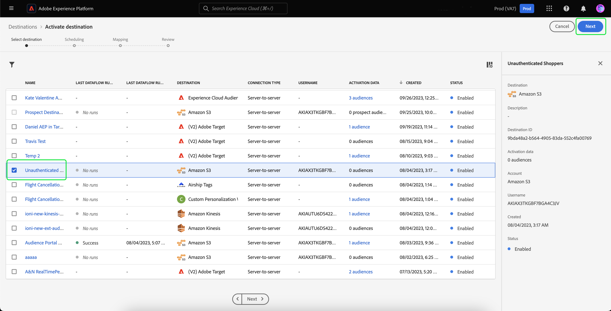

# Redireccionamiento fuera del sitio de visitantes no autenticados

>[!AVAILABILITY]
>
>Esta funcionalidad está disponible para los clientes con licencia de Real-Time CDP (servicio de aplicación), Adobe Experience Platform Activation, Real-Time CDP, Real-Time CDP Prime, Real-Time CDP Ultimate. Obtenga más información acerca de estos paquetes en las [descripciones de productos](https://helpx.adobe.com/legal/product-descriptions.html?lang=es) y póngase en contacto con el representante de Adobe para obtener más información.

Aprenda a crear una audiencia de visitantes no autenticados y a redirigirlos mediante los ID duraderos proporcionados por los socios.

## Por qué considerar este caso de uso {#why-use-case}

Con la eliminación gradual de las cookies de terceros, los especialistas en marketing digital deben reimaginar sus estrategias para volver a interactuar con visitantes anónimos. Las marcas que optan por integrarse con proveedores de identidad para el reconocimiento de visitantes en tiempo real también pueden aprovechar los identificadores duraderos proporcionados por los socios para el retargeting de medios de pago fuera del sitio.

A pesar del alto volumen de tráfico, muchas marcas ven una caída significativa en la fase de conversión. Los visitantes participan con demostraciones de contenido y productos, pero se van sin registrarse ni realizar una compra.

No solo puede crear audiencias basadas en la participación en el sitio para personalizar los mensajes de marketing, sino que también puede utilizar la compatibilidad de Adobe con los ID de socio para volver a interactuar con los visitantes en destinos de medios de pago.

## Requisitos previos y planificación {#prerequisites-and-planning}

Cuando planee volver a dirigirse a visitantes no autenticados, tenga en cuenta los siguientes requisitos previos durante el proceso de planificación:

- ¿He configurado los ID de socio con las áreas de nombres de identidad adecuadas?

Además, para implementar el caso de uso, utilizará las siguientes funciones y elementos de la interfaz de usuario de Real-Time CDP. Asegúrese de que dispone de los permisos de control de acceso basados en atributos necesarios para todas estas áreas o pídale al administrador del sistema que le conceda los permisos necesarios.

- [Públicos](../../segmentation/home.md)
- [Atributos calculados](../../profile/computed-attributes/overview.md)
- [Destinos](../../destinations/home.md)
- [SDK web](../../web-sdk/home.md)

## Obtención de datos de socios en Real-Time CDP {#get-data-in}

Para crear una audiencia de visitantes no autenticados, primero deberá introducir los datos de su socio en Real-Time CDP.

Para obtener información sobre la mejor manera de importar datos en Real-Time CDP mediante el SDK web, lea la [secciones de administración de datos y recopilación de datos de evento](./onsite-personalization.md#data-management) del caso de uso de personalización en el sitio.

## Reenvío de ID proporcionados por el socio {#bring-partner-ids-forward}

Después de importar los ID proporcionados por el socio en un conjunto de datos de evento, deberá obtener estos datos en los registros de perfil. Puede hacerlo utilizando atributos calculados.

Los atributos calculados permiten convertir rápidamente datos de comportamiento del perfil en valores agregados en el nivel de perfil. Como resultado, puede utilizar estas expresiones, como &quot;total de compra de por vida&quot; al perfil, lo que le permite utilizar fácilmente el atributo calculado dentro de sus audiencias. Encontrará más información sobre los atributos calculados en la [información general sobre atributos calculados](../../profile/computed-attributes/overview.md).

Para acceder a los atributos calculados, seleccione **[!UICONTROL Perfiles]** seguido de **[!UICONTROL Atributos calculados]** y **[!UICONTROL Crear atributo calculado]**.

![El [!UICONTROL Creación de atributos calculados] El botón se resalta además de la [!UICONTROL Atributos calculados] dentro de la [!UICONTROL Perfiles] workspace.](../assets/offsite-retargeting/create-ca.png)

El **[!UICONTROL Crear atributo calculado]** página. En esta página, puede utilizar los componentes para crear el atributo calculado.

>[!NOTE]
>
>Para obtener información más detallada sobre la creación de atributos calculados, lea la [guía de IU de atributos calculados](../../profile/computed-attributes/ui.md).

Para este caso de uso, puede crear un atributo calculado que, si existe el ID del socio, obtenga el valor más reciente del ID del socio en las últimas 24 horas.

Mediante la barra de búsqueda, puede localizar y agregar el evento &quot;ID de socio&quot; que [ha creado durante el caso de uso de personalización en el sitio](#get-data-in) al lienzo de atributos calculado.

![El [!UICONTROL Eventos] y la barra de búsqueda aparecen resaltadas.](../assets/offsite-retargeting/ca-add-partner-id.png)

Después de añadir el evento &quot;ID de socio&quot; a la definición, establezca la condición de filtrado del evento en **[!UICONTROL Existe]**, establezca la condición de filtrado del evento como. **[!UICONTROL Más reciente]** valor del ID de socio añadido y con un periodo retroactivo de 24 horas.

Asigne al atributo calculado un nombre adecuado (como &quot;ID de socio&quot;) y una descripción y, a continuación, seleccione **[!UICONTROL Publish]** para completar el proceso de creación de atributos calculados.

## Creación de una audiencia con el atributo calculado {#create-audience}

Ahora que ha creado el atributo calculado, puede utilizarlo para crear una audiencia. En este ejemplo, creará una audiencia compuesta por visitantes que visitaron su sitio web más de cinco veces este mes, pero que aún no se han registrado.

Para crear una audiencia, seleccione **[!UICONTROL Audiencias]**, seguido de **[!UICONTROL Crear audiencia]**.

![El [!UICONTROL Crear audiencia] botón resaltado.](../assets/offsite-retargeting/create-audience.png)

Aparecerá un cuadro de diálogo en el que se le pedirá que elija entre [!UICONTROL Componer audiencia] y [!UICONTROL Generar regla]. Seleccionar **[!UICONTROL Generar regla]** seguido de **[!UICONTROL Crear]**.

![El [!UICONTROL Generar regla] botón resaltado.](../assets/offsite-retargeting/select-build-rule.png)

Aparecerá la página Generador de segmentos. En esta página, puede utilizar los componentes para crear su audiencia.

>[!NOTE]
>
>Para obtener información más detallada sobre el uso del Generador de segmentos, lea la [Guía de IU del Generador de segmentos](../../segmentation/ui/segment-builder.md).

Para lograr el objetivo de encontrar estos visitantes, primero debe agregar un **[!UICONTROL Vista de página]** a su audiencia. Seleccione el **[!UICONTROL Eventos]** pestaña debajo de **[!UICONTROL Campos]**, luego arrastre y suelte el **[!UICONTROL Vista de página]** y agréguelo al lienzo de la sección eventos.

![El [!UICONTROL Eventos] en la pestaña [!UICONTROL Campos] se resalta, mientras se muestra la sección [!UICONTROL Vista de página]evento.](../assets/offsite-retargeting/add-page-view.png)

Seleccione el recién añadido **[!UICONTROL Vista de página]** evento. Cambiar el período retroactivo de **[!UICONTROL En cualquier momento]** hasta **[!UICONTROL Este mes]** y cambie la regla de evento para incluir **Al menos 5**.

![Detalles de la variable añadida [!UICONTROL Vista de página] evento se muestran.](../assets/offsite-retargeting/edit-event.png)

Después de agregar el evento, debe agregar un atributo. Dado que está trabajando con visitantes no autenticados, puede agregar el atributo calculado que acaba de crear. Este atributo calculado recién creado le permite vincular ID de socios a una audiencia.

Para agregar el atributo calculado, en **[!UICONTROL Atributos]**, seleccione **[!UICONTROL Perfil individual de XDM]**, seguido de **[el ID de inquilino de su organización](../../xdm/api/getting-started.md#know-your-tenant-id).**, **[!UICONTROL SystemComputedAttributes]**, y **[!UICONTROL PartnerID]**. Ahora, añada la variable **[!UICONTROL Valor]** del atributo calculado a la sección de atributos del lienzo.

Además, busque **[!UICONTROL Correo electrónico personal]** y añada el **[!UICONTROL Dirección]** atributo siguiente **[!UICONTROL PartnerID]** a la sección de atributos del lienzo.

![El [!UICONTROL PartnerID] atributo calculado y [!UICONTROL Correo electrónico personal] se resaltan en el lienzo del Generador de segmentos.](../assets/offsite-retargeting/added-attributes.png)

Ahora que ha añadido sus atributos, debe establecer sus criterios de evaluación. Para **[!UICONTROL PartnerID]**, establezca el criterio en **[!UICONTROL existe]**, y para **[!UICONTROL Dirección]**, establezca el criterio en **[!UICONTROL no existe]**.

Ahora ha creado correctamente una audiencia que busca visitantes de alta intensidad que tienen un ID proporcionado por el socio, pero que aún no se han registrado en el sitio. Asigne a la audiencia el nombre &quot;Redireccionamiento de usuarios no autenticados&quot; y seleccione **[!UICONTROL Guardar]** para terminar de crear la audiencia.

## Activación de la audiencia {#activate-audience}

Después de crear correctamente la audiencia, ahora puede activarla en destinos de flujo descendente. Seleccionar **[!UICONTROL Audiencias]** en el carril de navegación izquierdo, busque la audiencia recién creada, seleccione el icono de puntos suspensivos y seleccione **[!UICONTROL Activar en destino]**.

![El [!UICONTROL Activar en destino] botón resaltado.](../assets/offsite-retargeting/activate-to-destination.png)

>[!NOTE]
>
>Todos los tipos de destino, incluidos los destinos basados en archivos, admiten la activación de audiencias con ID de socio.
>
>Para obtener más información sobre cómo activar audiencias en un destino, lea la [información general de activación](../../destinations/ui/activation-overview.md).

El **[!UICONTROL Activar destino]** página. En esta página, puede seleccionar a qué destino desea activar el destino. Después de seleccionar el destino de elección, seleccione **[!UICONTROL Siguiente]**.

El **[!UICONTROL Programación]** página. En esta página, puede crear una programación que determine la frecuencia con la que desea que se active la audiencia. Seleccionar **[!UICONTROL Crear programación]** para crear una programación para la activación de audiencia.

![El [!UICONTROL Crear programación] botón resaltado.](../assets/offsite-retargeting/select-create-schedule.png)

El [!UICONTROL Programación] aparece la ventana emergente. En esta página, puede crear la programación de activación de audiencia. Después de configurar la programación, seleccione **[!UICONTROL Crear]** para continuar.

Después de confirmar los detalles de la programación, seleccione **[!UICONTROL Siguiente]**.

El **[!UICONTROL Seleccionar atributos]** página. En esta página, puede seleccionar qué atributos desea exportar junto con la audiencia activada. Como mínimo, debe incluir el ID de socio, ya que esto le permite identificar a los visitantes a los que planea redirigir. Seleccionar **[!UICONTROL Añadir nueva asignación]** y busque el atributo calculado. Después de añadir los atributos necesarios, seleccione **[!UICONTROL Siguiente]**.

![Tanto la [!UICONTROL Añadir nueva asignación] y el atributo calculado se resaltan.](../assets/offsite-retargeting/add-new-mapping.png)

El **[!UICONTROL Revisar]** página. En esta página, puede revisar los detalles de la activación de audiencia. Si está satisfecho con los detalles proporcionados, seleccione **[!UICONTROL Finalizar]**.

![El [!UICONTROL Revisar] se muestra la página, con los detalles de la activación de audiencia.](../assets/offsite-retargeting/review-destination-activation.png)

Ahora ha activado una audiencia de usuarios no autenticados en un destino descendente para un nuevo objetivo.

## Otros casos de uso {#other-use-cases}

Puede explorar más casos de uso habilitados a través de la compatibilidad con datos de socios en Real-Time CDP:

- [Interactúe y adquiera nuevos clientes](./prospecting.md) mediante datos de socio.
- [Personalizar experiencias en el sitio](./offsite-retargeting.md) con reconocimiento de visitantes asistido por socios.
- [Suplemento de Perfiles de origen](./supplement-first-party-profiles.md) con atributos proporcionados por el socio.
