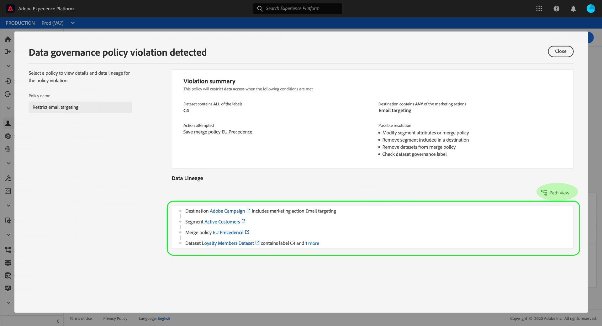

# [!DNL Data Governance] en tiempo real CDP

[!DNL Real-time Customer Data Platform] (CDP en tiempo real) aúna los datos de varios sistemas empresariales, lo que permite a los especialistas en mercadotecnia identificar, comprender y captar mejor a sus clientes. Estos datos pueden estar sujetos a restricciones de uso definidas por su organización o por las regulaciones legales. Por lo tanto, es importante asegurarse de que CDP en tiempo real cumpla con las políticas de uso al manejar sus datos.

Adobe Experience Platform [!DNL Data Governance] le permite administrar los datos de los clientes y garantizar el cumplimiento de las regulaciones, restricciones y políticas aplicables al uso de los datos. Desempeña un papel clave dentro de CDP en tiempo real, permitiéndole definir políticas de uso, categorizar los datos en base a esas políticas y verificar las infracciones de políticas al realizar ciertas acciones de mercadotecnia.

CDP en tiempo real se basa en Adobe Experience Platform y, por lo tanto, la mayoría de las [!DNL Data Governance] capacidades se cubren en la [!DNL Experience Platform] documentación. Este documento está diseñado para complementar la información general [de la Administración de](../../data-governance/home.md) datos [!DNL Experience Platform], y describe las características de la Administración disponibles en CDP en tiempo real. Se tratan los siguientes temas:

* [Aplicar etiquetas de uso a los datos](#labels)
* [Administrar directivas de uso de datos](#policies)
* [Aplicar el cumplimiento de uso de datos](#enforce-data-usage-compliance)

## Aplicar etiquetas de uso a los datos {#labels}

[!DNL Data Governance] permite aplicar etiquetas de uso a los datos, ya sea en el nivel de conjunto de datos o campo de conjunto de datos. Las etiquetas de uso de datos permiten clasificar los datos según las políticas de uso que se aplican a esos datos.

Para obtener información detallada sobre cómo trabajar con etiquetas de uso de datos, consulte la guía [de usuario de etiquetas de uso de](../../data-governance/labels/overview.md) datos para Adobe Experience Platform.

## Configurar casos de uso de mercadotecnia para destinos {#destinations}

Puede establecer restricciones de uso de datos en un destino definiendo casos de uso de mercadotecnia (también llamados acciones de mercadotecnia) para ese destino. Un caso de uso de marketing para un destino indica la intención de los datos que se exportarán a ese destino.

>[!NOTE]
>
>Para obtener más información sobre las acciones de marketing y su uso en las políticas de uso de datos, consulte la información general [de las directivas de uso de](../../data-governance/policies/overview.md) datos en la [!DNL Experience Platform] documentación.

La definición de casos de uso de mercadotecnia en los destinos le permite asegurarse de que todos los perfiles o segmentos enviados a dichos destinos cumplen las políticas de uso de datos. Por lo tanto, debe agregar a los destinos los casos de uso de mercadotecnia adecuados en función de las necesidades de su organización para aplicar restricciones de directiva en la activación.

Los casos de uso de mercadotecnia solo se pueden seleccionar al configurar un destino por primera vez. Según el tipo de destino con el que esté trabajando, la oportunidad de configurar casos de uso de mercadotecnia aparecerá en diferentes puntos del flujo de trabajo de configuración. Consulte la documentación [de](../destinations/overview.md) destinos para ver los pasos para configurar un destino concreto.

## Administrar directivas de uso de datos {#policies}

Para que las etiquetas de uso de datos admitan de manera efectiva el cumplimiento de los datos, las políticas de uso de datos deben definirse y habilitarse. Las políticas de uso de datos son reglas que describen los tipos de acciones de mercadotecnia que se le permite o se le restringe la realización de datos dentro de CDP en tiempo real. Consulte la sección &quot;Políticas de uso de datos&quot; en la información general [!DNL Experience Platform] sobre el Gobierno [de](../../data-governance/home.md) datos para obtener más información.

Adobe Experience Platform proporciona varias políticas principales para casos de uso comunes de la experiencia del cliente. Estas directivas se pueden ver en la interfaz de usuario navegando al espacio de trabajo **[!UICONTROL Directivas]** y seleccionando la ficha **[!UICONTROL Examinar]** . Consulte la guía [del usuario de](../../data-governance/policies/user-guide.md) directivas en la [!DNL Experience Platform] documentación para ver los pasos más detallados para trabajar con políticas en la interfaz de usuario, incluida la forma de crear sus propias políticas personalizadas.

## Aplicar el cumplimiento de uso de datos {#enforce-data-usage-compliance}

Una vez etiquetados los datos y definidas las políticas de uso, puede imponer el cumplimiento de las políticas en el uso de los datos. Al activar segmentos de audiencia en destinos en tiempo real CDP, aplica automáticamente las políticas de uso en caso de que se produzcan infracciones. [!DNL Data Governance]

El diagrama siguiente ilustra cómo se integra la aplicación de políticas en el flujo de datos de la activación de segmentos:

Cuando se activa un segmento por primera vez, comprueba [!DNL Policy Service] si hay infracciones de directivas en función de los siguientes factores:

* Las etiquetas de uso de datos aplicadas a los campos y conjuntos de datos dentro del segmento que se va a activar.
* El propósito de marketing del destino.

>[!NOTE]
>
>Si hay etiquetas de uso de datos que solo se han aplicado a determinados campos dentro de un conjunto de datos (en lugar de a todo el conjunto de datos), la aplicación de las etiquetas de nivel de campo en la activación solo se produce bajo las siguientes condiciones:
>* Los campos se utilizan en la definición del segmento.
>* Los campos se configuran como atributos proyectados para el destino de destinatario.

### Línea de datos {#lineage}

En CDP en tiempo real, el linaje de datos juega un papel clave en la manera en que se aplican las políticas. En términos generales, el linaje de datos se refiere al origen de un conjunto de datos y a lo que le sucede (o a dónde se mueve) con el tiempo.

En el contexto de [!DNL Data Governance], lineage permite que las etiquetas de uso de datos se propaguen desde conjuntos de datos a servicios que consumen sus datos, como Perfiles y destinos de clientes en tiempo real. Esto permite que las políticas se evalúen y apliquen en varios puntos clave del viaje de los datos a través de la plataforma, y proporciona contexto a los consumidores de datos sobre el motivo por el que se produjo una infracción de las políticas.

En el CDP en tiempo real, la aplicación de políticas se preocupa por el siguiente linaje:

1. Los datos se ingieren en CDP en tiempo real y se almacenan en **datasets**.
1. Los perfiles del cliente se identifican y construyen a partir de esos conjuntos de datos mediante la combinación de fragmentos de datos según la política **de** combinación.
1. Los grupos de perfiles se dividen en **segmentos** en función de atributos comunes.
1. Los segmentos se activan en **destinos** descendentes.

Cada etapa del calendario anterior representa una entidad que puede contribuir a que se infrinja una política, como se indica en el cuadro siguiente:

| Etapa del linaje de datos | Función en la aplicación de políticas |
| --- | --- |
| Conjunto de datos | Los conjuntos de datos contienen etiquetas de uso de datos (aplicadas a nivel de conjunto de datos o campo) que definen los casos de uso para los que se puede utilizar todo el conjunto de datos o campos específicos. Se producirán infracciones de directiva si se utiliza un conjunto de datos o un campo que contenga ciertas etiquetas para un propósito que una política restrinja. |
| Combinar directiva | Las políticas de combinación son las reglas que utiliza la plataforma para determinar cómo se priorizarán los datos al combinar fragmentos de varios conjuntos de datos. Se producirán infracciones de directiva si las directivas de combinación están configuradas de modo que los conjuntos de datos con etiquetas restringidas se activen en un destino. See the guide on [merge policies](../../profile/ui/merge-policies.md) for more information. |
| Segmento | Las reglas de segmentos definen qué atributos deben incluirse a partir de los perfiles del cliente. Según los campos que incluya una definición de segmento, el segmento heredará las etiquetas de uso aplicadas para esos campos. Se producirán infracciones de directiva si activa un segmento cuyas etiquetas heredadas están restringidas por las políticas aplicables del destino de destinatario, según el caso de uso de la mercadotecnia. |
| Destino | Al configurar un destino, se puede definir una acción de mercadotecnia (a veces denominada caso de uso de mercadotecnia). Este caso de uso se correlaciona con una acción de marketing tal como se define en una directiva de uso de datos. En otras palabras, el caso de uso de mercadotecnia que defina para un destino determina qué políticas de uso de datos son aplicables a dicho destino. Se producirán infracciones de directiva si activa un segmento cuyas etiquetas de uso están restringidas por las políticas aplicables del destino de destinatario. |

Cuando se producen infracciones de política, los mensajes resultantes que aparecen en la interfaz de usuario proporcionan herramientas útiles para explorar el linaje de datos de contribución de la infracción para ayudar a resolver el problema. En la siguiente sección se proporcionan más detalles.

### Mensajes de infracción de directiva {#enforcement}

Si se produce una infracción de directiva al intentar activar un segmento (o [realizar modificaciones en un segmento](#policy-enforcement-for-activated-segments)ya activado), se evita la acción y aparece una ventana emergente que indica que se han infringido una o varias directivas. Una vez que se ha activado una infracción, el botón **[!UICONTROL Guardar]** se desactiva para la entidad que se está modificando hasta que se actualizan los componentes correspondientes para cumplir con las políticas de uso de datos.

Seleccione una infracción de directiva en la columna izquierda de la ventana emergente para mostrar los detalles de dicha infracción.

El mensaje de infracción proporciona un resumen de la política violada, incluyendo las condiciones para las que se configura la política, la acción específica que activó la infracción y una lista de posibles resoluciones para el problema.

Debajo del resumen de infracciones se muestra un gráfico del linaje de datos que le permite visualizar los conjuntos de datos, las políticas de combinación, los segmentos y los destinos que participaron en la infracción de la directiva. La entidad que está cambiando actualmente se resalta en el gráfico, indicando qué punto del flujo está causando que se produzca la infracción. Puede seleccionar un nombre de entidad dentro del gráfico para abrir la página de detalles de la entidad en cuestión.

También puede utilizar el icono **[!UICONTROL Filtro]** () para filtrar las entidades mostradas por categoría. Se deben seleccionar al menos dos categorías para que se muestren los datos.

Seleccione la vista **[!UICONTROL de]** Lista para mostrar el linaje de datos como una lista. Para volver al gráfico visual, seleccione **[!UICONTROL Ruta de vista]**.

### Aplicación de directivas para segmentos activados {#policy-enforcement-for-activated-segments}

La aplicación de políticas sigue aplicándose a los segmentos después de activarlos, lo que restringe cualquier cambio en un segmento o en su destino que pueda provocar una infracción de la política. Debido a cómo funciona [el linaje](#lineage) de datos en la aplicación de políticas, cualquiera de las siguientes acciones puede potencialmente desencadenar una infracción:

* Actualización de etiquetas de uso de datos
* Cambio de conjuntos de datos para un segmento
* Cambio de predicados de segmentos
* Cambio de las configuraciones de destino

Si alguna de las acciones anteriores desencadena una infracción, se evita que se guarde esa acción y se muestra un mensaje de infracción de directiva, lo que garantiza que los segmentos activados sigan cumpliendo con las directivas de uso de datos al modificarse.

## Pasos siguientes

Ahora que ha sido presentado a las [!DNL Data Governance] funciones clave de CDP en tiempo real y cómo [!DNL Experience Platform] las habilita, continúe con la [documentación de Administración de datos en Adobe Experience Platform](../../data-governance/home.md). La documentación proporciona información general sobre [!DNL Data Governance] conceptos esenciales, así como flujos de trabajo paso a paso para administrar las directivas y etiquetas de uso de datos.

El siguiente vídeo proporciona información general sobre [!DNL Data Governance] el uso de CDP en tiempo real, incluido el uso de casos de uso de marketing en destinos y flujos de trabajo de ejemplo para diferentes escenarios:

>[!VIDEO](https://video.tv.adobe.com/v/33631?quality=12&learn=on)