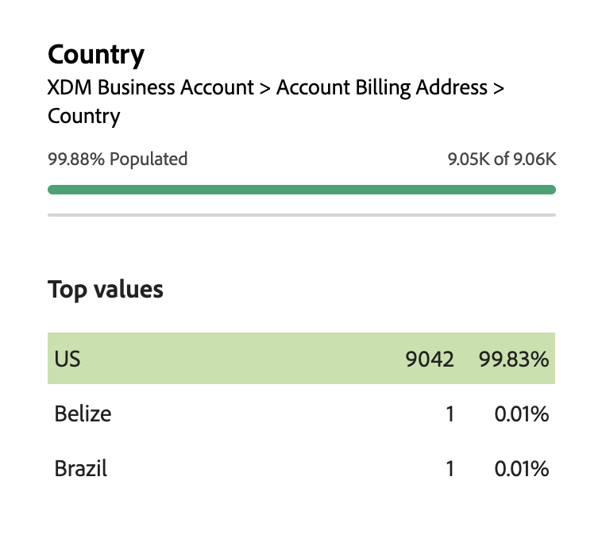

# Generador de audiencias en Real-Time Customer Data Platform

Compilado en Adobe Experience Platform, [!DNL Adobe Real-Time Customer Data Platform] puede usar todas las funcionalidades de Audience Builder que forman parte de [!DNL Experience Platform]. El espacio de trabajo proporciona controles intuitivos para crear y editar reglas, como mosaicos de arrastrar y soltar utilizados para representar las propiedades de datos.

{zoomable="yes"}

## Campos {#fields}

>[!CONTEXTUALHELP]
>id="platform_b2b_audiencebuilder_showfullxdmschema"
>title="Mostrar esquema XDM completo"
>abstract="De forma predeterminada, solo se muestran los campos que contienen datos. Active esta opción para mostrar todos los campos del esquema XDM."

>[!CONTEXTUALHELP]
>id="platform_b2b_audiencebuilder_showrelationselectors"
>title="Mostrar selectores de relación"
>abstract="De forma predeterminada, se utilizan las relaciones estándar para su organización. Active esta opción para mostrar los selectores de relación utilizados."

>[!CONTEXTUALHELP]
>id="platform_b2b_audiencebuilder_showconstrainedfields"
>title="Mostrar campos restringidos"
>abstract="De forma predeterminada, solo se muestran los campos que no tienen restricciones. Active esta opción para mostrar los campos que tienen restricciones."

Al usar el Generador de audiencias para cuentas de, puede usar los atributos de cuenta o las audiencias existentes como campos de la audiencia.

Puede seleccionar el  para ajustar la configuración de los campos mostrados.

{zoomable="yes"}

>[!NOTE]
>
>La sección **[!UICONTROL Opciones de campo]** está actualmente en versión beta y solo está disponible para clientes seleccionados. Póngase en contacto con el Servicio de atención al cliente de Adobe para obtener más información.

Se muestra la sección [!UICONTROL Configuración]. En esta sección, puede actualizar qué campos se muestran, así como la relación de los campos.

Para las **[!UICONTROL opciones de campo]**, puede mostrar solo los campos que contienen datos o el esquema XDM completo.

Para la **[!UICONTROL relación de campos]**, puede usar las relaciones estándar para su organización o mostrar los selectores de relación.

{width="300"}

### Atributos {#attributes}

La pestaña [!UICONTROL Atributos] le permite examinar los atributos de cuenta que pertenecen a la clase de cuenta empresarial de XDM, así como las oportunidades y los atributos basados en personas. Cada carpeta se puede expandir para mostrar atributos adicionales, donde cada atributo es un mosaico que se puede arrastrar al [lienzo del generador de reglas](#rule-builder-canvas) en el centro del espacio de trabajo.

Al seleccionar un atributo, puede ver los datos de resumen seleccionando el [icono de información](../../images/icons/info.png). Los datos de resumen incluyen información como valores principales, una explicación de qué es el campo y el porcentaje de cuentas que contienen valores para este atributo.

{width="300"}

Si menos del 25% de las cuentas rellenan un atributo, se mostrará el . Independientemente, se muestran los mismos datos de resumen para el atributo.

{width="300"}

>[!NOTE]
>
>Los datos de resumen solo están disponibles si el atributo pertenece al esquema de cuenta, persona u oportunidad. Además, los valores superiores solo se muestran si el campo **no** contiene demasiados valores diferentes y si los valores de esos campos se repiten con frecuencia.
>
>Estos datos de resumen se actualizan **diariamente**.

Para obtener una guía más detallada sobre el Generador de audiencias, lea la [guía del usuario del Generador de audiencias](../../segmentation/ui/segment-builder.md){target="_blank"}.

### Públicos {#audiences}

La pestaña **[!UICONTROL Audiencias]** enumera todas las audiencias basadas en personas y en cuentas disponibles en Experience Platform.

Puede situar el cursor sobre el  situado junto a una audiencia para ver información sobre la audiencia, incluido su ID, descripción y jerarquía de carpetas para localizar la audiencia.

{zoomable="yes"}

## Lienzo del generador de reglas {#rule-builder-canvas}

Una audiencia creada en el Generador de audiencias es una colección de reglas que se utilizan para describir las características o los comportamientos clave de una audiencia de destino. Estas reglas se crean mediante el lienzo del generador de reglas, ubicado en el centro del Generador de audiencias.

Para agregar una regla nueva a la definición del segmento, arrastre un mosaico desde la ficha **[!UICONTROL Campos]** y suéltelo en el lienzo del generador de reglas.

{zoomable="yes"}

Para obtener más información sobre el uso del lienzo del generador de reglas, lea la [documentación del generador de segmentos](../../segmentation/ui/segment-builder.md#rule-builder-canvas){target="_blank"}.

### Contenedores {#containers}

Las reglas de audiencia se evalúan en el orden en que aparecen en la lista. Puede utilizar contenedores para permitir un mayor control sobre el orden de ejecución, mediante el uso de consultas anidadas.

Para obtener más información sobre los contenedores, lea la [documentación del Generador de segmentos](../../segmentation/ui/segment-builder.md#containers){target="_blank"}.

## Propiedades de público {#properties}

La sección **[!UICONTROL Propiedades de audiencia]** muestra información sobre la audiencia, incluido un tamaño estimado de la audiencia. También puede especificar detalles sobre la audiencia, incluido su nombre, descripción y etiquetas.

{width="300"}

**[!UICONTROL Cuentas calificadas]** indica el número real de cuentas que coinciden con las reglas de la audiencia. Este número se actualiza cada 24 horas, después de ejecutar el trabajo de segmentación.

**[!UICONTROL Cuentas estimadas]** indica el número aproximado de cuentas basadas en el trabajo de muestra. Puede actualizar este valor después de agregar nuevas reglas o condiciones y seleccionar **[!UICONTROL Actualizar estimación]**.

{width="300"}

Puede seleccionar **[!UICONTROL Ver cuentas]** para ver un ejemplo de las cuentas que cumplen los requisitos para la audiencia con las reglas actuales.

{width="300"}

La **[!UICONTROL vista de código]** proporciona una descripción con código basado en texto de las reglas de la audiencia.

Puede seleccionar **[!UICONTROL Aplicar etiquetas de acceso]** para aplicar las etiquetas de acceso relevantes para la audiencia. Encontrará más información sobre las etiquetas de acceso en la [guía de administración de etiquetas](../../access-control/abac/ui/labels.md){target="_blank"}.

El resto de la sección de propiedades de la audiencia le permite editar detalles relacionados con la audiencia de la cuenta, incluidos el nombre, la descripción y las etiquetas.

{width="300"}

Usted **no puede** cambiar el método de evaluación de las audiencias de cuenta, ya que todas las audiencias de cuenta se evalúan mediante la segmentación por lotes.

## Pasos siguientes {#next-steps}

Audience Builder proporciona un flujo de trabajo enriquecido que le permite crear audiencias a partir de los datos de su cuenta empresarial de XDM.

Para obtener más información acerca del servicio de segmentación para los datos de perfil del cliente, lea la [descripción general del servicio de segmentación](../../segmentation/home.md){target="_blank"}.
