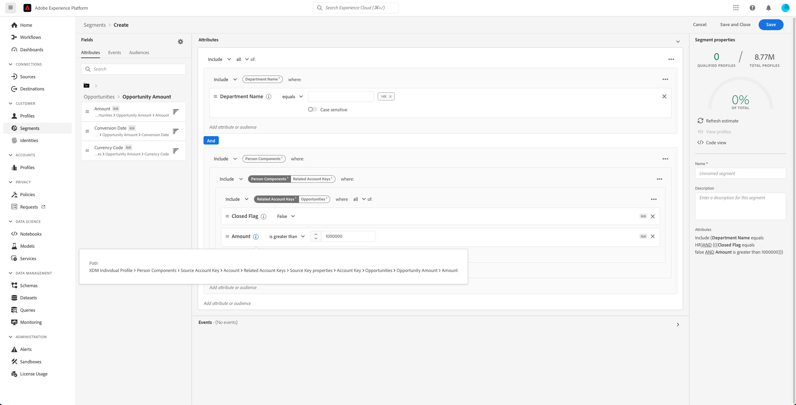

# Casos de uso de segmentación para Real-time Customer Data Platform B2B Edition

Este documento proporciona ejemplos de definiciones de segmentos en Adobe Real-time Customer Data Platform B2B Edition y cómo se pueden combinar distintos tipos de atributos para casos de uso comunes B2B. Para comprender cómo se ajustan los destinos a su flujo de trabajo B2B, consulte la [tutorial completo](../b2b-tutorial.md#create-a-segment-to-evaluate-your-data).

>[!NOTE]
>
>Los atributos necesarios para estos casos de uso de segmentación solo están disponibles para los clientes de Real-time Customer Data Platform B2B Edition. Si no utiliza Real-time Customer Data Platform B2B Edition, consulte la [información general sobre segmentación](./segmentation-overview.md) en su lugar.

## Requisitos previos {#prerequisites}

Antes de poder usar los atributos de segmentación para las clases B2B, debe completar los siguientes pasos:

1. Cree esquemas que utilicen las clases B2B. Las clases de B2B Edition incluyen Cuenta, Campaña, Oportunidad, Lista de marketing, etc. Para obtener información sobre [configuración de esquemas para su uso con clases B2B](../schemas/b2b.md) consulte la documentación del esquema.
1. Cree relaciones entre los esquemas B2B del Modelo de datos de experiencia (XDM). Los segmentos basados en atributos de B2B Edition requieren relaciones entre las clases para utilizar completamente la funcionalidad ampliada de segmentación B2B. Consulte la documentación sobre [definición de una relación entre dos esquemas B2B](../../xdm/tutorials/relationship-b2b.md) para obtener más información.
1. Ingeste datos mediante conjuntos de datos basados en esquemas B2B. Consulte la documentación de fuentes para [información sobre cómo introducir datos](../../sources/connectors/adobe-applications/marketo/marketo.md).
1. Lea el [Guía del usuario del Generador de segmentos](../../segmentation/ui/segment-builder.md) para obtener una guía más detallada sobre cómo crear segmentos.

Una vez cumplidos estos requisitos, puede combinar estos atributos para casos de uso comunes de B2B.

## Primeros pasos {#getting-started}

Una vez que los esquemas de unión de las clases B2B tienen relaciones establecidas y se han utilizado para introducir datos, sus atributos están disponibles en el carril izquierdo del Generador de segmentos.

Las clases B2B y sus atributos se añaden con un `B2B` en el espacio de trabajo Segmentación para diferenciarlos de los disponibles como estándar en Real-time Customer Data Platform.

Para crear segmentos de forma eficaz para casos de uso B2B, es importante tener un conocimiento profundo del esquema y comprender el aspecto que tiene el modelo de datos. También es útil tener en cuenta la ruta que toman los datos de un objeto de datos a otro.

La siguiente imagen ilustra las relaciones entre las clases B2B disponibles en Real-Time CDP B2B Edition.

Dado que el modelo de datos puede ser complicado, puede utilizar la interfaz de usuario de Platform para ver una representación visual más detallada del modelo de datos con el fin de encontrar los atributos relevantes para su caso de uso. Para empezar, vaya a la interfaz de usuario de Platform y seleccione Esquemas en el panel de navegación izquierdo.

Seleccione el esquema adecuado de la lista de elementos disponibles y seleccione la relación adecuada en el [!UICONTROL Composición] carril lateral. En el siguiente ejemplo, si selecciona la relación &quot;Persona&quot;, se muestra qué atributo del esquema actual hace referencia al esquema &quot;Persona&quot; relacionado (si es el esquema de origen de la relación) o está referenciado por el esquema &quot;Persona&quot; (si es el esquema de destino en la relación).

Esta relación se refleja dentro del Generador de segmentos mediante el uso de `Key` carpetas como se muestra en la imagen siguiente.

Consulte la [esquemas en la documentación de Real-time Customer Data Platform B2B Edition](../schemas/b2b.md) para obtener más información sobre las clases B2B disponibles.

Los casos de uso siguientes proporcionan información sobre qué clases se utilizan para establecer relaciones entre los distintos esquemas para lograr estos resultados. Estos ejemplos se pueden utilizar para ayudarle a crear sus propios segmentos.

## Ejemplos de casos de uso de segmentación diferentes {#use-cases}

Los siguientes casos de uso están disponibles para la segmentación con B2B Edition. Cada ejemplo proporciona una descripción de lo que hace el segmento y una descripción de las clases utilizadas para crearlos. Las imágenes proporcionadas resaltan la ruta del archivo en la variable [!UICONTROL Atributos] carril lateral que refleja la estructura del esquema. La variable [!UICONTROL Propiedades del segmento] a la derecha de la pantalla contiene un desglose por escrito de los atributos del segmento.

### Ejemplo 1: Buscar &quot;responsables de la toma de decisiones&quot; para oportunidades B2B {#find-decision-maker}

Encuentre a todas las personas que son el &quot;Responsable de Decisión&quot; de cualquier oportunidad. Este segmento requiere un vínculo entre las variables [!UICONTROL Perfil individual XDM] y [!UICONTROL Relación de persona de oportunidad comercial XDM] Clase .

### Ejemplo 2: Buscar perfiles B2B asignados a oportunidades en una determinada cantidad de dólares {#find-opportunities-amount}

Encuentre todas las personas directamente asignadas a cualquier oportunidad de la cual la cantidad de oportunidad sea superior a la cantidad dada (1 millón de dólares). Este segmento requiere un vínculo entre las variables [!UICONTROL Perfil individual XDM] class, [!UICONTROL Relación de persona de oportunidad comercial XDM] y [!UICONTROL Oportunidad comercial XDM] Clase .

### Ejemplo 3: Buscar perfiles B2B asignados a oportunidades por ubicación {#find-opportunities-location}

Encuentre todas las personas que están directamente asignadas a cualquier oportunidad donde la cuenta esté ubicada en una ubicación determinada (Canadá). Este segmento requiere un vínculo entre las variables [!UICONTROL Perfil individual XDM] class, [!UICONTROL Relación de persona de oportunidad comercial XDM] class, [!UICONTROL Oportunidad comercial XDM] y [!UICONTROL Cuenta comercial XDM] Clase .

### Ejemplo 4: Buscar &quot;responsables de la toma de decisiones&quot; para oportunidades por sector y comportamiento de navegación {#find-industry-browsing-behavior}

Encuentre a todas las personas que son &quot;responsables de tomar decisiones&quot; de cualquier oportunidad donde la cuenta esté en el sector &quot;financiero&quot;, y visiten la página de precios en los últimos tres días. Este segmento requiere un vínculo entre las variables [!UICONTROL Perfil individual XDM] class, [!UICONTROL Relación de persona de oportunidad comercial XDM] class, [!UICONTROL Oportunidad comercial XDM] y [!UICONTROL Cuenta comercial XDM] y [!UICONTROL XDM ExperienceEvent] Clase .

### Ejemplo 5: Encuentre perfiles B2B para oportunidades por nombre de departamento e cantidad de oportunidad {#find-department-opportunity-amount}

Encuentre a todas las personas que trabajan en un departamento de Recursos Humanos (HR) y están relacionadas con cualquier cuenta que tenga al menos una oportunidad abierta que valga la cantidad dada (1 millón de dólares) o más. Este segmento requiere un vínculo entre las variables [!UICONTROL Perfil individual XDM] class, [!UICONTROL Cuenta comercial XDM] y [!UICONTROL Oportunidad comercial XDM] Clase .

### Ejemplo 6: Buscar perfiles B2B por puesto de trabajo e ingresos anuales por cuenta {#find-by-job-title-and-revenue}

Encuentre todas las personas cuyo puesto de trabajo es vicepresidente y están relacionadas con cualquier cuenta con ingresos anuales de la cantidad dada (100 millones de dólares) o más, y hayan visitado la página de precios al menos 3 veces en el último mes. Este segmento requiere un vínculo entre las variables [!UICONTROL Perfil individual XDM] class, [!UICONTROL Cuenta comercial XDM] y [!UICONTROL XDM ExperienceEvent] Clase .

### Ejemplo 7: Buscar &quot;responsables de la toma de decisiones&quot; por estado de oportunidad y comportamiento de navegación {#find-by-opportunity-status-and-browsing-behavior}

Encuentre a todas las personas que son &quot;responsables de la toma de decisiones&quot; de cualquier oportunidad perdida cerrada, y visiten la página de precios en la última semana. Este segmento requiere un vínculo entre las variables [!UICONTROL Perfil individual XDM] class, [!UICONTROL Relación de persona de oportunidad comercial XDM] class, [!UICONTROL Oportunidad comercial XDM] y [!UICONTROL XDM ExperienceEvent] Clase .

### Ejemplo 8: Usar cuentas relacionadas para expandir el alcance de la segmentación {#related-accounts}

Encuentre todas las personas que trabajan en un departamento de Recursos Humanos (HR) y que están relacionadas con cualquier cuenta *o cualquiera de las cuentas relacionadas de la cuenta* que tenga al menos una oportunidad abierta que valga la cantidad dada (1 millón de dólares) o más. Este segmento requiere un vínculo entre las variables [!UICONTROL Perfil individual XDM] class, [!UICONTROL Cuenta comercial XDM] y [!UICONTROL Oportunidad comercial XDM] Clase .

### Ejemplo 9: Use puntuaciones de posible cliente o puntuaciones de cuenta para calificar el perfil {#account-scoring}

Encuentre todos los perfiles con una puntuación de posible cliente superior a 80.

## Pasos siguientes {#next-steps}

Después de leer esta descripción general, ahora conoce las posibilidades de segmentación disponibles mediante Real-Time CDP, B2B Edition. Para obtener más información sobre el servicio de segmentación, lea la [Documentación de segmentación](../../segmentation/home.md).
