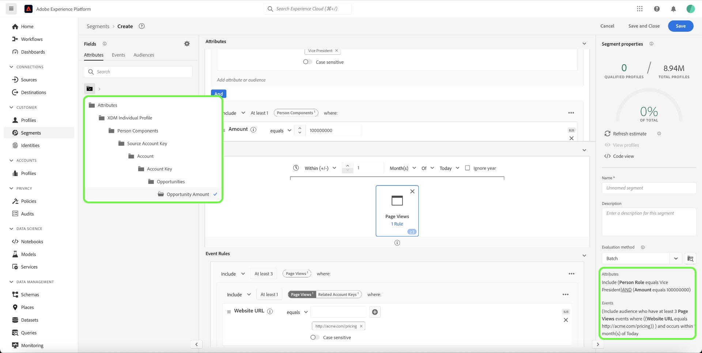
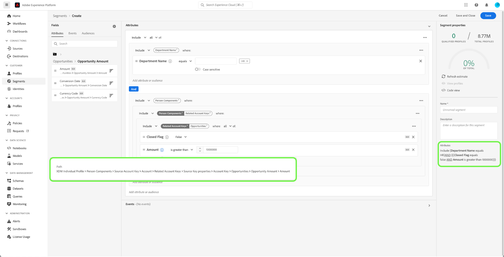

# Casos de uso de segmentación para Real-Time Customer Data Platform B2B edition

Este documento proporciona ejemplos de definiciones de segmentos en Adobe Real-Time Customer Data Platform B2B edition y cómo se pueden combinar distintos tipos de atributos para casos de uso B2B comunes. Para comprender cómo encajan los destinos en el flujo de trabajo B2B, consulte el [tutorial completo](../b2b-tutorial.md#create-a-segment-to-evaluate-your-data).

>[!NOTE]
>
>Los atributos necesarios para estos casos de uso de segmentación solo están disponibles para los clientes de Real-Time Customer Data Platform B2B edition. Si no usa Real-Time Customer Data Platform B2B edition, consulte la [descripción general de la segmentación](./segmentation-overview.md) en su lugar.

>[!BEGINSHADEBOX]

## Cambio de política de combinación

Como parte de las actualizaciones de la arquitectura de B2B edition de Real-Time CDP, las audiencias de varias entidades con atributos B2B ahora solo admiten una única política de combinación (la política de combinación predeterminada), en lugar de varias políticas de combinación. Además, los cambios en los que los perfiles pueden cumplir los requisitos para las audiencias pueden afectar a los flujos de trabajo posteriores, como la activación, la orquestación del recorrido y la segmentación de campañas. Se recomienda realizar las siguientes acciones para asegurarse de que los datos funcionan según lo esperado:

- Revise y pruebe cualquier audiencia que dependa de una lógica de combinación no predeterminada para comprender los posibles impactos de esta actualización.
- Vuelva a evaluar los criterios de cualificación de audiencias para las audiencias clave a fin de comprender si los cambios en la lógica de combinación pueden afectar a las cualificaciones.
- Monitorice los resultados de activación para detectar cualquier cambio en los resultados de audiencia causado por el cambio en la política de combinación.

>[!ENDSHADEBOX]

## Requisitos previos {#prerequisites}

Antes de poder utilizar los atributos de segmentación para las clases B2B, debe completar los siguientes pasos:

1. Cree esquemas que utilicen las clases B2B. Las clases de B2B edition incluyen Cuenta, Campaña, Oportunidad, Lista de marketing y más. Para obtener información sobre [cómo configurar esquemas para utilizarlos con clases B2B](../schemas/b2b.md), consulte la documentación del esquema.
2. Cree relaciones entre los esquemas B2B del Modelo de datos de experiencia (XDM). Las audiencias basadas en atributos de B2B edition requieren relaciones entre las clases para utilizar completamente la funcionalidad de segmentación B2B ampliada. Consulte la documentación sobre [cómo definir una relación entre dos esquemas B2B](../../xdm/tutorials/relationship-b2b.md) para obtener más información.
3. Ingesta de datos mediante conjuntos de datos basados en los esquemas B2B. Consulte la documentación de fuentes para obtener [información sobre cómo ingerir datos](../../sources/connectors/adobe-applications/marketo/marketo.md).
4. Lea la [Guía del usuario del Generador de segmentos](../../segmentation/ui/segment-builder.md) para obtener instrucciones más detalladas sobre cómo crear audiencias.

Una vez cumplidos estos requisitos, puede combinar estos atributos para casos de uso B2B comunes.

## Introducción {#getting-started}

Una vez que los esquemas de unión de las clases B2B han establecido relaciones y se han utilizado para introducir datos, sus atributos están disponibles en el carril izquierdo del Generador de segmentos.

A las clases B2B y sus atributos se les anexa una etiqueta `B2B` dentro del espacio de trabajo de segmentación para diferenciarlas de las disponibles como estándar en Real-Time Customer Data Platform.

Para crear audiencias para casos de uso B2B de forma eficaz, es importante tener un conocimiento profundo del esquema y comprender la apariencia del modelo de datos. También es útil tener en cuenta la ruta que los datos siguen de un objeto de datos a otro.

La siguiente imagen ilustra las relaciones entre las clases B2B disponibles en Real-Time CDP B2B edition.

Dado que el modelo de datos puede ser complicado, puede utilizar la interfaz de usuario de Platform para ver una representación visual más detallada del modelo de datos y encontrar los atributos relevantes para su caso de uso. Para empezar, vaya a la interfaz de usuario de Platform y seleccione Esquemas en el panel de navegación izquierdo.

Seleccione el esquema apropiado de la lista disponible y seleccione la relación apropiada en el carril lateral [!UICONTROL Composition]. En el ejemplo siguiente, al seleccionar la relación &quot;Persona&quot;, se muestra qué atributo del esquema actual hace referencia al esquema &quot;Persona&quot; relacionado (si es el esquema de origen de la relación) o se hace referencia a él mediante el esquema &quot;Persona&quot; (si es el esquema de referencia de la relación).

Esta relación se refleja dentro del Generador de segmentos mediante el uso de `Key` carpetas, como se muestra en la siguiente imagen.

Consulte los [esquemas de la documentación de Real-Time Customer Data Platform B2B edition](../schemas/b2b.md) para obtener más información sobre las clases B2B disponibles.

Los casos de uso siguientes proporcionan información sobre qué clases se utilizan para establecer relaciones entre los diferentes esquemas para lograr estos resultados. Estos ejemplos se pueden utilizar para ayudarle a crear sus propias audiencias.

## Ejemplos de diferentes casos de uso de segmentación {#use-cases}

Los siguientes casos de uso están disponibles para la segmentación con B2B edition. Cada ejemplo proporciona una descripción de lo que hace la audiencia y una descripción de las clases utilizadas para crearlas. Las imágenes proporcionadas resaltan la ruta de archivo en el carril lateral de [!UICONTROL Atributos], que refleja la estructura del esquema. La sección [!UICONTROL Propiedades del segmento] a la derecha de la pantalla contiene un desglose por escrito de los atributos de la audiencia.

### Ejemplo 1: Encuentre a los responsables de la toma de decisiones sobre las oportunidades B2B {#find-decision-maker}

Encuentre a todas las personas que son las &quot;decisoras&quot; de cualquier oportunidad. Esta audiencia requiere un vínculo entre la clase [!UICONTROL XDM Individual Profile] y la clase [!UICONTROL XDM Business Opportunity Person Relation].

### Ejemplo 2: Encuentre perfiles B2B asignados a oportunidades por encima de una determinada cantidad de dólares {#find-opportunities-amount}

Encuentre todas las personas que estén asignadas directamente a cualquier oportunidad cuya cantidad de oportunidad sea mayor que la cantidad dada (1 millón de dólares). Esta audiencia requiere un vínculo entre la clase [!UICONTROL XDM Individual Profile], la clase [!UICONTROL XDM Business Opportunity Person Relation] y la clase [!UICONTROL XDM Business Opportunity].

### Ejemplo 3: Buscar perfiles B2B asignados a oportunidades por ubicación {#find-opportunities-location}

Encuentre todas las personas que estén asignadas directamente a cualquier oportunidad donde la cuenta esté ubicada en una ubicación determinada (Canadá). Esta audiencia requiere un vínculo entre la clase [!UICONTROL XDM Individual Profile], la clase [!UICONTROL XDM Business Opportunity Person Relation], la clase [!UICONTROL XDM Business Opportunity] y la clase [!UICONTROL XDM Business Account].

### Ejemplo 4: Encuentre &quot;responsables de la toma de decisiones&quot; para conocer las oportunidades según el comportamiento de la industria y la navegación {#find-industry-browsing-behavior}

Encuentre a todas las personas que son un &quot;Tomador de decisiones&quot; de cualquier oportunidad donde la cuenta está en la industria &quot;Finanzas&quot;, y visitó la página de precios en los últimos tres días.

Para crear esta audiencia, debe utilizar &quot;segmentos de segmentos&quot; creando una audiencia base de todas las personas que visitaron la página de precios en los últimos tres días.

Después de crear la primera audiencia, puede combinarla con otra audiencia de personas que son &quot;tomadores de decisiones&quot; de cualquier oportunidad en la que la cuenta esté en la industria de las &quot;finanzas&quot;.

### Ejemplo 5: Búsqueda de perfiles B2B para oportunidades por nombre de departamento y cantidad de oportunidad {#find-department-opportunity-amount}

Encuentre a todas las personas que trabajan en un departamento de Recursos Humanos (RRHH) y tienen cualquier cuenta que tiene al menos una oportunidad abierta por valor de la cantidad dada (1 millón de dólares) o más. Esta audiencia requiere un vínculo entre la clase [!UICONTROL XDM Individual Profile], la clase [!UICONTROL XDM Business Account] y la clase [!UICONTROL XDM Business Opportunity].

### Ejemplo 6: Búsqueda de perfiles B2B por puesto e ingresos de cuenta anual {#find-by-job-title-and-revenue}

Encuentre a todas las personas cuyo cargo sea Vicepresidente y tenga una cuenta con ingresos anuales de la cantidad determinada (100 millones de dólares) o más, y haya visitado la página de precios al menos 3 veces en el último mes. Esta audiencia requiere un vínculo entre la clase [!UICONTROL XDM Individual Profile], la clase [!UICONTROL XDM Business Account] y la clase [!UICONTROL XDM ExperienceEvent].

### Ejemplo 7: Encuentre a los responsables de la toma de decisiones por estado de oportunidad y comportamiento de navegación {#find-by-opportunity-status-and-browsing-behavior}

Encuentre a todas las personas que son &quot;tomadores de decisiones&quot; de cualquier oportunidad perdida y cerrada, y visitaron la página de precios en los últimos tres días.

Para crear esta audiencia, debe utilizar &quot;segmentos de segmentos&quot; creando una audiencia base de todas las personas que visitaron la página de precios en los últimos tres días.

Después de crear la primera audiencia, puede combinarla con otra audiencia de personas que son &quot;tomadores de decisiones&quot; de cualquier oportunidad en la que tanto la &quot;marca cerrada&quot; está configurada como true y la &quot;marca perdida&quot; está configurada como false.

### Ejemplo 8: Uso de cuentas relacionadas para expandir el alcance de la segmentación {#related-accounts}

Encuentre a todas las personas que trabajan en un departamento de Recursos Humanos (RRHH) y están relacionadas con cualquier cuenta *o con cualquiera de las cuentas relacionadas de la cuenta* que tenga al menos una oportunidad abierta por un valor de la cantidad determinada (1 millón de dólares) o más. Esta audiencia requiere un vínculo entre la clase [!UICONTROL XDM Individual Profile], la clase [!UICONTROL XDM Business Account] y la clase [!UICONTROL XDM Business Opportunity].

### Ejemplo 9: Usar puntuaciones de posibles clientes o de cuenta para calificar el perfil {#account-scoring}

Encuentre todos los perfiles con una puntuación de más de 80 posibles clientes.

### Ejemplo 10: Encuentre perfiles B2B asociados a cuentas cuya organización principal tenga ingresos superiores a una determinada cantidad en dólares {#find-parent-org-amount}

Encuentre todas las personas asociadas con cuentas cuya organización principal tenga un ingreso mayor que la cantidad indicada (100.000.000 de dólares).

### Ejemplo 11: Buscar perfiles B2B por puesto y nombre de cuenta con una relación activa {#find-by-job-title-and-account-name}

Encuentre a todas las personas que sean un &quot;Manager&quot; en la cuenta &quot;Acme&quot;, donde la relación de la cuenta es &quot;Active&quot;.

### Ejemplo 12: Encuentre perfiles B2B dirigidos para campañas en las que el valor de actualCost excede el valor de budgetCost {#find-actualcost-exceed-budgetcost}

Encuentre todas las personas que son el objetivo de las campañas en las que el valor realCost superó al valor presupuestado.

### Ejemplo 13: Buscar perfiles B2B que pertenezcan a una lista estática de Marketo y isDeleted=false {#find-marketo-static-list}

Busque todas las personas que pertenezcan a la lista estática de Marketo &quot;Usuarios de aniversario&quot; donde isDeleted=false.

<!-- 
### Example 14: Find "decision makers" by opportunity status using streaming or edge segmentation {#find-decision-makers-personalization}

>[!NOTE]
>
>This example uses **streaming or edge** segmentation, as opposed to batch segmentation.

Find all the people who are a "Decision Maker" of any closed-lost opportunity and visited the pricing page in the last 24 hours. This example can be evaluated using streaming or edge segmentation, to support more real-time use cases.

To create this audience, you must use "segment of segments" by creating a base audience of all the people who visited the pricing page in the last 24 hours.

After creating the first audience, you can combine that with another audience of  people who are a "Decision Maker" of any opportunity where both the "Closed Flag" is set to true and the "Lost Flag" is set to false.

 -->

## Próximos pasos {#next-steps}

Después de leer esta descripción general, ahora comprende las posibilidades de segmentación disponibles con Real-Time CDP y B2B edition. Para obtener más información sobre el servicio de segmentación, lea la [documentación de segmentación](../../segmentation/home.md).
