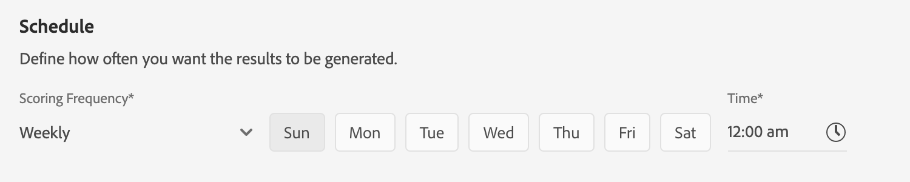

# Predecir las puntuaciones de tendencia del cliente mediante la API del cliente (alfa)

>[!NOTE]
>La funcionalidad de AI del cliente descrita en este documento está en alfa. La documentación y la funcionalidad están sujetas a cambios.

La API del cliente en Adobe Experience Platform, creada y con tecnología Adobe Sensei, le permite generar puntuaciones de tendencia personalizadas sin tener que preocuparse por los aspectos del aprendizaje automático.

En este tutorial se explican los pasos para trabajar con la API del cliente mediante la interfaz de usuario de la plataforma de experiencia. Se proporcionan pasos para los siguientes temas:

* [Configurar una instancia](#configure-an-instance)
* [Crear segmentos de clientes con puntuaciones predichas](#create-customer-segments-with-predicted-scores)

## Primeros pasos

Esta guía requiere un conocimiento práctico de los distintos servicios de plataforma implicados en el uso de la API del cliente. Antes de comenzar este tutorial, consulte los siguientes documentos:

* [Descripción general del perfil del cliente en tiempo real](https://www.adobe.io/apis/experienceplatform/home/profile-identity-segmentation/profile-identity-segmentation-services.html#!api-specification/markdown/narrative/technical_overview/unified_profile_architectural_overview/unified_profile_architectural_overview.md)
* [Descripción general del servicio de segmentación](https://www.adobe.io/apis/experienceplatform/home/profile-identity-segmentation/profile-identity-segmentation-services.html#!api-specification/markdown/narrative/technical_overview/segmentation/segmentation-overview.md)
* [Guía del usuario del Generador de segmentos](https://www.adobe.io/apis/experienceplatform/home/profile-identity-segmentation/profile-identity-segmentation-services.html#!api-specification/markdown/narrative/technical_overview/segmentation/segment-builder-guide.md)

## Configurar una instancia

La plataforma de experiencia proporciona una API de cliente como un servicio de Adobe Sensei sencillo de usar que se puede configurar para distintos casos de uso. Las siguientes secciones proporcionan los pasos para configurar una instancia de AI del cliente.

### Configurar la instancia

En la interfaz de usuario de la plataforma, haga clic en **Servicios** en el panel de navegación izquierdo. Aparece el navegador de **servicios** y muestra todos los servicios disponibles. En el contenedor de AI del cliente, haga clic en **Abrir**.

La pantalla *de AI* del cliente muestra todas las instancias de AI del cliente existentes. Haga clic en **Crear instancia**.

Aparece el flujo de trabajo de creación de instancias, comenzando en el paso *Configuración* .

A continuación encontrará información importante sobre los valores para los que debe proporcionar la instancia:

* El nombre de la instancia se utilizará en todos los lugares donde se muestre la puntuación de AI del cliente. Por lo tanto, los nombres deben describir lo que las puntuaciones de predicción representan, por ejemplo, &quot;Probabilidad de cancelar la suscripción a la revista&quot;.

* El tipo de tendencia determina la intención de la puntuación y la polaridad de la métrica. Puede elegir entre **Corn** o **Conversión**.

* La fuente de datos se refiere al conjunto de datos de entrada que se utilizará para predecir puntuaciones. Por diseño, la API del cliente utiliza los datos de eventos de experiencia del consumidor para calcular las puntuaciones de tendencia. Al seleccionar un conjunto de datos en el selector desplegable, solo se enumerarán los que son compatibles con la API del cliente.

* De forma predeterminada, se generan puntuaciones de tendencia para todos los perfiles a menos que se especifique una población elegible. Puede especificar una población elegible definiendo condiciones para incluir o excluir perfiles en función de eventos.

Proporcione los valores necesarios y haga clic en **Siguiente**.

### Definir un objetivo

Aparece el paso *Definir objetivo* y proporciona un entorno interactivo para que usted pueda definir visualmente un objetivo. Un objetivo se compone de uno o más eventos, donde la incidencia de cada evento se basa en la condición que contiene. El objetivo de una instancia de AI de cliente es determinar la probabilidad de lograr su objetivo dentro de un intervalo de tiempo determinado.

Haga clic en **Especificar nombre** de campo y seleccione un campo en la lista desplegable. Haga clic en la segunda entrada y seleccione una cláusula para la condición del evento y, a continuación, proporcione un valor de objetivo para completar el evento. Para configurar eventos adicionales, haga clic en **Agregar evento**. Por último, complete el objetivo aplicando un intervalo de tiempo de predicción en número de días y, a continuación, haga clic en **Siguiente**.

### Configurar una programación *(opcional)*

Aparece el paso *avanzado* . Este paso opcional le permite configurar una programación para automatizar las ejecuciones de predicciones, definir exclusiones de predicciones para filtrar determinados eventos o hacer clic en **Finalizar** si no se necesita nada.

Configure un programa de puntuación configurando la frecuencia *de* puntuación. Las ejecuciones de predicciones automatizadas se pueden programar para que se ejecuten de forma semanal o mensual.

Debajo de la configuración de programación, puede definir exclusiones de predicción para evitar que los eventos que cumplen determinadas condiciones se evalúen al generar puntuaciones. Esta función se puede utilizar para filtrar las entradas de datos irrelevantes.

Para excluir determinados eventos, haga clic en **Agregar exclusión** y defina el evento de la misma manera que se define el objetivo. Para eliminar una exclusión, haga clic en las elipses (**...**) en la parte superior derecha del contenedor de eventos y, a continuación, haga clic en **Eliminar contenedor**.

Excluya los eventos según sea necesario y haga clic en **Finalizar** para crear la instancia.

Si la instancia se crea correctamente, se activará inmediatamente una ejecución de predicción y las siguientes se ejecutarán según la programación definida.

>   **Nota:** Según el tamaño de los datos de entrada, las ejecuciones de predicciones pueden tardar hasta 24 horas en completarse.

Al seguir esta sección, ha configurado una instancia de AI del cliente y se ha ejecutado una ejecución de predicción. Una vez finalizada la ejecución, las perspectivas puntuadas hidratarán automáticamente perfiles con puntuaciones predichas. Espere 24 horas antes de continuar con la siguiente sección de este tutorial.

## Crear segmentos de clientes con puntuaciones predichas

Cuando se completa una ejecución de predicción, los perfiles consumen automáticamente las puntuaciones de tendencia predichas. Enriquecir perfiles con puntuaciones AI del cliente permite crear segmentos de clientes basados en puntuaciones de tendencia. Esta sección proporciona los pasos para crear segmentos mediante el Generador de segmentos. Para ver un tutorial más sólido sobre la creación de segmentos, consulte la guía [de usuario del Generador](https://www.adobe.io/apis/experienceplatform/home/profile-identity-segmentation/profile-identity-segmentation-services.html#!api-specification/markdown/narrative/technical_overview/segmentation/segment-builder-guide.md)de segmentos.

En la interfaz de usuario de la plataforma, haga clic en **Segmentos** en el panel de navegación izquierdo y, a continuación, haga clic en **Crear segmento**.

Aparece el Generador *de segmentos* . En la columna *Campos* de la izquierda y en la ficha *Atributos* , haga clic en la carpeta denominada Perfil **individual** XDM y, a continuación, haga clic en la carpeta con el espacio de nombres de su organización. La carpeta denominada **Customer AI** contiene los resultados de las ejecuciones de predicciones y recibe el nombre de la instancia a la que pertenecen las puntuaciones. Haga clic en y acceda a los resultados de la instancia deseada.

Situado en el centro del Generador de segmentos, arrastre y suelte el atributo **Puntuación** en el lienzo *del creador de* reglas para definir una regla.

En la columna de propiedades *del* segmento de la derecha, seleccione una directiva *de* combinación, proporcione un nombre para el segmento y, a continuación, haga clic en **Guardar** para crear el segmento.

## Pasos siguientes

Siguiendo este tutorial, ha configurado correctamente una instancia de AI del cliente, ha generado puntuaciones de tendencia y ha creado un segmento aplicado por puntuaciones de tendencia mediante el Generador de segmentos. Los destinos activados ahora pueden usar el segmento de cliente para dirigirse a las audiencias. Consulte la información general  Destinos para obtener más información.
