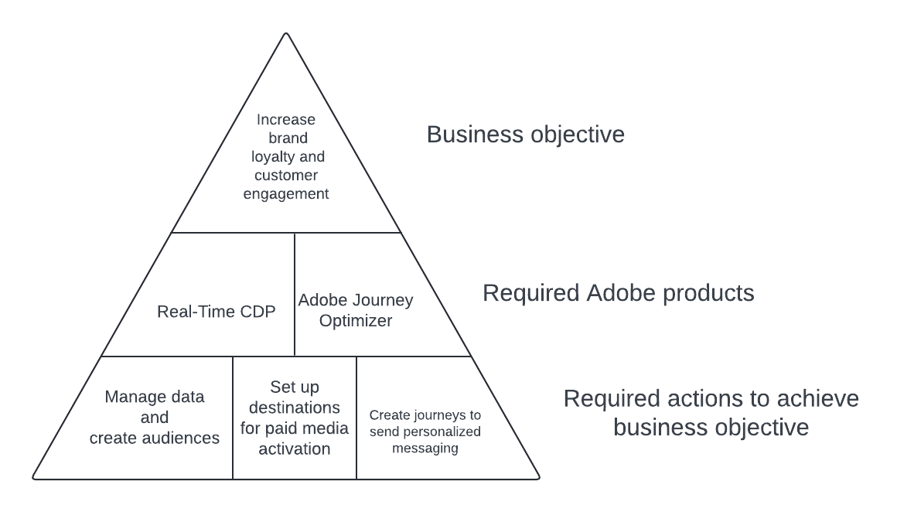

# Evolucionar el valor de cliente único al valor de duración

>[!IMPORTANT]
> 
>* Esta página presenta una implementación de muestra de Real-Time CDP y Adobe Journey Optimizer para lograr el caso de uso descrito. Utilice las cifras, los criterios de cualificación y otros campos de la página como guía, no como cifras prescriptivas.
>* Para completar este caso de uso, debe tener licencia para Real-Time CDP y Adobe Journey Optimizer. Obtenga más información en los [requisitos previos y la sección de planificación](#prerequisites-and-planning) más adelante.

Implemente el valor de cliente único en un caso de uso de valor de duración para impulsar la participación y la lealtad de la marca. Cree una experiencia de cliente conectada en varios canales o recorridos con la potencia de Experience Platform, aumentada por [Real-Time CDP](/help/rtcdp/home.md) y [Journey Optimizer](https://experienceleague.adobe.com/es/docs/journey-optimizer/using/ajo-home).

Las personas a las que está dirigiendo son los visitantes poco frecuentes de sus propiedades que han realizado algunas compras en los últimos tres meses.

Piense en estos clientes que visitan sus propiedades y compran esporádicamente los productos o servicios que ofrece. Es posible que quiera crear campañas personalizadas para atraer a estos clientes de modo que su marca pueda ofrecerles valor a largo plazo en lugar de valor único. Obtenga información sobre cómo:

* Recopilación y administración de datos
* Creación de públicos
* Cree recorridos para dirigirse a estas audiencias en Adobe Journey Optimizer y activarlas en Real-Time CDP.

{zoomable="yes"}

## Requisitos previos y planificación {#prerequisites-and-planning}

Teniendo en cuenta que internamente ha definido un objetivo comercial y un objetivo para aumentar la lealtad de la marca. Esto puede traducirse en la ejecución de un caso de uso para aumentar la participación y lealtad de los clientes.

Para lograrlo, la tecnología necesaria consiste en las dos aplicaciones Experience Platform [Real-Time CDP](https://experienceleague.adobe.com/docs/experience-platform/rtcdp/overview.html?lang=es) y [Adobe Journey Optimizer](https://experienceleague.adobe.com/docs/journey-optimizer/using/get-started/get-started.html?lang=es). A continuación se enumeran varias funcionalidades y elementos de interfaz de usuario de las dos aplicaciones que utilizará al implementar el caso de uso.

>[!TIP]
>
>Asegúrese de que dispone de los [permisos de control de acceso basados en atributos](/help/access-control/abac/end-to-end-guide.md) necesarios para todas estas áreas, o pídale al administrador del sistema que le conceda los permisos necesarios.

* [[!DNL Adobe Real-Time Customer Data Platform (Real-Time CDP)]](https://experienceleague.adobe.com/docs/platform-learn/tutorials/rtcdp/understanding-the-real-time-customer-data-platform.html): Integre datos entre orígenes de datos para impulsar la campaña. A continuación, estos datos se utilizan para crear las audiencias de campaña y los elementos de datos personalizados de superficie que se utilizan en los mosaicos de promo de correo electrónico y web (por ejemplo, nombre o información relacionada con la cuenta). Por último, Real-Time CDP también se utiliza para activar audiencias en destinos de medios de pago.
   * [Esquemas](/help/xdm/home.md)
   * [Perfiles](/help/profile/home.md)
   * [Conjuntos de datos](/help/catalog/datasets/overview.md)
   * [Públicos](/help/segmentation/home.md)
   * [Destinos](/help/destinations/home.md)
* [[!DNL Adobe Journey Optimizer]](https://experienceleague.adobe.com/docs/journey-optimizer/using/orchestrate-journeys/journey.html): Diseñe recorridos, configure déclencheur y cree los mensajes adecuados para dirigirse a los visitantes.
   * [Evento o Déclencheur de audiencia](https://experienceleague.adobe.com/docs/journey-optimizer/using/offer-decisioning/collect-event-data/data-collection.html)
   * [Audiencias y eventos](https://experienceleague.adobe.com/docs/journey-optimizer/using/audiences-profiles-identities/audiences/about-audiences.html?lang=es)
   * [Recorridos](https://experienceleague.adobe.com/docs/journey-optimizer/using/orchestrate-journeys/journey.html)

## Arquitectura de Real-Time CDP y Journey Optimizer

A continuación se muestra una vista de arquitectura de alto nivel de los distintos componentes de Real-Time CDP y Journey Optimizer. Este diagrama muestra cómo fluyen los datos entre las dos aplicaciones Experience Platform desde la recopilación de datos hasta el punto en que se activan mediante recorridos o campañas hasta los destinos, para lograr el caso de uso descrito en esta página.

{zoomable="yes"}

## Cómo lograr el caso de uso: información general de alto nivel {#achieve-the-use-case-high-level}

A continuación se ofrece una amplia descripción general del flujo de trabajo, una combinación de un flujo de trabajo de recorrido y un flujo de trabajo de activación.

En el flujo de trabajo de ejemplo que se muestra a continuación, busca clientes que cumplan un determinado criterio y quiere animarlos a que regresen a su sitio web o aplicación. Desea configurarlos en un recorrido en el que, en lugar de una actividad limitada en su propiedad, se devuelvan de forma más recurrente. Está intentando devolverlos a su propiedad y, una vez que regresen, les hace entrar en el recorrido para realizar compras recurrentes en el sitio. La campaña configurada aquí está limitada a una participación con clientes por mes.

Comience por enviar un mensaje a su audiencia de clientes de alto valor y baja frecuencia. A continuación, compruebe si han recibido este mensaje en los últimos treinta días. Si no lo han hecho, puede introducirlos en un recorrido sobre, por ejemplo, un nuevo programa de suscripción. A continuación, puede esperar unos días (siete días en este ejemplo). Después de este tiempo, si no han adquirido la suscripción sobre la que les ha enviado un mensaje, puede enviar anuncios de medios de pago a través de destinos. Si ha adquirido la suscripción, puede hacer que introduzca un recorrido de confirmación de pedido, completando así el caso de uso.

>[!IMPORTANT]
>
>Como se describe más adelante en esta página, al tener un grupo de campos de consentimiento [dedicado en su esquema](#customer-attributes-schema) y al [implementar políticas de consentimiento](#privacy-consent), todas las acciones y flujos de trabajo se implementan de manera confidencial y con consentimiento previo.

>[!BEGINSHADEBOX]

{zoomable="yes"}

1. Usted crea esquemas y conjuntos de datos y luego los marca para [!UICONTROL Perfil].
2. Los datos se recopilan e integran en Experience Platform mediante el SDK web, el SDK de Edge móvil o la API. El conector de datos de Analytics también se puede utilizar, pero puede provocar una latencia de recorrido.
3. Los perfiles se cargan en Real-Time CDP y se crean políticas de gobernanza para garantizar un uso responsable.
4. Las audiencias se generan centradas en la lista de perfiles para comprobar si hay clientes de alto valor y baja frecuencia.
5. Usted crea dos recorridos en [!DNL Adobe Journey Optimizer], uno para enviar un mensaje a los usuarios sobre un nuevo programa de suscripción y otro para enviarles un mensaje para que confirmen la compra más adelante.
6. Si lo desea, puede activar la audiencia de clientes que no hayan adquirido su suscripción a los destinos de medios de pago deseados.

>[!ENDSHADEBOX]

## Cómo lograr el caso de uso {#achieve-use-case-instruction}

Para completar cada uno de los pasos de la descripción general de alto nivel anterior, lea las secciones siguientes, que ofrecen vínculos a más información e instrucciones más detalladas.

### Funcionalidades y elementos de la interfaz de usuario que utilizará {#ui-functionality-and-elements}

A medida que complete los pasos para implementar el caso de uso, utilizará la Real-Time CDP, la funcionalidad de Adobe Journey Optimizer y los elementos de la interfaz de usuario enumerados al principio de este documento. Asegúrese de que dispone de los permisos de control de acceso basados en atributos necesarios para todas estas áreas o solicite al administrador del sistema que le conceda los permisos necesarios.

### Crear un diseño de esquema y especificar grupos de campos {#schema-design}

Los recursos del modelo de datos de experiencia (XDM) se administran en el área de trabajo [!UICONTROL Esquemas] de [!DNL Adobe Experience Platform]. Puede ver y explorar los recursos principales proporcionados por [!DNL Adobe] (por ejemplo, [!UICONTROL grupos de campos]) y crear recursos y esquemas personalizados para su organización.

Para obtener más información sobre la creación de [esquemas](https://experienceleague.adobe.com/docs/experience-platform/xdm/home.html?lang=es), lea el tutorial [crear esquema.](/help/xdm/tutorials/create-schema-ui.md)

Hay varios diseños de esquema que puede utilizar en esta implementación de muestra para que el caso de uso evolucione de un valor de una vez a un valor de duración. Cada esquema incluye campos obligatorios específicos que se van a configurar y algunos campos sugeridos.

En función de las implementaciones de muestra, Adobe sugiere crear los tres esquemas siguientes para lograr este caso de uso:

* [Esquema de atributos del cliente](#customer-attributes-schema) (un esquema de perfil)
* [Esquema de transacciones digitales del cliente](#customer-digital-transactions-schema) (un esquema de evento de experiencia)
* [Esquema de transacciones sin conexión de cliente](#customer-offline-transactions-schema) (un esquema de evento de experiencia)

#### Esquema de atributos del cliente {#customer-attributes-schema}

Utilice este esquema para estructurar y hacer referencia a los datos de perfil que conforman la información de cliente. Estos datos se incorporan generalmente a [!DNL Adobe Experience Platform] a través de su CRM o sistema similar y son necesarios para hacer referencia a los detalles del cliente que se utilizan para la personalización, el consentimiento de marketing y las capacidades de segmentación mejoradas.

El esquema de atributos del cliente está representado por una clase [!UICONTROL XDM Individual Profile], que incluye los siguientes grupos de campos:

+++Datos demográficos (grupo de campos)

[Detalles demográficos](/help/xdm/field-groups/profile/demographic-details.md) es un grupo de campos de esquema estándar para la clase de perfil individual de XDM. El grupo de campos proporciona un objeto person de nivel raíz, cuyos subcampos describen información sobre una persona individual.

+++

+++Datos personales de contacto (grupo de campos)

[Datos de contacto personal](/help/xdm/field-groups/profile/personal-contact-details.md) es un grupo de campos de esquema estándar para la clase de perfil individual de XDM, que describe la información de contacto de una persona individual.

+++

+++Detalles de auditoría del sistema de Source externo (grupo de campos)

[Atributos de auditoría del sistema de Source externo](/help/xdm/data-types/external-source-system-audit-attributes.md) es un tipo de datos estándar del Modelo de datos de experiencia (XDM) que captura detalles de auditoría sobre un sistema de origen externo.

+++

+++Grupos de campos de consentimiento y preferencia (grupo de campos)

[El grupo de campos Consentimientos y preferencias](/help/xdm/field-groups/profile/consents.md) proporciona un único campo de tipo de objeto, Consentimientos, para capturar información de preferencias y consentimiento.

+++

#### Esquema de transacciones digitales del cliente {#customer-digital-transactions-schema}

Este esquema se utiliza para estructurar y hacer referencia a los datos de evento que componen la actividad del cliente que se produce en el sitio web o en otras plataformas digitales asociadas. Estos datos se suelen ingerir en [!DNL Adobe Experience Platform] mediante [SDK web](/help/web-sdk/home.md) y son necesarios para hacer referencia a los distintos eventos de exploración y conversión que se utilizan para activar recorridos, análisis detallado de clientes en línea y funcionalidades de segmentación mejoradas.

El esquema de transacciones digitales del cliente está representado por una clase [!UICONTROL XDM ExperienceEvent], que incluye los siguientes grupos de campos:

+++ExperienceEvent del SDK web de Adobe Experience Platform (grupo de campos)

| Campos | Requisito |
| --- | --- |
| `device.model` | Sugerido |
| `environment.browserDetails.userAgent` | Sugerido |

+++

+++Detalles web (grupo de campos)

[Detalles web](/help/xdm/field-groups/event/web-details.md) es un grupo de campos de esquema estándar para la clase XDM ExperienceEvent, que se utiliza para describir información sobre eventos de detalles web como interacción, detalles de página y referente.

+++

+++Evento de experiencia del consumidor (grupo de campos)

Este grupo de campos incluye información diversa acerca de las acciones, como los eventos de compra o exploración, que realizan los usuarios en la propiedad web.

| Campo | Requisito |
| --- | --- |
| `commerce.cart.cartID` | Sugerido |
| `commerce.cart.cartSource` | Sugerido |
| `commerce.cartAbandons.id` | Sugerido |
| `commerce.cartAbandons.value` | Sugerido |
| `commerce.order.orderType` | Sugerido |
| `commerce.order.payments.paymentAmount` | Sugerido |
| `commerce.order.payments.paymentType` | Sugerido |
| `commerce.order.payments.transactionID` | Sugerido |
| `commerce.order.priceTotal` | Sugerido |
| `commerce.order.purchaseID` | Sugerido |
| `commerce.productListAdds.id` | Sugerido |
| `commerce.productListAdds.value` | Sugerido |
| `commerce.productListOpens.id` | Sugerido |
| `commerce.productListOpens.value` | Sugerido |
| `commerce.productListRemoval.id` | Sugerido |
| `commerce.productListRemoval.value` | Sugerido |
| `commerce.productListViews.id` | Sugerido |
| `commerce.productListViews.value` | Sugerido |
| `commerce.productViews.id` | Sugerido |
| `commerce.productViews.value` | Sugerido |
| `commerce.purchases.id` | Sugerido |
| `commerce.purchases.value` | Sugerido |
| `marketing.campaignGroup` | Sugerido |
| `marketing.campaignName` | Sugerido |
| `marketing.trackingCode` | Sugerido |
| `productListItems.name` | Sugerido |
| `productListItems.priceTotal` | Sugerido |
| `productListItems.product` | Sugerido |
| `productListItems.quantity` | Sugerido |

+++

+++Detalles del ID del usuario final (grupo de campos)

El grupo de campos [Detalles del identificador de usuario final](/help/xdm/field-groups/event/enduserids.md) incluye información diversa acerca de los usuarios, como si están autenticados en el sitio al visitarlos e información acerca de su identidad.

+++

+++Detalles de auditoría del sistema de Source externo (grupo de campos)

Los atributos de auditoría del sistema de Source externo son un tipo de datos estándar del Modelo de datos de experiencia (XDM) que captura detalles de auditoría sobre un sistema de origen externo.

+++

#### Esquema de transacciones sin conexión del cliente {#customer-offline-transactions-schema}

Este esquema se utiliza para estructurar y hacer referencia a los datos de evento que conforman la actividad de cliente que se produce en plataformas fuera del sitio web. Estos datos se suelen ingerir en [!DNL Adobe Experience Platform] desde un POS (o sistema similar) y, con mayor frecuencia, se transmiten a Platform a través de una conexión API. Obtenga información sobre [ingesta por lotes](/help/ingestion/batch-ingestion/getting-started.md). Su propósito es hacer referencia a los distintos eventos de conversión sin conexión que se utilizan para activar recorridos, realizar análisis de clientes en línea y sin conexión profundos y mejorar las capacidades de segmentación.

El esquema de transacciones sin conexión de cliente está representado por una clase [!UICONTROL XDM ExperienceEvent], que incluye los siguientes grupos de campos:

+++Detalles de Commerce (grupo de campos)

[Detalles de Commerce](/help/xdm/field-groups/event/commerce-details.md) es un grupo de campos de esquema estándar para la clase [!DNL XDM ExperienceEvent] que se usa para describir datos de comercio, como información de producto (SKU, nombre, cantidad) y operaciones estándar del carro de compras (pedidos, pagos y abandonos).

+++

+++Datos personales de contacto (grupo de campos)

[[!UICONTROL Datos personales de contacto]](/help/xdm/field-groups/profile/personal-contact-details.md) es un grupo de campos de esquema estándar para la clase [!DNL XDM Individual Profile], que describe la información de contacto de una persona individual.

+++

+++Detalles de auditoría del sistema de Source externo (grupo de campos)

Los atributos de auditoría del sistema de Source externo son un tipo de datos estándar del Modelo de datos de experiencia (XDM) que captura detalles de auditoría sobre un sistema de origen externo.

+++

#### esquema del conector web de Adobe {#adobe-web-connector-schema}

>[!NOTE]
>
>Esta es una implementación opcional si está usando [!DNL Adobe Analytics Data Connector].

Este esquema se utiliza para estructurar y hacer referencia a los datos de evento que componen la actividad del cliente que se produce en el sitio web o en otras plataformas digitales asociadas. Este esquema es similar al esquema de transacciones digitales del cliente, pero difiere en que puede hacerlo cuando el SDK web no es una opción para la recopilación de datos. Como tal, puede utilizar este esquema cuando esté utilizando [!DNL Adobe Analytics Data Connector] para enviar los datos en línea a [!DNL Adobe Experience Platform] como un conjunto de datos principal o secundario.

El esquema del conector web [!DNL Adobe] está representado por una clase [!UICONTROL XDM ExperienceEvent], que incluye los siguientes grupos de campos:

Plantilla de ExperienceEvent de +++Adobe Analytics (grupo de campos)

[[!UICONTROL Adobe Analytics ExperienceEvent Full Extension]](/help/xdm/field-groups/event/analytics-full-extension.md) es un grupo de campos de esquema estándar que captura métricas comunes recopiladas por Adobe Analytics.

+++

### Creación de un conjunto de datos a partir de un esquema {#dataset-from-schema}

Un conjunto de datos es una estructura de almacenamiento y administración para un grupo de datos. Cada esquema utilizado para realizar esta implementación de muestra tiene un único conjunto de datos.

Para obtener más información sobre cómo crear un [conjunto de datos](/help/catalog/datasets/overview.md) a partir de un esquema, lea la [Guía de IU de conjuntos de datos](/help/catalog/datasets/user-guide.md).

>[!NOTE]
>
>Similar al paso para crear un esquema, debe habilitar el conjunto de datos para que se incluya en el Perfil del cliente en tiempo real. Para obtener más información sobre cómo habilitar el conjunto de datos para utilizarlo en el perfil del cliente en tiempo real, lea el tutorial [crear esquema.](/help/xdm/tutorials/create-schema-ui.md#profile).

### Privacidad, consentimiento y administración de datos {#privacy-consent}

#### Políticas de consentimiento

>[!IMPORTANT]
>
>Proporcionar a los clientes la capacidad de cancelar la suscripción a la recepción de comunicaciones de una marca, así como garantizar que se cumpla esta opción, es un requisito legal. Obtenga más información acerca de la legislación aplicable en la [descripción general de las normas de privacidad](https://experienceleague.adobe.com/docs/experience-platform/privacy/regulations/overview.html).

Considere implementar las siguientes [políticas de consentimiento](https://experienceleague.adobe.com/docs/platform-learn/data-collection/web-sdk/consent/overview.html) y pida a sus visitantes su consentimiento antes de ponerse en contacto con ellos:

* Si `consents.marketing.email.val = "Y"`, entonces puede enviar un correo electrónico
* Si `consents.marketing.sms.val = "Y"`, entonces puede enviar un SMS
* Si `consents.marketing.push.val = "Y"`, entonces puede insertar
* Si `consents.share.val = "Y"`, entonces Puede anunciar

#### Etiqueta y aplicación de gobernanza de datos

Considere agregar y aplicar las [etiquetas de control de datos](/help/data-governance/labels/overview.md) siguientes:

* Las direcciones de correo electrónico personales se utilizan como datos directamente identificables que se utilizan para identificar a una persona específica o ponerse en contacto con ella, en lugar de con un dispositivo.
   * `personalEmail.address = I1`

#### Políticas de marketing

No se requieren [políticas de marketing](/help/data-governance/policies/overview.md) para los recorridos que crea como parte de este caso de uso. Sin embargo, puede tener en cuenta las siguientes políticas:

* Restringir datos confidenciales
* Restringir Advertising in situ
* Restringir direccionamiento de correo electrónico
* Restringir la segmentación entre sitios
* Restringir la combinación de datos directamente identificables con datos anónimos

### Creación de públicos {#create-audiences}

Este caso de uso requiere la creación de dos audiencias para definir atributos o comportamientos específicos compartidos por un subconjunto de perfiles del almacén de perfiles con el fin de distinguir un grupo comercializable de personas. Las audiencias se pueden crear de varias formas en Adobe Experience Platform:

* Para obtener información sobre cómo crear una audiencia, lea la [guía de la interfaz de usuario del servicio de audiencia](https://experienceleague.adobe.com/docs/experience-platform/segmentation/ui/overview.html#create-audience).
* Para obtener información sobre cómo componer [audiencias](/help/segmentation/home.md), lea la [guía de la interfaz de usuario de la composición de audiencias](/help/segmentation/ui/audience-composition.md).
* Para obtener información sobre cómo generar audiencias mediante definiciones de segmentos derivadas de Platform, lea la [guía de la interfaz de usuario de Audience Builder](/help/segmentation/ui/segment-builder.md).

Específicamente, debe crear y utilizar dos audiencias en diferentes pasos del caso de uso, como se muestra en la siguiente imagen.

{zoomable="yes"}

>[!BEGINTABS]

>[!TAB Audiencia calificada de Adobe Journey Optimizer]

Esta audiencia de alto valor y baja frecuencia incluye los perfiles a los que desea ponerse en contacto mediante un recorrido para informarles sobre un nuevo programa de suscripción. Los detalles de la audiencia son los siguientes:

* Descripción: Perfiles que han gastado más de 250 dólares en total en los últimos 3 meses
* Campos y condiciones necesarios en la audiencia:
   * Evento: `commerce.order.payments.paymentamount`
* Suma total: >= 250 $
   * Tipo de evento: `commerce.purchases`
* Marca de tiempo: menos de 3 meses antes de ahora

>[!TAB Audiencia de medios de pago]

Esta audiencia se crea para incluir perfiles que han gastado más de 250 dólares en total en los últimos 3 meses y no han tenido una compra en los últimos 7 días. Los detalles de la audiencia son los siguientes:

* Descripción: perfiles que han gastado más de 250 dólares en total en los últimos 3 meses y que no han realizado ninguna compra en los últimos 7 días.
* Campos y condiciones necesarios:
   * Tipo de evento: `journey.feedback`
      * Operando: = true
   * Evento: `experience.journeyOrchestration.stepEvents.nodeName`
      * Operando: = JourneyStepEventTracker - Suscripción no adquirida
      * Marca de tiempo: en los últimos 7 días
   * EventType no es: `commerce.purchases`
      * Marca de tiempo: &lt;= 7 días antes de ahora
   * Evento: SKU
      * Valor: = `subscription`

>[!ENDTABS]

### Configuración del recorrido en Adobe Journey Optimizer {#journey-setup}

>[!NOTE]
>
>[!DNL Adobe Journey Optimizer] no abarca todo lo que se muestra en los diagramas. Todos los [anuncios multimedia pagados](/help/destinations/catalog/social/overview.md) se han creado en [!UICONTROL destinos] [espacio de trabajo](/help/destinations/ui/destinations-workspace.md).

[[!DNL Adobe Journey Optimizer]](https://experienceleague.adobe.com/docs/journey-optimizer/using/orchestrate-journeys/journey.html) le ayuda a ofrecer a sus clientes experiencias conectadas, contextuales y personalizadas. El recorrido del cliente es todo el proceso de interacción de un cliente con la marca. Cada recorrido de caso de uso requiere información específica.

Para aplicar este caso de uso, debe crear dos recorridos independientes:

* El recorrido de duración, que incluye el mensaje que envía a sus clientes de alto valor y baja frecuencia
* El recorrido de confirmación de pedido para los usuarios que responden a su llamada y compran una suscripción.

{zoomable="yes"}

A continuación se enumeran los datos precisos necesarios para cada rama de Recorrido.

>[!BEGINTABS]

>[!TAB Recorrido de por vida]

El recorrido de duración se dirige a la audiencia de clientes de alto valor y baja frecuencia que no fueron objetivos en los últimos 30 días. Se muestra un mensaje a estos clientes y, si después de 7 días aún no compran, puede incluir a los no compradores en una audiencia a la que puede mostrar anuncios de medios de pago. Si compran, puede configurar los compradores en un recorrido de confirmación de pedido, que se detalla en la pestaña independiente.

{zoomable="yes"}

+++Lógica de Recorrido detallada

El recorrido mostrado anteriormente sigue la siguiente lógica.

1. Leer audiencia: usa una [actividad de lectura de audiencia](https://experienceleague.adobe.com/docs/journey-optimizer/using/orchestrate-journeys/about-journey-building/read-audience.html?lang=en) para la primera audiencia creada en la sección de audiencias anterior.

2. Condición: canal preferido: use una [actividad de condición](https://experienceleague.adobe.com/docs/journey-optimizer/using/orchestrate-journeys/about-journey-building/condition-activity.html) para determinar cómo ponerse en contacto con los clientes, ya sea por correo electrónico, SMS o notificaciones push. Utilice tres actividades de acción para crear las tres ramas.

3. Espera: usa una [actividad de espera](https://experienceleague.adobe.com/docs/journey-optimizer/using/orchestrate-journeys/about-journey-building/read-audience.html) para esperar hasta que escuches las compras.

4. Condición: ¿ha comprado una suscripción en los últimos 7 días?: utilice una actividad de condición para escuchar las compras de productos en los últimos siete días.

5. JourneyStepEventTracker - Suscripción no adquirida: usa una [acción personalizada](https://experienceleague.adobe.com/docs/journey-optimizer/using/orchestrate-journeys/about-journey-building/using-custom-actions.html) para los visitantes que aún no han comprado tu suscripción, a pesar de recibir tu mensaje. Como parte de la condición personalizada al final del recorrido, cree un evento `journey.feedback` y agréguelo a un conjunto de datos basado en el esquema [!UICONTROL Paso de Recorrido]. Este evento se utiliza para segmentar la audiencia que no ha adquirido la suscripción y a la que puede dirigirse mediante anuncios en medios de pago.

+++

>[!TAB Recorrido de confirmación de pedido]

El recorrido de confirmación de pedido se centra en si la compra se realizó a través del sitio web o de la aplicación móvil. Una vez que un cliente ha completado correctamente la compra de, por ejemplo, una suscripción con su compañía, puede configurarlos en un recorrido de confirmación de pedido.

{zoomable="yes"}

Lógica de Recorrido + + + +

Utilice los eventos, campos y acciones sugeridos a continuación en el recorrido de confirmación:

* El recorrido se activa mediante un evento de compra en línea
   * Esquema: Transacciones digitales del cliente
   * Campos:
      * `EventType`
   * Condición:
      * `EventType = commerce.purchases`
      * Campos:
         * `Commerce.purchases.id`
         * `Commerce.purchases.value`
         * `eventType`
         * `identityMap.authenticatedState`
         * `identityMap.id`
         * `identityMap.primary`
         * `productListItems.SKU`
         * `productListItems.currencyCode`
         * `productListItems.name`
         * `productListItems.priceTotal`
         * `productListItems.product`
         * `productListItems.productImageUrl`
         * `productListItems.quantity`
         * `timestamp`
         * `endUserIDs._experience.emailid.authenticatedState`
         * `endUserIDs._experience.emailid.id`
         * `endUserIDs._experience.emailid.namespace.code`
         * `_id`

+++

+++Lógica de Recorrido de claves

* Lógica de entrada de recorrido
   * Evento de pedido

* Condiciones
   * Seleccione el canal de destino (puede seleccionar uno o varios canales para ampliar el alcance).
      * La confirmación de pedido se considera una prestación por naturaleza, por lo que la comprobación del consentimiento suele ser innecesaria.
      * Correo electrónico
      * Push
      * SMS

   * Personalization de contenido de canal
      * Muestra información detallada del pedido y puede mostrar una lista de productos con un formato de tabla.

+++

>[!ENDTABS]

Para obtener más información sobre cómo crear recorridos en [!DNL Adobe Journey Optimizer], lea la guía de [introducción a recorrido](https://experienceleague.adobe.com/docs/journey-optimizer/using/orchestrate-journeys/journey.html).

### Configurar un destino para mostrar anuncios de medios de pago {#paid-media-ads}

Es posible que algunos usuarios no hayan adquirido su suscripción incluso después de enviarles un mensaje sobre el nuevo programa. Después de esperar un número de días (siete en este ejemplo de uso), puede decidir mostrar anuncios de medios de pago a esos usuarios para animarlos a que compren su suscripción.

Utilice el marco de destinos en Real-Time CDP para anuncios de medios de pago. Seleccione uno de los muchos destinos de publicidad disponibles para mostrar anuncios de medios pagados a sus clientes y activar la audiencia de medios pagados que [creó anteriormente](#create-audiences) en un destino de su elección. Ver una descripción general de los destinos disponibles [advertising](/help/destinations/catalog/advertising/overview.md) y [social](/help/destinations/catalog/social/overview.md).

Para obtener información sobre cómo activar datos en destinos (por ejemplo, [The Trade Desk](/help/destinations/catalog/advertising/tradedesk.md) o [Google Customer Match](/help/destinations/catalog/advertising/google-customer-match.md)), lea la siguiente documentación:

* [Crear una nueva conexión de destino](/help/destinations/ui/connect-destination.md)
* [Activar datos de audiencia en destinos de exportación de audiencia de flujo continuo](/help/destinations/ui/activate-segment-streaming-destinations.md)

## Pasos siguientes {#next-steps}

Si configura los usuarios de alta y baja frecuencia en un recorrido y muestra anuncios de medios de pago en un subconjunto de ellos, esperamos que haya convertido algunos de ellos de un valor único a clientes con valor de por vida, mejorando así las métricas de lealtad de marca y participación del cliente.

A continuación, puede explorar otros casos de uso admitidos por Real-Time CDP, como [volver a atraer clientes de forma inteligente](/help/rtcdp/use-case-guides/intelligent-re-engagement/intelligent-re-engagement.md) o [mostrar contenido personalizado a usuarios no autenticados](/help/rtcdp/partner-data/onsite-personalization.md) en sus propiedades web.
