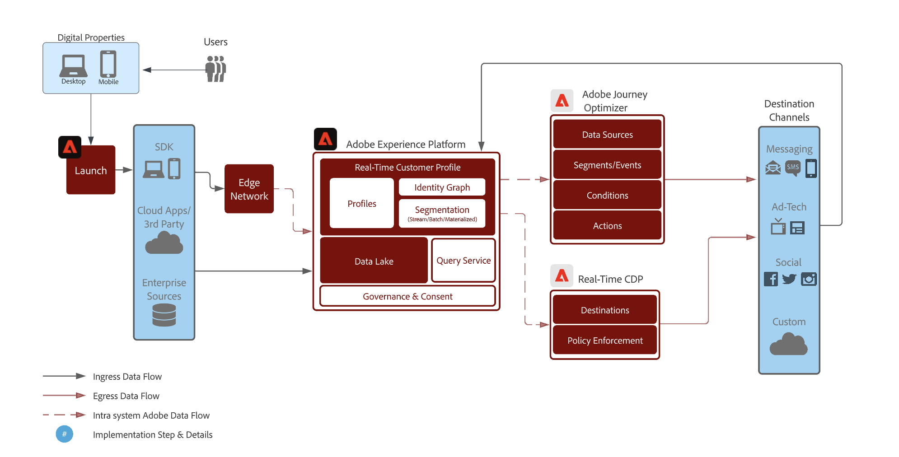

# Vuelva a atraer a sus clientes de forma inteligente para que regresen

>[!NOTE]
>
>Esta es una implementación de muestra y los ejemplos de esta página, como la sintaxis de segmentos, son solo ejemplos. Debe usar los ejemplos como guía, ya que la implementación puede diferir.

Vuelva a atraer a los clientes que han abandonado una conversión de forma inteligente y responsable. Capte a los clientes caducados con experiencias para aumentar la conversión y aumentar el valor de duración del cliente.

Utilice consideraciones en tiempo real, tenga en cuenta todas las cualidades y comportamientos de los consumidores y ofrezca una reclasificación rápida basada en eventos en línea y sin conexión.

## Resumen del caso de uso {#overview}

Construirá esquemas, conjuntos de datos y audiencias a medida que trabaje con ejemplos de escenarios de renovación de participación. También descubrirá las funciones necesarias para configurar los recorridos de ejemplo en [!DNL Adobe Journey Optimizer] y los necesarios para crear anuncios de medios de pago en los destinos. Esta guía utiliza ejemplos de renovación de la participación de los clientes en los recorridos de casos de uso que se describen a continuación:

* **Escenario de exploración de producto abandonado** - Segmente a los clientes que hayan abandonado la navegación por productos tanto en el sitio web como en la aplicación móvil.
* **Escenario de carro abandonado** - Segmente a los clientes que han colocado productos en el carro de compras, pero que aún no han sido comprados tanto en el sitio web como en la aplicación móvil.
* **Escenario de confirmación de pedido** - Centrarse en las compras de productos realizadas a través del sitio web y la aplicación móvil.

## Requisitos previos y planificación {#prerequisites-and-planning}

A medida que complete los pasos para implementar el caso de uso, utilizará las siguientes funcionalidades de Real-Time CDP y Adobe Journey Optimizer (enumeradas en el orden en que las utilizará). Asegúrese de que dispone de los [permisos de control de acceso basados en atributos](/help/access-control/home.md) necesarios para todas estas áreas, o pídale al administrador del sistema que le conceda los permisos necesarios.

* [[!DNL Adobe Real-Time Customer Data Platform (Real-Time CDP)]](https://experienceleague.adobe.com/docs/platform-learn/tutorials/rtcdp/understanding-the-real-time-customer-data-platform.html) : integra datos en todas las fuentes de datos para impulsar la campaña. A continuación, estos datos se utilizan para crear las audiencias de campaña y los elementos de datos personalizados de superficie que se utilizan en los mosaicos de promo de correo electrónico y web (por ejemplo, nombre o información relacionada con la cuenta). El CDP también se utiliza para activar audiencias en el correo electrónico y la web (a través de [!DNL Adobe Target]).
   * [Esquemas](/help/xdm/home.md)
   * [Perfiles](/help/profile/home.md)
   * [Conjuntos de datos](/help/catalog/datasets/overview.md)
   * [Audiencias](/help/segmentation/home.md)
   * [[!DNL Adobe Journey Optimizer]](https://experienceleague.adobe.com/docs/journey-optimizer/using/orchestrate-journeys/journey.html)
   * [Destinos](/help/destinations/home.md)

* [[!DNL Adobe Journey Optimizer]](https://experienceleague.adobe.com/docs/journey-optimizer-learn/tutorials/introduction-to-journey-optimizer/introduction.html?lang=es) : ayuda a ofrecer a sus clientes experiencias conectadas, contextuales y personalizadas.
   * [Evento o Déclencheur de audiencia](https://experienceleague.adobe.com/docs/journey-optimizer/using/offer-decisioning/collect-event-data/data-collection.html)
   * [Audiencias/ Eventos](https://experienceleague.adobe.com/docs/journey-optimizer/using/audiences-profiles-identities/audiences/about-audiences.html?lang=es)
   * [Acciones de recorrido](https://experienceleague.adobe.com/docs/journey-optimizer/using/orchestrate-journeys/journey.html)

## Cómo lograr el caso de uso {#achieve-use-case-instruction}

A continuación se ofrece una descripción general de alto nivel de los tres ejemplos de escenarios de renovación de la participación.

>[!BEGINTABS]

>[!TAB Escenario de exploración de productos abandonados]

El escenario de exploración de productos abandonados se dirige a la exploración de productos abandonados tanto en el sitio web como en la aplicación móvil. Este escenario se activa cuando se ha visto un producto, pero no se ha comprado ni agregado al carro de compras. En este ejemplo, la participación de la marca se activa después de tres días si no hay adiciones de lista en las últimas 24 horas.
{width="1920" zoomable="yes"}

1. Puede crear esquemas y conjuntos de datos y, a continuación, habilitar para [!UICONTROL Perfil].
2. Los datos de ingesta en Experience Platform se realizan mediante SDK web, SDK móvil o API. El conector de datos de Analytics también se puede utilizar, pero puede provocar una latencia de recorrido.
3. Los datos adicionales habilitados para perfiles se introducen y se pueden vincular al visitante autenticado de la aplicación web o móvil mediante gráficos de identidad.
4. Las audiencias se generan centradas en la lista de perfiles para comprobar si **cliente** ha realizado un compromiso en los últimos tres días.
5. Puede crear un recorrido de exploración de producto abandonado en [!DNL Adobe Journey Optimizer].
6. Si es necesario, trabaje con **socio de datos** para la activación de audiencias en destinos de medios de pago deseados.
7. [!DNL Adobe Journey Optimizer] comprueba el consentimiento y envía las distintas acciones configuradas.

>[!TAB Escenario de carro abandonado]

El escenario de carro de compras abandonado se aplica cuando los productos se han colocado en el carro de compras, pero aún no se han comprado tanto en el sitio web como en la aplicación móvil. Además, las campañas de medios de pago se inician y se detienen mediante este método.
{width="1920" zoomable="yes"}

1. Puede crear esquemas y conjuntos de datos y, a continuación, habilitar para [!UICONTROL Perfil].
2. Los datos de ingesta en Experience Platform se realizan mediante SDK web, SDK móvil o API. El conector de datos de Analytics también se puede utilizar, pero puede provocar una latencia de recorrido.
3. Los datos adicionales habilitados para perfiles se introducen y se pueden vincular al visitante autenticado de la aplicación web o móvil mediante gráficos de identidad.
4. Las audiencias se generan centradas en la lista de perfiles para comprobar si **cliente** ha colocado un artículo en su carro de compras, pero no ha completado la compra. El **[!UICONTROL Añadir al carro de compras]** Este evento desencadena un temporizador que espera durante 30 minutos y, a continuación, comprueba la compra. Si no se ha realizado ninguna compra, la variable **cliente** se añade a **[!UICONTROL Abandonar carro]** audiencias.
5. Puede crear un recorrido de carro de compras abandonado en [!DNL Adobe Journey Optimizer].
6. Si es necesario, trabaje con **socio de datos** para la activación de audiencias en destinos de medios de pago deseados.
7. [!DNL Adobe Journey Optimizer] comprueba el consentimiento y envía las distintas acciones configuradas.

>[!TAB Escenario de confirmación de pedido]

El escenario de confirmación de pedido se centra en las compras de productos realizadas a través del sitio web y la aplicación móvil.
{width="1920" zoomable="yes"}

1. Puede crear esquemas y conjuntos de datos y, a continuación, habilitar para [!UICONTROL Perfil].
2. Los datos de ingesta en Experience Platform se realizan mediante SDK web, SDK móvil o API. El conector de datos de Analytics también se puede utilizar, pero puede provocar una latencia de recorrido.
3. Los datos adicionales habilitados para perfiles se introducen y se pueden vincular al visitante autenticado de la aplicación web o móvil mediante gráficos de identidad.
4. Puede crear un recorrido de confirmación en [!DNL Adobe Journey Optimizer].
5. [!DNL Adobe Journey Optimizer] envía un mensaje de confirmación de pedido utilizando el canal preferido.

>[!ENDTABS]

Para completar cada uno de los pasos de la información general de alto nivel anterior, lea las secciones siguientes, que ofrecen vínculos a más información e instrucciones más detalladas.

### Crear esquemas y especificar grupos de campos {#schema-design}

Los recursos del Modelo de datos de experiencia (XDM) se administran en la variable [!UICONTROL Esquemas] workspace en [!DNL Adobe Experience Platform]. Puede ver y explorar los recursos principales proporcionados por [!DNL Adobe] (por ejemplo, grupos de campos) y cree recursos y esquemas personalizados para su organización.

Para obtener más información sobre la creación de [esquemas](/help/xdm/home.md), consulte la [tutorial de creación de esquemas.](/help/xdm/tutorials/create-schema-ui.md) y [Modelar los datos de la experiencia del cliente con XDM](https://experienceleague.adobe.com/docs/courses/using/experienceplatform-d-1-2021-1-xdm.html).

Hay cuatro diseños de esquema que se utilizan para el caso de uso de renovación de la participación. Cada esquema requiere que se configuren campos específicos. Debe habilitar el esquema para que se incluya en el perfil del cliente en tiempo real. Para obtener más información sobre la activación del esquema para su uso en el Perfil del cliente en tiempo real, lea [habilitar un esquema para el perfil del cliente en tiempo real](/help/xdm/ui/resources/schemas.md#enable-a-schema-for-real-time-customer-profile).

#### Esquema de atributos del cliente

Este esquema se utiliza para estructurar y hacer referencia a los datos de perfil que conforman la información de clientes. Estos datos se suelen introducir en [!DNL Adobe Experience Platform] a través de su CRM o sistema similar y es necesario para hacer referencia a los detalles del cliente que se utilizan para la personalización, el consentimiento de marketing y las funciones mejoradas de la audiencia.

El esquema de atributos del cliente se representa mediante una variable [[!UICONTROL Perfil individual de XDM]](/help/xdm/classes/individual-profile.md) , que incluye los siguientes grupos de campos:

+++Datos personales de contacto (grupo de campos)

[Datos personales de contacto](/help/xdm/field-groups/profile/personal-contact-details.md) es un grupo de campos de esquema estándar para la clase de perfil individual de XDM que describe la información de contacto de una persona individual.

| Campos | Requisito | Descripción |
| --- | --- | --- |
| `mobilePhone.number` | Requerido | Número de teléfono móvil de la persona, que se utilizará para los SMS. |
| `personalEmail.address` | Requerido | La dirección de correo electrónico de la persona. |

+++

+++Detalles de auditoría del sistema de origen externo (grupo de campos)

[Atributos de auditoría del sistema de origen externo](/help/xdm/data-types/external-source-system-audit-attributes.md) es un tipo de datos estándar del Modelo de datos de experiencia (XDM) que captura detalles de auditoría sobre un sistema de origen externo.

+++

+++Grupos de campos de consentimiento y preferencia (grupo de campos)

El [Consentimientos y preferencias](/help/xdm/field-groups//profile/consents.md) grupo de campos proporciona un único campo de tipo de objeto, consentimientos, para capturar información de consentimiento y preferencia.

| Campos | Requisito |
| --- | --- |
| `consents.marketing.email.val` | Requerido |
| `consents.marketing.preferred` | Requerido |
| `consents.marketing.push.val` | Requerido |
| `consents.marketing.sms.val` | Requerido |
| `consents.personalize.content.val` | Requerido |
| `consents.share.val` | Requerido |

+++

+++Detalles de prueba de perfil (grupo de campos)

Este grupo de campos se utiliza como práctica recomendada.

+++

#### Esquema de transacciones digitales del cliente

Este esquema se utiliza para estructurar y hacer referencia a los datos de evento que componen la actividad del cliente que se produce en el sitio web o en las plataformas digitales asociadas. Estos datos se suelen introducir en [!DNL Adobe Experience Platform] mediante [SDK web](/help/edge/home.md) y son necesarios para hacer referencia a los distintos eventos de exploración y conversión que se utilizan para activar recorridos, análisis de clientes en línea detallados y funciones de audiencia mejoradas.

El esquema de transacciones digitales del cliente se representa mediante una [[!UICONTROL ExperienceEvent de XDM]](/help/xdm/classes/experienceevent.md) clase.

+++ExperienceEvent de XDM (clase)

El [[!UICONTROL ExperienceEvent de XDM]](/help/xdm/classes/experienceevent.md) La clase incluye los siguientes grupos de campos:

| Campos | Requisito | Descripción |
| --- | --- | --- |
| `_id` | Requerido | Identifica de forma exclusiva los eventos individuales que se incorporan en [!DNL Adobe Experience Platform]. |
| `timestamp` | Requerido | Una marca de tiempo ISO 8601 de cuándo se produjo el evento, con formato según RFC 3339, sección 5.6. Esta marca de tiempo debe pertenecer al pasado. |
| `eventType` | Requerido | Cadena que indica el tipo de categoría del evento. |

+++

+++Detalles del ID del usuario final (grupo de campos)

El [Detalles del ID del usuario final](/help/xdm/field-groups/event/enduserids.md) grupo de campos se utiliza para describir la información de identidad de un individuo en varias aplicaciones de Adobe.

| Campos | Requisito | Descripción |
| --- | --- | --- |
| `endUserIDs._experience.emailid.authenticatedState` | Requerido | Estado autenticado de ID de dirección de correo electrónico del usuario final. |
| `endUserIDs._experience.emailid.id` | Requerido | ID de dirección de correo electrónico del usuario final. |
| `endUserIDs._experience.emailid.namespace.code` | Requerido | Código de área de nombres de ID de dirección de correo electrónico del usuario final. |
| `endUserIDs._experience.mcid.authenticatedState` | Requerido | [!DNL Adobe] Estado autenticado de ID de Marketing Cloud (ECID). El MCID ahora se conoce como ID de Experience Cloud (ECID). |
| `endUserIDs._experience.mcid.id` | Requerido | [!DNL Adobe] ID DE Marketing Cloud (MCID). El MCID ahora se conoce como ID de Experience Cloud (ECID). |
| `endUserIDs._experience.mcid.namespace.code` | Requerido | [!DNL Adobe] Código del área de nombres de ID de Marketing Cloud (MCID). |

+++

+++Detalles de auditoría del sistema de origen externo (grupo de campos)

Los atributos de auditoría del sistema de origen externo son un tipo de datos estándar del Modelo de datos de experiencia (XDM) que captura detalles de auditoría sobre un sistema de origen externo.

+++

#### Esquema de transacciones sin conexión del cliente

Este esquema se utiliza para estructurar y hacer referencia a los datos de evento que conforman la actividad de cliente que se produce en plataformas fuera del sitio web. Estos datos se suelen introducir en [!DNL Adobe Experience Platform] desde un POS (o sistema similar) y, con mayor frecuencia, se transmite a Platform a través de una conexión API. Su propósito es hacer referencia a los distintos eventos de conversión sin conexión que se utilizan para activar recorridos, análisis de clientes en línea y sin conexión profundos y funciones de audiencia mejoradas.

El esquema de transacciones sin conexión del cliente se representa mediante una [[!UICONTROL ExperienceEvent de XDM]](/help/xdm/classes/experienceevent.md) clase.

+++ExperienceEvent de XDM (clase)

El [[!UICONTROL ExperienceEvent de XDM]](/help/xdm/classes/experienceevent.md) La clase incluye los siguientes grupos de campos:

| Campos | Requisito | Descripción |
| --- | --- | --- |
| `_id` | Requerido | Identifica de forma exclusiva los eventos individuales que se incorporan en [!DNL Adobe Experience Platform]. |
| `timestamp` | Requerido | Una marca de tiempo ISO 8601 de cuándo se produjo el evento, con formato según RFC 3339, sección 5.6. Esta marca de tiempo debe pertenecer al pasado. |
| `eventType` | Requerido | Cadena que indica el tipo de categoría del evento. |

+++

+++Detalles de comercio (grupo de campos)

El [Detalles de comercio](/help/xdm/field-groups/event/commerce-details.md) El grupo de campos se utiliza para describir datos de comercio, como información del producto (SKU, nombre y cantidad) y operaciones estándar del carro de compras (pedidos, pagos y abandonos).

| Campos | Requisito | Descripción |
| --- | --- | --- |
| `commerce.cart.cartID` | Requerido | ID del carro de compras. |
| `commerce.order.orderType` | Requerido | Un objeto que describe el tipo de pedido del producto. |
| `commerce.order.payments.paymentAmount` | Requerido | Un objeto que describe el importe de pago del pedido del producto. |
| `commerce.order.payments.paymentType` | Requerido | Un objeto que describe el tipo de pago de pedido de producto. |
| `commerce.order.payments.transactionID` | Requerido | Un ID de transacción de pedido de producto de objeto. |
| `commerce.order.purchaseID` | Requerido | ID de compra de pedido de producto de objeto. |
| `productListItems.name` | Requerido | Una lista de nombres de artículos que representa los productos seleccionados por un cliente. |
| `productListItems.priceTotal` | Requerido | El precio total de la lista de artículos que representan los productos seleccionados por un cliente. |
| `productListItems.product` | Requerido | El producto o los productos seleccionados. |
| `productListItems.quantity` | Requerido | La cantidad de artículos que representan los productos seleccionados por un cliente. |

+++

+++Datos personales de contacto (grupo de campos)

[Datos personales de contacto](/help/xdm/field-groups/profile/personal-contact-details.md) es un grupo de campos de esquema estándar para la clase de perfil individual de XDM que describe la información de contacto de una persona individual.

| Campos | Requisito | Descripción |
| --- | --- | --- |
| `mobilePhone.number` | Requerido | Número de teléfono móvil de la persona, que se utilizará para los SMS. |
| `personalEmail.address` | Requerido | La dirección de correo electrónico de la persona. |

+++

+++Detalles de auditoría del sistema de origen externo (grupo de campos)

Los atributos de auditoría del sistema de origen externo son un tipo de datos estándar del Modelo de datos de experiencia (XDM) que captura detalles de auditoría sobre un sistema de origen externo.

+++

#### esquema del conector web de Adobe

>[!NOTE]
>
>Esta es una implementación opcional si utiliza [[!DNL Adobe Analytics Source Connector]](/help/sources/connectors/adobe-applications/analytics.md).

Este esquema se utiliza para estructurar y hacer referencia a los datos de evento que componen la actividad del cliente que se produce en el sitio web o en las plataformas digitales asociadas. Este esquema es similar al esquema de transacciones digitales del cliente, pero difiere en que está pensado para utilizarse cuando [SDK web](/help/edge/home.md) no es una opción para la recopilación de datos; por lo tanto, este esquema es necesario cuando se utiliza el [!DNL Adobe Analytics Source Connector] para enviar los datos en línea a [!DNL Adobe Experience Platform] como conjunto de datos principal o secundario.

El [!DNL Adobe] el esquema del conector web se representa mediante una variable [[!UICONTROL ExperienceEvent de XDM]](/help/xdm/classes/experienceevent.md) clase.

+++ExperienceEvent de XDM (clase)

El [[!UICONTROL ExperienceEvent de XDM]](/help/xdm/classes/experienceevent.md) La clase incluye los siguientes grupos de campos:

| Campos | Requisito | Descripción |
| --- | --- | --- |
| `_id` | Requerido | Identifica de forma exclusiva los eventos individuales que se incorporan en [!DNL Adobe Experience Platform]. |
| `timestamp` | Requerido | Una marca de tiempo ISO 8601 de cuándo se produjo el evento, con formato según RFC 3339, sección 5.6. Esta marca de tiempo debe pertenecer al pasado. |
| `eventType` | Requerido | Cadena que indica el tipo de categoría del evento. |

+++

Plantilla de ExperienceEvent de +++Adobe Analytics (grupo de campos)

El [Adobe Analytics ExperienceEvent](/help/xdm/field-groups/event/analytics-full-extension.md) grupo de campos captura métricas comunes recopiladas por Adobe Analytics.

| Campos | Requisito | Descripción |
| --- | --- | --- |
| `endUserIDs._experience.emailid.authenticatedState` | Requerido | Estado autenticado de ID de dirección de correo electrónico del usuario final. |
| `endUserIDs._experience.emailid.id` | Requerido | ID de dirección de correo electrónico del usuario final. |
| `endUserIDs._experience.emailid.namespace.code` | Requerido | Código de área de nombres de ID de dirección de correo electrónico del usuario final. |
| `endUserIDs._experience.mcid.authenticatedState` | Requerido | [!DNL Adobe] Estado autenticado de ID de Marketing Cloud (ECID). El MCID ahora se conoce como ID de Experience Cloud (ECID). |
| `endUserIDs._experience.mcid.id` | Requerido | [!DNL Adobe] ID DE Marketing Cloud (MCID). El MCID ahora se conoce como ID de Experience Cloud (ECID). |
| `endUserIDs._experience.mcid.namespace.code` | Requerido | [!DNL Adobe] Código del área de nombres de ID de Marketing Cloud (MCID). |

+++

+++Detalles de auditoría del sistema de origen externo (grupo de campos)

Los atributos de auditoría del sistema de origen externo son un tipo de datos estándar del Modelo de datos de experiencia (XDM) que captura detalles de auditoría sobre un sistema de origen externo.

+++

### Creación de un conjunto de datos a partir de un esquema {#create-datasets}

Un conjunto de datos es una estructura de almacenamiento y administración para un grupo de datos. Cada esquema para escenarios inteligentes de renovación de la participación debe tener su propio conjunto de datos.

Para obtener más información sobre cómo crear un [conjunto de datos](/help/catalog/datasets/overview.md) desde un esquema, lea la [Guía de IU de conjuntos de datos](/help/catalog/datasets/user-guide.md).

>[!NOTE]
>
>Similar al paso para crear un esquema, debe habilitar el conjunto de datos para que se incluya en el Perfil del cliente en tiempo real. Para obtener más información sobre la activación del conjunto de datos para su uso en el Perfil del cliente en tiempo real, consulte el tutorial sobre [Introducción de datos en el Perfil del cliente en tiempo real](https://experienceleague.adobe.com/docs/platform-learn/tutorials/profiles/bring-data-into-the-real-time-customer-profile.html?lang=es).

### Consentimiento y control de datos {#privacy-consent}

>[!IMPORTANT]
>
>Proporcionar a los clientes la capacidad de cancelar la suscripción a la recepción de comunicaciones de una marca, así como garantizar que se cumpla esta opción, es un requisito legal. Obtenga más información acerca de la legislación aplicable en la [Resumen de normas de privacidad](https://experienceleague.adobe.com/docs/experience-platform/privacy/regulations/overview.html).

#### Políticas de consentimiento

Al crear una ruta de renovación de la participación, considere la posibilidad de añadir lo siguiente [directivas de consentimiento](https://experienceleague.adobe.com/docs/platform-learn/data-collection/web-sdk/consent/overview.html):

* If `consents.marketing.email.val = "Y"` entonces Puede enviar por correo electrónico
* If `consents.marketing.sms.val = "Y"` entonces Puede SMS
* If `consents.marketing.push.val = "Y"` entonces Puede insertar
* If `consents.share.val = "Y"` Entonces puede anunciarse

#### Etiquetado y aplicación de gobernanza de datos

Al crear una ruta de renovación de la participación, considere la posibilidad de añadir lo siguiente [Etiquetas de gobernanza de datos](/help/data-governance/labels/overview.md):

* Las direcciones de correo electrónico personales se utilizan como datos de identificación directa que se utilizan para identificar a una persona específica o ponerse en contacto con ella, en lugar de con un dispositivo.
   * `personalEmail.address = I1`

#### Políticas de uso de datos

No hay ninguna [políticas de uso de datos](/help/data-governance/policies/overview.md) necesario para el escenario de exploración de productos abandonados. Sin embargo, debe tener en cuenta lo siguiente:

* Restringir datos confidenciales
* Restringir publicidad in situ
* Restringir direccionamiento de correo electrónico
* Restringir la segmentación entre sitios
* Restringir la combinación de datos directamente identificables con datos anónimos

### Crear audiencias {#create-audience}

Los escenarios de renovación de participación utilizan audiencias para definir atributos o comportamientos específicos compartidos por un subconjunto de perfiles del almacén de perfiles para distinguir un grupo comercializable de personas de la base de clientes. Las audiencias se pueden crear de varias formas en [!DNL Adobe Experience Platform].

Para obtener más información sobre cómo crear una audiencia, lea la [guía de IU de audience service](https://experienceleague.adobe.com/docs/experience-platform/segmentation/ui/overview.html#create-audience).

Para obtener más información sobre cómo componer directamente [Audiencias](/help/segmentation/home.md), lea la [Guía de IU de composición de audiencia](/help/segmentation/ui/audience-composition.md).

Para obtener más información sobre cómo crear audiencias a través de definiciones de audiencias derivadas de Platform, lea la [Guía de IU de Audience Builder](/help/segmentation/ui/segment-builder.md).

>[!BEGINTABS]

>[!TAB Escenario de exploración de productos abandonados]

Esta audiencia se crea como una mejora del escenario clásico &quot;Abandono del carro de compras&quot;. Mientras que el abandono del carro de compras generalmente se centra en la adición de un carro de compras sin una compra posterior en un período de tiempo determinado, esta audiencia busca una participación anterior, específicamente aquellos que pueden haber explorado un producto en particular, pero no lo agregaron al carro de compras y no tuvieron actividad de seguimiento en el sitio dentro de un marco de tiempo determinado. Esta audiencia le ayuda a mantener su marca &quot;en la mente&quot; de los clientes que cumplen con estos criterios de inclusión y también se puede aprovechar para clientes cuyas propiedades digitales pueden diferir de un modelo de comercio electrónico tradicional.

+++Vista de producto abandonado sin participación en los últimos tres días

El siguiente evento se utiliza para el escenario de exploración de productos abandonados en el que los usuarios vieron los productos en línea y no interactuaron (visitas al sitio, visitas a la aplicación, compras en línea, compras sin conexión y eventos de adición al carro de compras) en los 3 días siguientes.

Se requieren los campos y las condiciones siguientes al configurar esta audiencia:

* `eventType: commerce.productViews`
* Y `THEN` (evento secuencial) excluir `eventType: commerce.procuctListAdds` o `application.launch` o `web.webpagedetails.pageViews` o `commerce.purchases` (esto incluye tanto en línea como sin conexión)
   * `Timestamp: > 3 days after productView`

+++

+++Vista del producto con participación en los últimos tres días

El siguiente evento se utiliza en el escenario de navegación de productos abandonados en el que los usuarios vieron los productos en línea y participaron (visitas al sitio, visitas a la aplicación, compras en línea, compras sin conexión y eventos de adición al carro de compras) en los 3 días siguientes.

Se requieren los campos y las condiciones siguientes al configurar esta audiencia:

* `eventType: commerce.productViews`
* Y `THEN` (evento secuencial) incluir `eventType: commerce.procuctListAdds` o `application.launch` o `web.webpagedetails.pageViews` o `commerce.purchases` (esto incluye tanto en línea como sin conexión)
   * `Timestamp: > 3 days after productView`

+++Flujo de participación en el último día

El siguiente evento se utiliza para el escenario de exploración de productos abandonados en el que los usuarios han participado (visitas al sitio, visitas a la aplicación, compras en línea, compras sin conexión y eventos de agregar al carro de compras) en el último día.

Se requieren los campos y las condiciones siguientes al configurar esta audiencia:

* `eventType: commerce.procuctListAdds or application.launch or web.webpagedetails.pageViews or commerce.purchases`
   * `Timestamp: in last 1 day` (Transmisión)

+++

+++Lote de participación en los últimos tres días

El siguiente evento se utiliza para el escenario de exploración de productos abandonados en el que los usuarios han participado (visitas al sitio, visitas a la aplicación, compras en línea, compras sin conexión y eventos de agregar al carro de compras) en los últimos 3 días.

Se requieren los campos y las condiciones siguientes al configurar esta audiencia:

* `EventType: commerce.procuctListAdds or application.launch or web.webpagedetails.pageViews or commerce.purchases`
   * `Timestamp: in last 3 days` (Lote)

+++

>[!TAB Escenario de carro abandonado]

Esta audiencia se crea para admitir el escenario clásico &quot;Abandono del carro de compras&quot;. Su propósito es encontrar clientes que agregaron un producto al carro de compras, pero que finalmente no siguieron con una compra. Esta audiencia ayudará a mantener no solo su marca &quot;en mente&quot; para sus clientes, sino también los productos que dejaron atrás sin una compra posterior.

Los siguientes eventos se utilizan en el escenario de carro de compras abandonado, en el que los usuarios agregaron un producto al carro de compras hace entre 1 y 4 días, pero no completaron la compra ni borraron el carro de compras.

Se requieren los campos y las condiciones siguientes al configurar esta audiencia:

* `eventType: commerce.productListAdds`
   * `Timestamp: >= 1 days before now and <= 4 days before now `
* `eventType: commerce.purchases`
   * `Timestamp: <= 4 days before now`
* `eventType: commerce.productListRemovals`
   * `Timestamp: <= 4 days before now`

El descriptor para el escenario de carro de compras abandonado aparece de la siguiente manera:

`Include eventType = commerce.productListAdds between 30 min and 1440 minutes before now. exclude eventType = commerce.purchases 30 minutes before now OR eventType = commerce.productListRemovals AND Cart ID equals Product List Adds1 Cart ID (the inclusion event).`

>[!TAB Escenario de confirmación de pedido]

Este recorrido no requiere que se creen audiencias.

>[!ENDTABS]

### Configuración del recorrido en Adobe Journey Optimizer {#journey-setup}

>[!NOTE]
>
>[!DNL Adobe Journey Optimizer] no abarca todo lo que se muestra en los diagramas. Todo [anuncios de medios de pago](/help/destinations/catalog/social/overview.md) se crean en [!UICONTROL Destinos].

[[!DNL Adobe Journey Optimizer]](https://experienceleague.adobe.com/docs/journey-optimizer/using/orchestrate-journeys/journey.html) le ayuda a ofrecer experiencias conectadas, contextuales y personalizadas a sus clientes. El recorrido del cliente es todo el proceso de interacción de un cliente con la marca. Cada recorrido de caso de uso requiere información específica. A continuación se enumeran los datos precisos necesarios para cada recorrido.

>[!BEGINTABS]

>[!TAB Escenario de exploración de productos abandonados]

El escenario de exploración de productos abandonados se dirige a la exploración de productos abandonados tanto en el sitio web como en la aplicación móvil.
{width="1920" zoomable="yes"}

+++Eventos

* Evento 1: Vistas del producto
   * Esquema: Transacciones digitales del cliente
   * Campos:
      * `eventType`
   * Condición:
      * `eventType = commerce.productViews`
      * Campos:
         * `commerce.productViews.id`
         * `commerce.productViews.value`
         * `eventType`
         * `identityMap.authenticatedState`
         * `identityMap.id`
         * `identityMap.primary`
         * `productListItems.SKU`
         * `productListItems.currencyCode`
         * `productListItems.name`
         * `productListItems.priceTotal`
         * `productListItems.product`
         * `productListItems.productImageUrl`
         * `productListItems.quantity`
         * `timestamp`
         * `endUserIDs._experience.emailid.authenticatedState`
         * `endUserIDs._experience.emailid.id`
         * `endUserIDs._experience.emailid.namespace.code`
         * `_id`

* Evento 2: Agregar al carro
   * Esquema: Transacciones digitales del cliente
   * Campos:
      * `eventType`
   * Condición:
      * `eventType = commerce.productListAdds`
      * Campos:
         * `commerce.productListAdds.id`
         * `commerce.productListAdds.value`
         * `eventType`
         * `identityMap.authenticatedState`
         * `identityMap.id`
         * `identityMap.primary`
         * `productListItems.SKU`
         * `productListItems.currencyCode`
         * `productListItems.name`
         * `productListItems.priceTotal`
         * `productListItems.product`
         * `productListItems.productImageUrl`
         * `productListItems.quantity`
         * `timestamp`
         * `commerce.cart.cartID`
         * `endUserIDs._experience.emailid.authenticatedState`
         * `endUserIDs._experience.emailid.id`
         * `endUserIDs._experience.emailid.namespace.code`
         * `_id`

* Evento 3: Compromiso de marca
   * Esquema: Transacciones digitales del cliente
   * Campos:
      * `eventType`
   * Condición:
      * `eventType in application.launch, commerce.purchases, web.webpagedetails.pageViews`
      * Campos:
         * `eventType`
         * `identityMap.authenticatedState`
         * `identityMap.id`
         * `identityMap.primary`
         * `productListItems.SKU`
         * `productListItems.currencyCode`
         * `productListItems.name`
         * `productListItems.priceTotal`
         * `productListItems.product`
         * `productListItems.productImageUrl`
         * `productListItems.quantity`
         * `timestamp`
         * `web.webpagedetails.URL`
         * `web.webpagedetails.isHomePage`
         * `web.webpagedetails.name`
         * `endUserIDs._experience.emailid.authenticatedState`
         * `endUserIDs._experience.emailid.id`
         * `endUserIDs._experience.emailid.namespace.code`
         * `_id`
         * `commerce.purchases.id`
         * `commerce.purchases.value`
         * `shipping.address.city`
         * `shipping.address.countryCode`
         * `shipping.address.postalCode`
         * `shipping.address.state`
         * `shipping.address.street1`
         * `shipping.address.street2`
         * `shipping.shipDate`
         * `shipping.trackingNumber`
         * `shipping.trackingURL`

+++

+++Lógica de Recorrido de claves

* Lógica de entrada de recorrido
   * Evento de vista de producto

* Condiciones
   * Compruebe si hay al menos un evento de compra en línea o sin conexión desde la última vez que se vio el producto.
      * Esquema: Transacciones digitales del cliente
      * `eventType = commerce.purchases`
      * `timestamp > timestamp of product last viewed`

   * Compruebe si hay al menos una compra sin conexión desde la última vez que vio el producto:
      * Esquema: Transacciones sin conexión del cliente
      * `eventType = commerce.purchases`
      * `timestamp > timestamp of product last viewed`

   * Condiciones: Seleccione el canal de Target
      * Correo electrónico
         * `consents.marketing.email.val = y`
      * Push
         * `consents.marketing.push.val=y`
      * SMS
         * `consents.marketing.sms.val = y`

   * Personalización de canal
      * Contenido de canal personalizado basado en la vista del producto.

+++

>[!TAB Escenario de carro abandonado]

El escenario de carro de compras abandonado se dirige a productos que se han colocado en el carro de compras, pero que aún no se han comprado tanto en el sitio web como en la aplicación móvil.
{width="1920" zoomable="yes"}

+++Eventos

* Evento 2: Agregar al carro
   * Esquema: Transacciones digitales del cliente
   * Campos:
      * `eventType`
   * Condición:
      * `eventType = commerce.productListAdds`
      * Campos:
         * `commerce.productListAdds.id`
         * `commerce.productListAdds.value`
         * `eventType`
         * `identityMap.authenticatedState`
         * `identityMap.id`
         * `identityMap.primary`
         * `productListItems.SKU`
         * `productListItems.currencyCode`
         * `productListItems.name`
         * `productListItems.priceTotal`
         * `productListItems.product`
         * `productListItems.productImageUrl`
         * `productListItems.quantity`
         * `timestamp`
         * `commerce.cart.cartID`
         * `endUserIDs._experience.emailid.authenticatedState`
         * `endUserIDs._experience.emailid.id`
         * `endUserIDs._experience.emailid.namespace.code`
         * `_id`

* Evento 4: Compras en línea
   * Esquema: Transacciones digitales del cliente
   * Campos:
      * `eventType`
   * Condición:
      * `eventType = commerce.purchases`
      * Campos:
         * `commerce.purchases.id`
         * `commerce.purchases.value`
         * `eventType`
         * `identityMap.authenticatedState`
         * `identityMap.id`
         * `identityMap.primary`
         * `productListItems.SKU`
         * `productListItems.currencyCode`
         * `productListItems.name`
         * `productListItems.priceTotal`
         * `productListItems.product`
         * `productListItems.productImageUrl`
         * `productListItems.quantity`
         * `timestamp`
         * `endUserIDs._experience.emailid.authenticatedState`
         * `endUserIDs._experience.emailid.id`
         * `endUserIDs._experience.emailid.namespace.code`
         * `_id`

* Evento 3: Compromiso de marca
   * Esquema: Transacciones digitales del cliente
   * Campos:
      * `eventType`
   * Condición:
      * `eventType in application.launch, commerce.purchases, web.webpagedetails.pageViews`
      * Campos:
         * `eventType`
         * `identityMap.authenticatedState`
         * `identityMap.id`
         * `identityMap.primary`
         * `productListItems.SKU`
         * `productListItems.currencyCode`
         * `productListItems.name`
         * `productListItems.priceTotal`
         * `productListItems.product`
         * `productListItems.productImageUrl`
         * `productListItems.quantity`
         * `timestamp`
         * `web.webpagedetails.URL`
         * `web.webpagedetails.isHomePage`
         * `web.webpagedetails.name`
         * `endUserIDs._experience.emailid.authenticatedState`
         * `endUserIDs._experience.emailid.id`
         * `endUserIDs._experience.emailid.namespace.code`
         * `_id`
         * `commerce.purchases.id`
         * `commerce.purchases.value`
         * `shipping.address.city`
         * `shipping.address.countryCode`
         * `shipping.address.postalCode`
         * `shipping.address.state`
         * `shipping.address.street1`
         * `shipping.address.street2`
         * `shipping.shipDate`
         * `shipping.trackingNumber`
         * `shipping.trackingURL`

+++

+++Lógica de Recorrido de claves

* Lógica de entrada de recorrido
   * `AddToCart` Evento

* AuthenticatedState en autenticado

* Condición: compras sin conexión desde que se abandonó el carro por última vez:
   * Esquema: Transacciones sin conexión del cliente
   * `eventType = commerce.purchases`
   * `timestamp > timestamp of cart was last abandoned`

* Condición: carro de compras borrado desde la última vez que se abandonó:
   * Esquema: Transacciones digitales del cliente
   * `eventType = commerce.cartCleared`
   * `cartID` (ID del carro de compras)
   * `timestamp > timestamp of cart was last abandoned`

* Seleccionar canal de destino (seleccione uno o varios canales para ampliar el alcance)
   * Correo electrónico
      * `consents.marketing.email.val = y`
   * Push
      * `consents.marketing.push.val = y`
   * SMS
      * `consents.marketing.sms.val = y`
   * Personalización de canal
      * Muestra información detallada del carro de compras y puede mostrar varios productos en formato de tabla.

+++

>[!TAB Escenario de confirmación de pedido]

El escenario de confirmación de pedido se centra en las compras de productos realizadas a través del sitio web y la aplicación móvil.
{width="1920" zoomable="yes"}

+++Eventos

* Evento 4: Compras en línea
   * Esquema: Transacciones digitales del cliente
   * Campos:
      * `eventType`
   * Condición:
      * `eventType = commerce.purchases`
      * Campos:
         * `commerce.purchases.id`
         * `commerce.purchases.value`
         * `eventType`
         * `identityMap.authenticatedState`
         * `identityMap.id`
         * `identityMap.primary`
         * `productListItems.SKU`
         * `productListItems.currencyCode`
         * `productListItems.name`
         * `productListItems.priceTotal`
         * `productListItems.product`
         * `productListItems.productImageUrl`
         * `productListItems.quantity`
         * `timestamp`
         * `endUserIDs._experience.emailid.authenticatedState`
         * `endUserIDs._experience.emailid.id`
         * `endUserIDs._experience.emailid.namespace.code`
         * `_id`

+++

+++Lógica de Recorrido de claves

* Lógica de entrada de recorrido
   * Evento de pedido

* Condiciones
   * Seleccionar canal de destino (seleccione uno o varios canales para ampliar el alcance).
      * La confirmación de pedido se considera una prestación por naturaleza, por lo que la comprobación del consentimiento suele ser innecesaria.
      * Correo electrónico
      * Push
      * SMS

   * Personalización del contenido del canal
      * Muestra información detallada del pedido y puede mostrar una lista de productos con un formato de tabla.

+++

>[!ENDTABS]

Para obtener más información sobre la creación de recorridos en [!DNL Adobe Journey Optimizer], lea la [Guía de introducción a recorrido](https://experienceleague.adobe.com/docs/journey-optimizer/using/orchestrate-journeys/journey.html).

### Configuración de anuncios de medios de pago en destinos {#paid-media-ads}

El marco de destinos se utiliza para anuncios de medios de pago. Una vez comprobado el consentimiento, se envía a los distintos destinos configurados. Para obtener más información sobre los destinos, lea la [Resumen de destinos](/help/destinations/home.md) documento.

#### Datos necesarios para los destinos

Los destinos de exportación de audiencias de streaming (como Facebook, Google Customer Match o Google DV360) admiten varias identidades a partir de los datos del cliente:

* `personalEmail.address`
* `ECID`
* `mobilePhone.number`

la audiencia del carro de compras abandonado se evalúa como una audiencia de streaming y, por lo tanto, el marco de trabajo de destinos puede utilizarla para este caso de uso.

* Transmisión/Activado
   * [Publicidad](/help/destinations/catalog/advertising/overview.md)/[Medios de pago y medios sociales](/help/destinations/catalog/social/overview.md)
   * [Dispositivo móvil](/help/destinations/catalog/mobile-engagement/overview.md)
   * [Destino de streaming](/help/destinations/catalog/streaming/http-destination.md)
   * [Destino personalizado creado mediante Destination SDK.](/help/destinations/destination-sdk/overview.md). Si es cliente de Real-Time CDP Ultimate, también puede crear un [destino personalizado con Destination SDK](/help/destinations/destination-sdk/overview.md#productized-and-custom-integrations)
