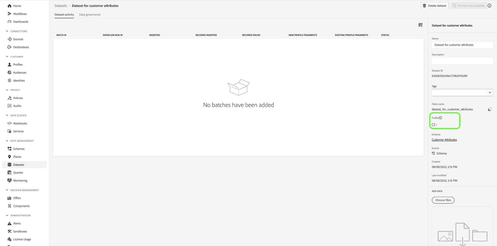

# Vuelva a atraer a sus clientes de forma inteligente para que regresen

La renovación inteligente de la participación le permite configurar una campaña de goteo a medida y en canales múltiples para persuadir a los clientes de realizar una acción en particular. La campaña de inserción está diseñada para funcionar durante una cantidad de tiempo limitada que incluye el envío de correos electrónicos, SMS y anuncios pagados de los clientes que han mostrado intención. Una vez que el cliente haya tomado la acción adecuada, la campaña de nudge finalizará de inmediato.

## Requisitos previos y planificación {#prerequisites-and-planning}

A medida que complete los pasos para implementar el caso de uso, utilizará las siguientes funciones y elementos de la interfaz de usuario de Real-Time CDP (enumerados en el orden en que los usará). Asegúrese de que dispone de los permisos de control de acceso basados en atributos necesarios para todas estas áreas o pídale al administrador del sistema que le conceda los permisos necesarios.

* [Adobe Real-time Customer Data Platform (Real-Time CDP)](https://experienceleague.adobe.com/docs/platform-learn/tutorials/rtcdp/understanding-the-real-time-customer-data-platform.html) : Agrega datos entre fuentes de datos para impulsar la campaña. Estos datos se utilizan para crear las audiencias de campaña y los elementos de datos personalizados utilizados en los mosaicos de promoción de correo electrónico y web (por ejemplo, nombre o información relacionada con la cuenta). El CDP también se utiliza para activar las audiencias en el correo electrónico y la web (a través de Adobe Target).
   * [Esquemas](/help/xdm/home.md)
   * [Perfiles](/help/profile/home.md)
   * [Audiencias](/help/segmentation/home.md)
* [Adobe Journey Optimizer](https://experienceleague.adobe.com/docs/journey-optimizer/using/orchestrate-journeys/journey.html)
   * [Evento o Déclencheur de audiencia](https://experienceleague.adobe.com/docs/journey-optimizer/using/offer-decisioning/collect-event-data/data-collection.html)
   * [Audiencias/ Eventos](https://experienceleague.adobe.com/docs/journey-optimizer/using/audiences-profiles-identities/audiences/about-audiences.html)
   * [Acciones de recorrido](https://experienceleague.adobe.com/docs/journey-optimizer/using/orchestrate-journeys/journey.html)

### Cómo lograr el caso de uso: información general de alto nivel {#achieve-the-use-case-high-level}

Se han creado tres recorridos de renovación de la participación.

>[!BEGINTABS]

>[!TAB Recorrido de renovación de participación]

El recorrido de renovación de la participación se dirige a los exploradores de productos abandonados tanto en el sitio web como en la aplicación. Este recorrido se activa cuando se ha visto un producto sin producto comprado ni añadido al carro de compras. La participación de la marca se activa después de tres días si no hay adiciones de lista en las últimas 24 horas.

1. Los datos se agregan a la ingesta de SDK web/SDK móvil/API de red perimetral mediante la red perimetral (método preferido).
2. As a **cliente**, puede crear conjuntos de datos marcados para [!UICONTROL Perfil].
3. As a **cliente**, los perfiles se cargan en Real-Time CDP y se crean políticas de gobernanza para garantizar un uso responsable.
4. As a **cliente**, las audiencias se crean a partir de la lista de perfiles para comprobar si **usuario** ha realizado un compromiso de marca en los últimos tres días.
5. As a **cliente**, creará un recorrido de renovación de la participación en Adobe Journey Optimizer.
6. Si es necesario, trabaje con **socio de datos** para la activación de audiencias en destinos de medios de pago deseados.
7. Adobe Journey Optimizer comprueba el consentimiento y envía las distintas acciones configuradas.

>[!TAB Recorrido de carro abandonado]

Este recorrido se dirige a los productos que se han colocado en el carro de compras, pero que no se han comprado en el sitio web ni en la aplicación. Se utiliza para iniciar y detener campañas de medios de pago

1. Los datos se agregan a la ingesta de SDK web/SDK móvil/API de red perimetral mediante la red perimetral (método preferido).
2. As a **cliente**, puede crear conjuntos de datos marcados para [!UICONTROL Perfil].
3. As a **cliente**, los perfiles se cargan en Real-Time CDP y se crean políticas de gobernanza para garantizar un uso responsable.
4. As a **cliente**, las audiencias se crean a partir de la lista de perfiles para comprobar si **usuario** ha colocado un artículo en su carro de compras, pero no ha completado la compra. El **[!UICONTROL Añadir al carro de compras]** Este evento desencadena un temporizador que espera durante 30 minutos y, a continuación, comprueba la compra. Si no se ha realizado ninguna compra, la variable **usuario** se añade a **[!UICONTROL Abandonar carro]** audiencias.
5. As a **cliente**, creará un recorrido de carro de compras abandonado en Adobe Journey Optimizer
6. Si es necesario, trabaje con **socio de datos** para la activación de audiencias en destinos de medios de pago deseados.
7. Adobe Journey Optimizer comprueba el consentimiento y envía las distintas acciones configuradas.

>[!TAB Recorrido de confirmación de pedido]

Este recorrido se dirige a las compras de productos tanto en el sitio web como en la aplicación.

1. Los datos se agregan a la ingesta de SDK web/SDK móvil/API de red perimetral mediante la red perimetral (método preferido).
2. As a **cliente**, puede crear conjuntos de datos marcados para [!UICONTROL Perfil].
3. As a **cliente**, los perfiles se cargan en Real-Time CDP y se crean políticas de gobernanza para garantizar un uso responsable.
4. As a **cliente**, las audiencias se crean a partir de la lista de perfiles para comprobar si **usuario** ha realizado una compra.
5. As a **cliente**, creará un recorrido de confirmación en Adobe Journey Optimizer.
6. Adobe Journey Optimizer envía un mensaje de confirmación de pedido utilizando el canal preferido.

>[!ENDTABS]

## Cómo lograr el caso de uso: Instrucciones paso a paso {#step-by-step-instructions}

Lea las secciones siguientes, que incluyen vínculos a documentación adicional, para completar cada uno de los pasos de la información general de alto nivel descrita anteriormente.

### Funcionalidad y elementos de la interfaz de usuario que utilizará {#ui-functionality-and-elements}

A medida que complete los pasos para implementar el caso de uso, utilizará las siguientes funciones y elementos de la interfaz de usuario de Real-Time CDP (enumerados en el orden en que los usará). Asegúrese de que dispone de los permisos de control de acceso basados en atributos necesarios para todas estas áreas o pídale al administrador del sistema que le conceda los permisos necesarios.

* [Esquemas](/help/xdm/home.md)
* [Perfiles](/help/profile/home.md)
* [Conjuntos de datos](/help/catalog/datasets/overview.md)
* [Audiencias](/help/segmentation/home.md)
* [Adobe Journey Optimizer](https://experienceleague.adobe.com/docs/journey-optimizer/using/orchestrate-journeys/journey.html)
* [Destinos](/help/destinations/home.md)

### Configuración de un diseño de esquema y grupos de campos

Hay 4 diseños de esquema utilizados para los recorridos inteligentes de renovación de la participación. Cada esquema requiere que se configuren campos específicos, así como algunos campos que se recomiendan encarecidamente.

>[!BEGINTABS]

>[!TAB Atributos del cliente (esquema de perfil)]

Los grupos de campos necesarios para el esquema de perfil son:

+++Datos personales de contacto (grupo de campos)

[Datos personales de contacto](/help/xdm/field-groups/profile/personal-contact-details.md) es un grupo de campos de esquema estándar para la clase de perfil individual de XDM que describe la información de contacto de una persona individual.

| Campos | Requisito | Descripción |
| --- | --- | --- |
| mobilePhone.number | Requerido | Número de teléfono móvil de la persona, que se utilizará para los SMS. |
| personalEmail.address | Requerido | La dirección de correo electrónico de la persona. |

+++

+++Datos demográficos (grupo de campos)

[Datos demográficos](/help/xdm/field-groups/profile/demographic-details.md) es un grupo de campos de esquema estándar para la clase de perfil individual de XDM. El grupo de campos proporciona un objeto person de nivel raíz, cuyos subcampos describen información sobre una persona individual.

| Campos | Requisito |
| --- | --- |
| person.name.firstName | Sugerido |
| person.name.lastName | Sugerido |

+++

+++Detalles de auditoría del sistema de origen externo (grupo de campos)

[Atributos de auditoría del sistema de origen externo](/help/xdm/data-types/external-source-system-audit-attributes.md) es un tipo de datos estándar del Modelo de datos de experiencia (XDM) que captura detalles de auditoría sobre un sistema de origen externo.

+++

+++Grupos de campos de consentimiento y preferencia (grupo de campos)

[Los consentimientos y preferencias](/help/xdm/field-groups//profile/consents.md) grupo de campos proporciona un único campo de tipo de objeto, consentimientos, para capturar información de consentimiento y preferencia.

| Campos | Requisito |
| --- | --- |
| consents.marketing.email.val | Requerido |
| consents.marketing.preferred | Requerido |
| consents.marketing.push.val | Requerido |
| consents.marketing.sms.val | Requerido |
| consents.personalize.content.val | Requerido |
| consents.share.val | Requerido |

+++

+++Detalles de prueba de perfil (grupo de campos)

Este grupo de campos se utiliza como práctica recomendada.

+++

>[!TAB Transacciones digitales del cliente]

Los grupos de campos necesarios para el esquema de evento de experiencia de la actividad en línea (no el conector de Adobe Analytics) son los siguientes:

+++ExperienceEvent del SDK web de Adobe Experience Platform (grupo de campos)

| Campos | Requisito |
| --- | --- |
| device.model | Sugerido |
| environment.browserDetails.userAgent | Sugerido |

+++

+++Detalles web (grupo de campos)

Detalles web es un grupo de campos de esquema estándar para la clase XDM ExperienceEvent, que se utiliza para describir información sobre los eventos de detalles web, como la interacción, los detalles de página y el referente.

| Campos | Requisito | Descripción |
| --- | --- | --- |
| web.webInteraction.linkClicks.id | Sugerido | ID del vínculo web o URL que corresponde a la interacción. |
| web.webInteraction.linkClicks.value | Sugerido | El número de clics para el vínculo web o la URL que corresponde a la interacción. |
| web.webInteraction.name | Sugerido | Nombre de la página web. |
| web.webInteraction.URL | Sugerido | Dirección URL de la página web. |
| web.webPageDetails.name | Sugerido | Nombre de la página web donde se produjo la interacción web. |
| web.webPageDetails.URL | Sugerido | Dirección URL de la página web donde se produjo la interacción web. |
| web.webReferrer.URL | Sugerido | Describe el referente de una interacción web, que es la URL de la que viene un visitante inmediatamente antes de que se registre la interacción web actual. |

+++

+++Evento de experiencia del consumidor (grupo de campos)

| Campos | Requisito |
| --- | --- |
| commerce.cart.cartID | Sugerido |
| commerce.cart.cartSource | Sugerido |
| commerce.cartAbandons.id | Sugerido |
| commerce.cartAbandons.value | Sugerido |
| commerce.order.orderType | Sugerido |
| commerce.order.payments.paymentAmount | Sugerido |
| commerce.order.payments.paymentType | Sugerido |
| commerce.order.payments.transactionID | Sugerido |
| commerce.order.priceTotal | Sugerido |
| commerce.order.purchaseID | Sugerido |
| commerce.productListAdds.id | Sugerido |
| commerce.productListAdds.value | Sugerido |
| commerce.productListOpens.id | Sugerido |
| commerce.productListOpens.value | Sugerido |
| commerce.productListRemoval.id | Sugerido |
| commerce.productListRemoval.value | Sugerido |
| commerce.productListViews.id | Sugerido |
| commerce.productListViews.value | Sugerido |
| commerce.productViews.id | Sugerido |
| commerce.productViews.value | Sugerido |
| commerce.purchases.id | Sugerido |
| commerce.purchases.value | Sugerido |
| marketing.campaignGroup | Sugerido |
| marketing.campaignName | Sugerido |
| marketing.trackingCode | Sugerido |
| productListItems.name | Sugerido |
| productListItems.priceTotal | Sugerido |
| productListItems.product | Sugerido |
| productListItems.quantity | Sugerido |

+++

+++Detalles del ID del usuario final (grupo de campos)

| Campos | Requisito | Descripción |
| --- | --- | --- |
| endUserID._experience.email.authenticatedState | Requerido | Estado autenticado de ID de dirección de correo electrónico del usuario final. |
| endUserID._experience.email.id | Requerido | ID de dirección de correo electrónico del usuario final. |
| endUserID._experience.email.namespace.code | Requerido | Código de área de nombres de ID de dirección de correo electrónico del usuario final. |
| endUserID._experience.mcid.authenticatedState | Requerido | Estado autenticado de Adobe Marketing Cloud ID (ECID). El MCID ahora se conoce como ID de Experience Cloud (ECID). |
| endUserID._experience.mcid.id | Requerido | Adobe Marketing Cloud ID (MCID). El MCID ahora se conoce como ID de Experience Cloud (ECID). |
| endUserID._experience.mcid.namespace.code | Requerido | Código del área de nombres de Adobe Marketing Cloud ID (MCID). |

+++

+++Valor de clase (grupo de campos)

| Campos | Requisito |
| --- | --- |
| eventType | Requerido |
| timestamp | Requerido |

+++

+++Detalles de auditoría del sistema de origen externo (grupo de campos)

Los atributos de auditoría del sistema de origen externo son un tipo de datos estándar del Modelo de datos de experiencia (XDM) que captura detalles de auditoría sobre un sistema de origen externo.

+++

>[!TAB Transacciones sin conexión del cliente]

Los grupos de campos necesarios para el esquema de eventos de experiencia de la actividad sin conexión son los siguientes:

+++Detalles de comercio (grupo de campos)

| Campos | Requisito | Descripción |
| --- | --- | --- |
| commerce.cart.cartID | Requerido | ID del carro de compras. |
| commerce.order.orderType | Requerido | Un objeto que describe el tipo de pedido del producto. |
| commerce.order.payments.paymentAmount | Requerido | Un objeto que describe el importe de pago del pedido del producto. |
| commerce.order.payments.paymentType | Requerido | Un objeto que describe el tipo de pago de pedido de producto. |
| commerce.order.payments.transactionID | Requerido | Un ID de transacción de pedido de producto de objeto. |
| commerce.order.purchaseID | Requerido | ID de compra de pedido de producto de objeto. |
| productListItems.name | Requerido | Una lista de nombres de artículos que representa los productos seleccionados por un cliente. |
| productListItems.priceTotal | Requerido | El precio total de la lista de artículos que representan los productos seleccionados por un cliente. |
| productListItems.product | Requerido | El producto o los productos seleccionados. |
| productListItems.quantity | Requerido | La cantidad de artículos que representan los productos seleccionados por un cliente. |

+++

+++Datos personales de contacto (grupo de campos)

| Campos | Requisito | Descripción |
| --- | --- | --- |
| mobilePhone.number | Requerido | Número de teléfono móvil de la persona, que se utilizará para los SMS. |
| personalEmail.address | Requerido | La dirección de correo electrónico de la persona. |

+++

+++Valor de clase (grupo de campos)

| Campos | Requisito |
| --- | --- |
| eventType | Requerido |
| timestamp | Requerido |

+++

+++Detalles de auditoría del sistema de origen externo (grupo de campos)

Los atributos de auditoría del sistema de origen externo son un tipo de datos estándar del Modelo de datos de experiencia (XDM) que captura detalles de auditoría sobre un sistema de origen externo.

+++

>[!TAB esquema del conector web de Adobe]

Los grupos de campos requeridos para el esquema de evento de experiencia para la fuente de datos de Adobe Analytics son los siguientes:

Plantilla de ExperienceEvent de +++Adobe Analytics (grupo de campos)

| Campos | Requisito | Descripción |
| --- | --- | --- |
| web.webInteraction.linkClicks.id | Sugerido | ID del vínculo web o URL que corresponde a la interacción. |
| web.webInteraction.linkClicks.value | Sugerido | El número de clics para el vínculo web o la URL que corresponde a la interacción. |
| web.webInteraction.name | Sugerido | Nombre de la página web. |
| web.webInteraction.URL | Sugerido | Dirección URL de la página web. |
| web.webPageDetails.name | Sugerido | Nombre de la página web donde se produjo la interacción web. |
| web.webPageDetails.URL | Sugerido | Dirección URL de la página web donde se produjo la interacción web. |
| web.webReferrer.URL | Sugerido | Describe el referente de una interacción web, que es la URL de la que viene un visitante inmediatamente antes de que se registre la interacción web actual. |
| commerce.cart.cartID | Sugerido | |
| commerce.cart.cartSource | Sugerido | |
| commerce.cartAbandons.id | Sugerido | |
| commerce.cartAbandons.value | Sugerido | |
| commerce.order.orderType | Sugerido | |
| commerce.order.payments.paymentAmount | Sugerido | |
| commerce.order.payments.paymentType | Sugerido | |
| commerce.order.payments.transactionID | Sugerido | |
| commerce.order.priceTotal | Sugerido | |
| commerce.order.purchaseID | Sugerido | |
| commerce.productListAdds.id | Sugerido | |
| commerce.productListAdds.value | Sugerido | |
| commerce.productListOpens.id | Sugerido | |
| commerce.productListOpens.value | Sugerido | |
| commerce.productListRemoval.id | Sugerido | |
| commerce.productListRemoval.value | Sugerido | |
| commerce.productListViews.id | Sugerido | |
| commerce.productListViews.value | Sugerido | |
| commerce.productViews.id | Sugerido | |
| commerce.productViews.value | Sugerido | |
| commerce.purchases.id | Sugerido | |
| commerce.purchases.value | Sugerido | |
| marketing.campaignGroup | Sugerido | |
| marketing.campaignName | Sugerido | |
| marketing.trackingCode | Sugerido | |
| productListItems.name | Sugerido | |
| productListItems.priceTotal | Sugerido | |
| productListItems.product | Sugerido | |
| productListItems.quantity | Sugerido | |
| endUserID._experience.email.authenticatedState | Requerido | Estado autenticado de ID de dirección de correo electrónico del usuario final. |
| endUserID._experience.email.id | Requerido | ID de dirección de correo electrónico del usuario final. |
| endUserID._experience.email.namespace.code | Requerido | Código de área de nombres de ID de dirección de correo electrónico del usuario final. |
| endUserID._experience.mcid.authenticatedState | Requerido | Estado autenticado de Adobe Marketing Cloud ID (ECID). El MCID ahora se conoce como ID de Experience Cloud (ECID). |
| endUserID._experience.mcid.id | Requerido | Adobe Marketing Cloud ID (MCID). El MCID ahora se conoce como ID de Experience Cloud (ECID). |
| endUserID._experience.mcid.namespace.code | Requerido | Código del área de nombres de Adobe Marketing Cloud ID (MCID). |

+++

+++Valor de clase (grupo de campos)

| Campos | Requisito |
| --- | --- |
| eventType | Requerido |
| timestamp | Requerido |

+++

+++Detalles de auditoría del sistema de origen externo (grupo de campos)

Los atributos de auditoría del sistema de origen externo son un tipo de datos estándar del Modelo de datos de experiencia (XDM) que captura detalles de auditoría sobre un sistema de origen externo.

+++

>[!ENDTABS]

### Creación de un conjunto de datos a partir de un esquema

Un conjunto de datos es una construcción de almacenamiento y administración para una colección de datos, normalmente una tabla, que contiene un esquema (columnas) y campos (filas). Para los recorridos inteligentes de renovación de la participación, cada esquema tendrá un conjunto de datos.

Para crear un conjunto de datos a partir de un esquema, complete los pasos siguientes:

1. Vaya a **[!UICONTROL Administración de datos]** > **[!UICONTROL Conjuntos de datos]** y seleccione **[!UICONTROL Crear conjunto de datos]**.
2. Seleccione **[!UICONTROL Crear conjunto de datos a partir de esquema]**.
3. Seleccione el esquema de renovación de la participación correspondiente que ha creado.
4. Asigne un nombre al conjunto de datos y, opcionalmente, una descripción.
5. Seleccione **[!UICONTROL Finalizar]**.

Tenga en cuenta que, de forma similar al paso para crear un esquema, debe habilitar el conjunto de datos para que se incluya en el perfil del cliente en tiempo real. Para obtener más información sobre la activación del conjunto de datos para su uso en el Perfil del cliente en tiempo real, lea la [tutorial de creación de esquemas.](/help/xdm/tutorials/create-schema-ui.md#profile)

### Privacidad, consentimiento y control de datos

#### Políticas de consentimiento

>[!IMPORTANT]
>
>Proporcionar a los clientes la capacidad de cancelar la suscripción a la recepción de comunicaciones de una marca es un requisito legal, así como garantizar que se cumpla esta opción. Obtenga más información acerca de la legislación aplicable en la [Documentación de Experience Platform](https://experienceleague.adobe.com/docs/experience-platform/privacy/regulations/overview.html).

Se deben tener en cuenta y utilizar las siguientes políticas de consentimiento al configurar un recorrido de renovación de la participación:

* Si conents.marketing.email.val = &quot;Y&quot; entonces Puede enviar un correo electrónico
* Si conents.marketing.sms.val = &quot;Y&quot; entonces ¿Puede SMS?
* Si conents.marketing.push.val = &quot;Y&quot;, puede insertar
* Si conents.share.val = &quot;Y&quot; entonces Puede anunciar
* Necesidad definida por la implementación del cliente

#### Etiqueta y aplicación DULE

La dirección de correo electrónico personal se utiliza como datos directamente identificables que pueden utilizarse para identificar o contactar a una persona específica, en lugar de un dispositivo.

* personalEmail.address = I1

#### Políticas de marketing

No hay políticas de marketing adicionales para los recorridos de renovación de la participación; sin embargo, se debe tener en cuenta lo siguiente:

* Considere lo que desee
* Restringir datos confidenciales
* Restringir publicidad in situ
* Restringir direccionamiento de correo electrónico
* Restringir la segmentación entre sitios
* Restringir la combinación de datos directamente identificables con datos anónimos

### Creación de audiencias para recorridos de renovación de la participación de la marca

Las audiencias para cada recorrido de renovación de la participación deben configurarse con eventos específicos para la calificación de segmentos.  Estos detalles específicos se encuentran a continuación en las pestañas correspondientes de cada recorrido.

>[!BEGINTABS]

>[!TAB Recorrido de renovación de participación]

Los siguientes eventos se utilizan para el recorrido de renovación de la participación, en el que los perfiles vieron los productos en línea y no se agregaron al carro de compras en las siguientes 24 horas, seguidos de la ausencia de participación de la marca en los 3 días siguientes.

Incluir audiencia que tenga al menos 1 evento EventType = ProductViews y LUEGO tener al menos 1 evento donde (EventType no es igual a commerce.productListAdds) y se produzca en las últimas 24 horas, y después de 3 días no tenga ningún evento donde (EventType = application.launch o web.webpagedetails.pageViews o commerce.purchases) y se produzca en los últimos 2 días.

>[!TAB Recorrido de carro abandonado]

Los siguientes eventos se utilizan para perfiles que agregaron un producto al carro de compras, pero que no completaron la compra ni lo borraron en las últimas 24 horas.

include EventType = commerce.productListAdds entre 30 minutos y 1440 minutos antes de ahora.
exclude EventType = commerce.purchases 30 minutos antes de ahora O EventType = commerce.productListRemovals AND Cart ID es igual a Product List Adds1 Cart ID (el evento de inclusión).

>[!ENDTABS]

Para obtener más información sobre la creación de audiencias, lea la [Guía de IU de Audience Builder](/help/segmentation/ui/segment-builder.md).

### Configuración del recorrido en Adobe Journey Optimizer

>[!NOTE]
>
>Adobe Journey Optimizer no engloba todo lo que se muestra en los diagramas de la parte superior de esta página. Todos los anuncios de medios de pago se crean en [!UICONTROL Destinos].

Se requiere información específica para los múltiples recorridos que puede tener cada caso de uso. A continuación, en las pestañas correspondientes, se encuentran los datos específicos necesarios para cada rama de Recorrido.

>[!BEGINTABS]

>[!TAB Recorrido de renovación de participación]

+++Eventos

* Vistas del producto
   * Esquema: Transacciones digitales del cliente
   * Campos:
      * EventType
   * Condición:
      * EventType = commerce.productViews
      * Campos:
         * Commerce.productViews.id
         * Commerce.productViews.value
         * eventType
         * identityMap.authenticatedState
         * identityMap.id
         * identityMap.primary
         * productListItems.SKU
         * productListItems.currencyCode
         * productListItems.name
         * productListItems.priceTotal
         * productListItems.product
         * productListItems.productImageUrl
         * productListItems.quantity
         * timestamp
         * endUserID._experience.email.authenticatedState
         * endUserID._experience.email.id
         * endUserID._experience.email.namespace.code
         * _id

* Añadir al carro
   * Esquema: Transacciones digitales del cliente
   * Campos:
      * Tipo de evento
   * Condición:
      * Tipo de evento = commerce.productListAdds
      * Campos:
         * Commerce.productListAdds.id
         * Commerce.productListAdds.value
         * eventType
         * identityMap.authenticatedState
         * identityMap.id
         * identityMap.primary
         * productListItems.SKU
         * productListItems.currencyCode
         * productListItems.name
         * productListItems.priceTotal
         * productListItems.product
         * productListItems.productImageUrl
         * productListItems.quantity
         * timestamp
         * commerce.cart.cartID
         * endUserID._experience.email.authenticatedState
         * endUserID._experience.email.id
         * endUserID._experience.email.namespace.code
         * _id

* Compromiso de marca
   * Esquema: Transacciones digitales del cliente
   * Campos:
      * EventType
   * Condición:
      * EventType en application.launch, commerce.purchases, web.webpagedetails.pageViews
      * Campos:
         * eventType
         * identityMap.authenticatedState
         * identityMap.id
         * identityMap.primary
         * productListItems.SKU
         * productListItems.currencyCode
         * productListItems.name
         * productListItems.priceTotal
         * productListItems.product
         * productListItems.productImageUrl
         * productListItems.quantity
         * timestamp
         * web.webpagedetails.URL
         * web.webpagedetails.isHomePage
         * web.webpagedetails.name
         * endUserID._experience.email.authenticatedState
         * endUserID._experience.email.id
         * endUserID._experience.email.namespace.code
         * _id
         * Commerce.purchases.id
         * Commerce.purchases.value
         * shipping.address.city
         * shipping.address.countryCode
         * shipping.address.postalCode
         * shipping.address.state
         * shipping.address.street1
         * shipping.address.street2
         * shipping.shipDate
         * shipping.trackingNumber
         * shipping.trackingURL

+++

+++Lógica de Recorrido de claves

* Lógica de entrada de recorrido
   * Evento de vista de producto

* Condiciones
   * Compruebe si hay al menos un evento de compra en línea o sin conexión desde la última vez que se vio el producto.
      * Esquema: Transacciones digitales del cliente
      * eventType = commerce.purchases
      * marca de tiempo > marca de tiempo de la última visualización del producto

   * Compruebe si hay al menos una compra sin conexión desde la última vez que vio el producto:
      * Esquema: Transacciones sin conexión del cliente v.1
      * eventType = commerce.purchases
      * marca de tiempo > marca de tiempo de la última visualización del producto

   * Condiciones: Seleccione el canal de Target
      * Correo electrónico
         * conents.marketing.email.val = y
      * Push
         * consents.marketing.push.val=y
      * SMS
         * conents.marketing.sms.val = y

   * Personalización de canal
      * Contenido de canal personalizado basado en la vista del producto.

+++

>[!TAB Recorrido de carro abandonado]

+++Eventos

* Añadir al carro
   * Esquema: Transacciones digitales del cliente
   * Campos:
      * Tipo de evento
   * Condición:
      * Tipo de evento = commerce.productListAdds
      * Campos:
         * Commerce.productListAdds.id
         * Commerce.productListAdds.value
         * eventType
         * identityMap.authenticatedState
         * identityMap.id
         * identityMap.primary
         * productListItems.SKU
         * productListItems.currencyCode
         * productListItems.name
         * productListItems.priceTotal
         * productListItems.product
         * productListItems.productImageUrl
         * productListItems.quantity
         * timestamp
         * commerce.cart.cartID
         * endUserID._experience.email.authenticatedState
         * endUserID._experience.email.id
         * endUserID._experience.email.namespace.code
         * _id

* Compras en línea
   * Esquema: Transacciones digitales del cliente
   * Campos:
      * Tipo de evento
   * Condición:
      * Tipo de evento = commerce.purchases
      * Campos:
         * Commerce.purchases.id
         * Commerce.purchases.value
         * eventType
         * identityMap.authenticatedState
         * identityMap.id
         * identityMap.primary
         * productListItems.SKU
         * productListItems.currencyCode
         * productListItems.name
         * productListItems.priceTotal
         * productListItems.product
         * productListItems.productImageUrl
         * productListItems.quantity
         * timestamp
         * endUserID._experience.email.authenticatedState
         * endUserID._experience.email.id
         * endUserID._experience.email.namespace.code
         * _id

* Compromiso de marca
   * Esquema: Transacciones digitales del cliente
   * Campos:
      * EventType
   * Condición:
      * EventType en application.launch, commerce.purchases, web.webpagedetails.pageViews
      * Campos:
         * eventType
         * identityMap.authenticatedState
         * identityMap.id
         * identityMap.primary
         * productListItems.SKU
         * productListItems.currencyCode
         * productListItems.name
         * productListItems.priceTotal
         * productListItems.product
         * productListItems.productImageUrl
         * productListItems.quantity
         * timestamp
         * web.webpagedetails.URL
         * web.webpagedetails.isHomePage
         * web.webpagedetails.name
         * endUserID._experience.email.authenticatedState
         * endUserID._experience.email.id
         * endUserID._experience.email.namespace.code
         * _id
         * Commerce.purchases.id
         * Commerce.purchases.value
         * shipping.address.city
         * shipping.address.countryCode
         * shipping.address.postalCode
         * shipping.address.state
         * shipping.address.street1
         * shipping.address.street2
         * shipping.shipDate
         * shipping.trackingNumber
         * shipping.trackingURL

+++

+++Lógica de Recorrido de claves

* Lógica de entrada de recorrido
   * Evento AddToCart

* AuthenticatedState en autenticado

* Condición: compras sin conexión desde que se abandonó el carro por última vez:
   * Esquema: Transacciones sin conexión del cliente v.1
   * eventType = commerce.purchases
   * marca de tiempo > marca de tiempo del carro de compras abandonada por última vez

* Condición: carro de compras borrado desde la última vez que se abandonó:
   * Esquema: Transacciones digitales de cliente v.1
   * eventType = commerce.cartCleared
   * cartID (ID del carrito)
   * marca de tiempo > marca de tiempo del carro de compras abandonada por última vez

* Seleccionar canal de destino (seleccione uno o varios canales para ampliar el alcance)
   * Correo electrónico
      * conents.marketing.email.val = y
   * Push
      * conents.marketing.push.val = y
   * SMS
      * conents.marketing.sms.val = y
   * Personalización de canal
      * Muestra información detallada del carro de compras y puede mostrar varios productos en formato de tabla.

+++

>[!TAB Recorrido de confirmación de pedido]

+++Eventos

* Compras en línea
   * Esquema: Transacciones digitales del cliente
   * Campos:
      * EventType
   * Condición:
      * Tipo de evento = commerce.purchases
      * Campos:
         * Commerce.purchases.id
         * Commerce.purchases.value
         * eventType
         * identityMap.authenticatedState
         * identityMap.id
         * identityMap.primary
         * productListItems.SKU
         * productListItems.currencyCode
         * productListItems.name
         * productListItems.priceTotal
         * productListItems.product
         * productListItems.productImageUrl
         * productListItems.quantity
         * timestamp
         * endUserID._experience.email.authenticatedState
         * endUserID._experience.email.id
         * endUserID._experience.email.namespace.code
         * _id

+++

+++Lógica de Recorrido de claves

* Lógica de entrada de recorrido
   * Evento de pedido

* Condiciones
   * Seleccionar canal de destino (seleccione uno o varios canales para ampliar el alcance).
      * La confirmación de pedido se considera una prestación por naturaleza, por lo que la comprobación del consentimiento suele ser innecesaria.
      * Correo electrónico
      * Push
      * SMS

   * Personalización del contenido del canal
      * Muestra información detallada del pedido y puede mostrar una lista de productos con un formato de tabla.

+++

>[!ENDTABS]

Para obtener más información sobre la creación de recorridos en [Adobe Journey Optimizer], lea la [Guía de introducción a recorrido](https://experienceleague.adobe.com/docs/journey-optimizer/using/orchestrate-journeys/journey.html).

### Configuración de anuncios de medios de pago en Destinos

El marco de destinos se utiliza para anuncios de medios de pago. Una vez comprobado el consentimiento, se envía a los distintos destinos configurados. Por ejemplo, correo postal, correo electrónico, etc.

#### Datos necesarios para los destinos

Los destinos de exportación de segmentos de streaming (como Facebook, Google Customer Match o Google DV360) admiten varias identidades a partir de los datos del cliente:

* personalEmail.address
* ECID
* mobilePhone.number

El segmento de carro de compras abandonado se está transmitiendo y, por lo tanto, el marco de trabajo de destino puede utilizarlo para este caso de uso.

* Transmisión/Activado
   * [Publicidad](/help/destinations/catalog/advertising/overview.md)/[Medios de pago y medios sociales](/help/destinations/catalog/social/overview.md)
   * [Dispositivo móvil](/help/destinations/catalog/mobile-engagement/overview.md)
   * [Destino de streaming](/help/destinations/catalog/streaming/http-destination.md)
   * [Destination SDK personalizado](/help/destinations/destination-sdk/overview.md)

* Archivo/Programado cada tres horas
   * [Marketing por correo electrónico](/help/destinations/catalog/email-marketing/overview.md)
