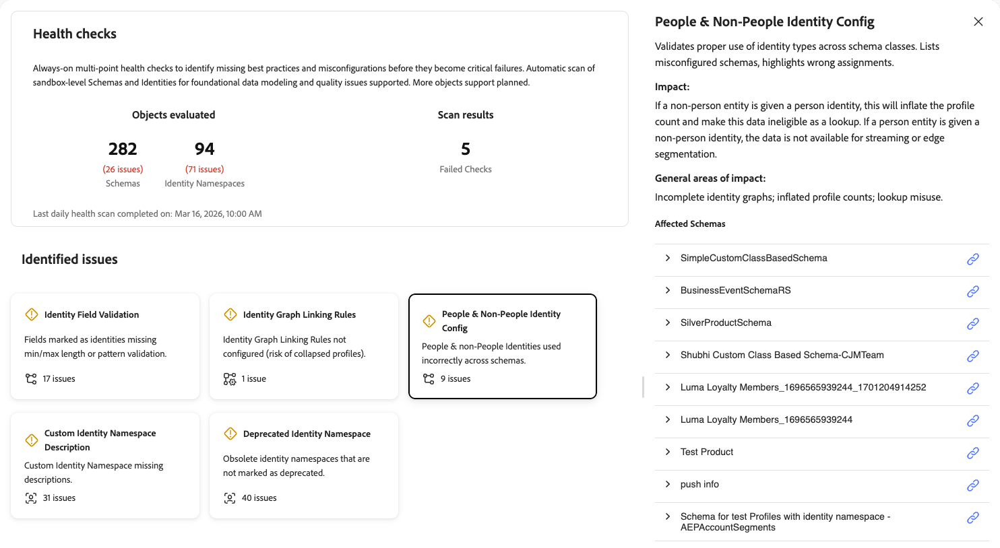
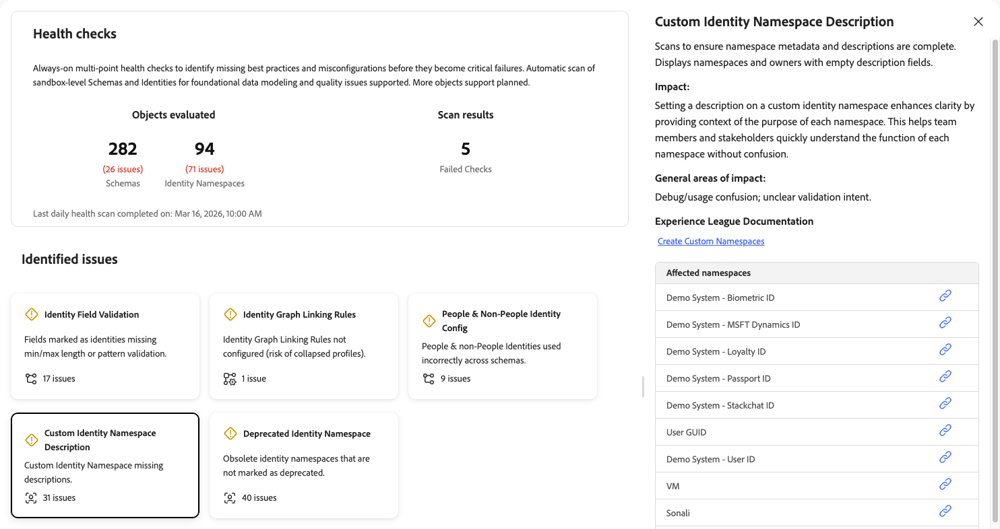

# Comprobaciones de estado

Las comprobaciones de estado analizan los esquemas y las identidades utilizados en su zona protegida y proporcionan un resumen de los problemas que puede utilizar para explorar y solucionar problemas con [!UICONTROL AI Assistant]. En el futuro, se podrán analizar más objetos para obtener un informe más completo.

Las configuraciones de esquema e identidad deficientes derivan en problemas descendentes significativos, como la creación incorrecta de perfiles, la calificación fallida de segmentos y la activación inexacta. Estos problemas son difíciles de detectar y a menudo requieren conocimientos especializados para diagnosticarlos. Las comprobaciones de estado cambian su enfoque de la solución de problemas reactiva al mantenimiento preventivo y proactivo.

Con las comprobaciones de estado, puede:

* **Detectar problemas de configuración al principio**: identifique las prácticas recomendadas, las configuraciones incorrectas y los patrones que faltan y que conducen a ineficiencias en la personalización, la activación y mucho más.
* **Recibir corrección guiada**: obtenga instrucciones claras sobre qué es cada problema y qué hacer al respecto.
* **Supervisar continuamente**: En este momento, las comprobaciones de estado ejecutan análisis automáticos diarios para detectar los problemas antes de que se conviertan en errores críticos. La programación puede cambiar en futuras versiones.

## Requisitos previos {#prerequisites}

Para acceder a las comprobaciones de estado, necesita el **[!UICONTROL View Health Checks]** [permiso de control de acceso](/help/access-control/home.md#permissions). Póngase en contacto con el administrador del sistema para asegurarse de que tiene los permisos adecuados.

## Acceso a comprobaciones de estado {#access-health-checks}

Para acceder a las comprobaciones de estado desde la interfaz de usuario de [!UICONTROL Experience Platform]:

1. Seleccione **[!UICONTROL Run and Operate]** en el panel de navegación izquierdo.
1. Seleccione **[!UICONTROL Health Checks]**.

El tablero de comprobaciones de estado muestra un resumen de los resultados del análisis más recientes.

## Explicación del tablero {#understanding-dashboard}

El panel de comprobaciones de estado proporciona tres áreas de información que le ayudarán a evaluar el estado de la implementación.

### Objetos evaluados {#objects-evaluated}

La sección **[!UICONTROL Objects evaluated]** muestra el número total de esquemas y áreas de nombres de identidad analizados, junto con cuántos problemas se encontraron para cada categoría. Esto le ofrece una vista rápida del ámbito y la gravedad de los problemas de configuración de la zona protegida.

### Resultados del análisis {#scan-results}

La sección **[!UICONTROL Scan results]** muestra el número de comprobaciones con errores. Una comprobación errónea indica que una o varias comprobaciones de estado detectaron problemas de configuración que requieren atención. La marca de tiempo **Último examen de estado diario completado el** muestra cuándo se ejecutó el examen más reciente.

### Problemas identificados {#identified-issues}

La sección **[!UICONTROL Identified issues]** muestra una tarjeta para cada comprobación de estado. Cada tarjeta muestra:

* El nombre de la comprobación de estado y una breve descripción del problema.
* Número de problemas encontrados o confirmación de que no existen problemas.
* Un indicador de estado que muestra si la comprobación ha superado o requiere atención.

Seleccione cualquier tarjeta para explorar los detalles de esa comprobación de estado.

## Comprobaciones de estado disponibles {#available-health-checks}

Las comprobaciones de estado evalúan actualmente cinco áreas básicas de esquema y configuración de identidad. Estas comprobaciones se dirigen a los problemas de modelado de datos más impactantes de la plataforma.

### Validación de campo de identidad {#identity-field-validation}

Analiza para garantizar que los campos de identidad tengan restricciones de longitud mínima y máxima y reglas de patrón regex para la integridad de los datos.

| Detalles | Descripción |
| --- | --- |
| **Problema** | A los campos marcados como identidades les falta una longitud mínima/máxima o una validación de patrón. |
| **Impacto** | Sin validación, los valores no utilizados pueden escribir [!UICONTROL Identity Service]. Los valores como &quot;0&quot;, &quot;Invitado&quot; o mayúsculas y minúsculas que no coinciden (por ejemplo, &quot;xyz123&quot; frente a &quot;XYZ123&quot;) comprometen la integridad del perfil que se monta durante la segmentación y la activación. |
| **Corrección** | Establezca restricciones de longitud y patrón mínimas/máximas en campos personalizados marcados como identidades. Utilice expresiones regulares para aplicar reglas como solo dígitos, mayúsculas o minúsculas, o combinaciones de caracteres específicas. |

Al seleccionar la tarjeta **[!UICONTROL Identity Field Validation]**, se abre un panel de detalles a la derecha. El panel muestra:

* **[!UICONTROL Description]**: explora para garantizar que los campos de identidad tengan longitudes mín./máx. y reglas de patrón regex para la integridad de los datos. Muestra los esquemas y campos afectados.
* **[!UICONTROL Impact]**: si los campos de identidad de los esquemas no tienen establecidas longitudes mín./máx. y validaciones de patrones, puede generar datos incoherentes, lo que puede comprometer la integridad y la calidad de los datos.
* **[!UICONTROL General areas of impact]**: identificadores de baja calidad en [!UICONTROL Identity Service]; vinculación no confiable.
* **[!UICONTROL Experience League Documentation]**: un vínculo a las prácticas recomendadas para el modelado de datos.
* **[!UICONTROL Affected Schemas]**: una lista de esquemas afectados, cada uno con un expansor para ver más detalles y un vínculo para abrir el esquema.

Para obtener más información, consulte las [sugerencias de integridad de datos](/help/xdm/schema/best-practices.md#data-integrity-tips) en la documentación de prácticas recomendadas de esquema.

### Reglas de vinculación de gráficos de identidad {#identity-graph-linking-rules}

Comprueba que las reglas de vinculación de gráficos de identidad estén configuradas para una zona protegida a fin de evitar perfiles contraídos.

| Detalles | Descripción |
| --- | --- |
| **Problema** | Las reglas de vinculación de gráficos de identidad no están configuradas para esta zona protegida. |
| **Impacto** | Sin vincular reglas, varios perfiles diferentes pueden combinarse en uno solo (contracción del gráfico). Algunos datos de dispositivos compartidos o identidades no únicas pueden almacenar en déclencheur combinaciones no deseadas, lo que conduce a una personalización inexacta. |
| **Corrección** | Vaya al menú **[!UICONTROL Identities]**, seleccione **[!UICONTROL Settings]** y seleccione al menos una identidad única por gráfico. Esto habilita las reglas de vinculación de gráficos de identidad y evita el colapso del perfil. |

Al seleccionar la tarjeta **[!UICONTROL Identity Graph Linking Rules]**, se abre un panel de detalles a la derecha. El panel muestra:

* **[!UICONTROL Description]**: comprueba que las reglas de vinculación adecuadas están configuradas para evitar perfiles contraídos. Muestra el estado actual de la regla y las identidades únicas por gráfico.
* **[!UICONTROL Impact]**: si no se establecen las reglas de vinculación de gráficos de identidad, determinados datos podrían intentar combinar varios perfiles dispares en un único perfil. Para evitar combinaciones no deseadas, deben utilizarse las configuraciones proporcionadas mediante reglas de vinculación de gráficos de identidad.
* **[!UICONTROL General areas of impact]**: perfiles contraídos o combinados.
* **[!UICONTROL Experience League Documentation]**: un vínculo a la descripción general de las reglas de vinculación de gráficos de identidad para obtener más información.
* **[!UICONTROL Configure linking rules]**: cuando la comprobación falla, aparece un botón para que pueda configurar las reglas de vinculación directamente desde el panel.

Para obtener más información, consulte [descripción general de las reglas de vinculación de gráficos de identidad](/help/identity-service/identity-graph-linking-rules/overview.md) y [guía de implementación](/help/identity-service/identity-graph-linking-rules/implementation-guide.md).

### Configuración de identidad de personas y no personas {#people-non-people-identity}

Valida el uso correcto de los tipos de identidad people y non-people en todas las clases de esquema.

| Detalles | Descripción |
| --- | --- |
| **Problema** | Los identificadores que no son personas se utilizan en esquemas de clase de perfil individual o de evento de experiencia, o los identificadores de personas se utilizan en esquemas de búsqueda. |
| **Impacto** | Los identificadores de no personas en esquemas de perfil no participan en el gráfico de identidad, lo que conduce a una resolución de identidad incompleta. Los identificadores de personas en los esquemas de búsqueda inflan el recuento de perfiles y hacen que los datos no sean aptos para los casos de uso de búsqueda. En ambos casos, existe el riesgo de que futuras mejoras del producto rompan la implementación. |
| **Corrección** | Revise los esquemas marcados y corrija las asignaciones de tipo de identidad. Elimine los identificadores que no sean de persona de los esquemas de Perfil individual siempre que sea posible. Para los esquemas que ya usan los conjuntos de datos, consulte las [reglas de evolución de esquema](/help/xdm/schema/composition.md#evolution). |

Al seleccionar la tarjeta **[!UICONTROL People & Non-People Identity Config]**, se abre un panel de detalles a la derecha. El panel muestra:

* **[!UICONTROL Description]**: valida el uso correcto de los tipos de identidad entre clases de esquema. Enumera los esquemas mal configurados y resalta las asignaciones incorrectas.
* **[!UICONTROL Impact]**: si a una entidad que no es una persona se le proporciona una identidad de persona, esto inflará el recuento de perfiles y hará que estos datos no sean aptos como búsqueda. Si a una entidad de persona se le proporciona una identidad que no sea de persona, los datos no están disponibles para la transmisión o segmentación de Edge.
* **[!UICONTROL General areas of impact]**: gráficos de identidad incompletos; recuentos de perfiles inflados; uso incorrecto de la búsqueda.
* **[!UICONTROL Affected Schemas]**: una lista de esquemas con problemas. Expanda una fila de esquema para ver la ruta, el nombre de identidad y el tipo de esquema de cada configuración incorrecta. Utilice el icono de vínculo para abrir el esquema.

Para obtener más información, consulte la [documentación de tipo de identidad](/help/identity-service/features/namespaces.md#identity-type) y las [prácticas recomendadas de esquema](/help/xdm/schema/best-practices.md).

### Descripción del área de nombres de identidad personalizada {#namespace-missing-description}

Analiza para garantizar que los metadatos y las descripciones del área de nombres de identidad personalizadas estén completos.

| Detalles | Descripción |
| --- | --- |
| **Problema** | Faltan áreas de nombres de identidad personalizadas en el campo de descripción. |
| **Impacto** | Las descripciones que faltan pueden provocar confusión durante el uso y la depuración. |
| **Corrección** | Documente cada área de nombres personalizada rellenando el campo de descripción. Incluya criterios de validación (longitud mínima/máxima, patrón) e información del ciclo vital que identifique qué sistema de origen externo crea estas identidades. |

Al seleccionar la tarjeta **[!UICONTROL Custom Identity Namespace Description]**, se abre un panel de detalles a la derecha. El panel muestra:

* **[!UICONTROL Description]**: explora para asegurarse de que los metadatos y las descripciones del área de nombres estén completos. Muestra áreas de nombres y propietarios con campos de descripción vacíos.
* **[!UICONTROL Impact]**: al establecer una descripción en un área de nombres de identidad personalizada, se mejora la claridad al proporcionar el contexto del propósito de cada área de nombres. Esto ayuda a los integrantes del equipo y a las partes interesadas a comprender rápidamente la función de cada área de nombres sin confusión.
* **[!UICONTROL General areas of impact]**: depuración o confusión de uso; intención de validación no clara.
* **[!UICONTROL Experience League Documentation]**: un vínculo para crear áreas de nombres personalizadas para obtener más información.
* **[!UICONTROL Affected namespaces]**: lista de áreas de nombres de identidad personalizadas a las que les faltan descripciones. Utilice el icono de vínculo situado junto a cada área de nombres para verla o editarla.

Para obtener más información, consulte la documentación sobre [creación de áreas de nombres personalizadas](/help/identity-service/features/namespaces.md#create-namespaces).

### Área de nombres de identidad obsoleta {#deprecated-namespace}

Detecta áreas de nombres de identidad obsoletas o no utilizadas que deben marcarse para su limpieza.

| Detalles | Descripción |
| --- | --- |
| **Problema** | Las áreas de nombres de identidad obsoletas no están marcadas como obsoletas. |
| **Impacto** | Las áreas de nombres no utilizadas u obsoletas crean confusión sobre lo que se utiliza activamente y aumentan el riesgo de etiquetar incorrectamente los campos de identidad. |
| **Corrección** | Cambie el nombre de los espacios de nombres no utilizados para incluir el prefijo &quot;No usar&quot; (por ejemplo, &quot;No usar - [nombre original]&quot;). Adobe Experience Platform no admite actualmente la eliminación del área de nombres, por lo que se recomienda cambiar el nombre. |

Al seleccionar la tarjeta **[!UICONTROL Deprecated Identity Namespace]**, se abre un panel de detalles a la derecha. El panel muestra:

* **[!UICONTROL Description]**: detecta áreas de nombres de identidad obsoletas o no utilizadas para la limpieza. Enumera las áreas de nombres no utilizadas con la última marca de tiempo de uso o referencia de esquema.
* **[!UICONTROL Impact]**: las áreas de nombres de identidad que no se usen en ningún esquema deben marcarse para su eliminación agregando una etiqueta &quot;OBSOLETA&quot; o &quot;NO USAR&quot; a sus nombres. Actualmente no se admite la eliminación de áreas de nombres de identidad.
* **[!UICONTROL General areas of impact]**: riesgo de confusión y etiquetado incorrecto.
* **[!UICONTROL Experience League Documentation]**: un vínculo a Áreas de nombres de identidad obsoletas para obtener más documentación.
* **[!UICONTROL Affected namespaces]**: una lista de áreas de nombres de identidad obsoletas o no utilizadas. Utilice el icono de vínculo situado junto a cada área de nombres para verla o administrarla.

Para obtener más información, consulte el artículo de [Experience Cloud Knowledge Base sobre áreas de nombres obsoletas](https://experienceleague.adobe.com/es/docs/experience-cloud-kcs/kbarticles/ka-18155){target="_blank"}.

## Próximos pasos {#next-steps}

Después de revisar los resultados de la comprobación de estado, explore los siguientes recursos para profundizar en su comprensión:

* Obtenga información acerca de [prácticas recomendadas de esquema](/help/xdm/schema/best-practices.md) para diseñar modelos de datos confiables.
* Comprenda [las reglas de vinculación de gráficos de identidad](/help/identity-service/identity-graph-linking-rules/overview.md) para evitar el colapso del perfil.
* Revise la [documentación del área de nombres de identidad](/help/identity-service/features/namespaces.md) para conocer las prácticas recomendadas de administración de áreas de nombres.
* Explore otras [herramientas de ejecución y funcionamiento](/help/run-and-operate/overview.md), entre ellas [[!UICONTROL Job Schedules]](/help/run-and-operate/job-schedules.md), para ver las operaciones por lotes.
