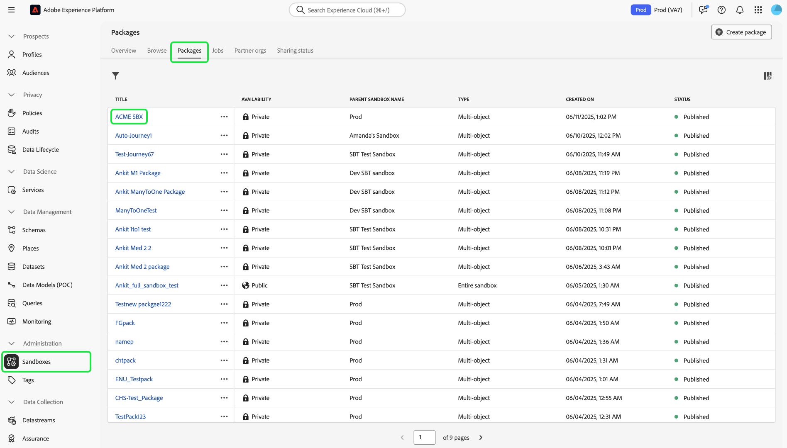
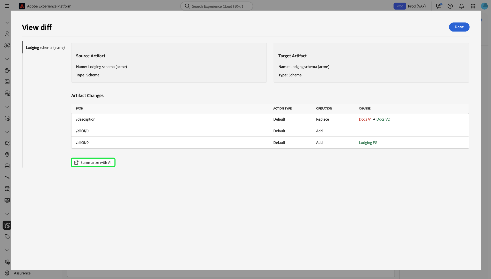
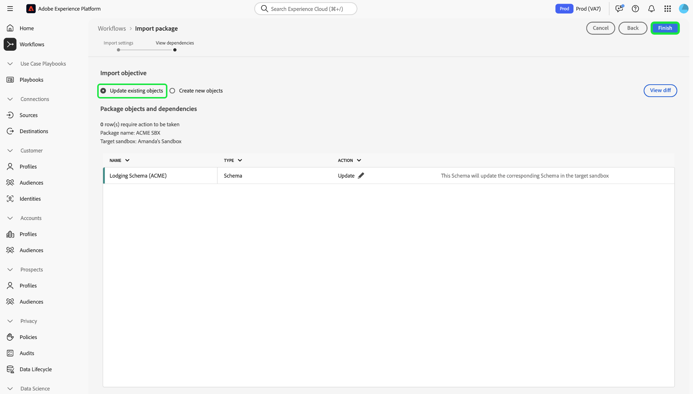

# Herramientas de zona protegida

>[!NOTE]
>
>Las herramientas de espacio aislado son una capacidad fundamental que admite [!DNL Real-Time Customer Data Platform] y [!DNL Journey Optimizer] para mejorar la eficiencia del ciclo de desarrollo y la precisión de la configuración.  Debe tener los dos permisos de control de acceso basados en roles siguientes para usar la característica de herramientas de zona protegida:  - `manage-sandbox` o `view-sandbox` - `manage-package`

Mejore la precisión de la configuración en todos los entornos limitados y exporte e importe sin problemas las configuraciones de los entornos limitados con la función de herramientas para entornos limitados. Utilice las herramientas de zona protegida para reducir el tiempo de respuesta al valor del proceso de implementación y mover las configuraciones correctas a través de las zonas protegidas.

Puede utilizar la función de herramientas de zona protegida para seleccionar diferentes objetos y exportarlos a un paquete. Un paquete puede constar de un único objeto o de varios objetos. <!--or an entire sandbox.-->Todos los objetos incluidos en un paquete deben pertenecer a la misma zona protegida.

## Objetos admitidos para las herramientas de zona protegida {#supported-objects}

La característica de herramientas de zona protegida permite exportar objetos [!DNL Adobe Real-Time Customer Data Platform] y [!DNL Adobe Journey Optimizer] a un paquete.

### Objetos de Real-time Customer Data Platform {#real-time-cdp-objects}

>[!BEGINSHADEBOX]

### Cambios en las importaciones de públicos de varias entidades

Con las [actualizaciones de arquitectura B2B](../../rtcdp/b2b-architecture-upgrade.md), ya no podrá importar audiencias de varias entidades con atributos B2B y eventos de experiencia si un paquete que incluía estas audiencias se publicó antes de la actualización. Estas audiencias no se importarán correctamente y no se pueden convertir automáticamente a la nueva arquitectura.

Para solucionar esta limitación, debe crear un nuevo paquete con las audiencias actualizadas y luego importarlas a sus respectivas zonas protegidas de destino con las herramientas de zonas protegidas.

>[!ENDSHADEBOX]

En la tabla siguiente se enumeran [!DNL Adobe Real-Time Customer Data Platform] objetos que actualmente se admiten en las herramientas de zona protegida:

| Plataforma | Objeto | Detalles |
| --- | --- | --- |
| Plataforma de datos del cliente | Fuentes | <ul><li>Las credenciales de la cuenta de origen no se replican en la zona protegida de destino por motivos de seguridad y deberán actualizarse manualmente.</li><li>El flujo de datos de origen se copia en estado de borrador de forma predeterminada.</li></ul> **NOTA:** Actualmente, las herramientas de zonas protegidas solo admiten flujos de datos de origen basados en lotes. No se admiten flujos de datos de origen basados en streaming. |
| Plataforma de datos del cliente | Públicos | <ul><li>Solo se admite el tipo **[!UICONTROL Customer Audience]** **[!UICONTROL Segmentation service]**.</li><li>Las etiquetas existentes para consentimiento y control se copiarán en el mismo trabajo de importación.</li><li> El sistema seleccionará automáticamente la política de combinación predeterminada en la zona protegida de destino con la misma clase XDM al comprobar las dependencias de la política de combinación.</li><li>Si se detecta un objeto existente con el mismo nombre al importar audiencias, las herramientas de espacio aislado siempre reutilizarán el objeto existente para evitar la proliferación de objetos.</li></ul> |
| Plataforma de datos del cliente | Identidades | <ul><li>El sistema deduplicará automáticamente las áreas de nombres de identidad estándar de Adobe al crear en la zona protegida de destino.</li><li>Las audiencias solo se pueden copiar cuando todos los atributos de las reglas de audiencia están habilitados en el esquema de unión. Los esquemas necesarios deben moverse y habilitarse primero para el perfil unificado.</li></ul> |
| Plataforma de datos del cliente | Esquemas/ Grupos de campos/ Tipos de datos | <ul><li>Las etiquetas existentes para consentimiento y control se copiarán en el mismo trabajo de importación.</li><li>Tiene la flexibilidad de importar esquemas sin la opción de perfil unificado habilitada. Las mayúsculas y minúsculas perimetrales de las relaciones de esquema no se incluyen en el paquete.</li><li>Si se detecta un objeto existente con el mismo nombre al importar esquemas o grupos de campos, las herramientas de espacio aislado siempre reutilizarán el objeto existente para evitar la proliferación de objetos.</li></ul> |
| Plataforma de datos del cliente | Conjuntos de datos | Los conjuntos de datos se copian con la configuración del perfil unificado deshabilitada de forma predeterminada. |
| Plataforma de datos del cliente | Políticas de consentimiento y gobernanza | Añada directivas personalizadas creadas por un usuario a un paquete y muévalas a zonas protegidas. |

Los objetos siguientes se importan, pero están en estado de borrador o desactivado:

| Función | Objeto | Estado |
| --- | --- | --- |
| Estado de importación | Flujo de datos de Source | Borrador |
| Estado de importación |  Recorrido  | Borrador |
| Perfil unificado | Conjunto de datos | Perfil unificado desactivado |
| Políticas | Políticas de gobernanza de datos | Desactivado |

### Objetos Adobe Journey Optimizer {#abobe-journey-optimizer-objects}

La tabla siguiente enumera [!DNL Adobe Journey Optimizer] objetos que actualmente son compatibles con las herramientas y limitaciones de la zona protegida:

| Plataforma | Objeto | Objetos dependientes admitidos | Detalles |
| --- | --- | --- | --- |
| [!DNL Adobe Journey Optimizer] | Público | | Una audiencia se puede copiar como un objeto dependiente del objeto de recorrido. Puede seleccionar crear una audiencia nueva o reutilizar una existente en la zona protegida de destino. |
| [!DNL Adobe Journey Optimizer] | Esquema | | Los esquemas utilizados en el recorrido se pueden copiar como objetos dependientes. Puede seleccionar crear un nuevo esquema o reutilizar uno existente en la zona protegida de destino. |
| [!DNL Adobe Journey Optimizer] | Política de combinación | | Las políticas de combinación utilizadas en el recorrido se pueden copiar como objetos dependientes. En la zona protegida de destino, **no puede** crear una nueva política de combinación, solo puede usar una existente. |
| [!DNL Adobe Journey Optimizer] |  Recorrido  | Los objetos siguientes utilizados en el recorrido se copian como objetos dependientes. Durante el flujo de trabajo de importación, puede elegir **[!UICONTROL Create new]** o **[!UICONTROL Use existing]** para cada uno: <ul><li>Públicos</li><li>Detalles del lienzo</li><li>Plantillas de contenido</li><li>Acciones personalizadas</li><li>Fuentes de datos</li><li>Eventos</li><li>Grupos de campos</li><li>Fragmentos</li><li>Esquemas</li></ul> | Cuando selecciona **[!UICONTROL Use existing]** durante el proceso de importación para copiar un recorrido en otra zona protegida, las acciones personalizadas existentes que elija **deben** coincidir exactamente con la acción personalizada de origen. Si no coinciden, el nuevo recorrido generará errores que no se pueden resolver. El sistema copia los eventos y los detalles del evento utilizados en la recorrido y crea una nueva versión en la zona protegida de destino. |
| [!DNL Adobe Journey Optimizer] | Acción | | Los mensajes push y de correo electrónico utilizados en el recorrido se pueden copiar como objetos dependientes. No se comprueba la integridad de las actividades de acción de canal utilizadas en los campos de recorrido que se utilizan para la personalización en el mensaje. Los bloques de contenido no se copian.  Se puede copiar la acción de actualización de perfil utilizada en el recorrido. Las acciones personalizadas se pueden añadir a un paquete de forma independiente. Los detalles de acción utilizados en el recorrido también se copian. Siempre se crea una nueva versión en la zona protegida de destino. |
| [!DNL Adobe Journey Optimizer] | Acciones personalizadas |  | Las acciones personalizadas se pueden añadir a un paquete de forma independiente. Una vez asignada una acción personalizada a un recorrido, ya no se puede editar. Para realizar actualizaciones en las acciones personalizadas, debe: <ul><li>mover acciones personalizadas antes de migrar un recorrido</li><li>actualizar configuraciones (como encabezados de solicitud, parámetros de consulta y autenticación) para acciones personalizadas después de la migración</li><li>migrar objetos de recorrido con las acciones personalizadas agregadas durante el primer paso</li></ul> |
| [!DNL Adobe Journey Optimizer] | Plantilla de contenido | | Una plantilla de contenido se puede copiar como un objeto dependiente del objeto de recorrido. Las plantillas independientes le permiten reutilizar fácilmente contenido personalizado en todas las campañas y recorridos de Journey Optimizer. |
| [!DNL Adobe Journey Optimizer] | Fragmento | Todos los fragmentos anidados. | Un fragmento se puede copiar como un objeto dependiente del objeto de recorrido. Los fragmentos son componentes reutilizables a los que se puede hacer referencia en uno o varios correos electrónicos en campañas y recorridos de Journey Optimizer. |
| [!DNL Adobe Journey Optimizer] | Campañas | Los siguientes objetos utilizados en la campaña se copian como objetos dependientes: <ul><li>Campañas</li><li>Públicos</li><li>Esquemas</li><li>Plantillas de contenido</li><li>Fragmentos</li><li>Mensaje/Contenido</li><li>Configuración de canal</li><li>Objetos de decisión unificados</li><li>Configuración/variantes del experimento</li></ul> | <ul><li>Las campañas se pueden copiar junto con todos los elementos relacionados con el perfil, la audiencia, el esquema, los mensajes en línea y los objetos dependientes. Algunos elementos no se copian, como las etiquetas de uso de datos y la configuración de idioma. Para obtener una lista completa de los objetos que no se pueden copiar, consulte la guía [exportar objetos a otra zona protegida](https://experienceleague.adobe.com/es/docs/journey-optimizer/using/configuration/copy-objects-to-sandbox).</li><li>El sistema detectará y reutilizará automáticamente un objeto de configuración de canal existente en la zona protegida de destino si existe una configuración idéntica. Si no se encuentra ninguna configuración que coincida, la configuración del canal se omite durante la importación y los usuarios deben actualizar manualmente la configuración del canal en la zona protegida de destino para este recorrido.</li><li>Los usuarios pueden reutilizar los experimentos y las audiencias existentes en la zona protegida de Target como objetos dependientes de las campañas seleccionadas.</li></ul> |
| [!DNL Adobe Journey Optimizer] | Toma de decisiones | Los objetos siguientes deben estar presentes en la zona protegida de destino antes de copiar los objetos de Decisioning: <ul><li>Atributos de perfil utilizados en objetos de Decisioning</li><li>El grupo de campos de atributos de oferta personalizados</li><li>Los esquemas de flujos de datos utilizados para atributos de contexto en reglas, clasificación o límite.</li></ul> | <ul><li>Actualmente no se admite la copia de fórmulas de clasificación que utilicen modelos de IA.</li><li>Los elementos de decisión (artículos de oferta) no se incluyen automáticamente. Para asegurarse de que se transfieran, agréguelos manualmente con la opción **Agregar al paquete**.</li><li>Las directivas que utilizan una estrategia de selección requieren que los elementos de decisión asociados se agreguen manualmente durante el proceso de copia. Las directivas que utilizan elementos de decisión manuales o de reserva tendrán esos elementos incluidos automáticamente como dependencias directas.</li><li>Los elementos de decisión se deben copiar primero, antes que cualquier otro objeto relacionado.</li><li>Para obtener una lista completa de los objetos admitidos, consulte la guía [exportar objetos a otra zona protegida](https://experienceleague.adobe.com/es/docs/journey-optimizer/using/configuration/copy-objects-to-sandbox).</li></ul> |

## Exportación de objetos a un paquete {#export-objects}

>[!NOTE]
>
>Todas las acciones de exportación se registran en los registros de auditoría.

>[!CONTEXTUALHELP]
>id="platform_sandbox_tooling_remove_object"
>title="Quitar un objeto"
>abstract="Para quitar un objeto del paquete, seleccione la fila que desea eliminar y, a continuación, utilice la opción Eliminar, que está disponible tras la selección. Tenga en cuenta que no puede quitar objetos de los paquetes publicados."

>[!CONTEXTUALHELP]
>id="platform_sandbox_package_expiry"
>title="Configuración de caducidad del paquete"
>abstract="Los paquetes están configurados para que caduquen después de un período de inactividad en estado de borrador. La fecha predeterminada está fijada para 90 días a partir de hoy. Esta fecha seguirá cambiando hasta que se haya publicado el paquete. Si visita el paquete en estado de borrador, la fecha se mueve a un día más (a menos que la establezca manualmente)."

>[!CONTEXTUALHELP]
>id="platform_sandbox_tooling_package_status"
>title="Estado del paquete"
>abstract="El estado se establece como borrador de manera predeterminada. El estado cambia a publicado una vez que se haya publicado el paquete. No se pueden realizar cambios después de publicar el paquete."

>[!NOTE]
>
>Solo puede importar un paquete si tiene permiso para acceder a los objetos.

Este ejemplo documenta el proceso de exportación de un esquema y su adición a un paquete. Puede utilizar el mismo proceso para exportar otros objetos, por ejemplo, conjuntos de datos, recorridos y mucho más.

### Agregar un objeto a un nuevo paquete {#add-object-to-new-package}

Seleccione **[!UICONTROL Schemas]** en el panel de navegación izquierdo y, a continuación, seleccione la pestaña **[!UICONTROL Browse]**, que enumera los esquemas disponibles. A continuación, seleccione los puntos suspensivos (`...`) junto al esquema seleccionado y aparecerá un menú desplegable con los controles. Seleccione **[!UICONTROL Add to package]** de la lista desplegable.

![Lista de esquemas que muestran el menú desplegable que resalta el control [!UICONTROL Add to package].](../images/ui/sandbox-tooling/add-to-package.png)

En el cuadro de diálogo **[!UICONTROL Add to package]**, seleccione la opción **[!UICONTROL Create new package]**. Proporcione un [!UICONTROL Name] para el paquete y un [!UICONTROL Description] opcional, y después seleccione **[!UICONTROL Add]**.

![Se seleccionó el cuadro de diálogo [!UICONTROL Add to package] con [!UICONTROL Create new package] y se resaltó [!UICONTROL Add].](../images/ui/sandbox-tooling/create-new-package.png)

Ha vuelto al entorno **[!UICONTROL Schemas]**. Ahora puede añadir objetos adicionales al paquete que ha creado siguiendo los pasos que se indican a continuación.

### Añadir un objeto a un paquete existente y publicarlo {#add-object-to-existing-package}

Para ver una lista de los esquemas disponibles, seleccione **[!UICONTROL Schemas]** en el panel de navegación izquierdo y, a continuación, seleccione la pestaña **[!UICONTROL Browse]**. A continuación, seleccione los puntos suspensivos (`...`) junto al esquema seleccionado para ver las opciones de control en un menú desplegable. Seleccione **[!UICONTROL Add to package]** de la lista desplegable.

![Lista de esquemas que muestran el menú desplegable que resalta el control [!UICONTROL Add to package].](../images/ui/sandbox-tooling/add-to-package.png)

Aparecerá el cuadro de diálogo **[!UICONTROL Add to package]**. Seleccione la opción **[!UICONTROL Existing package]**, luego seleccione la lista desplegable **[!UICONTROL Package name]** y seleccione el paquete requerido. Finalmente, seleccione **[!UICONTROL Add]** para confirmar sus opciones.

Cuadro de diálogo ![[!UICONTROL Add to package], que muestra un paquete seleccionado de la lista desplegable.](../images/ui/sandbox-tooling/add-to-existing-package.png)

Se muestra la lista de objetos añadidos al paquete. Para publicar el paquete y hacer que esté disponible para su importación en entornos limitados, seleccione **[!UICONTROL Publish]**.

![Una lista de objetos en el paquete, destacando la opción [!UICONTROL Publish].](../images/ui/sandbox-tooling/publish-package.png)

Seleccione **[!UICONTROL Publish]** para confirmar la publicación del paquete.

![Cuadro de diálogo de confirmación de paquete de publicación, en el que se resalta la opción [!UICONTROL Publish].](../images/ui/sandbox-tooling/publish-package-confirmation.png)

>[!NOTE]
>
>Una vez publicado, el contenido del paquete no se puede cambiar. Para evitar problemas de compatibilidad, asegúrese de que se han seleccionado todos los recursos necesarios. Si es necesario realizar cambios, debe crear un nuevo paquete.

Ha vuelto a la ficha **[!UICONTROL Packages]** en el entorno [!UICONTROL Sandboxes], donde puede ver el nuevo paquete publicado.

## Importación de un paquete en una zona protegida de destino {#import-package-to-target-sandbox}

>[!NOTE]
>
>Todas las acciones de importación se registran en los registros de auditoría.

Para importar el paquete en una zona protegida de destino, vaya a la pestaña Zonas protegidas **[!UICONTROL Browse]** y seleccione la opción más (+) junto al nombre de la zona protegida.

![La ficha **[!UICONTROL Browse]** de las zonas protegidas resalta la selección del paquete de importación.](../images/ui/sandbox-tooling/browse-sandboxes.png)

En el menú desplegable, seleccione el **[!UICONTROL Package name]** que desee importar a la zona protegida de destino. Agregue un(a) **[!UICONTROL Job name]**, que se usará(n) para la supervisión futura. De forma predeterminada, el perfil unificado se desactiva cuando se importan los esquemas del paquete. Cambie **Habilitar esquemas para el perfil** para habilitar esto y luego seleccione **[!UICONTROL Next]**.

![La página de detalles de importación que muestra la selección desplegable [!UICONTROL Package name]](../images/ui/sandbox-tooling/import-package-to-sandbox.png)

La página [!UICONTROL Package object and dependencies] proporciona una lista de todos los recursos incluidos en este paquete. El sistema detecta automáticamente los objetos dependientes necesarios para importar correctamente los objetos padre seleccionados. Los atributos que faltan se muestran en la parte superior de la página. Seleccione **[!UICONTROL View details]** para obtener un desglose más detallado.

![La página [!UICONTROL Package object and dependencies] muestra los atributos que faltan.](../images/ui/sandbox-tooling/missing-attributes.png)

>[!NOTE]
>
>Los objetos dependientes se pueden reemplazar por objetos existentes en la zona protegida de destino, lo que permite reutilizar objetos existentes en lugar de crear una nueva versión. Por ejemplo, al importar un paquete que incluye esquemas, puede reutilizar el grupo de campos personalizados existente y las áreas de nombres de identidad en la zona protegida de destino. Alternativamente, al importar un paquete que incluya Recorridos, puede reutilizar segmentos existentes en la zona protegida de Target.
>
>Actualmente, las herramientas de zona protegida no admiten la actualización o sobrescritura de objetos existentes. Puede elegir crear un objeto nuevo o seguir utilizando el objeto existente sin modificaciones. Si se detecta un objeto existente con el mismo nombre, las herramientas de espacio aislado siempre reutilizarán el objeto existente, incluso si selecciona la opción [!UICONTROL Create new] para evitar la proliferación de objetos.

Para utilizar un objeto existente, seleccione el icono de lápiz situado junto al objeto dependiente.

![La página [!UICONTROL Package object and dependencies] muestra una lista de recursos incluidos en el paquete.](../images/ui/sandbox-tooling/package-objects-and-dependencies.png)

Se muestran las opciones para crear nuevos o utilizar los existentes. Seleccione **[!UICONTROL Use existing]**.

![La página [!UICONTROL Package object and dependencies] muestra las opciones de objeto dependiente [!UICONTROL Create new] y [!UICONTROL Use existing].](../images/ui/sandbox-tooling/use-existing-object.png)

El cuadro de diálogo **[!UICONTROL Field group]** muestra una lista de grupos de campos disponibles para el objeto. Seleccione los grupos de campos requeridos y luego seleccione **[!UICONTROL Save]**.

![Una lista de campos mostrados en el cuadro de diálogo [!UICONTROL Field group], que resalta la selección [!UICONTROL Save].](../images/ui/sandbox-tooling/field-group-list.png)

Ha vuelto a la página [!UICONTROL Package object and dependencies]. Desde aquí, seleccione **[!UICONTROL Finish]** para completar la importación del paquete.

![La página [!UICONTROL Package object and dependencies] muestra una lista de los recursos incluidos en el paquete, destacando [!UICONTROL Finish].](../images/ui/sandbox-tooling/finish-object-dependencies.png)

## Exportar e importar una zona protegida completa

>[!NOTE]
>
>Actualmente, solo se admiten objetos de Real-time Customer Data Platform al exportar o importar una zona protegida completa. Los objetos de Adobe Journey Optimizer, como los recorridos, no son compatibles en este momento.

Puede exportar todos los tipos de objetos admitidos en un paquete de zona protegida completo y, a continuación, importar el paquete en varios entornos limitados para replicar las configuraciones de objetos. Por ejemplo, esta funcionalidad le permite:

- Vuelva a importar una zona protegida para reproducir todas las configuraciones del objeto si necesita restablecer la zona protegida
- Importe el paquete en otros entornos limitados y utilícelo como entorno limitado de modelo para acelerar el proceso de desarrollo.

### Exportar toda una zona protegida {#export-entire-sandbox}

Para exportar una zona protegida completa, vaya a la pestaña [!UICONTROL Sandboxes] **[!UICONTROL Packages]** y seleccione **[!UICONTROL Create package]**.

![La ficha [!UICONTROL Sandboxes] **[!UICONTROL Packages]** que resalta [!UICONTROL Create package].](../images/ui/sandbox-tooling/create-sandbox-package.png)

Seleccione **[!UICONTROL Entire sandbox]** para [!UICONTROL Type of package] en el cuadro de diálogo [!UICONTROL Create package]. Proporcione un [!UICONTROL Package name] para el nuevo paquete y seleccione el **[!UICONTROL Sandbox]** en la lista desplegable. Finalmente, seleccione **[!UICONTROL Create]** para confirmar las entradas.

![Cuadro de diálogo [!UICONTROL Create package] que muestra los campos completados y resalta [!UICONTROL Create].](../images/ui/sandbox-tooling/create-package-dialog.png)

El paquete se ha creado correctamente, seleccione **[!UICONTROL Publish]** para publicar el paquete.

Ha vuelto a la ficha **[!UICONTROL Packages]** en el entorno [!UICONTROL Sandboxes], donde puede ver el nuevo paquete publicado.

### Importar todo el paquete de zona protegida {#import-entire-sandbox-package}

>[!NOTE]
>
>Todos los objetos se importarán en la zona protegida de destino como objetos nuevos. Se recomienda importar un paquete de zona protegida completo en una zona protegida vacía.

Para importar el paquete en una zona protegida de destino, vaya a la pestaña [!UICONTROL Sandboxes] **[!UICONTROL Browse]** y seleccione la opción más (+) junto al nombre de la zona protegida.

![La ficha **[!UICONTROL Browse]** de las zonas protegidas resalta la selección del paquete de importación.](../images/ui/sandbox-tooling/browse-entire-package-sandboxes.png)

En el menú desplegable, seleccione la zona protegida completa mediante la lista desplegable **[!UICONTROL Package name]**. Agregue un(a) **[!UICONTROL Job name]**, que se usará(n) para la supervisión futura y un(a) **[!UICONTROL Job description]** opcional(a), y luego seleccione **[!UICONTROL Next]**.

![La página de detalles de importación que muestra la selección desplegable [!UICONTROL Package name]](../images/ui/sandbox-tooling/import-full-sandbox-package.png)

>[!NOTE]
>
>Debe tener permisos completos para todos los objetos incluidos en el paquete. Si no tiene permisos, la operación de importación fallará y aparecerán mensajes de error.

Se le dirigirá a la página [!UICONTROL Package object and dependencies], donde podrá ver el número de objetos y dependencias que son objetos importados y excluidos. Desde aquí, seleccione **[!UICONTROL Import]** para completar la importación del paquete.

![La página [!UICONTROL Package object and dependencies] muestra el mensaje en línea de los tipos de objeto no admitidos, destacando [!UICONTROL Import].](../images/ui/sandbox-tooling/finish-dependencies-entire-sandbox.png)

Espere un poco para que se complete la importación. El tiempo para finalizar puede variar según el número de objetos del paquete. Puede supervisar el trabajo de importación desde la ficha [!UICONTROL Sandboxes] **[!UICONTROL Jobs]**.

## Monitorización de detalles de importación {#view-import-details}

Para ver los detalles importados, vaya a la pestaña [!UICONTROL Sandboxes] **[!UICONTROL Jobs]** y seleccione el paquete en la lista. También puede utilizar la barra de búsqueda para buscar el paquete.

![La pestaña [!UICONTROL Jobs] de las zonas protegidas resalta la selección del paquete de importación.](../images/ui/sandbox-tooling/imports-tab.png)

<!--### View imported objects {#view-imported-objects}

On the **[!UICONTROL Jobs]** tab in the [!UICONTROL Sandboxes] environment, select **[!UICONTROL View imported objects]** from the right details pane.

Select **[!UICONTROL View imported objects]** from the right details pane on the **[!UICONTROL Jobs]** tab in the [!UICONTROL Sandboxes] environment.

![The sandboxes [!UICONTROL Imports] tab highlights the [!UICONTROL View imported objects] selection in the right pane.](../images/ui/sandbox-tooling/view-imported-objects.png)

Use the arrows to expand objects to view the full list of fields that have been imported into the package.

![The sandboxes [!UICONTROL Imported objects] showing a list of objects imported into the package.](../images/ui/sandbox-tooling/expand-imported-objects.png)-->

Seleccione **[!UICONTROL View import summary]** en el panel de detalles derecho de la pestaña **[!UICONTROL Jobs]** del entorno de entornos limitados.

![La ficha [!UICONTROL Imports] de las zonas protegidas resalta la selección [!UICONTROL View import details] en el panel derecho.](../images/ui/sandbox-tooling/view-import-details.png)

El cuadro de diálogo **[!UICONTROL Import summary]** muestra un desglose de las importaciones con progreso como porcentaje.

>[!NOTE]
>
>Puede ver una lista de objetos navegando a páginas de inventario específicas.

![El cuadro de diálogo [!UICONTROL Import details] muestra un desglose detallado de las importaciones.](../images/ui/sandbox-tooling/import-details.png)

Cuando finaliza la importación, se recibe una notificación en la interfaz de usuario de Experience Platform. Puede acceder a estas notificaciones desde el icono de alertas. Puede navegar a la resolución de problemas desde aquí si un trabajo no se ha realizado correctamente.

## Transferir actualizaciones de configuraciones de objetos iterativas entre zonas protegidas mediante las herramientas de zonas protegidas {#move-configs}

Puede utilizar las herramientas de zona protegida para transferir configuraciones de objetos entre diferentes zonas protegidas. Anteriormente, las actualizaciones de configuración de los objetos (como esquemas, grupos de campos y tipos de datos) tenían que volver a crearse o importarse manualmente para transferirse a otros entornos limitados. Con esta capacidad, puede utilizar las herramientas de la zona protegida para acelerar los flujos de trabajo y reducir los posibles errores transfiriendo sin problemas las actualizaciones de configuración en diferentes zonas protegidas.

>[!TIP]
>
> Asegúrese de tener los siguientes requisitos previos antes de intentar transferir las configuraciones de objetos en diferentes zonas protegidas.
>
>- Los permisos adecuados para acceder a las herramientas de la zona protegida.
>- Un objeto recién creado o actualizado (como un esquema) en la zona protegida de origen.

>[!BEGINSHADEBOX]

### Tipos de objetos admitidos para la operación de actualización

Se admiten los siguientes tipos de objetos para la actualización:

- Esquemas
- Grupos de campo
- Tipos de datos

| Actualizaciones compatibles | Actualizaciones no admitidas |
| --- | --- |
| <ul><li>Adición de nuevos campos o grupos de campos al recurso.</li><li>Hacer opcional un campo obligatorio.</li><li>Introducción de nuevos campos obligatorios.</li><li>Introducción de un nuevo campo de relación.</li><li>Introducción de un nuevo campo de identidad.</li><li>Cambiar el nombre para mostrar y la descripción del recurso.</li></ul> | <ul><li>Eliminando los campos definidos anteriormente.</li><li>Redefinición de campos existentes cuando el esquema está habilitado para el perfil del cliente en tiempo real.</li><li>Eliminación o restricción de los valores de campo admitidos anteriormente.</li><li>Mover los campos existentes a una ubicación diferente en el árbol de esquema: esto creará un nuevo campo en la zona protegida de destino, pero no se eliminará el campo anterior.</li><li>Habilitar o deshabilitar el esquema para que participe en el perfil: esta operación se omitirá en la comparación de diferencias.</li><li>Etiquetas de control de acceso.</li></ul> |

>[!ENDSHADEBOX]

Siga los pasos a continuación para aprender a utilizar las herramientas de zona protegida para transferir las configuraciones de objetos en diferentes zonas protegidas.

### Objetos importados anteriormente

Siga estos pasos si el caso de uso implica objetos existentes en la zona protegida de origen que requieren actualizaciones de configuración, después de haberse empaquetado e importado a otras zonas protegidas.

En primer lugar, actualice el objeto en la zona protegida de origen. Por ejemplo, vaya al área de trabajo **[!UICONTROL Schemas]**, seleccione el esquema y agregue un nuevo grupo de campos.

Una vez que haya actualizado el esquema, vaya a **[!UICONTROL Sandboxes]**, seleccione **[!UICONTROL Packages]** y, a continuación, busque el paquete existente.

Utilice la interfaz de paquetes para comprobar los cambios. Seleccione **[!UICONTROL Check for updates]** para ver cualquier cambio en los artefactos del paquete. A continuación, seleccione **[!UICONTROL View diff]** para recibir un resumen detallado de todos los cambios realizados con sus artefactos.

Aparecerá la interfaz [!UICONTROL View diff]. Consulte este peaje para obtener información sobre los artefactos de origen y destino, así como los cambios que se les deben aplicar.

Durante este paso, también puede seleccionar [!UICONTROL Summarize with AI] para obtener un resumen paso a paso de todos los cambios.

Cuando esté listo, seleccione **[!UICONTROL Update package]** y luego seleccione **[!UICONTROL Confirm]** en la ventana emergente que aparece. Una vez completado el trabajo, puede actualizar la página y seleccionar **[!UICONTROL View history]** para comprobar la versión del paquete.

Para importar los cambios, vuelva al directorio [!UICONTROL Packages] y seleccione los puntos suspensivos (`...`) junto al paquete. A continuación, seleccione **[!UICONTROL Import package]**. Experience Platform selecciona automáticamente [!UICONTROL Update existing objects]. Compruebe los cambios y seleccione **[!UICONTROL Finish]**.

>[!NOTE]
>
>Todos los objetos dependientes se actualizan automáticamente en la zona protegida de destino como parte de este flujo de trabajo.

Para validar aún más el proceso de importación, vaya a la zona protegida de destino y vea manualmente el objeto actualizado desde dicha zona protegida.

### Objetos creados manualmente en la zona protegida de Target

Siga estos pasos si el caso de uso implica aplicar cambios de configuración a objetos creados manualmente en zonas protegidas independientes.

En primer lugar, cree y publique un nuevo paquete con el objeto actualizado.

A continuación, importe el paquete en la zona protegida de destino que contiene los objetos que también desea actualizar. Durante el proceso de importación, seleccione **[!UICONTROL Update existing objects]** y, a continuación, utilice el navegador de objetos para seleccionar manualmente los objetos de destino a los que desea aplicar las actualizaciones.

>[!NOTE]
>
>- Es opcional seleccionar una asignación de destino en una zona protegida diferente para los objetos dependientes. Si no se selecciona ninguna, se crea una nueva.
>- Para el área de nombres de identidad, el sistema detecta automáticamente si es necesario crear una nueva identidad si es necesario reutilizar una existente en la zona protegida de Target.

Una vez identificados los objetos de destino que desea actualizar, seleccione **[!UICONTROL Finish]**.

## Tutorial de vídeo

El siguiente vídeo tiene como objetivo ayudarle a comprender las herramientas de la zona protegida, y describe cómo crear un nuevo paquete, publicarlo e importarlo.

>[!VIDEO](https://video.tv.adobe.com/v/3446086/?captions=spa&learn=on)

## Próximos pasos

Este documento muestra cómo utilizar la función de herramientas de zona protegida en la interfaz de usuario de Experience Platform. Para obtener información sobre las zonas protegidas, consulte la [guía de usuario sobre zonas protegidas](../ui/user-guide.md).

Para ver los pasos de realización de distintas operaciones mediante la API de espacio aislado, consulte la [guía para desarrolladores de espacios aislados](../api/getting-started.md). Para obtener información general de alto nivel sobre las zonas protegidas en Experience Platform, consulte la [documentación general](../home.md).
