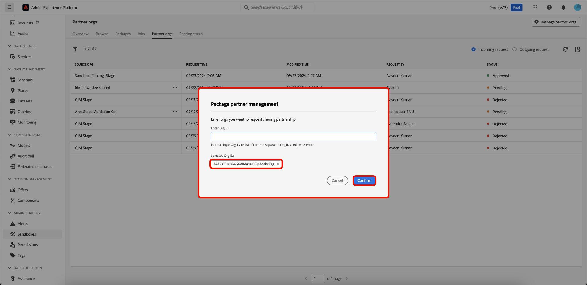
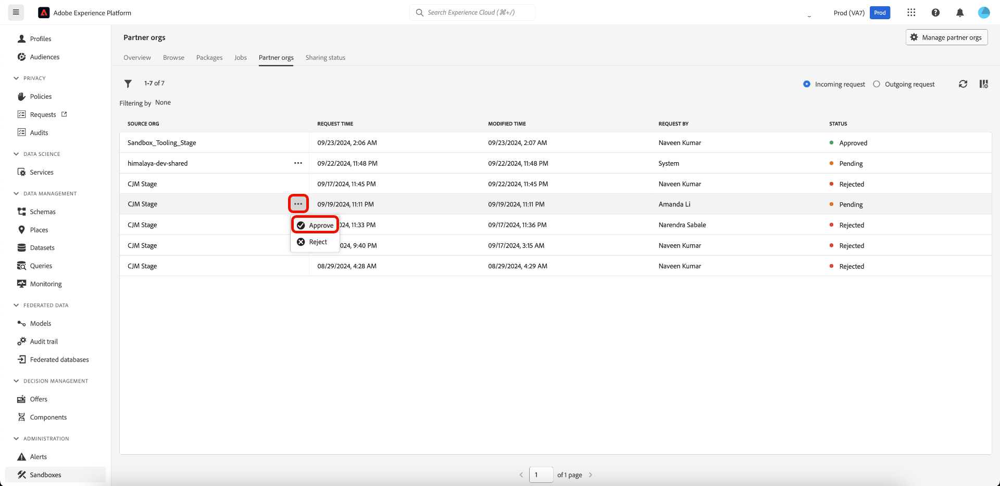
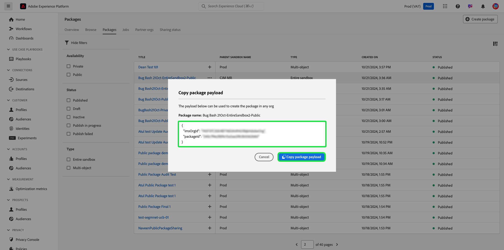

# Uso compartido de paquetes entre organizaciones mediante la herramienta Sandbox

Mejore la precisión de la configuración en los entornos limitados y exporte e importe sin problemas las configuraciones de los entornos limitados entre distintas organizaciones con la función de herramientas de entornos limitados. Este documento explica cómo utilizar las herramientas de zona protegida en Adobe Experience Platform para compartir paquetes entre distintas organizaciones. Existen dos tipos de paquetes compartidos:

- **Paquete privado**

[Los paquetes privados](#private-packages) solo se pueden compartir con organizaciones que hayan aprobado la solicitud de uso compartido de la organización de origen.

- **Paquete público**

Hay [paquetes públicos](#public-packages) disponibles para importar sin aprobación adicional. Estos paquetes se pueden compartir en el sitio web, el blog o la plataforma de un socio. La carga útil del paquete permite copiar y pegar paquetes de estos canales en la organización de destino.

## Paquetes privados {#private-packages}

>[!NOTE]
>
>Para iniciar y aprobar una solicitud de uso compartido y compartir paquetes entre organizaciones, necesitarás el permiso de control de acceso basado en roles **package-share**.

Utilice la función Herramienta de zona protegida para crear asociaciones, realizar un seguimiento de las estadísticas de solicitud de asociación, administrar las asociaciones existentes y compartir paquetes con organizaciones asociadas.

### Crear una solicitud de asociación de organización

Para crear una solicitud de asociación con una organización, vaya a la pestaña **[!UICONTROL Zonas protegidas]** **[!UICONTROL Organizaciones asociadas]**. A continuación, seleccione **[!UICONTROL Administrar organizaciones asociadas]**.

En el cuadro de diálogo [!UICONTROL Administración de socios de paquetes], escriba el identificador de organización en **[!UICONTROL Escriba el identificador de organización]** y presione Intro (Windows) o Retorno (Mac). El identificador de organización se muestra en la sección **[!UICONTROL ID de organización seleccionados]** a continuación. Después de agregar los identificadores, selecciona **[!UICONTROL Confirmar]**.

>[!TIP]
>
>Se pueden introducir varios ID de organización a la vez mediante listas separadas por comas o introduciendo cada ID de organización seguido de &quot;entrar&quot;.

La solicitud para compartir se ha enviado correctamente a la organización asociada y se le devolverá a la ficha [!UICONTROL Zonas protegidas] **[!UICONTROL Organizaciones asociadas]**, que muestra la **[!UICONTROL solicitud saliente]**.

### Autorizar una solicitud de asociación {#authorize-request}

Para autorizar una solicitud de asociación con una organización, vaya a la pestaña [!UICONTROL Zonas protegidas] **[!UICONTROL Organizaciones asociadas]**. A continuación, seleccione **[!UICONTROL Solicitud entrante]**.

El **[!UICONTROL estado]** actual de la solicitud, en este momento, es **Pendiente**. Para aprobar la solicitud, seleccione los puntos suspensivos (`...`) junto a la solicitud seleccionada y, a continuación, seleccione **[!UICONTROL Aprobar]** en el menú desplegable.

El cuadro de diálogo **[!UICONTROL Revisar solicitud de organización de socio]** muestra detalles sobre la solicitud de asociación de organización. Escriba un [!UICONTROL Motivo] para la aprobación y, a continuación, seleccione **[!UICONTROL Aprobar]**.

Ha vuelto a la página [!UICONTROL Solicitud entrante] y el estado de la solicitud se ha actualizado a **[!UICONTROL Aprobada]**.

Utilice este flujo de trabajo/proceso para compartir paquetes entre su organización y la organización de origen.

### Uso compartido de paquetes con organizaciones asociadas {#share-package}

>[!NOTE]
>
>Solo se pueden compartir los paquetes con el estado **Publicado**.

Para compartir un paquete con una organización asociada aprobada, vaya a la pestaña [!UICONTROL Zonas protegidas] **[!UICONTROL Paquetes]**. A continuación, seleccione los puntos suspensivos (`...`) junto al paquete y, a continuación, seleccione **[!UICONTROL Compartir paquete]** en el menú desplegable.

En el cuadro de diálogo **[!UICONTROL Compartir paquete]**, seleccione el paquete que desea compartir en el menú desplegable **[!UICONTROL Compartir configuración]** y, a continuación, seleccione **[!UICONTROL Confirmar]**.

>[!TIP]
>
>Es posible seleccionar más de una organización. Las organizaciones seleccionadas aparecerán debajo del menú desplegable [!UICONTROL Compartir configuración].

## Paquetes públicos {#public-packages}

Utilice la función Herramientas para zonas protegidas para crear paquetes públicos compartibles que no requieran ninguna aprobación adicional y que se importen fácilmente con el uso de la carga útil del paquete.

### Actualizar disponibilidad del paquete a público {#update-package}

Para actualizar el tipo de disponibilidad de un paquete, vaya a la pestaña [!UICONTROL Zonas protegidas] **[!UICONTROL Paquetes]**. A continuación, seleccione los puntos suspensivos (`...`) junto al paquete y, a continuación, seleccione **[!UICONTROL Actualizar al paquete público]** en el menú desplegable.

En el cuadro de diálogo **[!UICONTROL Cambiar la disponibilidad del paquete al público]**, compruebe que el nombre del paquete es correcto y seleccione **[!UICONTROL Confirmar]**.

>[!IMPORTANT]
>
> Una vez que un paquete se ha hecho público, no se puede volver a cambiar a privado.

### Uso compartido de paquetes mediante la carga útil del paquete

Para compartir el paquete público, seleccione los puntos suspensivos (`...`) junto al paquete y, a continuación, seleccione **[!UICONTROL Copiar carga útil del paquete]**.

El cuadro de diálogo **[!UICONTROL Copiar carga útil del paquete]** muestra el nombre del paquete y la carga útil. Seleccione **[!UICONTROL Copiar carga útil del paquete]** para copiar la carga útil asociada al paquete.

### Creación de un nuevo paquete mediante una carga útil de paquete

Para crear un paquete mediante una carga útil de paquete, vaya a la pestaña [!UICONTROL Zonas protegidas] **[!UICONTROL Paquetes]**. A continuación, seleccione **[!UICONTROL Crear paquete]**.

En el cuadro de diálogo **[!UICONTROL Crear paquete]**, seleccione la opción para **[!UICONTROL Pegar carga útil del paquete]** y, a continuación, seleccione **[!UICONTROL Seleccionar]**.

Pegue la carga útil del paquete copiado en el campo de texto y seleccione **[!UICONTROL Crear]**.

Para ver el estado actual de tu solicitud de uso compartido, ve al **[!UICONTROL estado de uso compartido]**. El estado actual de la solicitud se muestra en la columna **[!UICONTROL Compartir estado]**.

## Pasos siguientes {#next-steps}

Este documento muestra cómo utilizar la función de herramientas de espacio aislado para compartir paquetes entre diferentes organizaciones. Para obtener más información, consulte la [guía de herramientas de espacio aislado](../ui/sandbox-tooling.md).

Para obtener información sobre cómo realizar distintas operaciones con la API de espacio aislado, consulte la [guía para desarrolladores de espacios aislados](../api/getting-started.md). Para obtener información general de alto nivel sobre las zonas protegidas en Experience Platform, consulte la [documentación general](../home.md).
