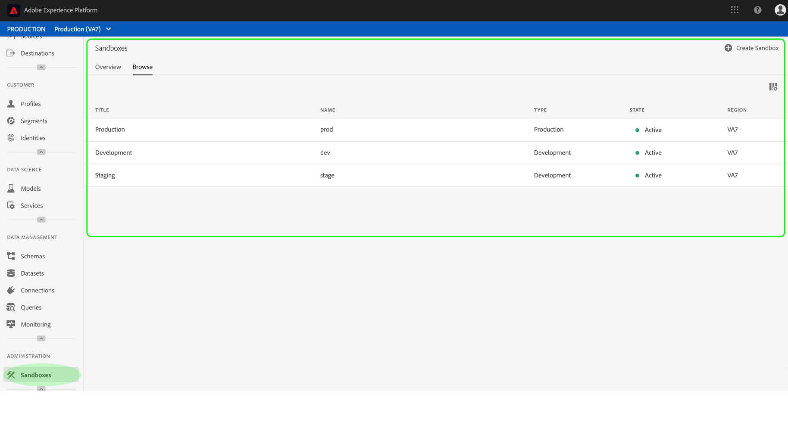

# Guía del usuario del Simulador para pruebas

Este documento proporciona pasos para realizar diversas operaciones relacionadas con los entornos limitados en la interfaz de usuario de Adobe Experience Platform.

## Entornos limitados de Vista

En la interfaz de usuario de la plataforma de experiencia, haga clic en **Simuladores** para pruebas en el panel de navegación izquierdo para abrir el panel _Simuladores para pruebas_ . El panel lista todos los entornos limitados disponibles para su organización, incluido el tipo de entorno limitado (producción o desarrollo) y el estado (activo, creativo, eliminado o fallido).

## Cambiar entre entornos limitados

El control del **conmutador** de simulador de pruebas en la parte superior izquierda de la pantalla muestra el simulador de pruebas activo.

Para cambiar entre entornos limitados, haga clic en el conmutador de entorno limitado y seleccione el entorno limitado deseado en la lista desplegable.

Una vez seleccionado un simulador de pruebas, la pantalla se actualiza con el simulador de pruebas seleccionado.

## Crear un nuevo simulador para pruebas

Para crear un nuevo simulador para pruebas en la interfaz de usuario, haga clic en **Entornos** para pruebas en la barra de navegación izquierda y, a continuación, haga clic en **Crear Simulador para pruebas**.

Aparece el cuadro de diálogo _Crear Simulador para pruebas_ , en el que se le solicita que proporcione un título y un nombre para mostrar para el simulador para pruebas. El título **de la** pantalla debe ser legible por el usuario y debe ser lo suficientemente descriptivo como para ser fácilmente identificable. El **nombre** del simulador para pruebas es un identificador en minúsculas que se utiliza en las llamadas de API y, por lo tanto, debe ser único y conciso.

Cuando termine, haga clic en **Crear**.

>[!NOTE] Dado que está restringido a la creación de tipos de entorno limitado que no sean de producción únicamente, la opción de **tipo** está bloqueada en &quot;No de producción&quot; y no se puede manipular.

Una vez que haya terminado de crear el simulador para pruebas, actualice la página y aparecerá el nuevo simulador para pruebas en el panel de _Simuladores para pruebas_ con el estado &quot;Creación&quot;. Los nuevos entornos limitados tardan aproximadamente 15 minutos en ser aprovisionados por el sistema, después de lo cual su estado cambia a &quot;Activo&quot;.

## Restablecer un entorno limitado

>[!NOTE] Esta funcionalidad solo está disponible para entornos limitados que no sean de producción. No se pueden restablecer los entornos limitados de producción.

Al restablecer un entorno limitado que no sea de producción, se eliminan todos los recursos asociados con dicho entorno limitado (esquemas, conjuntos de datos, etc.), al tiempo que se mantiene el nombre del entorno limitado y los permisos asociados. Este simulador para pruebas &quot;limpio&quot; sigue estando disponible con el mismo nombre para los usuarios que tienen acceso a él.

Para restablecer un simulador para pruebas en la interfaz de usuario, haga clic en **Entornos** para pruebas en la barra de navegación izquierda y, a continuación, haga clic en el simulador para pruebas que desee restablecer. En el cuadro de diálogo que aparece en la parte derecha de la pantalla, haga clic en **Restablecer Simulador para pruebas**.

Aparece un cuadro de diálogo que le solicita que confirme su elección. Click **Reset** to continue.

 

Aparece un mensaje de confirmación y el estado del simulador para pruebas cambia a &quot;Restauración&quot;. Una vez que el sistema lo haya aprovisionado, su estado se actualizará a &quot;Activo&quot; o &quot;Fallido&quot;.

## Eliminar un entorno limitado

>[!NOTE] Esta funcionalidad solo está disponible para entornos limitados que no sean de producción. No se pueden eliminar los entornos limitados de producción.

Al eliminar de forma permanente un entorno limitado que no sea de producción, se eliminan todos los recursos asociados a dicho entorno, incluidos los permisos.

Para eliminar un simulador para pruebas en la interfaz de usuario, haga clic en **Entornos** para pruebas en la barra de navegación izquierda y, a continuación, haga clic en el simulador para pruebas que desee eliminar. En el cuadro de diálogo que aparece en la parte derecha de la pantalla, haga clic en **Eliminar Simulador para pruebas**.

Aparece un cuadro de diálogo que le solicita que confirme su elección. Click **Delete** to continue.

 

Aparece un mensaje de confirmación y se elimina el simulador de pruebas del espacio de trabajo de _Simuladores de pruebas_ .

## Pasos siguientes

Este documento demostró cómo administrar entornos limitados en la interfaz de usuario de la plataforma de experiencia. Para obtener información sobre cómo administrar entornos limitados mediante la API de Simulador para pruebas, consulte la guía [para desarrolladores de](../api/getting-started.md)simuladores de pruebas.