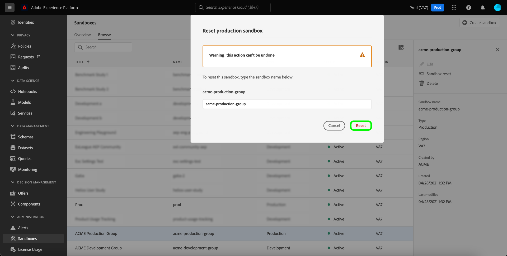

# Guía de la interfaz de usuario del Simulador para pruebas

Este documento proporciona pasos para realizar diversas operaciones relacionadas con los entornos limitados en la interfaz de usuario de Adobe Experience Platform.

## Entornos limitados de vista

En la interfaz de usuario del Experience Platform, seleccione **[!UICONTROL Simuladores para pruebas]** en el panel de navegación izquierdo para abrir el panel **[!UICONTROL Simuladores para pruebas]**. El panel lista todos los entornos limitados disponibles para su organización, incluido el tipo de entorno limitado (producción o desarrollo) y el estado (activo, creativo, eliminado o fallido).

## Cambiar entre entornos limitados

El control **simulador de pruebas** en la parte superior izquierda de la pantalla muestra el simulador de pruebas activo.

Para cambiar de entorno limitado a otro, seleccione el conmutador de entorno limitado y seleccione el entorno limitado deseado en la lista desplegable.

Una vez seleccionado un simulador de pruebas, la pantalla se actualiza con el simulador de pruebas seleccionado.

## Sesión para un simulador para pruebas

Puede navegar por la lista de los entornos limitados disponibles mediante la función de búsqueda en el menú del conmutador de simuladores de pruebas. Escriba el nombre del simulador para pruebas al que desea acceder para filtrar por todos los entornos limitados disponibles para su organización.

## Crear un nuevo simulador para pruebas

Utilice el siguiente vídeo para obtener una descripción general rápida sobre cómo utilizar los Simuladores para pruebas en Experience Platform.

>[!VIDEO](https://video.tv.adobe.com/v/29838/?quality=12&learn=on)

Para crear un nuevo simulador para pruebas en la interfaz de usuario, seleccione el botón **[!UICONTROL Crear Simulador para pruebas]** en la parte superior derecha de la pantalla.

Aparece el cuadro de diálogo **[!UICONTROL Crear Simulador para pruebas]**, en el que se le solicita que proporcione un título y un nombre para mostrar para el simulador para pruebas. El **título de visualización** debe ser legible por el usuario y ser lo suficientemente descriptivo como para ser fácilmente identificable. El simulador de pruebas **[!UICONTROL Name]** es un identificador en minúsculas que se utiliza en las llamadas de API y, por lo tanto, debe ser único y conciso. El simulador de pruebas **[!UICONTROL Name]** debe constar solamente de caracteres alfanuméricos y guiones **(-)**, debe comenzar con una letra y tiene un máximo de 256 caracteres.

Cuando termine, seleccione **[!UICONTROL Crear]**.

>[!NOTE]
>
>Dado que está restringido a la creación de tipos de entorno limitado que no sean de producción únicamente, la opción **[!UICONTROL tipo]** está bloqueada en &quot;No de producción&quot; y no se puede manipular.

Una vez que haya terminado de crear el simulador para pruebas, actualice la página y aparecerá el nuevo simulador para pruebas en el panel **[!UICONTROL Simuladores para pruebas]** con el estado &quot;[!UICONTROL Creación]&quot;. Los nuevos entornos limitados tardan aproximadamente 15 minutos en ser aprovisionados por el sistema, después de lo cual su estado cambia a &quot;[!UICONTROL Activo]&quot;.

## Restablecer un entorno limitado

>[!NOTE]
>
>Esta funcionalidad solo está disponible para entornos limitados que no sean de producción. No se pueden restablecer los entornos limitados de producción.

Al restablecer un entorno limitado que no sea de producción, se eliminan todos los recursos asociados con dicho entorno limitado (esquemas, conjuntos de datos, etc.), al tiempo que se mantiene el nombre del entorno limitado y los permisos asociados. Este simulador para pruebas &quot;limpio&quot; sigue estando disponible con el mismo nombre para los usuarios que tienen acceso a él.

Para restablecer un simulador para pruebas en la interfaz de usuario, seleccione **[!UICONTROL Simuladores para pruebas]** en la barra de navegación izquierda y, a continuación, seleccione el simulador para pruebas que desea restablecer. En el cuadro de diálogo que aparece en el lado derecho de la pantalla, seleccione **[!UICONTROL Restablecer Simulador para pruebas]**.

Aparece un cuadro de diálogo que le solicita que confirme su elección. Seleccione **[!UICONTROL Restablecer]** para continuar.

Aparece un mensaje de confirmación y el estado del simulador para pruebas cambia a &quot;**[!UICONTROL Restauración]&quot;**. Una vez que el sistema lo haya aprovisionado, su estado se actualizará a **&quot;[!UICONTROL Activo]&quot;** o **&quot;[!UICONTROL Fallido]&quot;**.

## Eliminar un entorno limitado

>[!NOTE]
>
>Esta funcionalidad solo está disponible para entornos limitados que no sean de producción. No se pueden eliminar los entornos limitados de producción.

Al eliminar de forma permanente un entorno limitado que no sea de producción, se eliminan todos los recursos asociados a dicho entorno, incluidos los permisos.

Para eliminar un simulador para pruebas en la interfaz de usuario, seleccione **[!UICONTROL Simuladores para pruebas]** en la barra de navegación izquierda y, a continuación, seleccione el simulador para pruebas que desee eliminar. En el cuadro de diálogo que aparece en la parte derecha de la pantalla, seleccione **[!UICONTROL Eliminar Simulador para pruebas]**.

Aparece un cuadro de diálogo que le solicita que confirme su elección. Seleccione **[!UICONTROL Eliminar]** para continuar.

Aparece un mensaje de confirmación y el simulador para pruebas se elimina del espacio de trabajo **[!UICONTROL Simuladores para pruebas]**.

## Pasos siguientes

Este documento demostró cómo administrar los entornos limitados en la interfaz de usuario del Experience Platform. Para obtener información sobre cómo administrar entornos limitados mediante la API de Simulador para pruebas, consulte la [guía para desarrolladores de simuladores de pruebas](../api/getting-started.md).