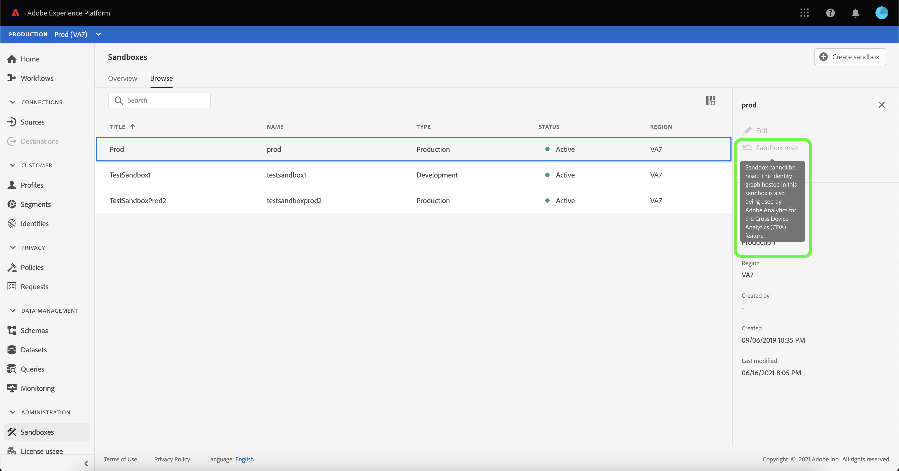

# Guía de la interfaz de usuario del Simulador para pruebas

Este documento proporciona pasos sobre cómo realizar varias operaciones relacionadas con entornos limitados en la interfaz de usuario de Adobe Experience Platform.

## Ver entornos limitados

En la interfaz de usuario de Platform, seleccione **[!UICONTROL Sandboxes]** en el panel de navegación izquierdo para abrir el tablero [!UICONTROL Sandboxes]. El tablero enumera todos los entornos limitados disponibles para su organización, incluido el tipo de entorno limitado (producción o desarrollo) y el estado (activo, creador, eliminado o fallido).

## Cambiar entre entornos limitados

El control **sandbox switch** en la parte superior izquierda de la pantalla muestra el entorno limitado activo actualmente.

Para cambiar entre entornos limitados, seleccione el conmutador de simulador de pruebas y seleccione el simulador de pruebas que desee en la lista desplegable.

Una vez seleccionado un simulador de pruebas, la pantalla se actualiza con el simulador de pruebas seleccionado que ahora aparece en el simulador de pruebas.

## Buscar un simulador de pruebas

Puede navegar por la lista de entornos limitados disponibles mediante la función de búsqueda del menú del conmutador de entornos limitados. Escriba el nombre del simulador de pruebas al que desea acceder para filtrar por todos los entornos limitados disponibles para su organización.

## Crear un nuevo simulador de pruebas

>[!NOTE]
>
>Cuando se crea un nuevo simulador para pruebas, primero debe agregar ese nuevo simulador para pruebas al perfil del producto en [Adobe Admin Console](https://adminconsole.adobe.com/) para poder empezar a usar el nuevo simulador para pruebas. Consulte la documentación sobre [administración de permisos para un perfil de producto](../../access-control/ui/permissions.md) para obtener información sobre cómo aprovisionar un simulador para pruebas a un perfil de producto.

Utilice el siguiente vídeo para obtener información general rápida sobre cómo utilizar entornos limitados en Experience Platform.

>[!VIDEO](https://video.tv.adobe.com/v/29838/?quality=12&learn=on)

Para crear un nuevo entorno limitado, seleccione **[!UICONTROL Crear entorno limitado]** en la esquina superior derecha de la pantalla.

Aparece el cuadro de diálogo **[!UICONTROL Crear entorno limitado]**. Si está creando un entorno limitado de desarrollo, seleccione **[!UICONTROL Desarrollo]** en el panel desplegable. Para crear un nuevo entorno limitado de producción, seleccione **[!UICONTROL Producción]**.

Después de seleccionar el tipo, proporcione un nombre y un título al simulador de pruebas. El título debe ser legible por el ser humano y debe ser lo suficientemente descriptivo como para ser fácilmente identificable. El nombre del simulador para pruebas es un identificador en minúsculas que se utiliza en las llamadas a la API y, por lo tanto, debe ser único y conciso. El nombre del simulador para pruebas debe comenzar con una letra, tener un máximo de 256 caracteres y constar únicamente de caracteres alfanuméricos y guiones (-).

Cuando termine, seleccione **[!UICONTROL Crear]**.

Una vez que haya terminado de crear el simulador para pruebas, actualice la página y aparecerá el nuevo simulador para pruebas en el tablero **[!UICONTROL Sandboxes]** con el estado &quot;[!UICONTROL Creating]&quot;. El sistema tarda aproximadamente 30 segundos en aprovisionar nuevos entornos limitados, tras lo cual su estado cambia a &quot;[!UICONTROL Activo]&quot;.

## Restablecer un simulador para pruebas

>[!IMPORTANT]
>
>No se puede restablecer el entorno limitado de producción predeterminado si Adobe Analytics también está utilizando el gráfico de identidad alojado en él para la función [Análisis entre dispositivos (CDA)](https://experienceleague.adobe.com/docs/analytics/components/cda/overview.html?lang=es) o si Adobe Audience Manager también está utilizando el gráfico de identidad alojado en él para la función [Destinos basados en personas (PBD)](https://experienceleague.adobe.com/docs/audience-manager/user-guide/features/destinations/people-based/people-based-destinations-overview.html) .

Al restablecer un entorno limitado de producción o desarrollo, se eliminan todos los recursos asociados a dicho entorno limitado (esquemas, conjuntos de datos, etc.), al tiempo que se mantienen el nombre del entorno limitado y los permisos asociados. Este simulador de pruebas &quot;limpio&quot; sigue estando disponible con el mismo nombre para los usuarios que tienen acceso a él.

Seleccione el simulador de pruebas que desea restablecer de la lista de entornos limitados. En el panel de navegación derecho que aparece, seleccione **[!UICONTROL Sandbox reset]**.

Aparece un cuadro de diálogo que le solicita que confirme su elección. Seleccione **[!UICONTROL Continue]** para continuar.

En la ventana de confirmación final, introduzca el nombre del simulador de pruebas en el cuadro de diálogo y seleccione **[!UICONTROL Reset]**

Después de unos momentos, aparece un cuadro de confirmación en la parte inferior de la pantalla para confirmar que el restablecimiento se ha realizado correctamente.

### Advertencias

No se puede restablecer un entorno limitado de producción predeterminado que contenga datos CDA y devuelve la siguiente advertencia.

Tampoco se puede restablecer un entorno limitado de producción predeterminado que contenga datos PBD y devuelve la siguiente advertencia.

Tampoco se puede restablecer un entorno limitado de producción predeterminado que contenga datos tanto para CDA como para PBD, y devuelve la siguiente advertencia.

Puede restablecer un simulador para pruebas de producción que se utilice para el uso compartido bidireccional de segmentos con [!DNL Audience Manager] o [!DNL Audience Core Service]. Seleccione [!UICONTROL Continuar] para continuar con el restablecimiento.

## Eliminación de un simulador para pruebas

>[!IMPORTANT]
>
>No se puede eliminar el entorno limitado de producción predeterminado.

Al eliminar un entorno limitado de producción o desarrollo, se eliminan permanentemente todos los recursos asociados a dicho entorno limitado, incluidos los permisos.

Seleccione el simulador de pruebas que desee eliminar de la lista de entornos limitados. En el panel de navegación derecho que aparece, seleccione **[!UICONTROL Eliminar]**.

Aparece un cuadro de diálogo que le solicita que confirme su elección. Seleccione **[!UICONTROL Continue]** para continuar.

En la ventana de confirmación final, introduzca el nombre del simulador de pruebas en el cuadro de diálogo y seleccione **[!UICONTROL Continue]**

Un entorno limitado de producción creado por el usuario que se utiliza para el uso compartido de segmentos bidireccionales con [!DNL Audience Manager] o [!DNL Audience Core Service] se puede eliminar después de la siguiente advertencia.

## Pasos siguientes

Este documento muestra cómo administrar entornos limitados dentro de la interfaz de usuario del Experience Platform. Para obtener información sobre cómo administrar entornos limitados mediante la API de espacio aislado, consulte la [guía para desarrolladores de entornos limitados](../api/getting-started.md).
