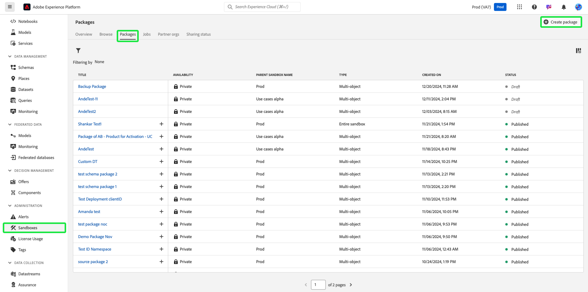

# Copia de seguridad de configuraciones de objeto mediante herramientas de zona protegida

Para restablecer de forma segura los entornos limitados y añadir compatibilidad con las versiones, haga una copia de seguridad de las configuraciones de objetos (o metadatos) mediante paquetes de herramientas de entorno limitado. Los paquetes de copia de seguridad evitan la pérdida de configuraciones críticas como esquemas, conjuntos de datos y audiencias, especialmente durante las iteraciones de desarrollo.

{zoomable="yes"}

## Por qué considerar este caso de uso {#why-this-use-case}

La creación de un paquete de copia de seguridad mediante la herramienta de entorno limitado garantiza que las configuraciones de objetos se almacenen y protejan. Los entornos limitados de desarrollo se pueden rellenar rápidamente a medida que experimenta y genera, mientras que la creación de un entorno limitado desde cero después de restablecerlo puede resultar lenta y dejar espacio para errores. Con la potencia de las herramientas de zona protegida, puede importar un paquete de copia de seguridad en una zona protegida recién restablecida para devolver inmediatamente las configuraciones ideales y así poder continuar desarrollando.

Los paquetes de copia de seguridad también le permiten admitir el control de versiones durante todo el proceso de desarrollo. A medida que cambie la zona protegida, cree paquetes de copia de seguridad adicionales junto con los paquetes anteriores para que pueda restaurar fácilmente la zona protegida a cualquiera de sus configuraciones.

## Requisitos previos y planificación {#prerequisites-and-planning}

Cuando planee crear su propio paquete de copia de seguridad dentro de su organización, tenga en cuenta los siguientes requisitos previos en el proceso de planificación:

- Evalúe los usos actuales de los entornos limitados de su organización. ¿Hay zonas protegidas que no sean de producción que se aproximen o excedan su derecho de licencia?
- ¿Cuál es el ámbito de los metadatos de los que desea realizar una copia de seguridad? Puede considerar la posibilidad de realizar una copia de seguridad de una zona protegida completa o parcial, según el caso de uso.
- Según los metadatos de ámbito de los que desee realizar una copia de seguridad, asegúrese de comprender cómo [agregar objetos manualmente a un paquete](../ui/sandbox-tooling.md#add-object-to-a-new-package) o cómo [exportar una zona protegida completa](../ui/sandbox-tooling.md#export-an-entire-sandbox).
- Asegúrese de que tiene acceso a las herramientas de zona protegida de su organización con los permisos correctos.

### Funcionalidad de la interfaz de usuario, componentes de Experience Platform y productos de Experience Cloud que utilizará {#ui-functionality-and-elements}

Para implementar correctamente este caso de uso, debe utilizar varias áreas de Adobe Experience Platform. Asegúrese de que tiene los [permisos de control de acceso basados en atributos](../../access-control/abac/overview.md) necesarios para todas estas áreas, o bien pídale al administrador del sistema que le conceda los permisos necesarios.

- [Herramientas de zona protegida](../ui/sandbox-tooling.md)
- [Administración de zona protegida](../ui/user-guide.md)
- [Panel de uso de licencias](../../landing/license-usage-and-guardrails/license-usage-dashboard.md)
- [Conjuntos de datos](../../catalog/datasets/overview.md)
- [Esquemas](../../xdm//home.md)
- [Públicos](../../segmentation/home.md)
- [Recorridos de Adobe Journey Optimizer](https://experienceleague.adobe.com/es/docs/journey-optimizer/using/orchestrate-journeys/journey)

## Cómo lograr el caso de uso: información general de alto nivel {#achieve-the-use-case-high-level}

1. Defina el ámbito de los metadatos de los que desea realizar una copia de seguridad.
2. Utilice la interfaz de usuario de herramientas de zona protegida para exportar los objetos deseados a un paquete de copia de seguridad.
3. Cree con regularidad nuevas versiones del paquete de copia de seguridad para garantizar que los entornos limitados permanezcan alineados con las configuraciones actuales.
4. Compruebe su uso actual en el panel de uso de licencias en relación con sus derechos para zonas protegidas que no sean de producción.
5. Restablezca los entornos limitados que no sean de producción para cumplir con los derechos o para liberar recursos y almacenamiento de datos innecesarios.
6. Importe el paquete de copia de seguridad en la zona protegida después de restablecerlo para restaurar las configuraciones de objeto.

## Cómo lograr el caso de uso: Instrucciones paso a paso {#step-by-step-instructions}

Lea las secciones siguientes, que incluyen vínculos a documentación adicional, para completar cada uno de los pasos de la descripción general de alto nivel anterior.

### Definición del ámbito de los metadatos

Antes de empezar a crear el paquete de copia de seguridad, debe tener en cuenta el caso de uso del paquete. Según sus necesidades, es posible que desee realizar una copia de seguridad de una zona protegida completa o seleccionar objetos específicos para agregarlos al paquete, como se menciona en los [requisitos previos](#prerequisites-and-planning).

>[!NOTE]
>
> Si está considerando hacer una copia de seguridad de su zona protegida para restablecerla, tenga en cuenta las [limitaciones](../ui/user-guide.md#reset-a-sandbox) que rodean el restablecimiento de las zonas protegidas.

### Exportar los metadatos seleccionados en un paquete

En este punto, ya puede realizar una copia de seguridad de la zona protegida mediante la interfaz de usuario de las herramientas para zonas protegidas. Este paso cubre la copia de seguridad de una zona protegida completa y la copia de seguridad de objetos específicos.

>[!NOTE]
>
> No todos los objetos son compatibles con las herramientas de zona protegida. Consulte la guía [objetos compatibles con las herramientas de la zona protegida](../ui/sandbox-tooling.md#objects-supported-for-sandbox-tooling) para obtener una lista completa de los objetos permitidos.

#### Exportar una zona protegida completa

Para realizar una copia de seguridad completa de la zona protegida, siga la [guía de herramientas de la zona protegida](../ui/sandbox-tooling.md#export-an-entire-sandbox) para crear y publicar un nuevo paquete que contenga las configuraciones de toda la zona protegida.

#### Exportación de objetos individuales

Puede realizar una copia de seguridad de objetos individuales en un paquete de cualquiera de las siguientes maneras. Aunque estas guías se centran en añadir un esquema al paquete, los mismos pasos se aplican a otros objetos, como conjuntos de datos, audiencias o recorridos.

- Agregue un objeto individual a un paquete nuevo, siguiendo la [guía de adición de objetos](../ui/sandbox-tooling.md#add-object-to-a-new-package) de la herramienta de zona protegida.
- Agregue un objeto individual a un paquete de copia de seguridad existente, siguiendo la [guía de herramientas de zona protegida](../ui/sandbox-tooling.md#add-an-object-to-an-existing-package-and-publish), asegurándose de publicar los cambios.
- Cree un paquete de varios objetos vacío al que añadir objetos, siguiendo la guía que aparece a continuación.

##### Creación de un paquete de varios objetos

En Experience Platform, seleccione **[!UICONTROL Zonas protegidas]** en el panel de navegación izquierdo y luego seleccione **[!UICONTROL Paquetes]**. Para empezar a crear un nuevo paquete, seleccione **[!UICONTROL Crear paquete]** en la esquina superior derecha.

Aparece el cuadro de diálogo **[!UICONTROL Crear paquete]**. Elige **[!UICONTROL Seleccionar objetos]** y luego selecciona **[!UICONTROL Seleccionar]**.

Seleccione la opción **[!UICONTROL Multi-object]**. Ahora, debe proporcionar un nombre para el nuevo paquete. Escriba el nombre que desee en el campo de texto **[!UICONTROL Nombre del paquete]**. Una vez finalizado, seleccione **[!UICONTROL Crear]**.

El nuevo paquete de varios objetos se ha creado y estará disponible en el panel [!UICONTROL Paquetes]. Seleccione el paquete en la lista.

Aparecerá la información y el contenido del paquete. Actualmente, no hay objetos en nuestro nuevo paquete. Para empezar a agregar objetos, siga la guía de [adición de objetos a un paquete existente](../ui/sandbox-tooling.md#add-object-to-a-new-package).

### Cree nuevas versiones del paquete de copia de seguridad según sea necesario

Ahora que ha creado el primer paquete de copia de seguridad para su zona protegida, querrá crear nuevas versiones del paquete de copia de seguridad a medida que cambien las configuraciones de la zona protegida.

Aunque es posible añadir nuevos objetos al paquete de copia de seguridad existente, se le recomienda crear nuevos paquetes para admitir el control de versiones en la zona protegida. Esto garantiza que pueda restablecer e importar fácilmente cualquier versión anterior de los entornos limitados a medida que continúa desarrollando.

### Comprobación de los usos actuales con respecto a los derechos de licencia

Ahora que el paquete de copia de seguridad está listo, puede restablecer la zona protegida para restablecer el uso. Debe monitorizar regularmente su uso para poder ajustar los derechos de licencia o restablecer la zona protegida según sea necesario. Puede consultar la [guía de uso de licencias](../../dashboards/guides/license-usage.md) para obtener más información sobre el tablero de uso de licencias.

### Restablecer la zona protegida

En este punto, puede restablecer de forma segura la zona protegida, suponiendo que cumpla los parámetros necesarios. Siga la guía de [restablecimiento de una zona protegida](../ui/user-guide.md#reset-a-sandbox) para comenzar a restablecer la zona protegida, asegurándose de leer los casos de la lista de advertencias que pueden impedir que restablezca la zona protegida.

### Importe el paquete de copia de seguridad recién creado en la zona protegida restablecida

Ahora que ha restablecido la zona protegida, puede utilizar el paquete de copia de seguridad que ha creado. Siga la [guía de herramientas de zona protegida](../ui/sandbox-tooling.md#import-a-package-to-a-target-sandbox) para obtener un proceso paso a paso sobre cómo importar un paquete en la zona protegida de destino.

## Otros casos de uso obtenidos mediante las herramientas de zona protegida: {#other-use-cases}

Explore más casos de uso habilitados mediante las herramientas de zona protegida:

- [Habilitación de un centro de excelencia mediante herramientas de zona protegida](./center-of-excellence.md)
