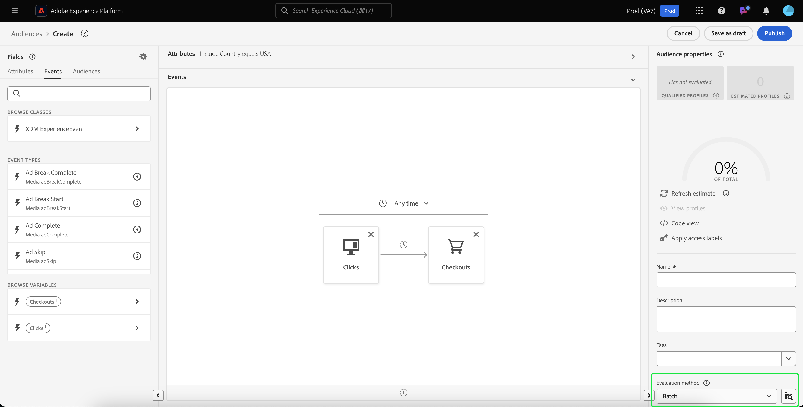

# Guía de segmentación por lotes

La segmentación por lotes es un método de evaluación de segmentación que le permite mover todos los datos de perfil a la vez para crear las audiencias correspondientes.

Con la segmentación por lotes, puede crear audiencias detalladas y enriquecidas, y ejecutar trabajos de segmentación para determinar cuándo desea que estos datos se propaguen a los servicios descendentes.

## Tipos de consulta aptos {#query-types}

Todas las consultas son aptas para la segmentación por lotes.

## Crear público {#create-audience}

Puede crear una audiencia que se evalúe mediante la segmentación por lotes utilizando la API del servicio de segmentación o a través de Audience Portal en la interfaz de usuario.

>[!BEGINTABS]

>[!TAB API del servicio de segmentación]

**Formato de API**

```http
POST /segment/definitions
```

**Solicitud**

+++ Una solicitud de ejemplo para crear una definición de segmento habilitada para la segmentación por lotes

```shell
curl -X POST https://platform.adobe.io/data/core/ups/segment/definitions
 -H 'Authorization: Bearer {ACCESS_TOKEN}' \
 -H 'Content-Type: application/json' \
 -H 'x-gw-ims-org-id: {ORG_ID}' \
 -H 'x-api-key: {API_KEY}' \
 -H 'x-sandbox-name: {SANDBOX_NAME}'
 -d '{
        "name": "People in the USA",
        "description: "An audience that looks for people who live in the USA",
        "expression": {
            "type": "PQL",
            "format": "pql/text",
            "value": "homeAddress.country = \"US\""
        },
        "evaluationInfo": {
            "batch": {
                "enabled": true
            },
            "continuous": {
                "enabled": false
            },
            "synchronous": {
                "enabled": false
            }
        },
        "schema": {
            "name": "_xdm.context.profile"
        }
     }'
```

+++

**Respuesta**

Una respuesta correcta devuelve el estado HTTP 200 con detalles de la definición del segmento recién creada.

+++Una respuesta de ejemplo al crear una definición de segmento.

```json
{
    "id": "4afe34ae-8c98-4513-8a1d-67ccaa54bc05",
    "schema": {
        "name": "_xdm.context.profile"
    },
    "profileInstanceId": "ups",
    "imsOrgId": "{ORG_ID}",
    "sandbox": {
        "sandboxId": "28e74200-e3de-11e9-8f5d-7f27416c5f0d",
        "sandboxName": "prod",
        "type": "production",
        "default": true
    },
    "name": "People in the USA",
    "description": "An audience that looks for people who live in the USA",
    "expression": {
        "type": "PQL",
        "format": "pql/text",
        "value": "homeAddress.country = \"US\""
    },
    "evaluationInfo": {
        "batch": {
            "enabled": true
        },
        "continuous": {
            "enabled": false
        },
        "synchronous": {
            "enabled": false
        }
    },
    "dataGovernancePolicy": {
        "excludeOptOut": true
    },
    "creationTime": 0,
    "updateEpoch": 1579292094,
    "updateTime": 1579292094000
}
```

+++

Encontrará más información sobre el uso de este extremo en la [guía de extremo de definición de segmento](../api/segment-definitions.md).

>[!TAB Portal de públicos]

En Audience Portal, seleccione **[!UICONTROL Crear audiencia]**.


Aparece una ventana emergente. Seleccione **[!UICONTROL Generar reglas]** para ingresar al Generador de segmentos.


Después de crear su definición de segmento, seleccione **[!UICONTROL Lote]** como **[!UICONTROL método de evaluación]**.



Para obtener más información sobre cómo crear definiciones de segmentos, lea la [guía del Generador de segmentos](../ui/segment-builder.md)

>[!ENDTABS]

## Recuperar audiencias {#retrieve-audiences}

Puede recuperar todas las audiencias que se evalúan mediante la segmentación por lotes utilizando la API del servicio de segmentación o a través de Audience Portal en la interfaz de usuario.

>[!BEGINTABS]

>[!TAB API del servicio de segmentación]

Recupere una lista de todas las definiciones de segmentos que se evalúan mediante la segmentación por lotes dentro de su organización realizando una petición GET al extremo `/segment/definitions`.

**Formato de API**

Debe incluir el parámetro de consulta `evaluationInfo.batch.enabled=true` en la ruta de solicitud para recuperar las definiciones de segmento evaluadas mediante la segmentación por lotes.

```http
GET /segment/definitions?evaluationInfo.batch.enabled=true
```

**Solicitud**

+++ Una solicitud de ejemplo para ver una lista de todas las definiciones de segmentos activadas por lotes

```shell
curl -X GET \
  'https://platform.adobe.io/data/core/ups/segment/definitions?evaluationInfo.batch.enabled=true' \
  -H 'Authorization: Bearer {ACCESS_TOKEN}' \
  -H 'Content-Type: application/json' \
  -H 'x-api-key: {API_KEY}' \
  -H 'x-gw-ims-org-id: {ORG_ID}' \
  -H 'x-sandbox-name: {SANDBOX_NAME}'
```

+++

**Respuesta**

Una respuesta correcta devuelve el estado HTTP 200 con una matriz de definiciones de segmentos en su organización que se evalúan mediante la segmentación por lotes.

+++Una respuesta de ejemplo que contiene una lista de todas las definiciones de segmentos evaluadas por segmentación por lotes de su organización

```json
{
    "segments": [
        {
            "id": "15063cb-2da8-4851-a2e2-bf59ddd2f004",
            "schema": {
                "name": "_xdm.context.profile"
            },
            "ttlInDays": 30,
            "imsOrgId": "{ORG_ID}",
            "sandbox": {
                "sandboxId": "",
                "sandboxName": "",
                "type": "production",
                "default": true
            },
            "name": " People who are NOT on their homepage ",
            "expression": {
                "type": "PQL",
                "format": "pql/text",
                "value": "select var1 from xEvent where var1._experience.analytics.endUser.firstWeb.webPageDetails.isHomePage = false"
            },
            "evaluationInfo": {
                "batch": {
                    "enabled": true
                },
                "continuous": {
                    "enabled": false
                },
                "synchronous": {
                    "enabled": false
                }
            },
            "creationTime": 1572029711000,
            "updateEpoch": 1572029712000,
            "updateTime": 1572029712000
        },
        {
            "id": "f15063cb-2da8-4851-a2e2-bf59ddd2f004",
            "schema": {
                "name": "_xdm.context.profile"
            },
            "ttlInDays": 30,
            "imsOrgId": "{ORG_ID}",
            "sandbox": {
                "sandboxId": "",
                "sandboxName": "",
                "type": "production",
                "default": true
            },
            "name": "Homepage_continuous",
            "description": "People who are on their homepage - continuous",
            "expression": {
                "type": "PQL",
                "format": "pql/text",
                "value": "select var1 from xEvent where var1._experience.analytics.endUser.firstWeb.webPageDetails.isHomePage = true"
            },
            "evaluationInfo": {
                "batch": {
                    "enabled": true
                },
                "continuous": {
                    "enabled": true
                },
                "synchronous": {
                    "enabled": false
                }
            },
            "creationTime": 1572021085000,
            "updateEpoch": 1572021086000,
            "updateTime": 1572021086000
        }
    ],
    "page": {
        "totalCount": 2,
        "totalPages": 1,
        "sortField": "creationTime",
        "sort": "desc",
        "pageSize": 2,
        "limit": 100
    },
    "link": {}
}
```

Encontrará información más detallada sobre la definición de segmento devuelta en la [guía de extremo de definiciones de segmento](../api/segment-definitions.md).

+++

>[!TAB Portal de públicos]

Puede recuperar todas las audiencias habilitadas para la segmentación por lotes en su organización mediante filtros en Audience Portal. Seleccione el icono de  para mostrar la lista de filtros.


Dentro de los filtros disponibles, ve a **[!UICONTROL Actualizar frecuencia]** y selecciona &quot;[!UICONTROL Lote]&quot;. El uso de este filtro muestra todas las audiencias de su organización que se evalúan mediante la segmentación por lotes.


Para obtener más información acerca de cómo ver audiencias en Platform, lea la [guía de Audience Portal](../ui/audience-portal.md).

>[!ENDTABS]

## Pasos siguientes

En esta guía se explica cómo crear una definición de segmento que se pueda evaluar mediante la segmentación por lotes en Adobe Experience Platform.

Para obtener más información acerca del uso de la interfaz de usuario de Experience Platform, lea la [Guía del usuario de segmentación](../ui/overview.md).

Para las preguntas más frecuentes sobre la segmentación por lotes, lea la sección [segmentación por lotes de las preguntas frecuentes](../faq.md#batch-segmentation).
