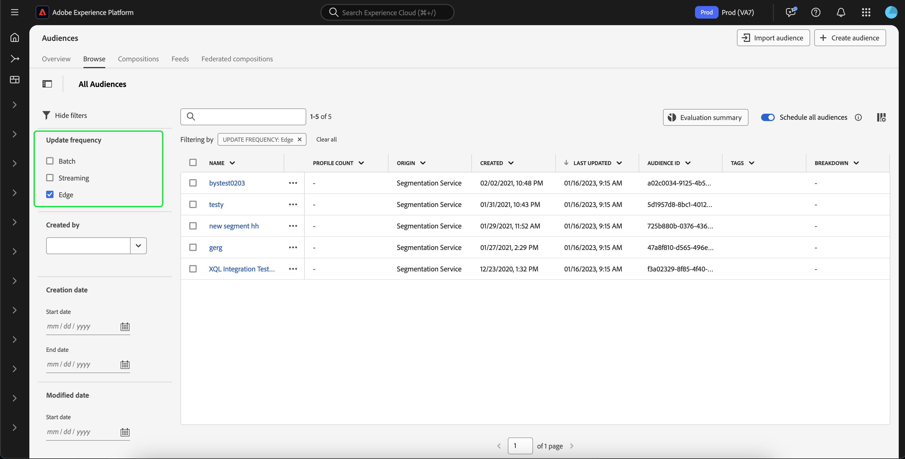

# Guía de segmentación de Edge

La segmentación de Edge es la capacidad de evaluar definiciones de segmentos en Adobe Experience Platform de forma instantánea [en el perímetro](../../landing/edge-and-hub-comparison.md), lo que permite casos de uso de personalización de la misma página y de la siguiente.

>[!IMPORTANT]
>
> Los datos perimetrales se almacenarán en una ubicación del servidor perimetral más cercana a la ubicación donde se recopilaron. Estos datos también se pueden almacenar en una ubicación distinta a la designada como centro (o principal) del centro de datos de Adobe Experience Platform.
>
> Además, el motor de segmentación de Edge solo aceptará solicitudes en Edge donde haya **una** identidad principal marcada, lo cual es coherente con las identidades principales no basadas en Edge.

## Tipos de consultas de segmentación de Edge {#query-types}

Una consulta se puede evaluar con la segmentación de extremos si cumple cualquiera de los criterios descritos en la siguiente tabla.

>[!NOTE]
>
>Si la consulta coincide con cualquiera de los tipos de consulta de la tabla siguiente, se evaluará automáticamente mediante la segmentación de extremos. El sistema determina esta capacidad automáticamente en función de la expresión de consulta.

| Tipo de consulta | Detalles | Consulta | Ejemplo |
| ---------- | ------- | ----- | ------- |
| Evento único en un intervalo de tiempo inferior a 24 horas | Cualquier definición de segmento que haga referencia a un único evento entrante en un intervalo de tiempo inferior a 24 horas. | `CHAIN(xEvent, timestamp, [C0: WHAT(eventType.equals("commerce.checkouts", false)) WHEN(today)])` |  |
| Solo perfil | Cualquier definición de segmento que haga referencia únicamente a un atributo de perfil. | `homeAddress.country.equals("US", false)` |  |
| Evento único con un atributo de perfil en un intervalo de tiempo relativo inferior a 24 horas | Cualquier definición de segmento que haga referencia a un único evento entrante, con uno o más atributos de perfil, y que se produzca en un intervalo de tiempo relativo inferior a 24 horas. | `workAddress.country.equals("US", false) and CHAIN(xEvent, timestamp, [C0: WHAT(eventType.equals("commerce.checkouts", false)) WHEN(today)])` |  |
| Segmento de segmentos | Cualquier definición de segmento que contenga uno o más segmentos por lotes o segmentos perimetrales. **Nota:** Si se usa un segmento de segmentos, la descalificación del perfil se producirá **cada 24 horas**. | `inSegment("a730ed3f-119c-415b-a4ac-27c396ae2dff") and inSegment("8fbbe169-2da6-4c9d-a332-b6a6ecf559b9")` |  |
| Varios eventos con un atributo de perfil | Cualquier definición de segmento que haga referencia a varios eventos **en las últimas 24 horas** y (opcionalmente) tenga uno o más atributos de perfil. | `workAddress.country.equals("US", false) and CHAIN(xEvent, timestamp, [C0: WHAT(eventType.equals("directMarketing.emailClicked", false)) WHEN(today), C1: WHAT(eventType.equals("commerce.checkouts", false)) WHEN(today)])` |  |

Además, la definición del segmento **debe** estar vinculada a una política de combinación que esté activa en Edge. Para obtener más información acerca de las políticas de combinación, lea la [guía de políticas de combinación](../../profile/api/merge-policies.md).

Una definición de segmento **no** será elegible para la segmentación de Edge en el siguiente escenario:

- La definición del segmento incluye una combinación de un solo evento y un evento `inSegment`.
   - Sin embargo, si la definición del segmento contenida en el evento `inSegment` es solo de perfil, la definición del segmento **se** habilitará para la segmentación de Edge.
- La definición del segmento utiliza &quot;Ignorar año&quot; como parte de sus restricciones de tiempo.

## Crear público {#create-audience}

Puede crear una audiencia que se evalúe mediante la segmentación de Edge mediante la API del servicio de segmentación o a través de Audience Portal en la interfaz de usuario de.

Una definición de segmento puede habilitarse para Edge si coincide con uno de los [tipos de consulta aptos](#eligible-query-types).

>[!BEGINTABS]

>[!TAB API del servicio de segmentación]

**Formato de API**

```http
POST /segment/definitions
```

**Solicitud**

+++ Una solicitud de ejemplo para crear una definición de segmento habilitada para la segmentación de Edge

```shell
curl -X POST https://platform.adobe.io/data/core/ups/segment/definitions
 -H 'Authorization: Bearer {ACCESS_TOKEN}' \
 -H 'Content-Type: application/json' \
 -H 'x-gw-ims-org-id: {ORG_ID}' \
 -H 'x-api-key: {API_KEY}' \
 -H 'x-sandbox-name: {SANDBOX_NAME}'
 -d '{
        "name": "People in the USA",
        "description: "An audience that looks for people who live in the USA",
        "expression": {
            "type": "PQL",
            "format": "pql/text",
            "value": "homeAddress.country = \"US\""
        },
        "evaluationInfo": {
            "batch": {
                "enabled": false
            },
            "continuous": {
                "enabled": false
            },
            "synchronous": {
                "enabled": true
            }
        },
        "schema": {
            "name": "_xdm.context.profile"
        }
     }'
```

+++

**Respuesta**

Una respuesta correcta devuelve el estado HTTP 200 con detalles de la definición del segmento recién creada.

+++Una respuesta de ejemplo al crear una definición de segmento.

```json
{
    "id": "4afe34ae-8c98-4513-8a1d-67ccaa54bc05",
    "schema": {
        "name": "_xdm.context.profile"
    },
    "profileInstanceId": "ups",
    "imsOrgId": "{ORG_ID}",
    "sandbox": {
        "sandboxId": "28e74200-e3de-11e9-8f5d-7f27416c5f0d",
        "sandboxName": "prod",
        "type": "production",
        "default": true
    },
    "name": "People in the USA",
    "description": "An audience that looks for people who live in the USA",
    "expression": {
        "type": "PQL",
        "format": "pql/text",
        "value": "homeAddress.country = \"US\""
    },
    "evaluationInfo": {
        "batch": {
            "enabled": false
        },
        "continuous": {
            "enabled": false
        },
        "synchronous": {
            "enabled": true
        }
    },
    "dataGovernancePolicy": {
        "excludeOptOut": true
    },
    "creationTime": 0,
    "updateEpoch": 1579292094,
    "updateTime": 1579292094000
}
```

+++

Encontrará más información sobre el uso de este extremo en la [guía de extremo de definición de segmento](../api/segment-definitions.md).

>[!TAB Portal de públicos]

En Audience Portal, seleccione **[!UICONTROL Crear audiencia]**.


Aparece una ventana emergente. Seleccione **[!UICONTROL Generar reglas]** para ingresar al Generador de segmentos.


En el Generador de segmentos, cree una definición de segmento que coincida con uno de los [tipos de consulta aptos](#eligible-query-types). Si la definición del segmento cumple los requisitos para la segmentación de Edge, podrá seleccionar **[!UICONTROL Edge]** como **[!UICONTROL método de evaluación]**.


Para obtener más información sobre cómo crear definiciones de segmentos, lea la [guía del Generador de segmentos](../ui/segment-builder.md)

>[!ENDTABS]

## Recuperar audiencias evaluadas mediante la segmentación de Edge {#retrieve-audiences}

Puede recuperar todas las audiencias que se evalúan mediante la segmentación de Edge mediante la API del servicio de segmentación o a través de Audience Portal en la interfaz de usuario.

>[!BEGINTABS]

>[!TAB API del servicio de segmentación]

Recupere una lista de todas las definiciones de segmentos que se evalúan mediante la segmentación de extremos dentro de su organización realizando una petición GET al extremo `/segment/definitions`.

**Formato de API**

Debe incluir el parámetro de consulta `evaluationInfo.synchronous.enabled=true` en la ruta de solicitud para recuperar las definiciones de segmento evaluadas mediante la segmentación de Edge.

```http
GET /segment/definitions?evaluationInfo.synchronous.enabled=true
```

**Solicitud**

+++ Una solicitud de ejemplo para ver una lista de todas las definiciones de segmentos con Edge habilitado

```shell
curl -X GET \
  'https://platform.adobe.io/data/core/ups/segment/definitions?evaluationInfo.synchronous.enabled=true' \
  -H 'Authorization: Bearer {ACCESS_TOKEN}' \
  -H 'x-api-key: {API_KEY}' \
  -H 'x-gw-ims-org-id: {ORG_ID}' \
  -H 'x-sandbox-name: {SANDBOX_NAME}'
```

+++

**Respuesta**

Una respuesta correcta devuelve el estado HTTP 200 con una matriz de definiciones de segmentos en su organización que están habilitadas para la segmentación de Edge.

+++ Una respuesta de ejemplo que contiene una lista de todas las definiciones de segmentos habilitadas para la segmentación de Edge de su organización

```json
{
    "segments": [
        {
            "id": "15063cb-2da8-4851-a2e2-bf59ddd2f004",
            "schema": {
                "name": "_xdm.context.profile"
            },
            "imsOrgId": "{ORG_ID}",
            "sandbox": {
                "sandboxId": "",
                "sandboxName": "",
                "type": "production",
                "default": true
            },
            "name": " People who are NOT on their homepage ",
            "expression": {
                "type": "PQL",
                "format": "pql/text",
                "value": "select var1 from xEvent where var1._experience.analytics.endUser.firstWeb.webPageDetails.isHomePage = false"
            },
            "evaluationInfo": {
                "batch": {
                    "enabled": false
                },
                "continuous": {
                    "enabled": false
                },
                "synchronous": {
                    "enabled": true
                }
            },
            "creationTime": 1572029711000,
            "updateEpoch": 1572029712000,
            "updateTime": 1572029712000
        },
        {
            "id": "f15063cb-2da8-4851-a2e2-bf59ddd2f004",
            "schema": {
                "name": "_xdm.context.profile"
            },
            "imsOrgId": "{ORG_ID}",
            "sandbox": {
                "sandboxId": "",
                "sandboxName": "",
                "type": "production",
                "default": true
            },
            "name": "Homepage_continuous",
            "description": "People who are on their homepage - continuous",
            "expression": {
                "type": "PQL",
                "format": "pql/text",
                "value": "select var1 from xEvent where var1._experience.analytics.endUser.firstWeb.webPageDetails.isHomePage = true"
            },
            "evaluationInfo": {
                "batch": {
                    "enabled": false
                },
                "continuous": {
                    "enabled": false
                },
                "synchronous": {
                    "enabled": true
                }
            },
            "creationTime": 1572021085000,
            "updateEpoch": 1572021086000,
            "updateTime": 1572021086000
        }
    ],
    "page": {
        "totalCount": 2,
        "totalPages": 1,
        "sortField": "creationTime",
        "sort": "desc",
        "pageSize": 2,
        "limit": 100
    },
    "link": {}
}
```

Encontrará información más detallada sobre la definición de segmento devuelta en la [guía de extremo de definiciones de segmento](../api/segment-definitions.md).

+++

>[!TAB Portal de públicos]

Puede recuperar todas las audiencias habilitadas para la segmentación de Edge dentro de su organización mediante filtros en Audience Portal. Seleccione el icono de  para mostrar la lista de filtros.


Dentro de los filtros disponibles, ve a **Actualizar frecuencia** y selecciona &quot;Edge&quot;. Con este filtro se muestran todas las audiencias de la organización que se evalúan mediante la segmentación de Edge.



Para obtener más información acerca de cómo ver audiencias en Experience Platform, lea la [guía de Audience Portal](../ui/audience-portal.md).

>[!ENDTABS]

## Detalles de público {#audience-details}

Puede ver los detalles de una audiencia específica evaluada mediante la segmentación de Edge seleccionándola en Audience Portal.

Después de seleccionar una audiencia en Audience Portal, aparece la página de detalles de la audiencia. Muestra información sobre la audiencia, incluido un resumen de los detalles de la audiencia, la cantidad de perfiles cualificados a lo largo del tiempo, así como los destinos a los que se ha activado la audiencia.


Para audiencias habilitadas para Edge, se muestra la tarjeta **[!UICONTROL Perfiles a lo largo del tiempo]**, que muestra el total de métricas calificadas y actualizadas de la nueva audiencia.

La métrica **[!UICONTROL Total de audiencias calificadas]** representa el número total de audiencias calificadas, según las evaluaciones de Edge para esta audiencia.

La métrica **[!UICONTROL Nueva audiencia actualizada]** está representada por un gráfico de líneas que muestra el cambio en el tamaño de la audiencia a través de la segmentación de Edge. Puede ajustar el menú desplegable para mostrar las últimas 24 horas, la semana pasada o los últimos 30 días.


Para obtener más información sobre los detalles de la audiencia, lea la [descripción general del Portal de audiencias](../ui/audience-portal.md#audience-details).

## Pasos siguientes

En esta guía se explica qué es la segmentación de Edge, así como cómo crear una definición de segmento que se pueda evaluar mediante la segmentación de Edge en Adobe Experience Platform.

Para obtener más información acerca del uso de la interfaz de usuario de Experience Platform, lea la [Guía del usuario de segmentación](./overview.md).

Para las preguntas frecuentes acerca de la segmentación de Edge, lea la sección [segmentación de Edge de las preguntas frecuentes](../faq.md#edge-segmentation).

