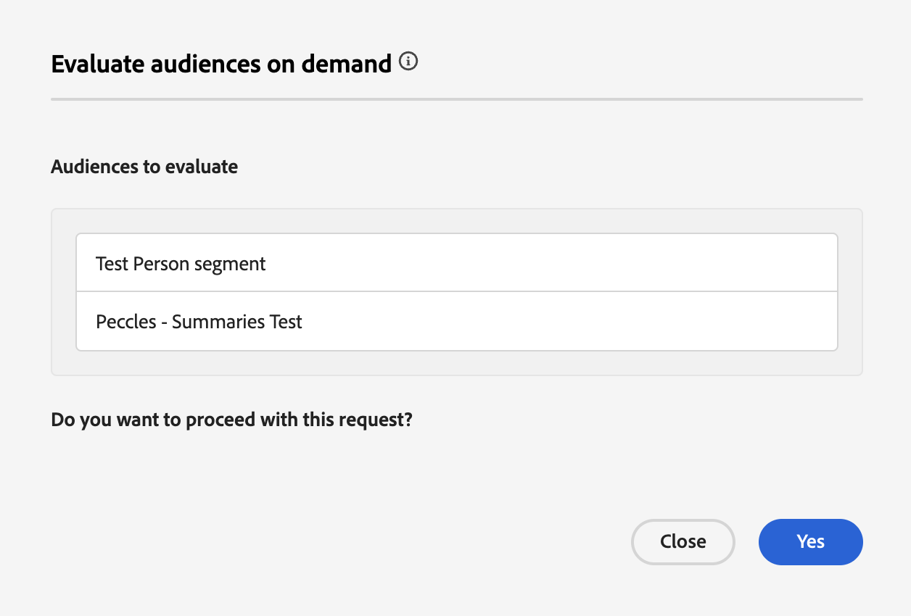

# Guía flexible de evaluación de audiencias

>[!AVAILABILITY]
>
>La evaluación de audiencia flexible está **solamente** disponible en las instancias de Experience Platform que se ejecutan en [!DNL Microsoft Azure]. Para obtener más información sobre la infraestructura de Experience Platform compatible, consulte la [descripción general de la nube múltiple de Experience Platform](../../landing/multi-cloud.md).
>
>Además, la evaluación de audiencia flexible está **solamente** disponible para usar con Real-Time CDP B2C Edition.

La evaluación flexible de audiencias le permite ejecutar un trabajo de segmentación por lotes bajo demanda. Con la evaluación flexible de audiencias, puede ejecutar lanzamientos de campañas ad-hoc, comunicaciones puntuales u otras actividades en las que el tiempo sea un factor importante.

## Mecanismos de protección {#guardrails}

>[!CONTEXTUALHELP]
>id="platform_segmentation_browse_flexibleaudienceevaluation"
>title="Límites flexibles de evaluación de público"
>abstract="Puede evaluar hasta 20 públicos en una sola ejecución flexible de evaluación de públicos.<br/><br/>Además, mientras el trabajo de evaluación se ejecuta lo antes posible, puede haber retrasos en el sistema, ya que las evaluaciones bajo demanda <b>no se pueden</b> ejecutar simultáneamente con otra evaluación bajo demanda o por lotes."

Cuando ejecute una evaluación de audiencia flexible, tenga en cuenta las siguientes condiciones:

- Solo puede usar la evaluación de audiencia flexible **dos veces** al día por zona protegida. Este límite se restablece a medianoche (UTC).
- Tiene un **máximo** de 50 ejecuciones flexibles de evaluación de audiencia por año por cada zona protegida de **producción**.
- Tiene un **máximo** de 100 ejecuciones flexibles de evaluación de audiencia por año por cada zona protegida de **desarrollo**.
- Todas las audiencias **deben** tener un origen de &quot;Servicio de segmentación&quot;.
- Todas las audiencias **deben** evaluarse mediante la segmentación por lotes.
- Todas las audiencias **deben** estar basadas en personas.
- Solo puede seleccionar un máximo de 20 audiencias por ejecución de evaluación de audiencia flexible.

>[!NOTE]
>
>Puede adquirir ejecuciones de evaluación de audiencia flexibles adicionales por año. Para obtener más información, póngase en contacto con el Servicio de atención al cliente de Adobe.

## Acceso {#access}

Para utilizar la evaluación de audiencia flexible, debe tener los siguientes permisos:

- **[!UICONTROL Evaluar segmento a una audiencia]** en la sección **[!DNL Profile Management]**.

Para obtener más información sobre el control de acceso basado en roles, lea la [descripción general del control de acceso](../../access-control/home.md).

## Ejecución de una evaluación de audiencia flexible

Puede ejecutar una evaluación de audiencia flexible mediante las API o la interfaz de usuario de Experience Platform.

>[!BEGINTABS]

>[!TAB API de Experience Platform]

Para ejecutar una evaluación de audiencia flexible dentro de las API de Experience Platform, deberá crear un trabajo de segmento que contenga los ID de todas las definiciones de segmento (audiencias) que desee evaluar.

>[!NOTE]
>
>Solo puede agregar un **máximo** de 20 ID de definición de segmento por llamada de API de trabajo de segmento.

Puede crear un nuevo trabajo de segmento realizando una petición POST al extremo `/segment/jobs` e incluyendo los ID de las definiciones de segmento en el cuerpo de la solicitud.

+++Una solicitud de ejemplo para crear un nuevo trabajo de segmentación

```shell
curl -X POST https://platform.adobe.io/data/core/ups/segment/jobs \
 -H 'Authorization: Bearer {ACCESS_TOKEN}' \
 -H 'Content-Type: application/json' \
 -H 'x-gw-ims-org-id: {ORG_ID}' \
 -H 'x-api-key: {API_KEY}' \
 -H 'x-sandbox-name: {SANDBOX_NAME}' \
 -d '[
    {
        "segmentId": "7863c010-e092-41c8-ae5e-9e533186752e"
    },
    {
        "segmentId": "07d39471-05d1-4083-a310-d96978fd7c85"
    }
 ]'
```

| Propiedad | Descripción |
| -------- | ----------- |
| `segmentId` | El ID de la definición del segmento que desea evaluar. Estas definiciones de segmentos pueden pertenecer a distintas políticas de combinación. |

+++

Una respuesta correcta devuelve el estado HTTP 200 con información sobre el trabajo de segmento recién creado.

+++ Una respuesta de ejemplo al crear un nuevo trabajo de segmentación.

```json
{
    "id": "b31aed3d-b3b1-4613-98c6-7d3846e8d48f",
    "imsOrgId": "{ORG_ID}",
    "sandbox": {
        "sandboxId": "28e74200-e3de-11e9-8f5d-7f27416c5f0d",
        "sandboxName": "prod",
        "type": "production",
        "default": true
    },
    "profileInstanceId": "ups",
    "source": "api",
    "status": "PROCESSING",
    "batchId": "678f53bc-e21d-4c47-a7ec-5ad0064f8e4c",
    "computeJobId": 8811,
    "computeGatewayJobId": "9ea97b25-a0f5-410e-ae87-b2d85e58f399",
    "segments": [
        {
            "segmentId": "7863c010-e092-41c8-ae5e-9e533186752e",
            "segment": {
                "id": "7863c010-e092-41c8-ae5e-9e533186752e",
                "expression": {
                    "type": "PQL",
                    "format": "pql/json",
                    "value": "workAddress.country = \"US\""
                },
                "mergePolicyId": "25c548a0-ca7f-4dcd-81d5-997642f178b9",
                "mergePolicy": {
                    "id": "25c548a0-ca7f-4dcd-81d5-997642f178b9",
                    "version": 1
                }
            }
        },
        {
            "segmentId": "07d39471-05d1-4083-a310-d96978fd7c85",
            "segment": {
                "id": "07d39471-05d1-4083-a310-d96978fd7c85",
                "expression": {
                    "type": "PQL",
                    "format": "pql/json",
                    "value": "workAddress.country = \"US\""
                },
                "mergePolicyId": "25c548a0-ca7f-4dcd-81d5-997642f178b9",
                "mergePolicy": {
                    "id": "25c548a0-ca7f-4dcd-81d5-997642f178b9",
                    "version": 1
                }
            }
        }
    ],
    "metrics": {
        "totalTime": {
            "startTimeInMs": 1573203617195,
            "endTimeInMs": 1573204395655,
            "totalTimeInMs": 778460
        },
        "profileSegmentationTime": {
            "startTimeInMs": 1573204266727,
            "endTimeInMs": 1573204395655,
            "totalTimeInMs": 128928
        },
        "segmentedProfileCounter":{
            "7863c010-e092-41c8-ae5e-9e533186752e":1033
        },
        "segmentedProfileByNamespaceCounter":{
            "7863c010-e092-41c8-ae5e-9e533186752e":{
                "tenantiduserobjid":1033,
                "campaign_profile_mscom_mkt_prod2":1033
            }
        },
        "segmentedProfileByStatusCounter":{
            "7863c010-e092-41c8-ae5e-9e533186752e":{
                "exited":144646,
                "realized":2056
            }
        },
        "totalProfiles":13146432,
        "totalProfilesByMergePolicy":{
            "25c548a0-ca7f-4dcd-81d5-997642f178b9":13146432
        }
    },
    "requestId": "4e538382-dbd8-449e-988a-4ac639ebe72b-1573203600264",
    "schema": {
        "name": "_xdm.context.profile"
    },
    "properties": {
        "scheduleId": "4e538382-dbd8-449e-988a-4ac639ebe72b",
        "runId": "e6c1308d-0d4b-4246-b2eb-43697b50a149"
    },
    "_links": {
        "cancel": {
            "href": "/segment/jobs/b31aed3d-b3b1-4613-98c6-7d3846e8d48f",
            "method": "DELETE"
        },
        "checkStatus": {
            "href": "/segment/jobs/b31aed3d-b3b1-4613-98c6-7d3846e8d48f",
            "method": "GET"
        }
    },
    "updateTime": 1573204395000,
    "creationTime": 1573203600535,
    "updateEpoch": 1573204395
}
```

+++

Después de crear el trabajo de segmento, puede comprobar su estado realizando una petición GET al extremo `/segment/jobs`, proporcionando el ID del trabajo de segmento recién creado en la ruta de solicitud.

+++Solicitud de muestra para recuperar un trabajo de segmentación

```shell
curl -X GET https://platform.adobe.io/data/core/ups/segment/jobs/b31aed3d-b3b1-4613-98c6-7d3846e8d48f \
 -H 'Authorization: Bearer {ACCESS_TOKEN}' \
 -H 'x-gw-ims-org-id: {ORG_ID}' \
 -H 'x-api-key: {API_KEY}' \
 -H 'x-sandbox-name: {SANDBOX_NAME}'
```

+++

Una respuesta correcta devuelve el estado HTTP 200 con información detallada sobre el trabajo de segmento especificado.


+++ Una respuesta de ejemplo para recuperar un trabajo de segmentación.

```json
{
    "id": "b31aed3d-b3b1-4613-98c6-7d3846e8d48f",
    "imsOrgId": "{ORG_ID}",
    "sandbox": {
        "sandboxId": "28e74200-e3de-11e9-8f5d-7f27416c5f0d",
        "sandboxName": "prod",
        "type": "production",
        "default": true
    },
    "profileInstanceId": "ups",
    "source": "api",
    "status": "SUCCEEDED",
    "batchId": "678f53bc-e21d-4c47-a7ec-5ad0064f8e4c",
    "computeJobId": 8811,
    "computeGatewayJobId": "9ea97b25-a0f5-410e-ae87-b2d85e58f399",
    "segments": [
        {
            "segmentId": "7863c010-e092-41c8-ae5e-9e533186752e",
            "segment": {
                "id": "7863c010-e092-41c8-ae5e-9e533186752e",
                "expression": {
                    "type": "PQL",
                    "format": "pql/text",
                    "value": "workAddress.country = \"US\""
                },
                "mergePolicyId": "25c548a0-ca7f-4dcd-81d5-997642f178b9",
                "mergePolicy": {
                    "id": "25c548a0-ca7f-4dcd-81d5-997642f178b9",
                    "version": 1
                }
            }
        },
        {
            "segmentId": "07d39471-05d1-4083-a310-d96978fd7c85",
            "segment": {
                "id": "07d39471-05d1-4083-a310-d96978fd7c85",
                "expression": {
                    "type": "PQL",
                    "format": "pql/json",
                    "value": "workAddress.country = \"US\""
                },
                "mergePolicyId": "25c548a0-ca7f-4dcd-81d5-997642f178b9",
                "mergePolicy": {
                    "id": "25c548a0-ca7f-4dcd-81d5-997642f178b9",
                    "version": 1
                }
            }
        }
    ],
    "metrics": {
        "totalTime": {
            "startTimeInMs": 1579304313411
        },
        "profileSegmentationTime": {}
    },
    "requestId": "4e538382-dbd8-449e-988a-4ac639ebe72b-1573203600264",
    "schema": {
        "name": "_xdm.context.profile"
    },
    "_links": {
        "cancel": {
            "href": "/segment/jobs/d3b4a50d-dfea-43eb-9fca-557ea53771fd",
            "method": "DELETE"
        },
        "checkStatus": {
            "href": "/segment/jobs/d3b4a50d-dfea-43eb-9fca-557ea53771fd",
            "method": "GET"
        }
    },
    "updateTime": 1579304339000,
    "creationTime": 1579304260897,
    "updateEpoch": 1579304339
}
```

+++

>[!TAB IU DE Experience Platform]

Para ejecutar una evaluación de audiencia flexible dentro de la interfaz de usuario de Experience Platform, seleccione **[!UICONTROL Audiencias]** en la sección **[!UICONTROL Clientes]**.


Se muestra Audience Portal, con una lista de todas las audiencias de personas de la organización. En Audience Portal, puede elegir las audiencias que desea evaluar y seleccionar **[!UICONTROL Evaluar audiencia]**.


Aparece la ventana emergente **[!UICONTROL Evaluar audiencias bajo demanda]**, que muestra la lista de audiencias que se evaluarán con el trabajo del segmento bajo demanda. Si una audiencia no puede evaluarse bajo demanda, se elimina automáticamente del trabajo de evaluación. Confirme que las audiencias de la lista son las que desea que se evalúen.



Después de confirmar que se enumeran las audiencias correctas, puede continuar con la solicitud, y comenzará la evaluación flexible de audiencias. Puede ver el estado de esta evaluación de audiencia en la [vista de supervisión del trabajo de evaluación](../../dataflows/ui/monitor-audiences.md#evaluation-job-details).

>[!NOTE]
>
>El estado del trabajo del segmento puede informarse como en &quot;En cola&quot; en el panel de monitorización. Puede ver el estado más actualizado del trabajo del segmento realizando una petición GET al extremo `/segment/jobs`, proporcionando el ID del trabajo del segmento en la ruta de solicitud. Puede encontrar más información sobre el uso de este extremo en la pestaña API.
>
>Si ejecuta una evaluación de audiencia flexible y desea que la evaluación active la audiencia en un destino, debe asegurarse de que la frecuencia esté establecida en **[!UICONTROL Después de la evaluación del segmento]**. La ejecución de una evaluación de audiencia flexible en audiencias que ya están configuradas para activarse [después de la evaluación de segmentos](../../destinations/ui/activate-batch-profile-destinations.md#export-full-files), activará las audiencias en cuanto finalice el trabajo de evaluación de audiencia flexible, independientemente de cualquier trabajo de activación diario anterior.

>[!ENDTABS]

## Vídeo {#video}

En el siguiente vídeo se muestra cómo acceder y utilizar la evaluación de audiencia flexible en Experience Platform.

>[!VIDEO](https://video.tv.adobe.com/v/3453640?)

## Preguntas frecuentes {#faq}

En la siguiente sección se enumeran las preguntas más frecuentes relacionadas con la evaluación flexible de audiencias.

### ¿Con qué frecuencia puedo activar una audiencia mediante una evaluación de audiencia flexible?

+++ Respuesta

Puede activar una audiencia utilizando una evaluación de audiencia flexible inmediatamente después de su creación.

+++

### ¿Cuánto tiempo tarda la evaluación flexible de audiencias?

+++ Respuesta

Un trabajo flexible de evaluación de audiencias puede tardar hasta cuatro horas en completarse.

+++

### ¿Puedo ejecutar la programación con una evaluación de audiencia flexible?

+++ Respuesta

No, la programación no está disponible para su uso con una evaluación de audiencia flexible.

+++

### ¿Debo ejecutar un trabajo de exportación adicional al utilizar una evaluación de audiencia flexible?

+++ Respuesta

No, el trabajo de exportación se ejecuta automáticamente una vez completado el trabajo de segmento correspondiente.

+++

### ¿Qué servicios puedo utilizar para evaluar audiencias con evaluación de audiencia flexible?

+++ Respuesta

Puede utilizar audiencias en todos los servicios descendentes, incluidos destinos y recorridos de Adobe Journey Optimizer.

+++

### ¿Cuándo se restablecen los límites flexibles de evaluación de audiencia?

+++ Respuesta

El límite diario se restablece a medianoche (UTC). El límite anual se restablece en la fecha de aniversario de su contrato.

+++

### ¿Qué tipos de audiencias se admiten con la evaluación de audiencias flexible?

+++ Respuesta

Para una evaluación de audiencia flexible, solo se admiten audiencias con el origen del servicio de segmentación. Otras audiencias, como composiciones, carga personalizada o Data Distiller, no son compatibles con la evaluación flexible de audiencias.

+++

### ¿Qué ejecuciones contribuyen a mi recuento flexible de ejecuciones de evaluación de audiencia?

+++ Respuesta

Las ejecuciones de evaluación de audiencia flexibles que se crearon mediante la API o el recuento de IU hasta el límite máximo. Sin embargo, la ejecución diaria del trabajo de segmentación por lotes que se ejecuta todas las noches **no** contribuye a este límite.

+++

### ¿Debo evaluar todas las audiencias dependientes al evaluar la audiencia principal con una evaluación de audiencia flexible?

+++ Respuesta

No. La evaluación flexible de audiencias evaluará automáticamente todas las audiencias dependientes. Por ejemplo, si la audiencia A depende de la audiencia B, solo necesita evaluar la audiencia B. Una evaluación de audiencia flexible evaluará automáticamente la audiencia A y luego la audiencia B.

+++
