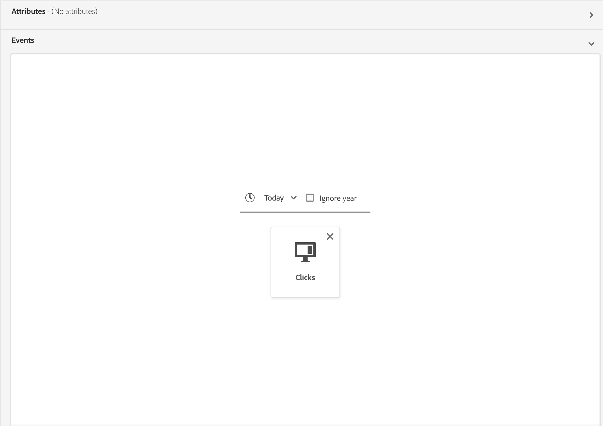
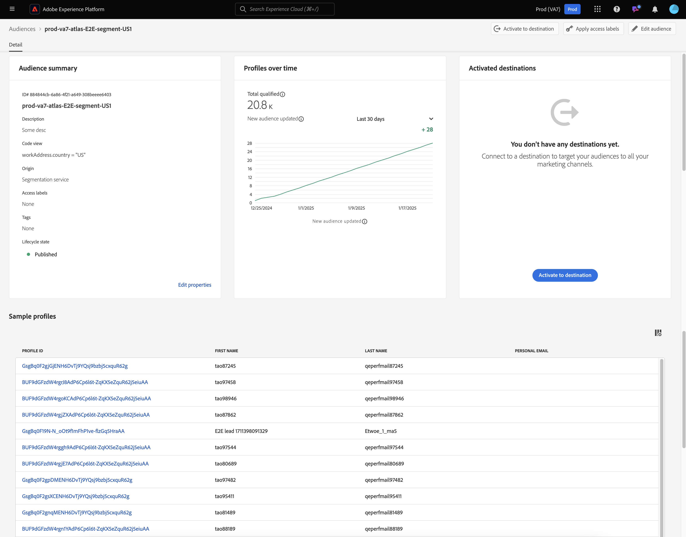

# Streaming segmentation guide

>[!BEGINSHADEBOX]

>[!NOTE]
>
>The streaming segmentation eligibility criteria have updated on May 20, 2025.

+++Eligibility updates

>[!IMPORTANT]
>
>Todas las definiciones de segmento existentes que se evalúan actualmente mediante streaming o segmentación de bordes seguirán funcionando tal cual, a menos que se editen o actualicen.

## Conjunto de reglas {#ruleset}

Cualquier definición de segmento **nueva o editada** que coincida con los siguientes conjuntos de reglas **ya no** se evaluará mediante streaming o segmentación de bordes. En su lugar, se evaluarán mediante la segmentación por lotes.

- Un único evento con un intervalo de tiempo superior a 24 horas
   - Activar una audiencia con todos los perfiles que hayan visto una página web en los últimos 3 días.
- Un solo evento sin ventana de tiempo
   - Active una audiencia con todos los perfiles que hayan visto una página web.

## Periodo de tiempo {#time-window}

Para evaluar una audiencia con segmentación por streaming, **debe** estar restringida en un período de tiempo de 24 horas.

## Inclusión de datos por lotes en audiencias de streaming {#include-batch-data}

>[!NOTE]
>
>To keep streaming segmentation accurate when using batch data, make sure that the batch data is **only** kept within the batch audience and is referenced within the streaming audience.

Prior to this update, you could create a streaming audience definition that combined both batch and streaming data sources. However, with the latest update, creating an audience with both batch and streaming data sources will be evaluated using batch segmentation.

If you need to evaluate a segment definition using streaming or edge segmentation that matches the updated ruleset, you need to explicitly create a batch and streaming ruleset and combine them using segment of segments. This batch ruleset **must** be based on a profile schema.

Por ejemplo, supongamos que tiene dos audiencias, con un perfil de alojamiento de audiencia que contiene datos de esquema y el otro esquema de evento de experiencia de alojamiento:

| Público | Esquema | Tipo de Source | Definición de consulta | ID de público |
| -------- | ------ | ----------- | ---------------- | ----------- |
| Residentes de California | Perfil | Lote | La dirección postal está en el estado de California | `e3be6d7f-1727-401f-a41e-c296b45f607a` |
| Cierres de compra recientes | Evento de experiencia | Streaming | Tiene al menos un pago en las últimas 24 horas | `9e1646bb-57ff-4309-ba59-17d6c5bab6a1` |

Si desea utilizar el componente por lotes en su audiencia de transmisión, deberá hacer referencia a la audiencia por lotes mediante segmentos de segmentos.

Por lo tanto, un conjunto de reglas de ejemplo que combine las dos audiencias se vería como sigue:

```
inSegment("e3be6d7f-1727-401f-a41e-c296b45f607a") and 
CHAIN(xEvent, timestamp, [C0: WHAT(eventType.equals("commerce.checkouts", false)) 
WHEN(<= 24 hours before now)])
```

La audiencia resultante *se* evaluará mediante la segmentación de la transmisión, ya que aprovecha la pertenencia de la audiencia del lote haciendo referencia al componente de audiencia del lote.

Sin embargo, si quieres combinar dos audiencias con datos de eventos, **no puedes** combinar los dos eventos. Tendrás que crear ambas audiencias y luego crear otra audiencia que use `inSegment` para hacer referencia a ambas.

Por ejemplo, supongamos que tiene dos audiencias, con ambos datos de esquema de eventos de experiencia de alojamiento de audiencias:

| Público | Esquema | Tipo de origen | Definición de consulta | ID de público |
| -------- | ------ | ----------- | ---------------- | ----------- |
| Recent abandons | Evento de experiencia | Lote | Has at least one abandon event in the last 24 hours | `e3be6d7f-1727-401f-a41e-c296b45f607a` |
| Recent checkouts | Evento de experiencia | Streaming | Tiene al menos un pago en las últimas 24 horas | `9e1646bb-57ff-4309-ba59-17d6c5bab6a1` |

En esta situación, debe crear una tercera audiencia de la siguiente manera:

```
inSegment("e3be6d7f-1727-401f-a41e-c296b45f607a") and inSegment("9e1646bb-57ff-4309-ba59-17d6c5bab6a1")
```

>[!IMPORTANT]
>
>Todas las definiciones de segmento existentes que coincidan con los conjuntos de reglas se seguirán evaluando mediante streaming o segmentación de bordes hasta que se editen.
>
>Además, todas las definiciones de segmentos existentes que actualmente cumplen los demás criterios de evaluación de la transmisión o segmentación de bordes seguirán evaluándose con la transmisión o la segmentación de bordes.

## Política de combinación {#merge-policy}

Cualquier definición de segmento **nueva o editada** que cumpla los requisitos para la transmisión o la segmentación de bordes **debe** estar en la directiva de combinación &quot;Activo en Edge&quot;.

Si no hay ningún conjunto de directivas de combinación activo, [configure su directiva de combinación](../../profile/merge-policies/ui-guide.md#configure) y establézcala para que esté activa en edge.


+++

>[!ENDSHADEBOX]

La segmentación del streaming es la capacidad de evaluar las audiencias en Adobe Experience Platform en tiempo casi real mientras se centra en la riqueza de datos.

Con la segmentación del streaming, la cualificación de la audiencia ahora se produce cuando los datos del streaming llegan a Experience Platform, lo que alivia la necesidad de programar y ejecutar los trabajos de segmentación. Esto te permite evaluar los datos a medida que se transfieren al Experience Platform, lo que permite que el abono de la audiencia se actualice automáticamente.

## Conjuntos de reglas elegibles {#rulesets}

>[!IMPORTANT]
>
>Para usar la segmentación de transmisión, **debes** usar una directiva de combinación que esté &quot;Activa en el borde&quot;. Para obtener más información sobre las políticas de combinación, consulte la [información general sobre políticas de combinación](../../profile/merge-policies/overview.md).

Un conjunto de reglas podrá optar a la segmentación de transmisión si cumple cualquiera de los criterios descritos en la siguiente tabla.

>[!NOTE]
>
>In order for streaming segmentation to work, you will need to enable scheduled segmentation for the organization. For details on enabling scheduled segmentation, please refer to [the Audience Portal overview](../ui/audience-portal.md#scheduled-segmentation).

| Tipo de consulta | Detalles | Consulta | Ejemplo |
| ---------- | ------- | ----- | ------- |
| Evento único en un plazo inferior a 24 horas | Cualquier definición de segmento que haga referencia a un único evento entrante en un intervalo de tiempo inferior a 24 horas. | `CHAIN(xEvent, timestamp, [C0: WHAT(eventType.equals("commerce.checkouts", false)) WHEN(today)])` |  |
| Solo perfil | Cualquier definición de segmento que haga referencia únicamente a un atributo de perfil. | `homeAddress.country.equals("Canada", false)` |  |
| Evento único con un atributo de perfil en un intervalo de tiempo relativo inferior a 24 horas | Any segment definition that refers to a single incoming event, with one or more profile attributes, and occurs within a relative time window of less than 24 hours. | `workAddress.country.equals("Canada", false) and CHAIN(xEvent, timestamp, [C0: WHAT(eventType.equals("commerce.checkouts", false)) WHEN(today)])` |  |
| Multiple events within a relative time window of 24 hours | Cualquier definición de segmento que haga referencia a varios eventos **en las últimas 24 horas** y (opcionalmente) tenga uno o más atributos de perfil. | `workAddress.country.equals("US", false) and CHAIN(xEvent, timestamp, [C0: WHAT(eventType.equals("directMarketing.emailClicked", false)) WHEN(today), C1: WHAT(eventType.equals("commerce.checkouts", false)) WHEN(today)])` |  |

Una definición de segmento **no** será elegible para la segmentación de streaming en los siguientes casos:

- La definición del segmento incluye segmentos o rasgos de Adobe Audience Manager (AAM).
- La definición del segmento incluye varias entidades (consultas de varias entidades).
- La definición de segmento incluye una combinación de un único evento y un evento `inSegment`.
   - Por ejemplo, encadenando lo siguiente en un único conjunto de reglas: `inSegment("e3be6d7f-1727-401f-a41e-c296b45f607a") and  CHAIN(xEvent, timestamp, [C0: WHAT(eventType.equals("commerce.checkouts", false))  WHEN(<= 24 hours before now)])`.
- La definición de segmento utiliza &quot;Ignorar año&quot; como parte de sus restricciones de tiempo.

Tenga en cuenta las siguientes directrices que se aplican a las consultas de segmentación de streaming:

| Tipo de consulta | Pauta |
| ---------- | -------- |
| Conjunto de reglas de evento único | La ventana retrospectiva está limitada a **un día**. |
| Consulta con historial de eventos | <ul><li>La ventana de retrospectiva está limitada a **un día**.</li><li>Entre los eventos debe existir una condición estricta de ordenación de tiempo **&#x200B;**.</li><li>Se admiten consultas con al menos un evento denegado. Sin embargo, todo el evento **no puede** ser una negación.</li></ul> |

Si se modifica una definición de segmento para que ya no cumpla los criterios de segmentación por secuencias, la definición de segmento cambiará automáticamente de &quot;Transmisión&quot; a &quot;Lote&quot;.

Además, la descalificación de segmentos, al igual que la calificación de segmentos, se produce en tiempo real. Como resultado, si una audiencia ya no califica para un segmento, inmediatamente se descalificará. Por ejemplo, si la definición del segmento solicita &quot;Todos los usuarios que compraron zapatos rojos en las últimas tres horas&quot;, después de tres horas, todos los perfiles que inicialmente se calificaron para la definición del segmento serán no calificados.

### Combinar audiencias {#combine-audiences}

Para combinar datos de fuentes de flujo y por lotes, deberá separar los componentes por lotes y de flujo continuo en audiencias independientes.

### Atributo de perfil y evento de experiencia {#profile-and-event}

Por ejemplo, vamos a tener en cuenta los dos siguientes públicos de muestra:

| Público | Esquema | Tipo de Source | Definición de consulta | ID de público |
| -------- | ------ | ----------- | ---------------- | ----------- |
| Residentes de California | Perfil | Lote | El domicilio se encuentra en el estado de California | `e3be6d7f-1727-401f-a41e-c296b45f607a` |
| Desprotecciones recientes | Evento de experiencia | Streaming | Tiene al menos un pago en las últimas 24 horas | `9e1646bb-57ff-4309-ba59-17d6c5bab6a1` |

Si desea utilizar el componente por lotes en su audiencia de transmisión, deberá hacer referencia a la audiencia por lotes mediante segmentos de segmentos.

Por lo tanto, un conjunto de reglas de ejemplo que combine las dos audiencias se vería como sigue:

```
inSegment("e3be6d7f-1727-401f-a41e-c296b45f607a") and 
CHAIN(xEvent, timestamp, [C0: WHAT(eventType.equals("commerce.checkouts", false)) 
WHEN(<= 24 hours before now)])
```

La audiencia resultante *se* evaluará mediante la segmentación de la transmisión, ya que aprovecha la pertenencia de la audiencia del lote haciendo referencia al componente de audiencia del lote.

### Varios eventos de experiencia {#two-events}

Si quieres combinar varias audiencias con datos de eventos, **no puedes** solo combinar los eventos. Tendrás que crear una audiencia para cada evento y luego crear otra audiencia que use `inSegment` para referirse a todas las audiencias.

Por ejemplo, supongamos que tiene dos audiencias, con ambos datos de esquema de eventos de experiencia de alojamiento de audiencias:

| Público | Esquema | Tipo de origen | Definición de consulta | ID de público |
| -------- | ------ | ----------- | ---------------- | ----------- |
| Recientes abandonos | Evento de experiencia | Lote | Tiene al menos un evento de abandono en las últimas 48 horas | `7deb246a-49b4-4687-95f9-6316df049948` |
| Cierres de compra recientes | Evento de experiencia | Streaming | Tiene al menos un cierre de compra en las últimas 24 horas | `9e1646bb-57ff-4309-ba59-17d6c5bab6a1` |

In this situation, you&#39;d need to create a third audience as follows:

```
inSegment("7deb246a-49b4-4687-95f9-6316df049948) and inSegment("9e1646bb-57ff-4309-ba59-17d6c5bab6a1")
```

## Crear audiencia {#create-audience}

You can create an audience that is evaluated using streaming segmentation using either the Segmentation Service API or through Audience Portal in the UI.

Una definición de segmento puede habilitarse para la transmisión por secuencias si coincide con uno de los [conjuntos de reglas elegibles](#eligible-rulesets).

>[!BEGINTABS]

>[!TAB API del servicio de segmentación]

**Formato de API**

```http
POST /segment/definitions
```

**Solicitud**

+++ Una solicitud de ejemplo para crear una definición de segmento habilitada para la segmentación de flujo continuo

```shell
curl -X POST https://platform.adobe.io/data/core/ups/segment/definitions
 -H 'Authorization: Bearer {ACCESS_TOKEN}' \
 -H 'Content-Type: application/json' \
 -H 'x-gw-ims-org-id: {ORG_ID}' \
 -H 'x-api-key: {API_KEY}' \
 -H 'x-sandbox-name: {SANDBOX_NAME}'
 -d '{
        "name": "People in the USA",
        "description: "An audience that looks for people who live in the USA",
        "expression": {
            "type": "PQL",
            "format": "pql/text",
            "value": "homeAddress.country = \"US\""
        },
        "evaluationInfo": {
            "batch": {
                "enabled": false
            },
            "continuous": {
                "enabled": true
            },
            "synchronous": {
                "enabled": false
            }
        },
        "schema": {
            "name": "_xdm.context.profile"
        }
     }'
```

+++

**Respuesta**

Una respuesta correcta devuelve el estado HTTP 200 con detalles de la definición de segmento recién creada.

+++Respuesta de ejemplo al crear una definición de segmento.

```json
{
    "id": "4afe34ae-8c98-4513-8a1d-67ccaa54bc05",
    "schema": {
        "name": "_xdm.context.profile"
    },
    "profileInstanceId": "ups",
    "imsOrgId": "{ORG_ID}",
    "sandbox": {
        "sandboxId": "28e74200-e3de-11e9-8f5d-7f27416c5f0d",
        "sandboxName": "prod",
        "type": "production",
        "default": true
    },
    "name": "People in the USA",
    "description": "An audience that looks for people who live in the USA",
    "expression": {
        "type": "PQL",
        "format": "pql/text",
        "value": "homeAddress.country = \"US\""
    },
    "evaluationInfo": {
        "batch": {
            "enabled": false
        },
        "continuous": {
            "enabled": true
        },
        "synchronous": {
            "enabled": false
        }
    },
    "dataGovernancePolicy": {
        "excludeOptOut": true
    },
    "creationTime": 0,
    "updateEpoch": 1579292094,
    "updateTime": 1579292094000
}
```

+++

Encontrará más información sobre el uso de este extremo en la [guía de extremo de definición de segmento](../api/segment-definitions.md).

>[!TAB Portal de públicos]

En Audience Portal, seleccione **[!UICONTROL Create audience]**.


Aparece una ventana emergente. Seleccione **[!UICONTROL Build rules]** para ingresar al Generador de segmentos.


Within Segment Builder, create a segment definition that matches one of the [eligible rulesets](#eligible-rulesets). If the segment definition qualifies for streaming segmentation, you&#39;ll be able to select **[!UICONTROL Streaming]** as the **[!UICONTROL Evaluation method]**.


Para obtener más información sobre cómo crear definiciones de segmentos, lea la [guía del Generador de segmentos](../ui/segment-builder.md)

>[!ENDTABS]

## Recuperar audiencias {#retrieve-audiences}

Puede recuperar todas las audiencias que se evalúan mediante la segmentación de streaming mediante la API del servicio de segmentación o a través de Audience Portal en la interfaz de usuario.

>[!BEGINTABS]

>[!TAB API del servicio de segmentación]

Recupere una lista de todas las definiciones de segmentos que se evalúan mediante la segmentación de flujo continuo dentro de su organización realizando una petición GET al extremo `/segment/definitions`.

**Formato de API**

Debe incluir el parámetro de consulta `evaluationInfo.synchronous.enabled=true` en la ruta de solicitud para recuperar las definiciones de segmento evaluadas mediante la segmentación de flujo continuo.

```http
GET /segment/definitions?evaluationInfo.continuous.enabled=true
```

**Solicitud**

+++ Una solicitud de muestra para ver una lista de todas las definiciones de segmentos habilitados para streaming

```shell
curl -X GET 'https://platform.adobe.io/data/core/ups/segment/definitions?evaluationInfo.continuous.enabled=true' \
  -H 'Authorization: Bearer {ACCESS_TOKEN}' \
  -H 'Content-Type: application/json' \
  -H 'x-api-key: {API_KEY}' \
  -H 'x-gw-ims-org-id: {ORG_ID}' \
  -H 'x-sandbox-name: {SANDBOX_NAME}'
```

+++

**Respuesta**

Una respuesta correcta devuelve el estado HTTP 200 con una matriz de definiciones de segmentos en su organización que están habilitadas para la segmentación de flujo continuo.

+++Una respuesta de ejemplo que contiene una lista de todas las definiciones de segmentos habilitadas para la segmentación por streaming de su organización

```json
{
    "segments": [
        {
            "id": "15063cb-2da8-4851-a2e2-bf59ddd2f004",
            "schema": {
                "name": "_xdm.context.profile"
            },
            "ttlInDays": 30,
            "imsOrgId": "{ORG_ID}",
            "sandbox": {
                "sandboxId": "",
                "sandboxName": "",
                "type": "production",
                "default": true
            },
            "name": " People who are NOT on their homepage ",
            "expression": {
                "type": "PQL",
                "format": "pql/text",
                "value": "select var1 from xEvent where var1._experience.analytics.endUser.firstWeb.webPageDetails.isHomePage = false"
            },
            "evaluationInfo": {
                "batch": {
                    "enabled": false
                },
                "continuous": {
                    "enabled": true
                },
                "synchronous": {
                    "enabled": false
                }
            },
            "creationTime": 1572029711000,
            "updateEpoch": 1572029712000,
            "updateTime": 1572029712000
        },
        {
            "id": "f15063cb-2da8-4851-a2e2-bf59ddd2f004",
            "schema": {
                "name": "_xdm.context.profile"
            },
            "ttlInDays": 30,
            "imsOrgId": "{ORG_ID}",
            "sandbox": {
                "sandboxId": "",
                "sandboxName": "",
                "type": "production",
                "default": true
            },
            "name": "Homepage_continuous",
            "description": "People who are on their homepage - continuous",
            "expression": {
                "type": "PQL",
                "format": "pql/text",
                "value": "select var1 from xEvent where var1._experience.analytics.endUser.firstWeb.webPageDetails.isHomePage = true"
            },
            "evaluationInfo": {
                "batch": {
                    "enabled": true
                },
                "continuous": {
                    "enabled": true
                },
                "synchronous": {
                    "enabled": false
                }
            },
            "creationTime": 1572021085000,
            "updateEpoch": 1572021086000,
            "updateTime": 1572021086000
        }
    ],
    "page": {
        "totalCount": 2,
        "totalPages": 1,
        "sortField": "creationTime",
        "sort": "desc",
        "pageSize": 2,
        "limit": 100
    },
    "link": {}
}
```

Encontrará información más detallada sobre la definición de segmento devuelta en la [guía de extremo de definiciones de segmento](../api/segment-definitions.md).

+++

>[!TAB Portal de públicos]

Puede recuperar todas las audiencias habilitadas para la segmentación de la transmisión en su organización mediante filtros en el portal de Audience. Seleccione el icono de  para mostrar la lista de filtros.


Dentro de los filtros disponibles, ve a **[!UICONTROL Update frequency]** y selecciona &quot;[!UICONTROL Streaming]&quot;. Con este filtro, se muestran todas las audiencias de tu organización que se evalúan mediante la segmentación de transmisiones.


Para obtener más información sobre cómo ver audiencias en Experience Platform, lee la [Guía del portal de Audience](../ui/audience-portal.md).

>[!ENDTABS]

## Detalles de público {#audience-details}

Puedes ver los detalles de una audiencia específica evaluada mediante la segmentación de la transmisión seleccionándola en el portal de Audience.

Después de seleccionar una audiencia en el portal de la audiencia, aparece la página de detalles de la audiencia. Esto muestra información sobre la audiencia, incluido un resumen de los detalles de la audiencia, la cantidad de perfiles cualificados a lo largo del tiempo, así como los destinos a los que se ha activado la audiencia.



Para las audiencias habilitadas para el streaming, se muestra la tarjeta **[!UICONTROL Profiles over time]**, que muestra el total de métricas cualificadas y la nueva audiencia actualizada.

La métrica **[!UICONTROL Total qualified]** representa el número total de audiencias aptas, según las evaluaciones por lotes y de transmisión para esta audiencia.

The **[!UICONTROL New audience updated]** metric is represented by a line graph that shows the change in audience size through streaming segmentation. You can adjust the dropdown to show the last 24 hours, last week, or last 30 days.


Para obtener más información sobre los detalles de la audiencia, lee la [descripción general del portal de Audience](../ui/audience-portal.md#audience-details).

## Próximos pasos

En esta guía se explica cómo funcionan las definiciones de segmento habilitadas para el streaming en Adobe Experience Platform y cómo supervisar las definiciones de segmento habilitadas para el streaming.

Para obtener más información sobre el uso de la interfaz de usuario de Adobe Experience Platform, lee la [Guía del usuario de segmentación](./overview.md).

Si tienes alguna pregunta frecuente sobre la segmentación de la transmisión, lee la sección [segmentación de la transmisión de las preguntas frecuentes](../faq.md#streaming-segmentation).
