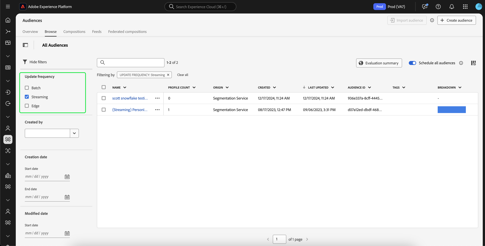

# Guía de segmentación de streaming

>[!BEGINSHADEBOX]

>[!NOTE]
>
>Los criterios de idoneidad para la segmentación de streaming se han actualizado el 20 de mayo de 2025.

+++Actualizaciones de idoneidad

>[!IMPORTANT]
>
>Todas las definiciones de segmentos existentes que se evalúan actualmente mediante streaming o segmentación de Edge seguirán funcionando tal cual, a menos que se editen o actualicen.

## Conjunto de reglas {#ruleset}

Cualquier definición de segmento **nueva o editada** que coincida con los siguientes conjuntos de reglas **ya no se evaluará** mediante la transmisión por secuencias o la segmentación de perímetros. En su lugar, se evaluarán mediante la segmentación por lotes.

- Un solo evento con un intervalo de tiempo superior a 24 horas
   - Active una audiencia con todos los perfiles que hayan visto una página web en los últimos tres días.
- Un solo evento sin ventana de tiempo
   - Active una audiencia con todos los perfiles que hayan visto una página web.

## Periodo de tiempo {#time-window}

Para evaluar una audiencia con segmentación por streaming, **debe** estar restringida en un período de tiempo de 24 horas.

## Inclusión de datos por lotes en audiencias de streaming {#include-batch-data}

Antes de esta actualización, podía crear una definición de audiencia de flujo continuo que combinara fuentes de datos de flujo y por lotes. Sin embargo, con la última actualización, la creación de una audiencia con fuentes de datos por lotes y de flujo continuo se evaluará mediante la segmentación por lotes.

Si necesita evaluar una definición de segmento mediante streaming o segmentación de Edge que coincida con el conjunto de reglas actualizado, debe crear explícitamente un lote y un conjunto de reglas de streaming y combinarlos con un segmento de segmentos. Este conjunto de reglas por lotes **debe** basarse en un esquema de perfil.

Por ejemplo, supongamos que tiene dos audiencias, con un perfil de alojamiento de audiencia que contiene datos de esquema y el otro esquema de evento de experiencia de alojamiento:

| Público | Esquema | Tipo de Source | Definición de consulta | ID de público |
| -------- | ------ | ----------- | ---------------- | ----------- |
| Residentes de California | Perfil | Lote | La dirección postal está en el estado de California | `e3be6d7f-1727-401f-a41e-c296b45f607a` |
| Cierres de compra recientes | Evento de experiencia | Streaming | Tiene al menos un cierre de compra en las últimas 24 horas | `9e1646bb-57ff-4309-ba59-17d6c5bab6a1` |

Si desea utilizar el componente por lotes en la audiencia de flujo continuo, deberá hacer referencia a la audiencia por lotes mediante un segmento de segmentos.

Por lo tanto, un conjunto de reglas de ejemplo que combinara las dos audiencias tendría el siguiente aspecto:

```
inSegment("e3be6d7f-1727-401f-a41e-c296b45f607a") and 
CHAIN(xEvent, timestamp, [C0: WHAT(eventType.equals("commerce.checkouts", false)) 
WHEN(<= 24 hours before now)])
```

La audiencia resultante *se* evaluará usando la segmentación de flujo continuo, ya que aprovecha la pertenencia de la audiencia por lotes haciendo referencia al componente de audiencia por lotes.

Sin embargo, si desea combinar dos audiencias con datos de evento, **no puede** combinar los dos eventos. Deberá crear ambas audiencias y luego crear otra audiencia que use `inSegment` para hacer referencia a ambas audiencias.

Por ejemplo, supongamos que tiene dos audiencias, con ambas audiencias albergando datos de esquema de evento de experiencia:

| Público | Esquema | Tipo de Source | Definición de consulta | ID de público |
| -------- | ------ | ----------- | ---------------- | ----------- |
| Abandonos recientes | Evento de experiencia | Lote | Tiene al menos un evento de abandono en las últimas 24 horas | `e3be6d7f-1727-401f-a41e-c296b45f607a` |
| Cierres de compra recientes | Evento de experiencia | Streaming | Tiene al menos un cierre de compra en las últimas 24 horas | `9e1646bb-57ff-4309-ba59-17d6c5bab6a1` |

En este caso, debe crear una tercera audiencia de la siguiente manera:

```
inSegment("e3be6d7f-1727-401f-a41e-c296b45f607a") and inSegment("9e1646bb-57ff-4309-ba59-17d6c5bab6a1")
```

>[!IMPORTANT]
>
>Todas las definiciones de segmentos existentes que coincidan con los conjuntos de reglas permanecerán evaluadas mediante streaming o segmentación de Edge hasta que se editen.
>
>Además, todas las definiciones de segmentos existentes que actualmente cumplen los demás criterios de evaluación de segmentación de Edge o streaming se seguirán evaluando con la segmentación de Edge o streaming.

## Política de combinación {#merge-policy}

Cualquier definición de segmento **nueva o editada** que califique para la segmentación de Edge o streaming **debe** estar en la política de combinación &quot;Activa en Edge&quot;.

Si no hay ninguna política de combinación activa establecida, tendrás que [configurar tu política de combinación](../../profile/merge-policies/ui-guide.md#configure) y establecerla para que esté activa en Edge.


+++

>[!ENDSHADEBOX]

La segmentación por streaming es la capacidad de evaluar audiencias en Adobe Experience Platform en tiempo casi real, al tiempo que se centra en la riqueza de datos.

Con la segmentación por streaming, la calificación de audiencia ahora se produce cuando los datos de streaming llegan a Experience Platform, lo que alivia la necesidad de programar y ejecutar trabajos de segmentación. Esto le permite evaluar los datos a medida que se pasan a Experience Platform, lo que permite mantener actualizada automáticamente la pertenencia a audiencias.

## Conjuntos de reglas aptos {#rulesets}

>[!IMPORTANT]
>
>Para usar la segmentación de flujo continuo, **debe** usar una política de combinación que sea &quot;Activa en Edge&quot;. Para obtener más información sobre las políticas de combinación, lea la [descripción general de las políticas de combinación](../../profile/merge-policies/overview.md).

Un conjunto de reglas será apto para la segmentación por streaming si cumple cualquiera de los criterios descritos en la siguiente tabla.

>[!NOTE]
>
>Para que la segmentación de streaming funcione, deberá habilitar la segmentación programada para la organización. Para obtener más información sobre cómo habilitar la segmentación programada, consulte [la descripción general de Audience Portal](../ui/audience-portal.md#scheduled-segmentation).

| Tipo de consulta | Detalles | Consulta | Ejemplo |
| ---------- | ------- | ----- | ------- |
| Evento único en un intervalo de tiempo inferior a 24 horas | Cualquier definición de segmento que haga referencia a un único evento entrante en un intervalo de tiempo inferior a 24 horas. | `CHAIN(xEvent, timestamp, [C0: WHAT(eventType.equals("commerce.checkouts", false)) WHEN(today)])` |  |
| Solo perfil | Cualquier definición de segmento que haga referencia únicamente a un atributo de perfil. | `homeAddress.country.equals("US", false)` |  |
| Evento único con un atributo de perfil en un intervalo de tiempo relativo inferior a 24 horas | Cualquier definición de segmento que haga referencia a un único evento entrante, con uno o más atributos de perfil, y que se produzca en un intervalo de tiempo relativo inferior a 24 horas. | `workAddress.country.equals("US", false) and CHAIN(xEvent, timestamp, [C0: WHAT(eventType.equals("commerce.checkouts", false)) WHEN(today)])` |  |
| Varios eventos en un intervalo de tiempo relativo de 24 horas | Cualquier definición de segmento que haga referencia a varios eventos **en las últimas 24 horas** y (opcionalmente) tenga uno o más atributos de perfil. | `workAddress.country.equals("US", false) and CHAIN(xEvent, timestamp, [C0: WHAT(eventType.equals("directMarketing.emailClicked", false)) WHEN(today), C1: WHAT(eventType.equals("commerce.checkouts", false)) WHEN(today)])` |  |

Una definición de segmento **no** será elegible para la segmentación de streaming en los siguientes casos:

- La definición del segmento incluye segmentos o rasgos de Adobe Audience Manager (AAM).
- La definición del segmento incluye varias entidades (consultas de varias entidades).
- La definición del segmento incluye una combinación de un solo evento y un evento `inSegment`.
   - Por ejemplo, encadenar lo siguiente en un único conjunto de reglas: `inSegment("e3be6d7f-1727-401f-a41e-c296b45f607a") and  CHAIN(xEvent, timestamp, [C0: WHAT(eventType.equals("commerce.checkouts", false))  WHEN(<= 24 hours before now)])`.
- La definición del segmento utiliza &quot;Ignorar año&quot; como parte de sus restricciones de tiempo.

Tenga en cuenta las siguientes directrices que se aplican a las consultas de segmentación de streaming:

| Tipo de consulta | Directriz |
| ---------- | -------- |
| Conjunto de reglas de evento único | La ventana retrospectiva está limitada a **un día**. |
| Consulta con historial de eventos | <ul><li>La ventana retrospectiva está limitada a **un día**.</li><li>Debe **existir una condición de orden de tiempo estricta entre los eventos.**</li><li>Se admiten consultas con al menos un evento denegado. Sin embargo, todo el evento **no puede** ser una negación.</li></ul> |

Si se modifica una definición de segmento para que ya no cumpla los criterios de segmentación de flujo continuo, la definición de segmento cambiará automáticamente de &quot;Flujo&quot; a &quot;Lote&quot;.

Además, la descalificación de segmentos, de manera similar a la calificación de segmentos, se produce en tiempo real. Como resultado, si una audiencia ya no cumple los requisitos para un segmento, se elimina inmediatamente. Por ejemplo, si la definición del segmento solicita &quot;Todos los usuarios que compraron zapatos rojos en las últimas tres horas&quot;, después de tres horas, todos los perfiles que inicialmente se calificaron para la definición del segmento serán no calificados.

### Combinación de audiencias {#combine-audiences}

Para combinar datos de fuentes de flujo y por lotes, deberá separar los componentes por lotes y de flujo continuo en audiencias independientes.

Por ejemplo, tomemos las dos audiencias de muestra siguientes en cuenta:

| Público | Esquema | Tipo de Source | Definición de consulta | ID de público |
| -------- | ------ | ----------- | ---------------- | ----------- |
| Residentes de California | Perfil | Lote | La dirección postal está en el estado de California | `e3be6d7f-1727-401f-a41e-c296b45f607a` |
| Cierres de compra recientes | Evento de experiencia | Streaming | Tiene al menos un cierre de compra en las últimas 24 horas | `9e1646bb-57ff-4309-ba59-17d6c5bab6a1` |

Si desea utilizar el componente por lotes en la audiencia de flujo continuo, deberá hacer referencia a la audiencia por lotes mediante un segmento de segmentos.

Por lo tanto, un conjunto de reglas de ejemplo que combinara las dos audiencias tendría el siguiente aspecto:

```
inSegment("e3be6d7f-1727-401f-a41e-c296b45f607a") and 
CHAIN(xEvent, timestamp, [C0: WHAT(eventType.equals("commerce.checkouts", false)) 
WHEN(<= 24 hours before now)])
```

La audiencia resultante *se* evaluará usando la segmentación de flujo continuo, ya que aprovecha la pertenencia de la audiencia por lotes haciendo referencia al componente de audiencia por lotes.

Sin embargo, si desea combinar dos audiencias con datos de evento, **no puede** combinar los dos eventos. Deberá crear ambas audiencias y luego crear otra audiencia que use `inSegment` para hacer referencia a ambas audiencias.

Por ejemplo, supongamos que tiene dos audiencias, con ambas audiencias albergando datos de esquema de evento de experiencia:

| Público | Esquema | Tipo de Source | Definición de consulta | ID de público |
| -------- | ------ | ----------- | ---------------- | ----------- |
| Abandonos recientes | Evento de experiencia | Lote | Tiene al menos un evento de abandono en las últimas 24 horas | `e3be6d7f-1727-401f-a41e-c296b45f607a` |
| Cierres de compra recientes | Evento de experiencia | Streaming | Tiene al menos un cierre de compra en las últimas 24 horas | `9e1646bb-57ff-4309-ba59-17d6c5bab6a1` |

En este caso, debe crear una tercera audiencia de la siguiente manera:

```
inSegment("e3be6d7f-1727-401f-a41e-c296b45f607a") and inSegment("9e1646bb-57ff-4309-ba59-17d6c5bab6a1")
```

## Crear público {#create-audience}

Puede crear una audiencia que se evalúe mediante la segmentación de flujo continuo mediante la API del servicio de segmentación o a través de Audience Portal en la interfaz de usuario.

Una definición de segmento puede habilitarse para la transmisión por secuencias si coincide con uno de los [conjuntos de reglas elegibles](#eligible-rulesets).

>[!BEGINTABS]

>[!TAB API del servicio de segmentación]

**Formato de API**

```http
POST /segment/definitions
```

**Solicitud**

+++ Una solicitud de ejemplo para crear una definición de segmento habilitada para la segmentación de flujo continuo

```shell
curl -X POST https://platform.adobe.io/data/core/ups/segment/definitions
 -H 'Authorization: Bearer {ACCESS_TOKEN}' \
 -H 'Content-Type: application/json' \
 -H 'x-gw-ims-org-id: {ORG_ID}' \
 -H 'x-api-key: {API_KEY}' \
 -H 'x-sandbox-name: {SANDBOX_NAME}'
 -d '{
        "name": "People in the USA",
        "description: "An audience that looks for people who live in the USA",
        "expression": {
            "type": "PQL",
            "format": "pql/text",
            "value": "homeAddress.country = \"US\""
        },
        "evaluationInfo": {
            "batch": {
                "enabled": false
            },
            "continuous": {
                "enabled": true
            },
            "synchronous": {
                "enabled": false
            }
        },
        "schema": {
            "name": "_xdm.context.profile"
        }
     }'
```

+++

**Respuesta**

Una respuesta correcta devuelve el estado HTTP 200 con detalles de la definición del segmento recién creada.

+++Una respuesta de ejemplo al crear una definición de segmento.

```json
{
    "id": "4afe34ae-8c98-4513-8a1d-67ccaa54bc05",
    "schema": {
        "name": "_xdm.context.profile"
    },
    "profileInstanceId": "ups",
    "imsOrgId": "{ORG_ID}",
    "sandbox": {
        "sandboxId": "28e74200-e3de-11e9-8f5d-7f27416c5f0d",
        "sandboxName": "prod",
        "type": "production",
        "default": true
    },
    "name": "People in the USA",
    "description": "An audience that looks for people who live in the USA",
    "expression": {
        "type": "PQL",
        "format": "pql/text",
        "value": "homeAddress.country = \"US\""
    },
    "evaluationInfo": {
        "batch": {
            "enabled": false
        },
        "continuous": {
            "enabled": true
        },
        "synchronous": {
            "enabled": false
        }
    },
    "dataGovernancePolicy": {
        "excludeOptOut": true
    },
    "creationTime": 0,
    "updateEpoch": 1579292094,
    "updateTime": 1579292094000
}
```

+++

Encontrará más información sobre el uso de este extremo en la [guía de extremo de definición de segmento](../api/segment-definitions.md).

>[!TAB Portal de públicos]

En Audience Portal, seleccione **[!UICONTROL Crear audiencia]**.


Aparece una ventana emergente. Seleccione **[!UICONTROL Generar reglas]** para ingresar al Generador de segmentos.


En el Generador de segmentos, cree una definición de segmento que coincida con uno de los [conjuntos de reglas aptos](#eligible-rulesets). Si la definición del segmento cumple los requisitos para la segmentación de transmisión, podrá seleccionar **[!UICONTROL Transmisión]** como **[!UICONTROL método de evaluación]**.


Para obtener más información sobre cómo crear definiciones de segmentos, lea la [guía del Generador de segmentos](../ui/segment-builder.md)

>[!ENDTABS]

## Recuperar audiencias {#retrieve-audiences}

Puede recuperar todas las audiencias que se evalúan mediante la segmentación de streaming mediante la API del servicio de segmentación o a través de Audience Portal en la interfaz de usuario.

>[!BEGINTABS]

>[!TAB API del servicio de segmentación]

Recupere una lista de todas las definiciones de segmentos que se evalúan mediante la segmentación de flujo continuo dentro de su organización realizando una petición GET al extremo `/segment/definitions`.

**Formato de API**

Debe incluir el parámetro de consulta `evaluationInfo.synchronous.enabled=true` en la ruta de solicitud para recuperar las definiciones de segmento evaluadas mediante la segmentación de flujo continuo.

```http
GET /segment/definitions?evaluationInfo.continuous.enabled=true
```

**Solicitud**

+++ Una solicitud de muestra para ver una lista de todas las definiciones de segmentos habilitados para streaming

```shell
curl -X GET 'https://platform.adobe.io/data/core/ups/segment/definitions?evaluationInfo.continuous.enabled=true' \
  -H 'Authorization: Bearer {ACCESS_TOKEN}' \
  -H 'Content-Type: application/json' \
  -H 'x-api-key: {API_KEY}' \
  -H 'x-gw-ims-org-id: {ORG_ID}' \
  -H 'x-sandbox-name: {SANDBOX_NAME}'
```

+++

**Respuesta**

Una respuesta correcta devuelve el estado HTTP 200 con una matriz de definiciones de segmentos en su organización que están habilitadas para la segmentación de flujo continuo.

+++Una respuesta de ejemplo que contiene una lista de todas las definiciones de segmentos habilitadas para la segmentación por streaming de su organización

```json
{
    "segments": [
        {
            "id": "15063cb-2da8-4851-a2e2-bf59ddd2f004",
            "schema": {
                "name": "_xdm.context.profile"
            },
            "ttlInDays": 30,
            "imsOrgId": "{ORG_ID}",
            "sandbox": {
                "sandboxId": "",
                "sandboxName": "",
                "type": "production",
                "default": true
            },
            "name": " People who are NOT on their homepage ",
            "expression": {
                "type": "PQL",
                "format": "pql/text",
                "value": "select var1 from xEvent where var1._experience.analytics.endUser.firstWeb.webPageDetails.isHomePage = false"
            },
            "evaluationInfo": {
                "batch": {
                    "enabled": false
                },
                "continuous": {
                    "enabled": true
                },
                "synchronous": {
                    "enabled": false
                }
            },
            "creationTime": 1572029711000,
            "updateEpoch": 1572029712000,
            "updateTime": 1572029712000
        },
        {
            "id": "f15063cb-2da8-4851-a2e2-bf59ddd2f004",
            "schema": {
                "name": "_xdm.context.profile"
            },
            "ttlInDays": 30,
            "imsOrgId": "{ORG_ID}",
            "sandbox": {
                "sandboxId": "",
                "sandboxName": "",
                "type": "production",
                "default": true
            },
            "name": "Homepage_continuous",
            "description": "People who are on their homepage - continuous",
            "expression": {
                "type": "PQL",
                "format": "pql/text",
                "value": "select var1 from xEvent where var1._experience.analytics.endUser.firstWeb.webPageDetails.isHomePage = true"
            },
            "evaluationInfo": {
                "batch": {
                    "enabled": true
                },
                "continuous": {
                    "enabled": true
                },
                "synchronous": {
                    "enabled": false
                }
            },
            "creationTime": 1572021085000,
            "updateEpoch": 1572021086000,
            "updateTime": 1572021086000
        }
    ],
    "page": {
        "totalCount": 2,
        "totalPages": 1,
        "sortField": "creationTime",
        "sort": "desc",
        "pageSize": 2,
        "limit": 100
    },
    "link": {}
}
```

Encontrará información más detallada sobre la definición de segmento devuelta en la [guía de extremo de definiciones de segmento](../api/segment-definitions.md).

+++

>[!TAB Portal de públicos]

Puede recuperar todas las audiencias habilitadas para la segmentación de streaming dentro de su organización mediante filtros en Audience Portal. Seleccione el icono de  para mostrar la lista de filtros.


Dentro de los filtros disponibles, ve a **[!UICONTROL Actualizar frecuencia]** y selecciona &quot;[!UICONTROL Transmisión]&quot;. Uso de este filtro muestra todas las audiencias de su organización que se evalúan mediante la segmentación de flujo continuo.



Para obtener más información acerca de cómo ver audiencias en Experience Platform, lea la [guía de Audience Portal](../ui/audience-portal.md).

>[!ENDTABS]

## Detalles de público {#audience-details}

Puede ver los detalles de una audiencia específica evaluada mediante la segmentación de flujo continuo seleccionándola en Audience Portal.

Después de seleccionar una audiencia en Audience Portal, aparece la página de detalles de la audiencia. Muestra información sobre la audiencia, incluido un resumen de los detalles de la audiencia, la cantidad de perfiles cualificados a lo largo del tiempo, así como los destinos a los que se ha activado la audiencia.


Para audiencias habilitadas para streaming, se muestra la tarjeta **[!UICONTROL Perfiles a lo largo del tiempo]**, que muestra las métricas totales calificadas y actualizadas de la nueva audiencia.

La métrica **[!UICONTROL Total de audiencias calificadas]** representa el número total de audiencias calificadas, según las evaluaciones por lotes y de streaming para esta audiencia.

La métrica **[!UICONTROL Nueva audiencia actualizada]** está representada por un gráfico de líneas que muestra el cambio en el tamaño de la audiencia a través de la segmentación de flujo continuo. Puede ajustar el menú desplegable para mostrar las últimas 24 horas, la semana pasada o los últimos 30 días.


Para obtener más información sobre los detalles de la audiencia, lea la [descripción general del Portal de audiencias](../ui/audience-portal.md#audience-details).

## Pasos siguientes

En esta guía se explica cómo funcionan las definiciones de segmentos habilitadas para streaming en Adobe Experience Platform y cómo monitorizar las definiciones de segmentos habilitadas para streaming.

Para obtener más información acerca del uso de la interfaz de usuario de Adobe Experience Platform, lea la [Guía del usuario de segmentación](./overview.md).

Para las preguntas más frecuentes acerca de la segmentación por transmisión, lea la [sección de segmentación por transmisión de las preguntas frecuentes](../faq.md#streaming-segmentation).
