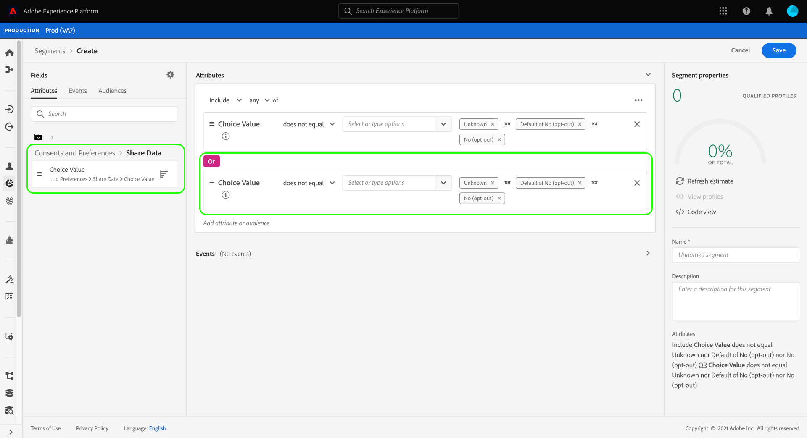

# Respeto del consentimiento en las definiciones de segmentos

>[!NOTE]
>
>Esta guía explica cómo cumplir los consentimientos dentro de **definiciones de segmentos**.

Las regulaciones legales de privacidad, como la [!DNL California Consumer Privacy Act] (CCPA), proporcionan a los consumidores el derecho de exclusión de la recopilación o el uso compartido de sus datos personales con terceros. Adobe Experience Platform proporciona componentes de modelo de datos de experiencia (XDM) estándar destinados a capturar estas preferencias de consentimiento del cliente en datos de perfil del cliente en tiempo real.

Si un cliente ha retirado o retenido el consentimiento para que se compartan sus datos personales, es importante que su organización respete esa preferencia al generar audiencias para actividades de marketing. En este documento se describe cómo integrar los valores de consentimiento del cliente en las definiciones de segmentos mediante la interfaz de usuario de Experience Platform.

## Introducción

El cumplimiento de los valores de consentimiento del cliente requiere una comprensión de los distintos servicios de [!DNL Adobe Experience Platform] involucrados. Antes de iniciar este tutorial, asegúrese de estar familiarizado con los siguientes servicios:

* [[!DNL Experience Data Model (XDM)]](../../xdm/home.md): el marco estandarizado mediante el cual Experience Platform organiza los datos de experiencia del cliente.
* [[!DNL Real-Time Customer Profile]](../../profile/home.md): proporciona un perfil de cliente unificado en tiempo real en función de los datos agregados de varias fuentes.
* [[!DNL Adobe Experience Platform Segmentation Service]](../home.md): permite crear audiencias a partir de los datos de [!DNL Real-Time Customer Profile].

## Campos del esquema de consentimiento

Para respetar los consentimientos y preferencias del cliente, uno de los esquemas que forma parte del esquema de unión de [!UICONTROL XDM Individual Profile] debe contener el grupo de campos estándar **[!UICONTROL Consentimientos y preferencias]**.

Para obtener detalles sobre la estructura y el caso de uso previsto de cada uno de los atributos proporcionados por el grupo de campos, consulte la [guía de referencia de consentimientos y preferencias](../../xdm/field-groups/profile/consents.md). Para obtener instrucciones paso a paso sobre cómo agregar un grupo de campos a un esquema, consulte la [guía de la interfaz de usuario de XDM](../../xdm/ui/resources/schemas.md#add-field-groups).

Una vez que el grupo de campos se haya agregado a un [esquema con perfil habilitado](../../xdm/ui/resources/schemas.md#profile) y sus campos se hayan utilizado para introducir datos de consentimiento de su aplicación de experiencia, puede utilizar los atributos de consentimiento recopilados en las reglas de segmento.

## Gestión del consentimiento en la segmentación

Para garantizar que los perfiles de exclusión no se incluyan en las definiciones de segmentos, se deben añadir campos especiales a las definiciones de segmentos existentes e incluirlos al crear nuevas definiciones de segmentos.

Los pasos siguientes muestran cómo agregar los campos adecuados para dos tipos de indicadores de exclusión:

1. [!UICONTROL Recopilación de datos]
1. [!UICONTROL Compartir datos]

>[!NOTE]
>
>Aunque esta guía se centra en los dos indicadores de exclusión anteriores, puede configurar sus definiciones de segmento para incorporar también señales de consentimiento adicionales. La [guía de referencia de consentimientos y preferencias](../../xdm/field-groups/profile/consents.md) proporciona más información sobre cada una de estas opciones y sus casos de uso previstos.

Al crear una definición de segmento en la interfaz de usuario, en **[!UICONTROL Atributos]**, vaya a **[!UICONTROL Perfil individual de XDM]** y, a continuación, seleccione **[!UICONTROL Consentimientos y preferencias]**, seguidos de **[!UICONTROL Específico de ID]**. Desde aquí puedes ver las opciones de **[!UICONTROL Recopilación de datos]** y **[!UICONTROL Compartir datos]**.

Comience por seleccionar la categoría **[!UICONTROL Recopilación de datos]** y, a continuación, arrastre **[!UICONTROL Valor de opción]** al generador de segmentos. Al agregar el atributo a la definición del segmento, puede especificar los [valores de consentimiento](../../xdm/field-groups/profile/consents.md#choice-values) que deben incluirse o excluirse.

Un método consiste en excluir a los clientes que hayan optado por no recopilar sus datos. Para ello, establezca el operador en **[!UICONTROL does not equal]** y elija los siguientes valores:

* **[!UICONTROL No (exclusión)]**
* **[!UICONTROL Valor predeterminado de No (exclusión)]**
* **[!UICONTROL Desconocido]** (si se supone que el consentimiento se ha retenido si no se conoce)

En **[!UICONTROL Atributos]** en el carril izquierdo, vuelva a la sección **[!UICONTROL Consentimientos y preferencias]** y, a continuación, seleccione **[!UICONTROL Compartir datos]**. Arrastre su **[!UICONTROL Valor de opción]** correspondiente al lienzo y seleccione los mismos valores que los del valor de opción [!UICONTROL Recopilación de datos]. Asegúrese de que se ha establecido una relación **[!UICONTROL Or]** entre los dos atributos.

Con los valores de consentimiento de **[!UICONTROL Recopilación de datos]** y **[!UICONTROL Compartir datos]** añadidos a la definición del segmento, los clientes que hayan optado por no usar sus datos se excluirán de la audiencia resultante. Desde aquí, puede seguir personalizando la definición del segmento antes de seleccionar **[!UICONTROL Guardar]** para finalizar el proceso.

## Pasos siguientes

Al seguir este tutorial, debería comprender mejor cómo cumplir los consentimientos y preferencias de los clientes al crear definiciones de segmentos en Experience Platform.

Para obtener más información sobre la administración del consentimiento en Experience Platform, consulte la siguiente documentación:

* [Procesamiento de consentimiento mediante el estándar de Adobe](../../landing/governance-privacy-security/consent/adobe/overview.md)
* [Procesamiento de consentimiento mediante el estándar IAB TCF 2.0](../../landing/governance-privacy-security/consent/iab/overview.md)