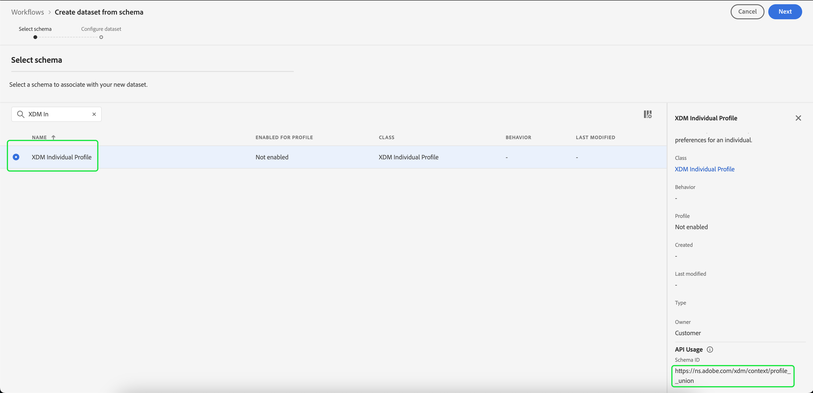

# Crear un conjunto de datos para exportar un segmento de audiencia

[!DNL Adobe Experience Platform] le permite segmentar perfiles de clientes en audiencias en función de atributos específicos. Una vez creado un segmento, puede exportar esa audiencia a un conjunto de datos al que se pueda acceder y sobre el que se pueda actuar. Para que la exportación se realice correctamente, el conjunto de datos debe estar configurado correctamente.

Este tutorial recorre los pasos necesarios para crear un conjunto de datos que se pueda utilizar para exportar un segmento de audiencia utilizando [!DNL Experience Platform] IU.

Este tutorial está directamente relacionado con los pasos descritos en el tutorial sobre [evaluación y acceso a los resultados de los segmentos](./evaluate-a-segment.md). El tutorial de evaluación de segmentos proporciona los pasos para crear un conjunto de datos con la variable [!DNL Catalog Service] API, mientras que este tutorial describe los pasos para crear un conjunto de datos utilizando la variable [!DNL Experience Platform] IU.

## Primeros pasos

Para exportar un segmento, el conjunto de datos debe basarse en la variable [!DNL XDM Individual Profile Union Schema]. Un esquema de unión es un esquema de solo lectura generado por el sistema que agrega los campos de todos los esquemas que comparten la misma clase. Para obtener más información sobre los esquemas de unión, consulte la guía de [los conceptos básicos de composición de esquemas](../../xdm/schema/composition.md#union).

Para ver los esquemas de unión en la IU, seleccione **[!UICONTROL Perfiles]** en el panel de navegación izquierdo, seleccione **[!UICONTROL Esquema de unión]** como se muestra a continuación.

## Datasets Workspace

El [!UICONTROL Conjuntos de datos] workspace le permite ver y administrar todos los conjuntos de datos de su organización.

Seleccionar **[!UICONTROL Conjuntos de datos]** en la navegación izquierda para acceder al espacio de trabajo, seleccione **[!UICONTROL Examinar]**. Esta pestaña muestra una lista de conjuntos de datos y sus detalles. Según el ancho de cada columna, es posible que tenga que desplazarse a la izquierda o a la derecha para ver todas las columnas.

>[!NOTE]
>
>Seleccione el icono de filtro junto a la barra de búsqueda para utilizar las funcionalidades de filtrado y ver solo los conjuntos de datos habilitados para [!DNL Real-Time Customer Profile].

## Crear un conjunto de datos

Para crear un conjunto de datos, seleccione **[!UICONTROL Crear conjunto de datos]**.

En la pantalla siguiente, seleccione **[!UICONTROL Crear conjunto de datos a partir de esquema]**.

## Seleccionar esquema de unión de perfil individual de XDM

Para seleccionar [!DNL XDM Individual Profile Union Schema] para su uso en el conjunto de datos, busque el &quot;[!UICONTROL Perfil individual de XDM]&quot; en el **[!UICONTROL Seleccionar esquema]** pantalla. Una vez seleccionado el esquema, puede confirmar si se trata del esquema de unión en **[!UICONTROL Uso de API]** en el carril derecho. Si la variable [!UICONTROL Esquema] la ruta termina por `_union`, es un esquema de unión.

>[!NOTE]
>
>A pesar del hecho de que los esquemas de unión participan en el Perfil del cliente en tiempo real por definición, se enumeran como &quot;No habilitado&quot; debido al hecho de que no están habilitados para el perfil de la misma manera que los esquemas tradicionales.

Seleccione el botón de opción situado junto a **[!UICONTROL Perfil individual de XDM]**, luego seleccione **[!UICONTROL Siguiente]**.

## Configurar el conjunto de datos

En la pantalla siguiente, debe asignar un nombre al conjunto de datos. También puede añadir una descripción opcional.

**Notas sobre los nombres de conjuntos de datos:**

* Los nombres de los conjuntos de datos deben ser cortos y descriptivos para que se puedan encontrar fácilmente en la biblioteca más adelante.
* Los nombres de los conjuntos de datos deben ser únicos, lo que significa que también deben ser lo suficientemente específicos para que no se reutilicen en el futuro.
* Se recomienda proporcionar información adicional sobre el conjunto de datos mediante el campo de descripción, ya que puede ayudar a otros usuarios a diferenciar entre conjuntos de datos en el futuro.

Una vez que el conjunto de datos tenga un nombre y una descripción, seleccione **[!UICONTROL Finalizar]**.

## Actividad de conjunto de datos

Una vez creado el conjunto de datos, se le mostrará la página de actividad de ese conjunto de datos. Debería ver el nombre del conjunto de datos en la esquina superior izquierda del espacio de trabajo, junto con una notificación que indique que no se han agregado lotes. Esto es lo que cabe esperar, ya que todavía no ha añadido ningún lote a este conjunto de datos.

El carril derecho contiene información relacionada con el nuevo conjunto de datos, como el ID del conjunto de datos, el nombre, la descripción, el esquema, etc. Tome nota de la **[!UICONTROL ID de conjunto de datos]**, ya que este valor es necesario para completar el flujo de trabajo de exportación de segmentos de audiencia.

## Pasos siguientes

Ahora que ha creado un conjunto de datos basado en la variable [!DNL XDM Individual Profile Union Schema], puede utilizar la ID del conjunto de datos para continuar con la [evaluación y acceso a los resultados de los segmentos](./evaluate-a-segment.md) tutorial.

En este momento, vuelva al tutorial de evaluación de resultados del segmento y recoja de la [generación de perfiles para miembros de audiencia](./evaluate-a-segment.md#generate-profiles) paso de exportación de un flujo de trabajo de segmentos.
