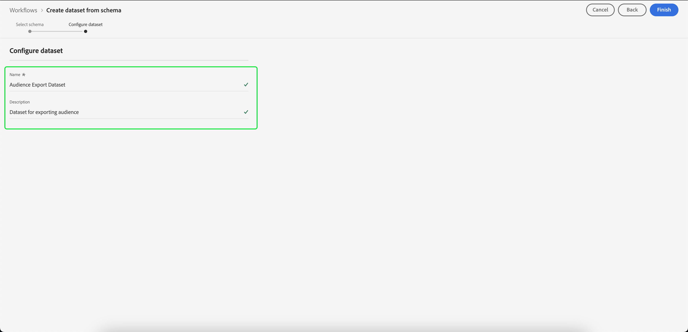

# Crear un conjunto de datos para exportar una audiencia

[!DNL Adobe Experience Platform] le permite segmentar perfiles de clientes en audiencias en función de atributos específicos. Una vez creada una definición de segmento, puede exportar la audiencia resultante a un conjunto de datos al que se pueda acceder y sobre el que se pueda actuar. Para que la exportación se realice correctamente, el conjunto de datos debe estar configurado correctamente.

Este tutorial recorre los pasos necesarios para crear un conjunto de datos que se pueda utilizar para exportar una audiencia mediante la interfaz de usuario de [!DNL Experience Platform].

Este tutorial está directamente relacionado con los pasos descritos en el tutorial sobre [evaluación y acceso a los resultados de la segmentación](./evaluate-a-segment.md). El tutorial de evaluación de definición de segmento proporciona pasos para crear un conjunto de datos mediante la API [!DNL Catalog Service], mientras que este tutorial describe los pasos para crear un conjunto de datos mediante la interfaz de usuario de [!DNL Experience Platform].

## Introducción

Para exportar una audiencia, el conjunto de datos debe basarse en [!DNL XDM Individual Profile Union Schema]. Un esquema de unión es un esquema de solo lectura generado por el sistema que agrega los campos de todos los esquemas que comparten la misma clase. Para obtener más información sobre los esquemas de unión, consulte la guía de [los conceptos básicos de la composición de esquemas](../../xdm/schema/composition.md#union).

Para ver los esquemas de unión en la interfaz de usuario, seleccione **[!UICONTROL Perfiles]** en el panel de navegación izquierdo y, a continuación, seleccione **[!UICONTROL Esquema de unión]** como se muestra a continuación.

## Datasets Workspace

El área de trabajo [!UICONTROL Conjuntos de datos] le permite ver y administrar todos los conjuntos de datos de su organización.

Seleccione **[!UICONTROL Conjuntos de datos]** en el panel de navegación izquierdo para acceder al espacio de trabajo y, a continuación, seleccione **[!UICONTROL Examinar]**. Esta pestaña muestra una lista de conjuntos de datos y sus detalles. Según el ancho de cada columna, es posible que tenga que desplazarse a la izquierda o a la derecha para ver todas las columnas.

>[!NOTE]
>
>Seleccione el icono de filtro que aparece junto a la barra de búsqueda para utilizar las capacidades de filtrado con el fin de ver únicamente los conjuntos de datos habilitados para [!DNL Real-Time Customer Profile].

## Crear un conjunto de datos

Para crear un conjunto de datos, seleccione **[!UICONTROL Crear conjunto de datos]**.

En la pantalla siguiente, seleccione **[!UICONTROL Crear conjunto de datos a partir del esquema]**.

## Seleccionar esquema de unión de perfil individual de XDM

Para seleccionar [!DNL XDM Individual Profile Union Schema] para utilizarlo en su conjunto de datos, busque el esquema &quot;[!UICONTROL XDM Individual Profile]&quot; en la pantalla **[!UICONTROL Seleccionar esquema]**. Una vez que seleccione el esquema, puede confirmar si se trata del esquema de unión en **[!UICONTROL Uso de API]** en el carril derecho. Si la ruta de acceso [!UICONTROL Schema] termina con `_union`, se trata de un esquema de unión.

>[!NOTE]
>
>A pesar del hecho de que los esquemas de unión participan en el Perfil del cliente en tiempo real por definición, se enumeran como &quot;No habilitado&quot; debido al hecho de que no están habilitados para el perfil de la misma manera que los esquemas tradicionales.

Seleccione el botón de opción junto a **[!UICONTROL Perfil XDM individual]** y, a continuación, seleccione **[!UICONTROL Siguiente]**.

## Configurar conjunto de datos

En la pantalla siguiente, debe asignar un nombre al conjunto de datos. También puede añadir una descripción opcional.

**Notas sobre nombres de conjuntos de datos:**

* Los nombres de los conjuntos de datos deben ser cortos y descriptivos para que se puedan encontrar fácilmente en la biblioteca más adelante.
* Los nombres de los conjuntos de datos deben ser únicos, lo que significa que también deben ser lo suficientemente específicos para que no se reutilicen en el futuro.
* Debe proporcionar información adicional sobre el conjunto de datos mediante el campo de descripción, ya que puede ayudar a otros usuarios a diferenciar entre conjuntos de datos en el futuro.

Una vez que el conjunto de datos tenga un nombre y una descripción, seleccione **[!UICONTROL Finalizar]**.

## Actividad del conjunto de datos

Una vez creado el conjunto de datos, se le mostrará la página de actividad de ese conjunto de datos. Debería ver el nombre del conjunto de datos en la esquina superior izquierda del espacio de trabajo, junto con una notificación que indique que no se han agregado lotes. Esto es lo que cabe esperar, ya que todavía no ha añadido ningún lote a este conjunto de datos.

El carril derecho contiene información relacionada con el nuevo conjunto de datos, como el ID del conjunto de datos, el nombre, la descripción, el esquema, etc. Tome nota de **[!UICONTROL ID del conjunto de datos]**, ya que este valor es necesario para completar el flujo de trabajo de exportación de audiencias.

## Pasos siguientes

Ahora que ha creado un conjunto de datos basado en [!DNL XDM Individual Profile Union Schema], puede usar el ID del conjunto de datos para continuar con el tutorial de [evaluación y acceso a los resultados de la definición del segmento](./evaluate-a-segment.md).

En este momento, vuelva al tutorial que evalúa los resultados de la definición del segmento y tómelo del paso [generación de perfiles para miembros de audiencia](./evaluate-a-segment.md#generate-profiles) del flujo de trabajo de exportación de una audiencia.
