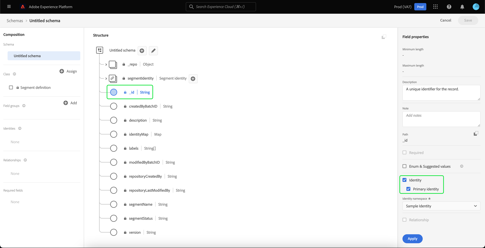
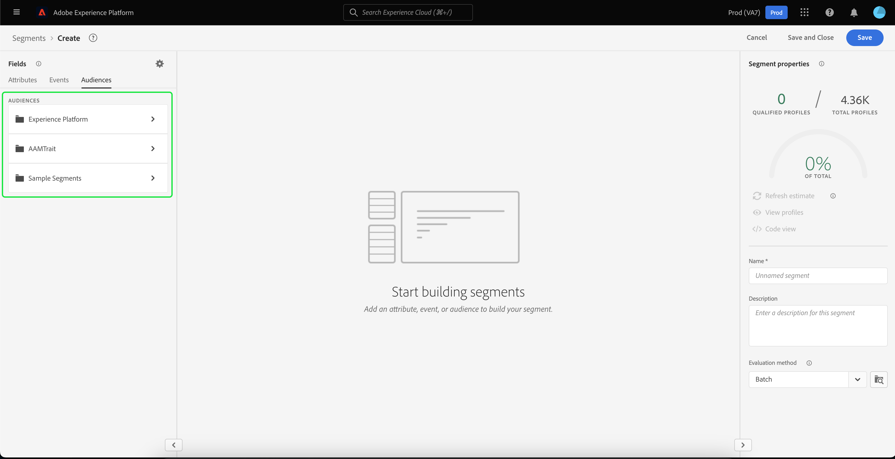

# Importación y uso de audiencias externas

Adobe Experience Platform admite la capacidad de importar audiencia externa, que posteriormente se puede utilizar como componentes para una nueva definición de segmento. Este documento proporciona un tutorial para configurar el Experience Platform para importar y utilizar audiencias externas.

## Primeros pasos

- [Servicio](../home.md) de segmentación: Le permite generar segmentos de audiencia a partir de datos de Perfil del cliente en tiempo real.
- [Perfil](../../profile/home.md) del cliente en tiempo real: Proporciona un perfil de consumo unificado y en tiempo real basado en datos agregados de varias fuentes.
- [Modelo de datos de experiencia (XDM)](../../xdm/home.md): El marco estandarizado por el cual Platform organiza los datos de experiencia del cliente.
- [Conjuntos](../../catalog/datasets/overview.md) de datos: La construcción de almacenamiento y administración para la persistencia de datos en Experience Platform.
- [Transmisión por secuencias](../../ingestion/streaming-ingestion/overview.md): Cómo el Experience Platform ingiere y almacena datos desde dispositivos del lado del cliente y del servidor en tiempo real.

## Crear una Área de nombres de identidad para la audiencia externa

El primer paso para utilizar audiencias externas es crear una Área de nombres de identidad. Las Áreas de nombres de identidad permiten a Platform asociar el origen de un segmento.

Para crear una Área de nombres de identidad, siga las instrucciones de la [guía de Área de nombres de identidad](../../identity-service/namespaces.md#manage-namespaces). Al crear la Área de nombres de identidad, agregue los detalles del origen a la Área de nombres de identidad y marque su [!UICONTROL Tipo] como **[!UICONTROL Identificador de no personas]**.

## Creación de un esquema para los metadatos del segmento

Después de crear una Área de nombres de identidad, debe crear un nuevo esquema para el segmento que va a crear.

Para empezar a componer un esquema, primero seleccione **[!UICONTROL Esquemas]** en la barra de navegación izquierda, seguido de **[!UICONTROL Crear esquema]** en la esquina superior derecha del espacio de trabajo Esquemas. Desde aquí, seleccione **[!UICONTROL Examinar]** para ver una selección completa de los tipos de Esquema disponibles.

Dado que está creando una definición de segmento, que es una clase predefinida, seleccione **[!UICONTROL Usar clase existente]**. Ahora, seleccione la clase **[!UICONTROL Segment definition]**, seguida de **[!UICONTROL Asignar clase]**.

Ahora que se ha creado el esquema, deberá especificar qué campo contendrá el ID del segmento. Este campo debe marcarse como la identidad principal y asignarse a las Áreas de nombres creadas anteriormente.

Después de marcar el campo `_id` como identidad principal, seleccione el título del esquema, seguido del conmutador etiquetado **[!UICONTROL Perfil]**. Seleccione **[!UICONTROL Habilitar]** para habilitar el esquema para [!DNL Real-time Customer Profile].

Ahora, este esquema está habilitado para el Perfil, con la identificación principal asignada a la Área de nombres de identidad no personal que ha creado. Como resultado, esto significa que los metadatos de segmento importados en la plataforma que utilicen este esquema se ingerirán en Perfil sin combinarse con otros datos de Perfil relacionados con las personas.

## Crear un conjunto de datos para el esquema

Después de configurar el esquema, deberá crear un conjunto de datos para los metadatos del segmento.

Para crear un conjunto de datos, siga las instrucciones de la [guía del usuario del conjunto de datos](../../catalog/datasets/user-guide.md#create). Deberá seguir la opción **[!UICONTROL Crear conjunto de datos a partir de esquema]**, utilizando el esquema que creó anteriormente.

Después de crear el conjunto de datos, siga las instrucciones de la [guía del usuario del conjunto de datos](../../catalog/datasets/user-guide.md#enable-profile) para habilitar este conjunto de datos para el Perfil del cliente en tiempo real.

## Configurar e importar datos de audiencia

Con el conjunto de datos habilitado, ahora se pueden enviar datos a la plataforma a través de la interfaz de usuario o mediante las API de Experience Platform. Para transferir estos datos a Platform, deberá crear una conexión de flujo continuo.

Para crear una conexión de flujo continuo, puede seguir las instrucciones del [tutorial de API](../../sources/tutorials/api/create/streaming/http.md) o del [tutorial de interfaz de usuario](../../sources/tutorials/ui/create/streaming/http.md).

Una vez que haya creado la conexión de flujo continuo, tendrá acceso a su punto final de flujo único al que podrá enviar los datos. Para aprender a enviar datos a estos extremos, lea el [tutorial sobre datos de registro de flujo](../../ingestion/tutorials/streaming-record-data.md#ingest-data).

## Creación de segmentos mediante audiencias importadas

Una vez configuradas las audiencias importadas, pueden utilizarse como parte del proceso de segmentación. Para buscar audiencias externas, vaya al Generador de segmentos y seleccione la ficha **[!UICONTROL Audiencias]** en la sección **[!UICONTROL Campos]**.

## Pasos siguientes

Ahora que puede utilizar audiencias externas en los segmentos, puede utilizar el Generador de segmentos para crear segmentos. Para aprender a crear segmentos, lea el [tutorial sobre la creación de segmentos](./create-a-segment.md).