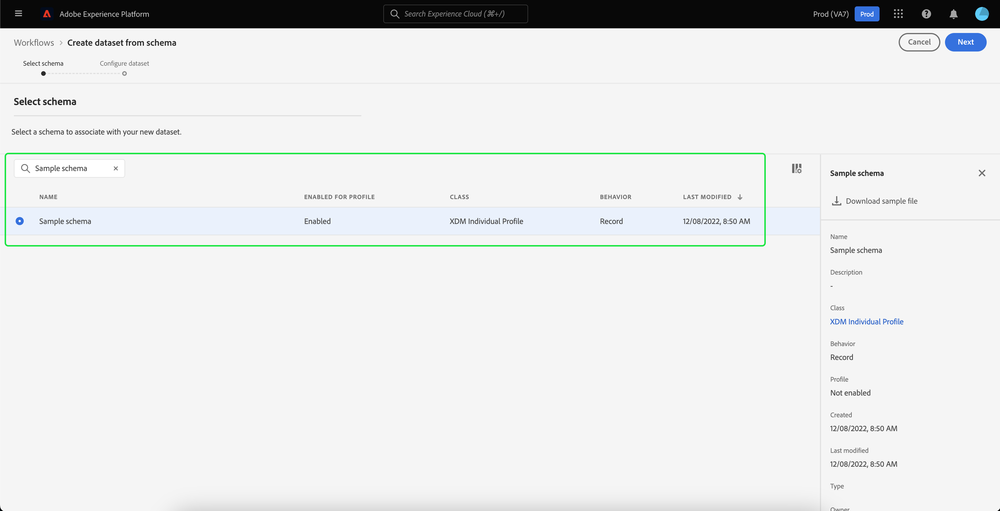

# Importación y uso de audiencias externas

>[!IMPORTANT]
>
>Esta documentación contiene información de una versión anterior de la documentación de Audiences y, como resultado, no está actualizada.

Adobe Experience Platform admite la capacidad de importar audiencias externas, que posteriormente pueden utilizarse como componentes para una nueva audiencia. Este documento proporciona un tutorial para configurar Experience Platform para importar y utilizar audiencias externas.

## Introducción

Este tutorial requiere una comprensión práctica de los distintos [!DNL Adobe Experience Platform] servicios implicados en la creación de audiencias. Antes de comenzar este tutorial, revise la documentación de los siguientes servicios:

- [Servicio de segmentación](../home.md): Permite crear audiencias a partir de los datos del perfil del cliente en tiempo real.
- [Perfil del cliente en tiempo real](../../profile/home.md): Proporciona un perfil de consumidor unificado y en tiempo real basado en los datos agregados de varias fuentes.
- [Modelo de datos de experiencia (XDM)](../../xdm/home.md): el marco estandarizado mediante el cual Platform organiza los datos de experiencia del cliente. Para utilizar mejor la segmentación, asegúrese de que sus datos se incorporan como perfiles y eventos según el [prácticas recomendadas para el modelado de datos](../../xdm/schema/best-practices.md).
- [Conjuntos de datos](../../catalog/datasets/overview.md): La construcción de almacenamiento y administración para la persistencia de datos en Experience Platform.
- [Ingesta por streaming](../../ingestion/streaming-ingestion/overview.md): el modo en que el Experience Platform ingiere y almacena datos de dispositivos del lado del cliente y del servidor en tiempo real.

### Audiencias o definiciones de segmentos

Antes de empezar a importar y usar audiencias externas, es importante comprender la diferencia entre las audiencias y las definiciones de segmentos.

Las audiencias se refieren al grupo de perfiles por el que intenta filtrar. Al utilizar definiciones de segmentos, puede crear una audiencia creando una definición de segmento que filtre los perfiles al subconjunto que cumpla los criterios de calificación de segmentos.

Las definiciones de segmentos incluyen información como el nombre, la descripción, la expresión (si corresponde), la fecha de creación, la última fecha de modificación y un ID. El ID vincula los metadatos del segmento con los perfiles individuales que cumplen con la calificación del segmento y forman parte de la audiencia resultante.

| Públicos | Definición del segmento |
| --------- | ---------------- |
| El grupo de perfiles que está intentando encontrar. Al utilizar definiciones de segmentos, esto significa que será el grupo de perfiles que cumplan con la calificación de segmentos. | El grupo de reglas utilizadas para segmentar la audiencia que está buscando. |

## Crear un área de nombres de identidad para la audiencia externa

El primer paso para utilizar audiencias externas es crear un área de nombres de identidad. Las áreas de nombres de identidad permiten que Platform asocie el lugar desde el que se origina una audiencia.

Para crear un área de nombres de identidad, siga las instrucciones de la [guía del área de nombres de identidad](../../identity-service/namespaces.md#manage-namespaces). Al crear el área de nombres de identidad, agregue los detalles de origen al área de nombres de identidad y marque su [!UICONTROL Tipo] as a **[!UICONTROL Identificador de no personas]**.


## Creación de un esquema para los metadatos del segmento

Después de crear un área de nombres de identidad, debe crear un nuevo esquema para el segmento que va a crear.

Para empezar a maquetar un esquema, seleccione primero **[!UICONTROL Esquemas]** en la barra de navegación izquierda, seguido de **[!UICONTROL Crear esquema]** en la esquina superior derecha del espacio de trabajo Esquemas. Desde aquí, seleccione **[!UICONTROL Examinar]** para ver una selección completa de los tipos de esquema disponibles.


Dado que está creando una definición de segmento, que es una clase predefinida, seleccione **[!UICONTROL Utilizar clase existente]**. Ahora, seleccione la **[!UICONTROL Definición del segmento]** clase, seguida de **[!UICONTROL Asignar clase]**.


Ahora que se ha creado el esquema, debe especificar qué campo contendrá el ID del segmento. Este campo debe marcarse como identidad principal y asignarse a las áreas de nombres creadas anteriormente.


Después de marcar la variable `_id` como identidad principal, seleccione el título del esquema, seguido de la opción denominada **[!UICONTROL Perfil]**. Seleccionar **[!UICONTROL Activar]** para habilitar el esquema para [!DNL Real-Time Customer Profile].


Ahora, este esquema está habilitado para el perfil, con la identificación principal asignada al área de nombres de identidad de no persona que ha creado. Como resultado, esto significa que los metadatos de segmento importados en Platform mediante este esquema se incorporarán en el perfil sin combinarse con otros datos de perfil relacionados con personas.

## Crear un conjunto de datos para el esquema

Después de configurar el esquema, deberá crear un conjunto de datos para los metadatos del segmento.

Para crear un conjunto de datos, siga las instrucciones de la [guía del usuario del conjunto de datos](../../catalog/datasets/user-guide.md#create). Debe seguir las **[!UICONTROL Crear conjunto de datos a partir de esquema]** , utilizando el esquema creado anteriormente.



Después de crear el conjunto de datos, siga las instrucciones del [guía del usuario del conjunto de datos](../../catalog/datasets/user-guide.md#enable-profile) para habilitar este conjunto de datos para el perfil del cliente en tiempo real.


## Configuración e importación de datos de audiencia

Con el conjunto de datos habilitado, ahora los datos se pueden enviar a Platform a través de la interfaz de usuario o mediante las API de Experience Platform. Puede introducir estos datos mediante una conexión por lotes o de flujo continuo.

### Ingesta de datos mediante una conexión por lotes

Para crear una conexión por lotes, puede seguir las instrucciones del genérico [guía de IU de carga de archivos locales](../../sources/tutorials/ui/create/local-system/local-file-upload.md). Para obtener una lista completa de las fuentes disponibles con las que puede utilizar la ingesta de datos, lea la [información general de orígenes](../../sources/home.md).

### Ingesta de datos mediante una conexión de flujo continuo

Para crear una conexión de flujo continuo, puede seguir las instrucciones de la [Tutorial de API](../../sources/tutorials/api/create/streaming/http.md) o el [Tutorial de IU](../../sources/tutorials/ui/create/streaming/http.md).

Una vez que haya creado su conexión de flujo continuo, tendrá acceso a su punto final de flujo único al que puede enviar sus datos. Para obtener información sobre cómo enviar datos a estos extremos, lea la [tutorial sobre streaming de datos de registro](../../ingestion/tutorials/streaming-record-data.md#ingest-data).


## Estructura de metadatos de audiencia

Después de crear una conexión, ahora puede introducir los datos en Platform.

A continuación se muestra una muestra de los metadatos de la carga útil de audiencia externa:

```json
{
    "header": {
        "schemaRef": {
            "id": "https://ns.adobe.com/{TENANT_ID}/schemas/{SCHEMA_ID}",
            "contentType": "application/vnd.adobe.xed-full+json;version=1"
        },
        "imsOrgId": "{ORG_ID}",
        "datasetId": "{DATASET_ID}",
        "source": {
            "name": "Sample External Audience"
        }
    },
    "body": {
        "xdmMeta": {
            "schemaRef": {
                "id": "https://ns.adobe.com/{TENANT_ID}/schemas/{SCHEMA_ID}",
                "contentType": "application/vnd.adobe.xed-full+json;version=1"
            }
        },
        "xdmEntity": {
            "_id": "{SEGMENT_ID}",
            "description": "Sample description",
            "identityMap": {
                "{IDENTITY_NAMESPACE}": [{
                    "id": "{}"
                }]
            },
            "segmentName" : "{SEGMENT_NAME}",
            "segmentStatus": "ACTIVE",
            "version": "1.0"
        }
    }
}
```

| Propiedad | Descripción |
| -------- | ----------- |
| `schemaRef` | El esquema **debe** consulte el esquema creado anteriormente para los metadatos del segmento. |
| `datasetId` | ID del conjunto de datos **debe** consulte el conjunto de datos creado anteriormente para el esquema que acaba de crear. |
| `xdmEntity._id` | El ID **debe** consulte el mismo ID de segmento que utiliza como audiencia externa. |
| `xdmEntity.identityMap` | Esta sección **debe** contienen la etiqueta de identidad utilizada al crear el área de nombres creada anteriormente. |
| `{IDENTITY_NAMESPACE}` | Esta es la etiqueta del área de nombres de identidad creada anteriormente. Por lo tanto, si llamara al área de nombres de identidad &quot;externalAudience&quot;, la usaría como clave de la matriz. |
| `segmentName` | El nombre del segmento por el que desea segmentar la audiencia externa. |

## Generación de segmentos con audiencias importadas

Una vez configuradas las audiencias importadas, pueden utilizarse como parte del proceso de segmentación. Para buscar audiencias externas, vaya al Generador de segmentos y seleccione **[!UICONTROL Audiencias]** en la pestaña **[!UICONTROL Campos]** sección.


## Pasos siguientes

Ahora que puede usar audiencias externas en los segmentos, puede usar el Generador de segmentos para crear segmentos. Para aprender a crear segmentos, lea la [tutorial sobre creación de segmentos](./create-a-segment.md).

## Apéndice

Además de utilizar metadatos de audiencia externos importados y utilizarlos para crear segmentos, también puede importar suscripciones a segmentos externos a Platform.

### Configurar un esquema de destino de pertenencia a segmento externo

Para empezar a maquetar un esquema, seleccione primero **[!UICONTROL Esquemas]** en la barra de navegación izquierda, seguido de **[!UICONTROL Crear esquema]** en la esquina superior derecha del espacio de trabajo Esquemas. Desde aquí, seleccione **[!UICONTROL Perfil individual de XDM]**.


Ahora que se ha creado el esquema, deberá agregar el grupo de campos de pertenencia al segmento como parte del esquema. Para ello, seleccione [!UICONTROL Detalles de abono de segmento], seguido de [!UICONTROL Adición de grupos de campos].


Además, asegúrese de que el esquema esté marcado para **[!UICONTROL Perfil]**. Para ello, debe marcar un campo como la identidad principal.


### Configurar el conjunto de datos

Después de crear el esquema, deberá crear un conjunto de datos.

Para crear un conjunto de datos, siga las instrucciones de la [guía del usuario del conjunto de datos](../../catalog/datasets/user-guide.md#create). Debe seguir las **[!UICONTROL Crear conjunto de datos a partir de esquema]** , utilizando el esquema creado anteriormente.


Después de crear el conjunto de datos, siga las instrucciones del [guía del usuario del conjunto de datos](../../catalog/datasets/user-guide.md#enable-profile) para habilitar este conjunto de datos para el perfil del cliente en tiempo real.


## Configuración e importación de datos de pertenencia a audiencias externas

Con el conjunto de datos habilitado, ahora los datos se pueden enviar a Platform a través de la interfaz de usuario o mediante las API de Experience Platform. Puede introducir estos datos mediante una conexión por lotes o de flujo continuo.

### Ingesta de datos mediante una conexión por lotes

Para crear una conexión por lotes, puede seguir las instrucciones del genérico [guía de IU de carga de archivos locales](../../sources/tutorials/ui/create/local-system/local-file-upload.md). Para obtener una lista completa de las fuentes disponibles con las que puede utilizar la ingesta de datos, lea la [información general de orígenes](../../sources/home.md).

### Ingesta de datos mediante una conexión de flujo continuo

Para crear una conexión de flujo continuo, puede seguir las instrucciones de la [Tutorial de API](../../sources/tutorials/api/create/streaming/http.md) o el [Tutorial de IU](../../sources/tutorials/ui/create/streaming/http.md).

Una vez que haya creado su conexión de flujo continuo, tendrá acceso a su punto final de flujo único al que puede enviar sus datos. Para obtener información sobre cómo enviar datos a estos extremos, lea la [tutorial sobre streaming de datos de registro](../../ingestion/tutorials/streaming-record-data.md#ingest-data).


## Estructura del abono de segmentos

Después de crear una conexión, ahora puede introducir los datos en Platform.

A continuación se puede ver una muestra de la carga útil de pertenencia a audiencia externa:

```json
{
    "header": {
        "schemaRef": {
            "id": "https://ns.adobe.com/{TENANT_ID}/schemas/{SCHEMA_ID}",
            "contentType": "application/vnd.adobe.xed-full+json;version=1"
        },
        "imsOrgId": "{ORG_ID}",
        "datasetId": "{DATASET_ID}",
        "source": {
            "name": "Sample External Audience Membership"
        }
    },
    "body": {
        "xdmMeta": {
            "schemaRef": {
                "id": "https://ns.adobe.com/{TENANT_ID}/schemas/{SCHEMA_ID}",
                "contentType": "application/vnd.adobe.xed-full+json;version=1"
            }
        },
        "xdmEntity": {
            "_id": "{UNIQUE_ID}",
            "description": "Sample description",
            "{TENANT_NAME}": {
                "identities": {
                    "{SCHEMA_IDENTITY}": "sample-id"
                }
            },
            "personId" : "sample-name",
            "segmentMembership": {
                "{IDENTITY_NAMESPACE}": {
                    "{EXTERNAL_IDENTITY}": {
                        "status": "realized",
                        "lastQualificationTime": "2022-03-14T:00:00:00Z"
                    }
                }
            }
        }
    }
}
```

| Propiedad | Descripción |
| -------- | ----------- |
| `schemaRef` | El esquema **debe** consulte el esquema creado anteriormente para los datos de abono del segmento. |
| `datasetId` | ID del conjunto de datos **debe** consulte el conjunto de datos creado anteriormente para el esquema de pertenencia que acaba de crear. |
| `xdmEntity._id` | Un ID adecuado que se utiliza para identificar de forma exclusiva el registro dentro del conjunto de datos. |
| `{TENANT_NAME}.identities` | Esta sección se utiliza para conectar el grupo de campos de las identidades personalizadas con los usuarios importados anteriormente. |
| `segmentMembership.{IDENTITY_NAMESPACE}` | Esta es la etiqueta del área de nombres de identidad personalizada creada anteriormente. Por lo tanto, si llamara al área de nombres de identidad &quot;externalAudience&quot;, la usaría como clave de la matriz. |

>[!NOTE]
>
>De forma predeterminada, las suscripciones a audiencias externas se eliminan a los 30 días. Para evitar su eliminación y conservarlas durante más de 30 días, utilice el `validUntil` al introducir los datos de audiencia. Para obtener más información sobre este campo, lea la guía de [Grupos de campos de esquema Detalles de abono de segmento](../../xdm/field-groups/profile/segmentation.md).
