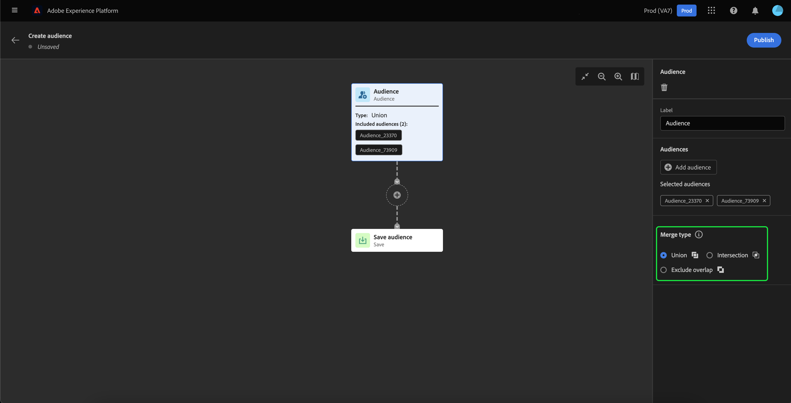
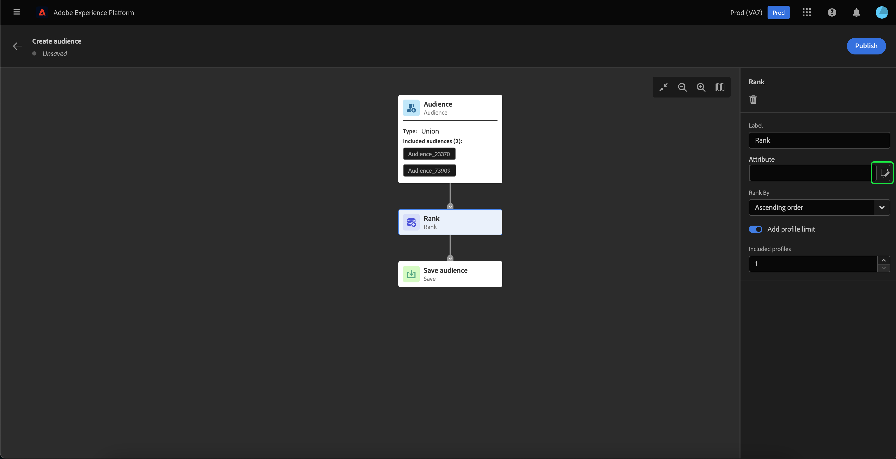
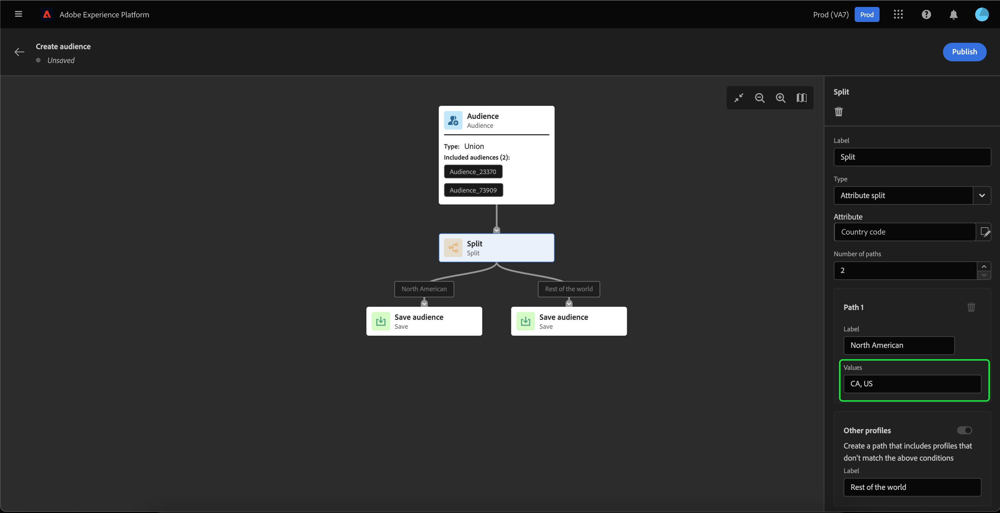

# Guía de la interfaz de usuario de Audience Builder

>[!IMPORTANT]
>
>El Generador de audiencias se encuentra en la versión beta y no está disponible para todos los usuarios. La documentación y las funciones están sujetas a cambios.

El Generador de audiencias proporciona un espacio de trabajo para crear y editar audiencias, mediante bloques que se utilizan para representar diferentes acciones.

El lienzo de la composición de la audiencia consta de cinco tipos diferentes de bloques: **[[!UICONTROL Audiencia]](#audience-block)**, **[[!UICONTROL Excluir]](#exclude-block)**, **[[!UICONTROL Unirse]](#join-block)**, **[[!UICONTROL Clasificación]](#rank-block)** y **[[!UICONTROL Split]](#split-block)**.

## [!UICONTROL Audiencia ] {#audience-block}

La variable **[!UICONTROL Audiencia]** el tipo de bloque le permite añadir las subaudiencias que desea componer la nueva audiencia más grande. De forma predeterminada, una **[!UICONTROL Audiencia]** se incluye en la parte superior del lienzo de composición.

Al seleccionar la variable **[!UICONTROL Audiencia]** , el carril derecho muestra controles para etiquetar y agregar audiencias al bloque.

Después de seleccionar **[!UICONTROL Añadir audiencia]**, aparece una lista de audiencias. Seleccione las audiencias que desee incluir, seguidas de **[!UICONTROL Agregar]** para anexarlos al bloque de audiencia.

Las audiencias seleccionadas ahora aparecen en el carril derecho cuando se llama a **[!UICONTROL Audiencia]** está seleccionado. Desde aquí puede cambiar el tipo de combinación de las audiencias combinadas.

| Tipo de combinación | Descripción |
| ---------- | ----------- |
| [!UICONTROL Union] | Las audiencias se combinan en una sola audiencia. Esto sería el equivalente de una operación OR. |
| [!UICONTROL Intersección] | Las audiencias se combinan, solo con las audiencias compartidas en **all** de ellos que se van a añadir. Esto sería el equivalente de una operación AND. |
| [!UICONTROL Excluir superposición] | Las audiencias se combinan, solo con las audiencias compartidas en **uno, pero no todos** de ellos que se van a añadir. Esto sería el equivalente de una operación XOR. |

## [!UICONTROL Excluir] {#exclude-block}

La variable **[!UICONTROL Excluir]** el tipo de bloque le permite excluir subaudiencias o atributos especificados de la nueva audiencia más grande.

Para agregar un **[!UICONTROL Excluir]** , seleccione **+** icono, seguido de **[!UICONTROL Excluir]**.

La variable **[!UICONTROL Excluir]** se añade. Cuando se selecciona este bloque, los detalles sobre la exclusión aparecen en el carril derecho. Esto incluye la etiqueta del bloque y el tipo de exclusión. Puede excluir [por audiencia](#exclude-audience) o [por atributo](#exclude-attribute).

### Excluir por audiencia {#exclude-audience}

Si excluye por audiencia, puede seleccionar qué audiencias desea excluir seleccionando **[!UICONTROL Añadir audiencia]**.

Aparecerá una lista de audiencias. Select **[!UICONTROL Agregar]** para añadir las audiencias que desea excluir al bloque de exclusión.

### Excluir por atributo {#exclude-attribute}

Si excluye por atributo, puede seleccionar qué atributos desea excluir seleccionando el  dentro del **[!UICONTROL Regla de exclusión]** para obtener más información.

Aparece una lista de atributos de perfil. Seleccione el tipo de atributo que desea excluir, seguido de **[!UICONTROL Select]** para añadirlos al bloque de exclusión.

## [!UICONTROL Unirse] {#join-block}

La variable **[!UICONTROL Unirse]** el tipo de bloque permite agregar audiencias externas de conjuntos de datos que Adobe Experience Platform aún no ha procesado.

Para agregar un **[!UICONTROL Unirse]** , seleccione **+** icono, seguido de **[!UICONTROL Unirse]**.

Cuando selecciona el bloque, los detalles sobre la unión se muestran en el carril derecho, incluida la etiqueta del bloque y la opción de agregar audiencias al conjunto de datos de enriquecimiento.

Después de seleccionar **[!UICONTROL Añadir audiencia]**, aparece una lista de audiencias. Seleccione las audiencias que desee incluir, seguidas de **[!UICONTROL Agregar]** para agregarlos al bloque de unión.

Las audiencias seleccionadas ahora aparecen en el carril derecho cuando se llama a **[!UICONTROL Unirse]** está seleccionado.

## [!UICONTROL Clasificación] {#rank-block}

La variable **[!UICONTROL Clasificación]** el tipo de bloque le permite clasificar y ordenar las audiencias antes de publicar la nueva audiencia.

Para agregar un **[!UICONTROL Clasificación]** , seleccione **+** icono, seguido de **[!UICONTROL Clasificación]**.

Al seleccionar el bloque, los detalles sobre la clasificación se muestran en el carril derecho, incluida la etiqueta del bloque, el atributo por el que se va a clasificar, el orden de clasificación y una opción para limitar el número de perfiles que se van a clasificar.

Para seleccionar el atributo por el que clasificar las audiencias, seleccione el  icono.

Aparece una lista de atributos de perfil. En esta ventana, puede seleccionar el tipo de atributo por el que quiere clasificar la audiencia. Select **[!UICONTROL Select]** para agregarlo al bloque de clasificación. Tenga en cuenta que el atributo seleccionado puede **only** ser de tipo `int`.

Después de seleccionar el atributo, puede seleccionar el orden por el que desea clasificarlo. Se trata de un orden ascendente (de menor a mayor) o descendente (de mayor a menor).

Además, puede limitar el número de audiencias devueltas habilitando la variable **[!UICONTROL Añadir límite de perfil]** alternar. Cuando esta opción está habilitada, puede establecer el número máximo de audiencias devueltas dentro del **[!UICONTROL Perfiles incluidos]** campo .

## [!UICONTROL Split] {#split-block}

La variable **[!UICONTROL Split]** el tipo de bloque le permite dividir la nueva audiencia en varias subaudiencias. Puede dividir esta audiencia según un porcentaje o un atributo.

Para agregar un **[!UICONTROL Split]** , seleccione **+** icono, seguido de **[!UICONTROL Split]**.

### Dividido por porcentaje {#split-percentage}

Al dividir por porcentaje, las audiencias se dividirán aleatoriamente, según el número de rutas y porcentajes proporcionados.

Por ejemplo, puede tener tres rutas, cada una con un porcentaje diferente de perfiles.

Además, puede marcar una de las audiencias divididas como grupo de control.

### Dividir por atributo {#split-attribute}

Al dividir por atributo, las audiencias se dividirán según los atributos proporcionados. Para seleccionar el atributo por el que se va a dividir, seleccione el **[!UICONTROL Split]** , seguido de la variable  icono.

Aparece una lista de atributos de perfil. Seleccione el tipo de atributo, seguido de **[!UICONTROL Select]** para agregarlo al bloque dividido.

Después de seleccionar el atributo, puede elegir qué perfiles pertenecerán a cada subaudiencia agregando los valores dentro del **[!UICONTROL Valores]** campo .

Además, puede habilitar la variable **[!UICONTROL Otros perfiles]** para crear una subaudiencia que incluya todos los perfiles no seleccionados.

## Publicación de la audiencia

Después de componer la audiencia, puede guardarla y publicarla seleccionándola **[!UICONTROL Publicación]**.

Si hay algún error en la creación de la audiencia, aparece una alerta que le permite saber cómo resolver el problema.

## Pasos siguientes

El Generador de audiencias proporciona un flujo de trabajo enriquecido que le permite crear audiencias a partir de los distintos tipos de bloques. Para obtener más información sobre otras partes de la interfaz de usuario del servicio de segmentación, lea la [Guía del usuario del servicio de segmentación](./overview.md).