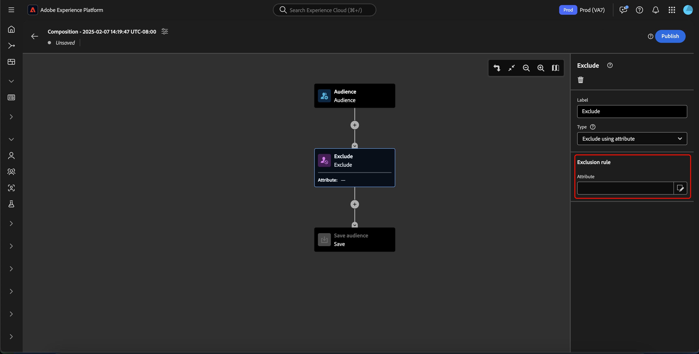

# Guía de IU de composición de audiencia

>[!NOTE]
>
>Esta guía explica cómo crear audiencias mediante Composición de audiencias. Para aprender a crear audiencias a través de las definiciones de segmentos mediante el Generador de segmentos, lea la [guía de la interfaz de usuario del Generador de segmentos](./segment-builder.md).

Composición de audiencia proporciona un espacio de trabajo para crear y editar audiencias, utilizando bloques que se utilizan para representar diferentes acciones.

Para cambiar los detalles de la composición, incluidos el título y la descripción, seleccione el botón .

Aparece la ventana emergente **[!UICONTROL Propiedades de composición]**. Puede insertar detalles de la composición, incluidos el título y la descripción aquí.

>[!NOTE]
>
>Si **no** le asigna un título a la composición, tendrá un título de &quot;Composición&quot; seguido de la fecha y hora de creación de forma predeterminada. Además, cada composición **debe** tener su propio nombre único.

Después de actualizar los detalles de la composición, seleccione **[!UICONTROL Guardar]** para confirmar estas actualizaciones. El lienzo de composición de audiencia vuelve a aparecer.

El lienzo de composición de audiencia consta de cuatro tipos diferentes de bloques: **[[!UICONTROL Audiencia]](#audience-block)**, **[[!UICONTROL Excluir]](#exclude-block)**, **[[!UICONTROL Rango]](#rank-block)** y **[[!UICONTROL División]](#split-block)**.

## [!UICONTROL Audiencia] {#audience-block}

El tipo de bloque **[!UICONTROL Audiencia]** le permite agregar las subaudiencias que desea para componer la nueva audiencia más grande. De manera predeterminada, se incluye un bloque **[!UICONTROL Audience]** en la parte superior del lienzo de composición.

Cuando selecciona el bloque **[!UICONTROL Audience]**, el carril derecho muestra controles para etiquetar la audiencia, agregar audiencias al bloque y crear reglas personalizadas para el bloque de audiencia.

>[!NOTE]
>
>Puede agregar audiencias **o** para crear una regla personalizada. Estas dos funcionalidades **no se pueden** usar juntas.

### [!UICONTROL Agregar audiencia] {#add-audience}

Para añadir audiencias al bloque Audiencia. seleccione **[!UICONTROL Agregar audiencia]**.

>[!IMPORTANT]
>
>Tenga en cuenta que solo aparecerán **1} audiencias definidas mediante la política de combinación predeterminada.**
>
>Además, solo se pueden usar **audiencias publicadas** creadas con el Generador de segmentos. Las audiencias creadas con Composición de audiencias y audiencias generadas externamente están disponibles **no**.

Aparecerá una lista de audiencias. Seleccione las audiencias que desee incluir, seguidas de **[!UICONTROL Agregar]** para anexarlas al bloque de audiencias.

Las audiencias seleccionadas aparecerán ahora dentro del carril derecho cuando se seleccione el bloque **[!UICONTROL Audiencia]**. Desde aquí puede cambiar el tipo de combinación de las audiencias combinadas.

| Tipo de combinación | Descripción |
| ---------- | ----------- |
| [!UICONTROL Unión] | Las audiencias se combinan en una sola audiencia. Sería el equivalente de una operación O. |
| [!UICONTROL Intersección] | Las audiencias se combinan y solo se agregan las audiencias que se comparten en **todas**. Esto sería el equivalente de una operación AND. |
| [!UICONTROL Excluir superposición] | Las audiencias se combinan y solo se agregan las audiencias que se comparten en **una, pero no todas**. Esto sería el equivalente de una operación XOR. |

### [!UICONTROL Generar regla] {#build-rule}

Para agregar una regla personalizada al bloque Audiencia, seleccione **[!UICONTROL Generar regla]**.

Aparecerá el Generador de segmentos. Puede usar el Generador de segmentos para crear una regla personalizada para la audiencia que seguirá. Encontrará más información sobre el uso del Generador de segmentos en la [guía del Generador de segmentos](./segment-builder.md).

Después de agregar una regla personalizada, selecciona **[!UICONTROL Guardar]** para agregar la regla a tu audiencia.

## [!UICONTROL Excluir] {#exclude-block}

El tipo de bloque **[!UICONTROL Exclude]** le permite excluir subaudiencias o atributos especificados de la nueva audiencia mayor.

Para agregar un bloque **[!UICONTROL Exclude]**, selecciona el icono **+**, seguido de **[!UICONTROL Exclude]**.

Se ha agregado el bloque **[!UICONTROL Exclude]**. Cuando se selecciona este bloque, los detalles sobre la exclusión aparecen en el carril derecho. Esto incluye la etiqueta del bloque y el tipo de exclusión. Puede excluir [por audiencia](#exclude-audience) o [por atributo](#exclude-attribute).

### Excluir por audiencia {#exclude-audience}

Si excluyes por audiencia, puedes seleccionar las audiencias que deseas excluir seleccionando **[!UICONTROL Agregar audiencia]**.

![El botón [!UICONTROL Agregar audiencia] está seleccionado, lo que le permite elegir la audiencia que desea excluir.](../images/ui/audience-composition/add-excluded-audience.png)

>[!IMPORTANT]
>
>Solo se pueden usar las **audiencias publicadas** creadas mediante el Generador de segmentos. Las audiencias creadas con Composición de audiencias y audiencias generadas externamente están disponibles **no**.

Aparecerá una lista de audiencias. Seleccione **[!UICONTROL Agregar]** para agregar las audiencias que desee excluir al bloque de exclusión.

### Excluir por atributo {#exclude-attribute}

Si excluye por atributo, puede seleccionar qué atributos desea excluir seleccionando el icono  dentro de la sección **[!UICONTROL Regla de exclusión]**.

Aparecerá una lista de atributos de perfil. Seleccione el tipo de atributo que desea excluir, seguido de **[!UICONTROL Select]** para agregarlo al bloque de exclusión.

>[!IMPORTANT]
>
>Al excluir por atributo, solo puede especificar **un** valor que excluir. El uso de cualquier tipo de separador, como una coma o un punto y coma, solo hará que se excluya ese valor exacto. Por ejemplo, si establece el valor como `red, blue`, se excluirá el término `red, blue` del atributo, pero **no** se excluirá el término `red` o `blue`.

## [!UICONTROL Enriquecer] {#enrich-block}

>[!IMPORTANT]
>
>En este momento, los atributos de enriquecimiento **solo** se pueden usar en escenarios de Adobe Journey Optimizer descendentes.

El tipo de bloque **[!UICONTROL Enrich]** le permite enriquecer su audiencia con atributos adicionales de un conjunto de datos. Puede utilizar estos atributos en casos de uso de personalización.

Para agregar un bloque **[!UICONTROL Enrich]**, selecciona el icono **+**, seguido de **[!UICONTROL Enrich]**.

![Se ha seleccionado la opción [!UICONTROL Enrich].](../images/ui/audience-composition/add-enrich-block.png)

Se ha agregado el bloque **[!UICONTROL Enrich]**. Cuando se selecciona este bloque, los detalles sobre el enriquecimiento aparecen en el carril derecho. Esto incluye la etiqueta del bloque y el conjunto de datos de enriquecimiento.

Para seleccionar el conjunto de datos con el que enriquecer la audiencia, seleccione el icono .

![El botón de filtro está resaltado. Si selecciona esto, accederá a la ventana emergente [!UICONTROL Seleccionar conjunto de datos].](../images/ui/audience-composition/enrich-select-dataset.png)

Aparece la ventana emergente **[!UICONTROL Seleccionar conjunto de datos]**. Seleccione el conjunto de datos que desee agregar para el enriquecimiento, seguido de **[!UICONTROL Select]** para agregar el conjunto de datos para el enriquecimiento.

>[!IMPORTANT]
>
>El conjunto de datos seleccionado **debe** cumplir con los siguientes criterios:
>
>- El conjunto de datos **debe** ser de tipo de registro.
>   - El conjunto de datos **no puede** ser de tipo de evento, generado por el sistema o marcado para el perfil.
>- El conjunto de datos **debe** tener 1 GB o menos.

La sección **[!UICONTROL Criterios de enriquecimiento]** aparece ahora en el carril derecho. En esta sección, puede seleccionar **[!UICONTROL Source join key]** y **[!UICONTROL Enrichment dataset join key]**, que le permiten vincular el conjunto de datos enriquecido con la audiencia que está intentando crear.

![El área [!UICONTROL Criterios de enriquecimiento] está resaltada.](../images/ui/audience-composition/enrichment-criteria.png)

Para seleccionar la clave de unión de **[!UICONTROL Source]**, seleccione el icono .

![El icono de filtro de la [!UICONTROL clave de unión de Source] está resaltado.](../images/ui/audience-composition/enrich-select-source-join-key.png)

Aparece la ventana emergente **[!UICONTROL Seleccionar un atributo de perfil]**. Seleccione el atributo de perfil que desee usar como clave de unión de origen, seguido de **[!UICONTROL Seleccionar]** para elegir ese atributo como clave de unión de origen.

Para seleccionar la clave de unión del conjunto de datos **[!UICONTROL Enrichment]**, seleccione el icono .

]

Aparece la ventana emergente **[!UICONTROL Atributos de enriquecimiento]**. Seleccione el atributo que desee usar como clave de unión del conjunto de datos enriquecido, seguido de **[!UICONTROL Seleccionar]** para elegir ese atributo como clave de unión del conjunto de datos enriquecido.

Ahora que ha agregado ambas claves de combinación, aparece la sección **[!UICONTROL Atributos de enriquecimiento]**. Ahora puede añadir el atributo con el que desee mejorar la audiencia. Para agregar estos atributos, seleccione **[!UICONTROL Agregar atributo]**.

![El botón [!UICONTROL Agregar atributo] está resaltado.](../images/ui/audience-composition/enrich-select-add-attribute.png)

Aparece la ventana emergente **[!UICONTROL Atributos de enriquecimiento]**. Puede seleccionar los atributos del conjunto de datos con los que enriquecer la audiencia, seguidos de **[!UICONTROL Select]** para agregarlos a la audiencia.

<!-- ## [!UICONTROL Join] {#join-block}

The **[!UICONTROL Join]** block type allows you to add in external audiences from datasets that have not yet been processed by Adobe Experience Platform.

To add a **[!UICONTROL Join]** block, select the **+** icon, followed by **[!UICONTROL Join]**.

When you select the block, details about the join are shown in the right rail, including the block's label and the option to add audiences to the enrichment dataset.

After selecting **[!UICONTROL Add Audience]**, a list of audiences appears. Select the audiences you want to include, followed by **[!UICONTROL Add]** to add them to your join block.

Your selected audiences now appear within the right rail when the **[!UICONTROL Join]** block is selected. 

 -->

## [!UICONTROL Rango] {#rank-block}

El tipo de bloque **[!UICONTROL Rank]** le permite clasificar y ordenar perfiles según un atributo especificado e incluir estos perfiles clasificados en la composición.

Para agregar un bloque **[!UICONTROL Rank]**, selecciona el icono **+**, seguido de **[!UICONTROL Rank]**.

Al seleccionar el bloque, los detalles sobre la clasificación se muestran en el carril derecho, incluida la etiqueta del bloque, el atributo por el que clasificar, el orden de clasificación y una opción para limitar el número de perfiles que clasificar.

Para seleccionar por qué atributo clasificar las audiencias, seleccione el icono .

Aparecerá una lista de atributos de perfil. En esta ventana emergente, puede seleccionar el tipo de atributo por el que desea clasificar la audiencia. Seleccione **[!UICONTROL Select]** para agregarlo a su bloque de clasificación. Tenga en cuenta que el atributo seleccionado **solamente** puede ser números.

Después de seleccionar el atributo, puede seleccionar el orden por el que desea clasificarlo. Puede ser ascendente (de menor a mayor) o descendente (de mayor a menor).

Además, puede limitar el número de perfiles devueltos habilitando la opción **[!UICONTROL Agregar límite de perfiles]**. Cuando se habilita esta opción, puede establecer el número máximo de perfiles devueltos dentro del campo **[!UICONTROL Perfiles incluidos]**.

## [!UICONTROL División] {#split-block}

El tipo de bloque **[!UICONTROL Split]** le permite dividir la nueva audiencia en varias subaudiencias. Puede dividir esta audiencia según el porcentaje o por un atributo. Al dividir la audiencia en subaudiencias, esta división es **no** persistente. Esto significa que los perfiles pueden estar en las diferentes subaudiencias de cada evaluación.

Para agregar un bloque **[!UICONTROL Split]**, selecciona el icono **+**, seguido de **[!UICONTROL Split]**.

Al dividir la audiencia, puede hacerlo por porcentaje o por atributo.

### Dividido por porcentaje {#split-percentage}

Al dividir por porcentaje, las audiencias se dividirán aleatoriamente en función del número de rutas y porcentajes proporcionados.

Por ejemplo, puede tener tres rutas, cada una con un porcentaje diferente de perfiles.

### Dividir por atributo {#split-attribute}

Al dividir por atributo, las audiencias se dividen según los atributos proporcionados. Para seleccionar el atributo por el que dividir, selecciona el bloque **[!UICONTROL Split]**, seguido del icono .

Aparecerá una lista de atributos de perfil. Seleccione el tipo de atributo, seguido de **[!UICONTROL Select]** para agregarlo al bloque dividido.

Después de seleccionar el atributo, puede elegir qué perfiles pertenecerán a cada subaudiencia agregando los valores dentro del campo **[!UICONTROL Valores]**.

Además, puede habilitar la opción **[!UICONTROL Otros perfiles]** para crear una subaudiencia que incluya todos los perfiles no seleccionados.

## Publicación de la audiencia

>[!IMPORTANT]
>
>Al publicar la composición de audiencia, tenga en cuenta que puede tardar hasta 48 horas en evaluarse y activarse para su uso en servicios descendentes como un destino de Real-Time CDP o un canal de Adobe Journey Optimizer.

Después de crear la composición, puede guardarla y publicarla seleccionando **[!UICONTROL Publish]**.

Si se produce algún error al crear la audiencia, aparece una alerta que le permite saber cómo resolver el problema.

## Pasos siguientes

Composición de audiencia proporciona un flujo de trabajo enriquecido que le permite crear composiciones a partir de los distintos tipos de bloques. Para obtener más información acerca de otras partes de la interfaz de usuario del servicio de segmentación, lea la [Guía del usuario del servicio de segmentación](./overview.md).
