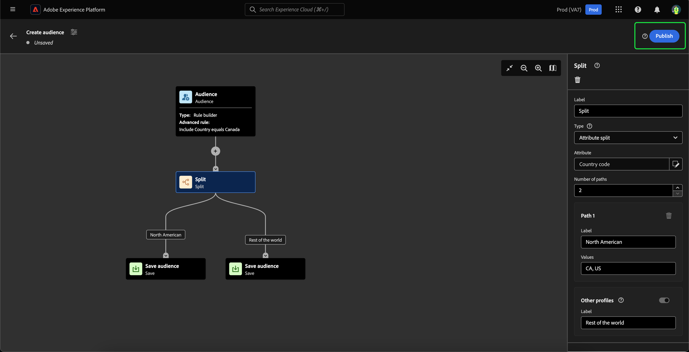

# Guía de IU de composición de audiencia

Composición de audiencia proporciona un espacio de trabajo para crear y editar audiencias, utilizando bloques que se utilizan para representar diferentes acciones.

Para cambiar los detalles de la composición, incluidos el título y la descripción, seleccione la  botón.

El **[!UICONTROL Propiedades de composición]** aparece la ventana emergente. Puede insertar detalles de la composición, incluidos el título y la descripción aquí.

>[!NOTE]
>
>Si lo hace **no** Si le asigna un título a la composición, tendrá un título de &quot;Composición&quot; seguido de la fecha y hora de creación de forma predeterminada.

Después de actualizar los detalles de la composición, seleccione **[!UICONTROL Guardar]** para confirmar estas actualizaciones. El lienzo de composición de audiencia vuelve a aparecer.

El lienzo de composición de audiencia se compone de cuatro tipos diferentes de bloques: **[[!UICONTROL Audiencia]](#audience-block)**, **[[!UICONTROL Excluir]](#exclude-block)**, **[[!UICONTROL Rango]](#rank-block)**, y **[[!UICONTROL Split]](#split-block)**.

## [!UICONTROL Audiencia ] {#audience-block}

El **[!UICONTROL Audiencia]** el tipo de bloque le permite añadir las subaudiencias que desea para componer su nueva audiencia más grande. De forma predeterminada, una **[!UICONTROL Audiencia]** El bloque de se incluye en la parte superior del lienzo de composición.

Al seleccionar la variable **[!UICONTROL Audiencia]** , el carril derecho muestra controles para etiquetar la audiencia y añadir audiencias al bloque, así como crear reglas personalizadas para el bloque de audiencia.

>[!NOTE]
>
>Puede añadir audiencias **o** crear una regla personalizada. Estas dos funcionalidades **no puede** se usarán juntos.

### [!UICONTROL Añadir audiencia] {#add-audience}

Para añadir audiencias al bloque Audiencia. select **[!UICONTROL Añadir audiencia]**.

Aparecerá una lista de audiencias. Seleccione las audiencias que desee incluir, seguidas de **[!UICONTROL Añadir]** para anexarlas al bloque de audiencia.

Las audiencias seleccionadas aparecerán ahora en el carril derecho cuando el **[!UICONTROL Audiencia]** El bloque está seleccionado. Desde aquí puede cambiar el tipo de combinación de las audiencias combinadas.

| Tipo de combinación | Descripción |
| ---------- | ----------- |
| [!UICONTROL Union] | Las audiencias se combinan en una sola audiencia. Sería el equivalente de una operación O. |
| [!UICONTROL Intersección] | Las audiencias se combinan, y solo se comparten las audiencias en **todo** de ellos que se van a añadir. Esto sería el equivalente de una operación AND. |
| [!UICONTROL Excluir superposición] | Las audiencias se combinan, y solo se comparten las audiencias en **uno, pero no todos** de ellos que se van a añadir. Esto sería el equivalente de una operación XOR. |

### [!UICONTROL Generar regla] {#build-rule}

Para añadir una regla personalizada al bloque Audiencia, seleccione **[!UICONTROL Generar regla]**.

Aparecerá el Generador de segmentos. Puede usar el Generador de segmentos para crear una regla personalizada para la audiencia que seguirá. Encontrará más información sobre el uso del Generador de segmentos en la [Guía del Generador de segmentos](./segment-builder.md).

Después de agregar una regla personalizada, seleccione **[!UICONTROL Guardar]** para añadir la regla a la audiencia.

## [!UICONTROL Excluir] {#exclude-block}

El **[!UICONTROL Excluir]** el tipo de bloque le permite excluir subaudiencias o atributos especificados de la nueva audiencia más grande.

Para agregar un **[!UICONTROL Excluir]** , seleccione la **+** icono, seguido de **[!UICONTROL Excluir]**.

El **[!UICONTROL Excluir]** se ha añadido un bloque de. Cuando se selecciona este bloque, los detalles sobre la exclusión aparecen en el carril derecho. Esto incluye la etiqueta del bloque y el tipo de exclusión. Puede excluir [por audiencia](#exclude-audience) o [por atributo](#exclude-attribute).

### Excluir por audiencia {#exclude-audience}

Si excluye por audiencia, puede seleccionar qué audiencias desea excluir seleccionando **[!UICONTROL Añadir audiencia]**.

![El [!UICONTROL Añadir audiencia] El botón está seleccionado, lo que le permite elegir qué audiencia desea excluir.](../images/ui/audience-composition/add-excluded-audience.png)

Aparecerá una lista de audiencias. Seleccionar **[!UICONTROL Añadir]** para añadir las audiencias que desee excluir al bloque de exclusión.

### Excluir por atributo {#exclude-attribute}

Si excluye por atributo, puede seleccionar qué atributos desea excluir seleccionando la variable  dentro de la **[!UICONTROL Regla de exclusión]** sección.

Aparecerá una lista de atributos de perfil. Seleccione el tipo de atributo que desea excluir, seguido de **[!UICONTROL Seleccionar]** para añadirlos al bloque de exclusión.

## [!UICONTROL Enriquecer] {#enrich-block}

>[!IMPORTANT]
>
>En este momento, los atributos de enriquecimiento pueden **solamente** se utilizará en escenarios de Adobe Journey Optimizer descendentes.

El **[!UICONTROL Enriquecer]** el tipo de bloque permite enriquecer la audiencia con atributos adicionales de un conjunto de datos. Puede utilizar estos atributos en casos de uso de personalización.

Para agregar un **[!UICONTROL Enriquecer]** , seleccione la **+** icono, seguido de **[!UICONTROL Enriquecer]**.

![El [!UICONTROL Enriquecer] La opción está seleccionada.](../images/ui/audience-composition/add-enrich-block.png)

El **[!UICONTROL Enriquecer]** se ha añadido un bloque de. Cuando se selecciona este bloque, los detalles sobre el enriquecimiento aparecen en el carril derecho. Esto incluye la etiqueta del bloque y el conjunto de datos de enriquecimiento.

Para seleccionar el conjunto de datos con el que enriquecer la audiencia, seleccione  icono.

![El botón de filtro está resaltado. Si selecciona esta opción, accederá al [!UICONTROL Seleccionar conjunto de datos] popover.](../images/ui/audience-composition/enrich-select-dataset.png)

El **[!UICONTROL Seleccionar conjunto de datos]** aparece la ventana emergente. Seleccione el conjunto de datos que desee agregar para el enriquecimiento, seguido de **[!UICONTROL Seleccionar]** para añadir el conjunto de datos para el enriquecimiento.

>[!IMPORTANT]
>
>El conjunto de datos seleccionado **debe** cumplen los siguientes criterios:
>
>- El conjunto de datos **debe** ser de tipo registro.
>   - El conjunto de datos **no puede** ser de tipo de evento, generarse por el sistema o marcarse para Perfil.
>- El conjunto de datos **debe** ser de 1 GB o menor.

El **[!UICONTROL Criterios de enriquecimiento]** ahora aparece la sección en el carril derecho. En esta sección, puede seleccionar la variable **[!UICONTROL Clave de combinación de origen]** y el **[!UICONTROL Clave de combinación del conjunto de datos de enriquecimiento]**, que le permite vincular el conjunto de datos enriquecido con la audiencia que intenta crear.

![El [!UICONTROL Criterios de enriquecimiento] área resaltada.](../images/ui/audience-composition/enrichment-criteria.png)

Para seleccionar **[!UICONTROL Clave de combinación de origen]**, seleccione la  icono.

![El icono de filtro para [!UICONTROL Clave de combinación de origen] está resaltado.](../images/ui/audience-composition/enrich-select-source-join-key.png)

El **[!UICONTROL Seleccionar un atributo de perfil]** aparece la ventana emergente. Seleccione el atributo de perfil que desee utilizar como clave de unión de origen, seguido de **[!UICONTROL Seleccionar]** para elegir ese atributo como clave de unión de origen.

Para seleccionar **[!UICONTROL Clave de combinación del conjunto de datos de enriquecimiento]**, seleccione la  icono.

![El icono de filtro para [!UICONTROL Clave de combinación del conjunto de datos de enriquecimiento] está resaltado.](../images/ui/audience-composition/enrich-select-enrichment-dataset-join-key.png)

El **[!UICONTROL Atributos de enriquecimiento]** aparece la ventana emergente. Seleccione el atributo que desee utilizar como clave de unión del conjunto de datos de enriquecimiento, seguido de **[!UICONTROL Seleccionar]** para elegir ese atributo como clave de unión del conjunto de datos de enriquecimiento.

Ahora que ha agregado ambas claves de unión, la variable **[!UICONTROL Atributos de enriquecimiento]** aparece la sección. Ahora puede añadir el atributo con el que desee mejorar la audiencia. Para añadir estos atributos, seleccione **[!UICONTROL Añadir atributo]**.

![El [!UICONTROL Añadir atributo] botón resaltado.](../images/ui/audience-composition/enrich-select-add-attribute.png)

El **[!UICONTROL Atributos de enriquecimiento]** aparece la ventana emergente. Puede seleccionar los atributos del conjunto de datos con los que enriquecer la audiencia, seguidos de **[!UICONTROL Seleccionar]** para añadir los atributos a la audiencia.

<!-- ## [!UICONTROL Join] {#join-block}

The **[!UICONTROL Join]** block type allows you to add in external audiences from datasets that have not yet been processed by Adobe Experience Platform.

To add a **[!UICONTROL Join]** block, select the **+** icon, followed by **[!UICONTROL Join]**.

When you select the block, details about the join are shown in the right rail, including the block's label and the option to add audiences to the enrichment dataset.

After selecting **[!UICONTROL Add Audience]**, a list of audiences appears. Select the audiences you want to include, followed by **[!UICONTROL Add]** to add them to your join block.

Your selected audiences now appear within the right rail when the **[!UICONTROL Join]** block is selected. 

 -->

## [!UICONTROL Rango] {#rank-block}

El **[!UICONTROL Rango]** el tipo de bloque permite clasificar y ordenar perfiles en función de un atributo especificado e incluir estos perfiles clasificados en la composición.

Para agregar un **[!UICONTROL Rango]** , seleccione la **+** icono, seguido de **[!UICONTROL Rango]**.

Al seleccionar el bloque, los detalles sobre la clasificación se muestran en el carril derecho, incluida la etiqueta del bloque, el atributo por el que clasificar, el orden de clasificación y una opción para limitar el número de perfiles que clasificar.

Para seleccionar por qué atributo clasificar las audiencias, seleccione el  icono.

Aparecerá una lista de atributos de perfil. En esta ventana emergente, puede seleccionar el tipo de atributo por el que desea clasificar la audiencia. Seleccionar **[!UICONTROL Seleccionar]** para añadirlo a su bloque de clasificación. Tenga en cuenta que el atributo seleccionado **solamente** ser números.

Después de seleccionar el atributo, puede seleccionar el orden por el que desea clasificarlo. Puede ser ascendente (de menor a mayor) o descendente (de mayor a menor).

Además, puede limitar el número de audiencias que devuelve habilitando la variable **[!UICONTROL Añadir límite de perfil]** alternar. Cuando esta opción está habilitada, puede establecer el número máximo de audiencias devueltas dentro de la variable **[!UICONTROL Perfiles incluidos]** field.

## [!UICONTROL Split] {#split-block}

El **[!UICONTROL Split]** el tipo de bloque le permite dividir la nueva audiencia en varias subaudiencias. Puede dividir esta audiencia según el porcentaje o por un atributo.

Para agregar un **[!UICONTROL Split]** , seleccione la **+** icono, seguido de **[!UICONTROL Split]**.

Al dividir la audiencia, puede hacerlo por porcentaje o por atributo.

### Dividido por porcentaje {#split-percentage}

Al dividir por porcentaje, las audiencias se dividirán aleatoriamente en función del número de rutas y porcentajes proporcionados.

Por ejemplo, puede tener tres rutas, cada una con un porcentaje diferente de perfiles.

### Dividir por atributo {#split-attribute}

Al dividir por atributo, las audiencias se dividen según los atributos proporcionados. Para seleccionar el atributo por el que dividir, seleccione **[!UICONTROL Split]** bloque, seguido de la variable  icono.

Aparecerá una lista de atributos de perfil. Seleccione el tipo de atributo, seguido de **[!UICONTROL Seleccionar]** para añadirlo a su bloque de división.

Después de seleccionar el atributo, puede elegir qué perfiles pertenecen a cada subaudiencia añadiendo los valores dentro de la variable **[!UICONTROL Valores]** field.

Además, puede habilitar la variable **[!UICONTROL Otros perfiles]** active esta opción para crear una subaudiencia que incluya todos los perfiles no seleccionados.

## Publicación de la audiencia

Una vez maquetada la audiencia, puede guardarla y publicarla seleccionando **[!UICONTROL Publish]**.

Si se produce algún error al crear la audiencia, aparece una alerta que le permite saber cómo resolver el problema.

## Pasos siguientes

Composición de audiencia proporciona un flujo de trabajo enriquecido que le permite crear audiencias a partir de los diferentes tipos de bloques. Para obtener más información acerca de otras partes de la interfaz de usuario del servicio de segmentación, lea la [Guía del usuario del servicio de segmentación](./overview.md).
