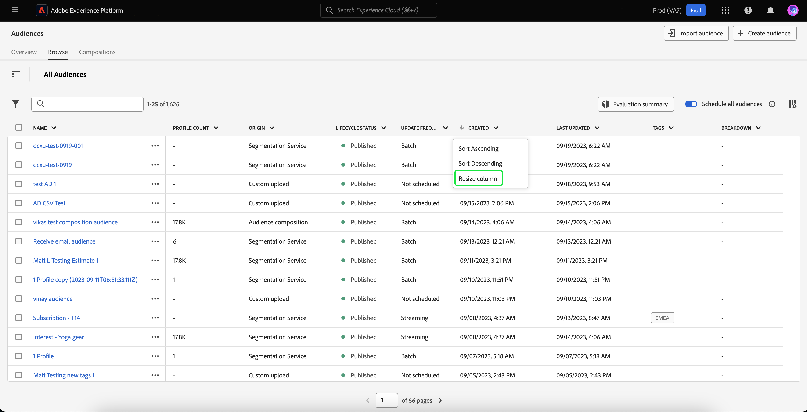
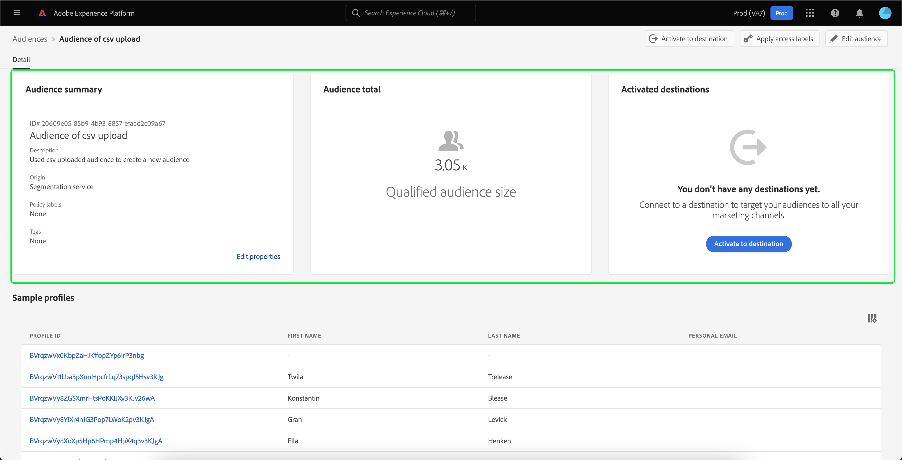
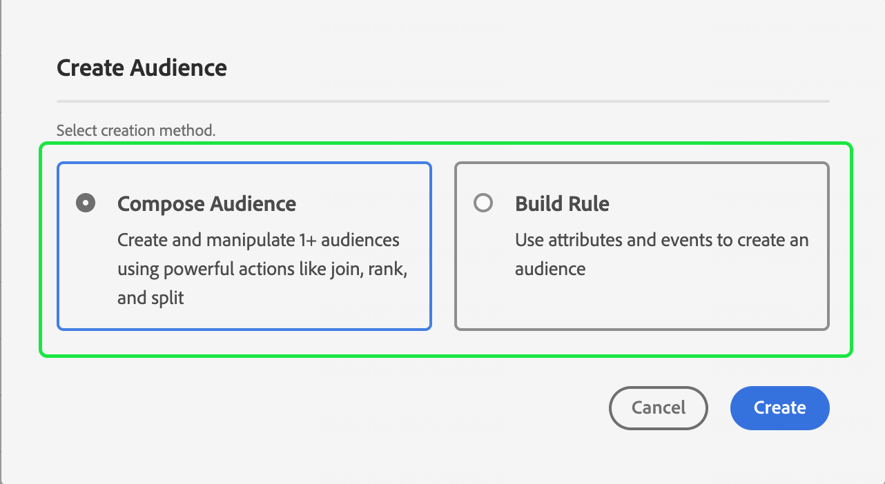

# Información general de Audience Portal

Audience Portal es un concentrador central, dentro de Adobe Experience Platform, que le permite ver, administrar y crear audiencias.

En Audience Portal, puede realizar las siguientes tareas:

>[!BEGINSHADEBOX]

- [Visualización de una lista de sus audiencias](#list)
   - [Uso de acciones rápidas en las audiencias](#quick-actions)
   - [Personalice las propiedades que se muestran en la lista de audiencias](#customize)
   - [Utilice filtros, carpetas y etiquetas para organizar las audiencias](#manage-audiences)
- [Ver detalles de su audiencia](#audience-details)
   - [Vea un resumen sobre su audiencia](#audience-summary)
- [Activación de las audiencias para la segmentación programada](#scheduled-segmentation)
- [Crear un público](#create-audience)
   - [Utilice el Generador de segmentos para crear una audiencia](#segment-builder)
   - [Usar Composición de audiencia para crear una audiencia](#audience-composition)
   - [Use la Composición de audiencia federada para crear una audiencia con los datos de su almacén de datos existente](#fac)
   - [Uso de Data Distiller para crear una audiencia](#data-distiller)
- [Importación de públicos generados externamente](#import-audience)

>[!ENDSHADEBOX]

Para abrir Audience Portal, seleccione la ficha **[!UICONTROL Examinar]** en la sección Segmentación.

## Lista de público {#list}

>[!CONTEXTUALHELP]
>id="platform_segments_browse_churncolumnname"
>title="Pérdida"
>abstract="La pérdida representa el porcentaje de perfiles que cambian dentro de un público en comparación con la última vez que se ejecutó el trabajo del público."

>[!CONTEXTUALHELP]
>id="platform_segments_browse_evaluationmethodcolumnname"
>title="Método de evaluación"
>abstract="Los métodos de evaluación de públicos incluyen lote, streaming y Edge."

De forma predeterminada, Audience Portal muestra una lista de todas las audiencias de la organización y de la zona protegida, incluido el recuento de perfiles, el origen, la fecha de creación, la fecha de la última modificación, las etiquetas y el desglose.

### Acciones rápidas {#quick-actions}

Junto a cada audiencia hay un icono de puntos suspensivos. Al seleccionar esta opción, se muestra una lista de las acciones rápidas disponibles para la audiencia. Esta lista de acciones difiere según el origen de la audiencia.

![Se muestra la lista de acciones rápidas para las audiencias con el origen de [!UICONTROL Composición de audiencias].](../images/ui/audience-portal/browse-audience-composition-details.png)

| Acción | Orígenes | Descripción |
| ------ | ------- | ----------- |
| [!UICONTROL Editar] | Servicio de segmentación | Abre el Generador de segmentos para editar la audiencia. Tenga en cuenta que si la audiencia se creó mediante la API, **no** podrá editarla con el Generador de segmentos. Para obtener más información sobre el uso del Generador de segmentos, lea la [guía de la interfaz de usuario del Generador de segmentos](./segment-builder.md). |
| [!UICONTROL Abrir composición] | Composición del público | Abre la composición Audiencia para ver su audiencia. Para obtener más información sobre la composición de audiencias, lea la [guía de interfaz de usuario sobre composición de audiencias](./audience-composition.md). |
| [!UICONTROL Activar en destino] | Servicio de segmentación | Activa la audiencia en un destino. Para obtener información más detallada sobre cómo activar una audiencia en un destino, lea [información general de activación](../../destinations/ui/activation-overview.md). |
| [!UICONTROL Compartir con socios] | Composición de audiencias, carga personalizada, servicio de segmentación | Comparte la audiencia con otros usuarios de Experience Platform. Para obtener más información sobre esta característica, lea [Resumen de coincidencia de segmentos](./segment-match/overview.md). |
| [!UICONTROL Administrar etiquetas] | Composición de audiencias, carga personalizada, servicio de segmentación | Administra las etiquetas definidas por el usuario que pertenecen a la audiencia. Para obtener más información sobre esta característica, lea la sección sobre [filtrado y etiquetado](#manage-audiences). |
| [!UICONTROL Mover a la carpeta] | Composición de audiencias, carga personalizada, servicio de segmentación | Administra a qué carpeta pertenece la audiencia. Para obtener más información sobre esta característica, lea la sección sobre [filtrado y etiquetado](#manage-audiences). |
| [!UICONTROL Copiar] | Servicio de segmentación | Duplica la audiencia seleccionada. Encontrará más información sobre esta función en [Preguntas frecuentes sobre la segmentación](../faq.md#copy). |
| [!UICONTROL Aplicar etiquetas de acceso] | Composición de audiencias, carga personalizada, servicio de segmentación | Administra las etiquetas de acceso que pertenecen a la audiencia. Para obtener más información sobre las etiquetas de acceso, lea la documentación sobre [administración de etiquetas](../../access-control/abac/ui/labels.md). |
| [!UICONTROL Publicar] | Carga personalizada, servicio de segmentación | Publica la audiencia seleccionada. Para obtener más información sobre la administración del estado del ciclo vital, lea la [sección de estado del ciclo vital de las Preguntas frecuentes sobre la segmentación](../faq.md#lifecycle-states). |
| [!UICONTROL Desactivar] | Carga personalizada, servicio de segmentación | Desactiva la audiencia seleccionada. Tenga en cuenta que para desactivar una audiencia, **no se puede** activar en **ningún** destino (incluidos destinos que no sean de Experience Platform) ni formar parte de **ningún** otro tipo de audiencias. Para obtener más información sobre la administración del estado del ciclo vital, lea la [sección de estado del ciclo vital de las Preguntas frecuentes sobre la segmentación](../faq.md#lifecycle-states). |
| [!UICONTROL Eliminar] | Composición de audiencias, carga personalizada, servicio de segmentación | Elimina la audiencia seleccionada. Las audiencias que se usan en destinos de flujo descendente o que dependen de otras audiencias **no se pueden** eliminar. Para obtener más información sobre la eliminación de audiencias, lea las [preguntas frecuentes sobre la segmentación](../faq.md#lifecycle-states). |
| [!UICONTROL Agregar al paquete] | Composición de audiencias, carga personalizada, servicio de segmentación | Mueve la audiencia entre zonas protegidas. Para obtener más información sobre esta característica, lea la [guía de herramientas para zonas protegidas](../../sandboxes/ui/sandbox-tooling.md). |

>[!IMPORTANT]
>
>Antes de eliminar tu audiencia, asegúrate de que la audiencia **no** se use como componente en una audiencia basada en cuentas o se use en Adobe Journey Optimizer.

En la parte superior de la página hay opciones para añadir todas las audiencias a una programación, importar una audiencia, crear una audiencia nueva y ver un resumen de la evaluación de audiencias.

Si se cambia **[!UICONTROL Programar todas las audiencias]**, se habilitará la segmentación programada. Encontrará más información sobre la segmentación programada en la sección [segmentación programada de esta guía del usuario](#scheduled-segmentation).

Si selecciona **[!UICONTROL Importar audiencia]**, podrá importar una audiencia generada externamente. Para obtener más información sobre cómo importar audiencias, lea la sección sobre [importación de una audiencia en la guía del usuario](#import-audience).

Si selecciona **[!UICONTROL Crear audiencia]**, podrá crear una audiencia. Para obtener más información sobre cómo crear audiencias, lea la sección sobre [creación de una audiencia en la guía del usuario](#create-audience).

Puede seleccionar **[!UICONTROL Resumen de evaluación]** para mostrar un gráfico circular con un resumen de las evaluaciones de audiencia.

Aparece un gráfico circular que muestra un desglose de las audiencias por evaluación de audiencia. El gráfico muestra la cantidad total de audiencias en el centro y el tiempo diario de evaluación por lotes en UTC en la parte inferior. Si pasa el ratón por encima de las diferentes partes de la audiencia, se mostrará el número de audiencias que pertenecen a cada tipo de frecuencia de actualización.

### Personalizar {#customize}

Puede agregar campos adicionales al Portal de audiencias seleccionando . Estos campos adicionales incluyen el estado del ciclo vital, la frecuencia de actualización, la última actualización por, la descripción, la creación por y las etiquetas de acceso.

| Campo | Descripción |
| ----- | ----------- |
| [!UICONTROL Nombre] | Nombre de la audiencia. |
| [!UICONTROL Recuento de perfiles] | Número total de perfiles aptos para la audiencia. |
| [!UICONTROL Origen] | El origen de la audiencia. Indica de dónde proviene la audiencia. Los valores posibles incluyen [Servicio de segmentación](#segment-builder), [Carga personalizada](#import-audience), [Composición de audiencias](#audience-composition), [Audience Manager](https://experienceleague.adobe.com/es/docs/audience-manager/user-guide/aam-home), [Audiencia similar](../types/lookalike-audiences.md), [Composición de audiencias federada](#fac), [Customer Journey Analytics](https://experienceleague.adobe.com/es/docs/analytics-platform/using/cja-overview/cja-overview), [Distiller de datos](#data-distiller), [AJO B2B](https://experienceleague.adobe.com/es/docs/journey-optimizer-b2b/user/guide-overview) y [Real-Time CDP Collaboration](https://experienceleague.adobe.com/es/docs/real-time-cdp-collaboration/using/destinations/experience-platform#audience-portal). |
| [!UICONTROL Estado del ciclo vital] | El estado de la audiencia. Los valores posibles de este campo incluyen `Draft`, `Inactive` y `Published`. Para obtener más información sobre los estados del ciclo vital, incluidos el significado de los distintos estados y cómo mover audiencias a diferentes estados del ciclo vital, lea la sección [estado del ciclo vital de las Preguntas frecuentes sobre la segmentación](../faq.md#lifecycle-status). |
| [!UICONTROL Frecuencia de actualización] | Un valor que indica la frecuencia con la que se actualizan los datos de la audiencia. Los valores posibles para este campo incluyen [!UICONTROL Lote], [!UICONTROL Transmisión en línea], [!UICONTROL Edge] y [!UICONTROL No programado]. |
| [!UICONTROL Última actualización por] | El nombre de la persona que actualizó la audiencia por última vez. |
| [!UICONTROL Creado] | La fecha y la hora, en UTC, en que se creó la audiencia. |
| [!UICONTROL Última actualización] | La fecha y la hora, en UTC, en que se actualizó la audiencia por última vez. |
| [!UICONTROL Etiquetas] | Las etiquetas definidas por el usuario que pertenecen a la audiencia. Encontrará más información sobre estas etiquetas en la sección [de etiquetas](#tags). |
| [!UICONTROL Descripción] | La descripción de la audiencia. |
| [!UICONTROL Creado por] | El nombre de la persona que creó la audiencia. |
| [!UICONTROL Etiquetas de acceso] | Las etiquetas de acceso para la audiencia. Las etiquetas de acceso le permiten categorizar conjuntos de datos y campos según las políticas de uso que se aplican a esos datos. Estas etiquetas se pueden aplicar en cualquier momento, lo que proporciona flexibilidad en la forma en que se decide administrar los datos. Para obtener más información sobre las etiquetas de acceso, lea la documentación sobre [administración de etiquetas](../../access-control/abac/ui/labels.md). |
| [!UICONTROL Desglose] | El desglose del estado del perfil de la audiencia. A continuación, se puede encontrar una descripción más detallada de este desglose del estado del perfil. |

Si se selecciona desglose, la pantalla muestra un gráfico de barras que indica el porcentaje de perfiles que pertenecen a cada uno de los siguientes estados de perfiles calculados: [!UICONTROL Realizado], [!UICONTROL Existente] y [!UICONTROL Saliendo]. Además, el desglose que se muestra en la ficha [!UICONTROL Examinar] es el desglose más preciso del estado de la definición del segmento. Si este número difiere de lo indicado en la ficha [!UICONTROL Información general], debe usar los números de la ficha [!UICONTROL Examinar] como fuente de información correcta, ya que los números de la ficha [!UICONTROL Información general] solo se actualizan una vez al día.

| Estado | Descripción |
| ------ | ----------- |
| [!UICONTROL Realizado] | Recuento de perfiles que **calificaron** para la audiencia en las últimas 24 horas desde que se ejecutó el último trabajo de segmentación por lotes. |
| [!UICONTROL Existente] | Recuento de perfiles que **permanecieron** en la audiencia en las últimas 24 horas desde que se ejecutó el último trabajo de segmentación por lotes. Este campo es **calculado** y no aparece en el objeto [`segmentMembership`](../../xdm/field-groups/profile/segmentation.md). |
| [!UICONTROL Saliendo] | Recuento de perfiles que **abandonaron** la audiencia en las últimas 24 horas desde que se ejecutó el último trabajo de segmentación por lotes. |

Después de seleccionar los campos que desea mostrar, también puede cambiar el tamaño del ancho de las columnas mostradas. Para ello, arrastre el área entre las columnas o seleccione el  de la columna cuyo tamaño desea cambiar, seguido de **[!UICONTROL Cambiar tamaño de columna]**.

### Filtrado, carpetas y etiquetado {#manage-audiences}

Para mejorar la eficacia del trabajo, puede buscar audiencias existentes, añadir etiquetas definidas por el usuario a las audiencias, colocar audiencias en carpetas y filtrar las audiencias mostradas.

#### Buscar {#search}

Puede buscar audiencias existentes en hasta 9 idiomas diferentes con [!DNL Unified Search].

Para usar [!DNL Unified Search], agregue el término que desea buscar en la barra de búsqueda resaltada.

Para obtener más información acerca de [!DNL Unified Search], incluidas las características compatibles, lea la [documentación de búsqueda unificada](https://experienceleague.adobe.com/docs/core-services/interface/services/search-experience-cloud.html?lang=es).

#### Etiquetas {#tags}

Puede añadir etiquetas definidas por el usuario para describir, buscar y administrar mejor sus audiencias.

Para agregar una etiqueta, selecciona **[!UICONTROL Administrar etiquetas]** en la audiencia que quieras etiquetar.

![El botón [!UICONTROL Administrar etiquetas] está seleccionado para una audiencia especificada.](../images/ui/audience-portal/browse-manage-tags.png)

Aparece la ventana emergente **[!UICONTROL Administrar etiquetas]**. En esta ventana emergente, puede seleccionar una etiqueta clasificada o una etiqueta sin clasificar.

| Tipo de etiqueta | Descripción |
| -------- | ----------- |
| Categorizado | Una etiqueta que crean y administran los administradores de su organización. |
| Sin categorizar | Una etiqueta que se crea en la ventana emergente [!UICONTROL Administrar etiquetas]. Cualquiera puede crear o administrar este tipo de etiquetas. |

![Se muestra la ventana emergente [!UICONTROL Administrar etiquetas]. Se resaltan las opciones para elegir una categoría o una categoría sin categoría.](../images/ui/audience-portal/create-tag.png)

Después de agregar todas las etiquetas que quieras adjuntar a la audiencia, selecciona **[!UICONTROL Guardar]**.

![En la ventana emergente [!UICONTROL Administrar etiquetas], las etiquetas agregadas están resaltadas.](../images/ui/audience-portal/created-tags.png)

Para obtener más información sobre cómo crear y administrar etiquetas, lea la [Guía de administración de etiquetas](../../administrative-tags/ui/managing-tags.md).

#### Carpetas {#folders}

Puede colocar audiencias dentro de carpetas para mejorar la gestión de audiencias.

Para crear una carpeta para albergar tus audiencias, selecciona **[!UICONTROL Crear carpeta]**.

>[!NOTE]
>
>Solo puede crear una carpeta si está dentro de otra carpeta. Esto significa que **no puede** crear una carpeta si tiene **[!UICONTROL Todas las audiencias]** seleccionadas en la barra de navegación izquierda.

Aparece una ventana emergente que le permite asignar un nombre a la carpeta recién creada. Seleccione **[!UICONTROL Guardar]** después de darle un nombre a la carpeta para terminar de crearla. Tenga en cuenta que los nombres **deben** ser exclusivos de la carpeta principal.

Para mover una audiencia a una carpeta, seleccione **[!UICONTROL Mover a la carpeta]** de la audiencia que desee mover.

![El botón [!UICONTROL Mover a carpeta] está seleccionado para una audiencia específica.](../images/ui/audience-portal/browse-move-to-folder.png)

Aparece la ventana emergente **Mover audiencia a la carpeta**. Seleccione la carpeta a la que desee mover la audiencia y, a continuación, seleccione **[!UICONTROL Guardar]**.

Una vez que la audiencia está en una carpeta, puede elegir mostrar únicamente las audiencias que pertenecen a una carpeta específica.

Se muestran 

#### Filtro {#filter}

También puede filtrar las audiencias en función de diversos ajustes.

Para filtrar las audiencias disponibles, seleccione el .

Se muestra la lista de filtros disponibles.

| Filtro | Descripción |
| ------ | ----------- |
| [!UICONTROL Origen] | Le permite filtrar según el origen de la audiencia. Los valores posibles incluyen [Servicio de segmentación](#segment-builder), [Carga personalizada](#import-audience), [Composición de audiencias](#audience-composition), [Audience Manager](https://experienceleague.adobe.com/es/docs/audience-manager/user-guide/aam-home), [Audiencia similar](../types/lookalike-audiences.md), [Composición de audiencias federada](#fac), [Customer Journey Analytics](https://experienceleague.adobe.com/es/docs/analytics-platform/using/cja-overview/cja-overview), [Distiller de datos](#data-distiller), [AJO B2B](https://experienceleague.adobe.com/es/docs/journey-optimizer-b2b/user/guide-overview) y [Real-Time CDP Collaboration](https://experienceleague.adobe.com/es/docs/real-time-cdp-collaboration/using/destinations/experience-platform#audience-portal). |
| [!UICONTROL Tiene cualquier etiqueta] | Le permite filtrar por etiquetas. Puede seleccionar entre **[!UICONTROL Tiene cualquier etiqueta]** y **[!UICONTROL Tiene todas las etiquetas]**. Cuando se selecciona **[!UICONTROL Tiene cualquier etiqueta]**, las audiencias filtradas incluirán **cualquiera** de las etiquetas que haya agregado. Cuando se selecciona **[!UICONTROL Tiene todas las etiquetas]**, las audiencias filtradas deben incluir **todas** las etiquetas que haya agregado. |
| [!UICONTROL Estado del ciclo vital] | Le permite filtrar según el estado del ciclo vital de la audiencia. Las opciones disponibles son [!UICONTROL Eliminado], [!UICONTROL Borrador], [!UICONTROL Inactivo] y [!UICONTROL Publicado]. |
| [!UICONTROL Frecuencia de actualización] | Le permite filtrar según la frecuencia de actualización de la audiencia (método de evaluación). Las opciones disponibles son [!UICONTROL Lote], [!UICONTROL Transmisión] y [!UICONTROL Edge] |
| [!UICONTROL Creado por] | Le permite filtrar según la persona que creó la audiencia. |
| [!UICONTROL Fecha de creación] | Le permite filtrar según la fecha de creación de la audiencia. Puede elegir un intervalo de fechas para filtrar cuándo se creó la audiencia. |
| [!UICONTROL Fecha de modificación] | Le permite filtrar según la última fecha de modificación de la audiencia. Puede elegir un intervalo de fechas para filtrar cuándo se modificó la audiencia por última vez. |

### Acciones masivas {#bulk-actions}

Además, puede seleccionar hasta 25 audiencias diferentes y realizar diversas acciones en estas audiencias. Estas acciones incluyen [mover a una carpeta](#folders), [editar o aplicar una etiqueta](#tags), [evaluar audiencias](#flexible-audience-evaluation), [aplicar etiquetas de acceso](../../access-control/abac/ui/labels.md) y [eliminar](#browse).

Cuando se aplican acciones masivas a las audiencias, se aplican las siguientes condiciones:

- Usted **puede** seleccionar audiencias de diferentes páginas.
- Usted **no puede** eliminar una audiencia que se esté usando en una activación de destino.
- Si selecciona un filtro, las audiencias seleccionadas **se restablecerán**.

#### Evaluación flexible de audiencias {#flexible-audience-evaluation}

La evaluación flexible de audiencias le permite ejecutar un trabajo de segmentación bajo demanda. Para obtener más información acerca de la evaluación flexible de audiencias, lea la [guía de evaluación flexible de audiencias](../methods/flexible-audience-evaluation.md).

## Detalles de público {#audience-details}

Para ver más detalles sobre una audiencia específica, selecciona el nombre de una audiencia en la pestaña **[!UICONTROL Examinar]**.

Aparecerá la página de detalles de la audiencia. En la parte superior, hay un resumen de la audiencia, información sobre el tamaño de audiencia cualificado, así como destinos para los que se activa el segmento.

### Resumen de público {#audience-summary}

La sección **[!UICONTROL Resumen de audiencia]** proporciona información como el ID, el nombre, la descripción, el origen y los detalles de los atributos.

Además, tiene la opción de activar la audiencia en un destino, aplicar etiquetas de acceso o editar/actualizar la audiencia.

Si selecciona **[!UICONTROL Activar en destino]** podrá activar la audiencia en un destino. Para obtener información más detallada sobre cómo activar una audiencia en un destino, lea [información general de activación](../../destinations/ui/activation-overview.md).

Si selecciona **[!UICONTROL Aplicar etiquetas de acceso]**, podrá administrar las etiquetas de acceso que pertenecen a la audiencia. Para obtener más información sobre las etiquetas de acceso, lea la documentación sobre [administración de etiquetas](../../access-control/abac/ui/labels.md).

>[!BEGINTABS]

>[!TAB Composición de público]

![Se muestra la página de detalles de la audiencia con el botón [!UICONTROL Abrir composición] resaltado.](../images/ui/audience-portal/audience-details-open-composition.png)

Si selecciona **[!UICONTROL Abrir composición]** podrá ver la audiencia en Composición de audiencias. Para obtener más información sobre la composición de audiencias, lea la [guía de la interfaz de usuario de la composición de audiencias](./audience-composition.md).

>[!TAB Carga personalizada]

![Se muestra la página de detalles de audiencia con el botón [!UICONTROL Actualizar audiencia] resaltado.](../images/ui/audience-portal/audience-details-update-audience.png)

Si selecciona **[!UICONTROL Actualizar audiencia]**, podrá volver a cargar una audiencia generada externamente. Para obtener más información sobre cómo importar una audiencia generada externamente, lea la sección sobre [importación de una audiencia](#import-audience).

>[!TAB Servicio de segmentación]

![Se muestra la página de detalles de audiencia con el botón [!UICONTROL Editar audiencia] resaltado.](../images/ui/audience-portal/audience-details-edit-audience.png)

Si selecciona **[!UICONTROL Editar audiencia]**, podrá editar su audiencia en el Generador de segmentos. Para obtener información más detallada sobre el uso del área de trabajo [!DNL Segment Builder], lea la [[!DNL Segment Builder] guía del usuario](./segment-builder.md).

>[!ENDTABS]

Si selecciona **[!UICONTROL Editar propiedades]**, podrá editar los detalles básicos de la audiencia, como el nombre, la descripción y las etiquetas.

### Total de público {#audience-total}

Para audiencias y composiciones generadas por Experience Platform, la sección **[!UICONTROL Audiencia total]** muestra el número total de perfiles aptos para la audiencia.

>[!NOTE]
>
>El recuento total de audiencias puede tardar hasta 30 minutos en actualizarse una vez completado el trabajo de exportación.

Las estimaciones se generan utilizando un tamaño de muestra de los datos de muestra de ese día. Si hay menos de 1 millón de entidades en el almacén de perfiles, se utiliza el conjunto de datos completo; para entre 1 y 20 millones de entidades, se utiliza 1 millón de entidades; y para más de 20 millones de entidades, se utiliza el 5% del total de entidades. Encontrará más información sobre la generación de estimaciones en la [sección de generación de estimaciones](../tutorials/create-a-segment.md#estimate-and-preview-an-audience) del tutorial de creación de audiencias.

### Detalles de ingesta {#ingestion-details}

Para audiencias con un origen de **[!UICONTROL carga personalizada]**, la sección **[!UICONTROL Detalles de ingesta]** muestra tanto el total del perfil como los detalles del conjunto de datos en el que se ingirió la audiencia generada externamente.

>[!NOTE]
>
>El recuento de perfiles de la audiencia puede tardar hasta 30 minutos después del trabajo de exportación en actualizarse por completo.

| Propiedad | Descripción |
| -------- | ----------- |
| Recuento de perfiles | Número total de perfiles aptos para la audiencia. |
| Nombre del conjunto de datos | Nombre del conjunto de datos en el que se ingirió la audiencia. Puede seleccionar el nombre del conjunto de datos para obtener más información sobre este. Para obtener más información sobre los conjuntos de datos, lea la [guía de la interfaz de usuario del conjunto de datos](../../catalog/datasets/user-guide.md). |
| Lote de conjuntos de datos | El ID del conjunto de datos en el que se ingirió la audiencia. Puede seleccionar el ID del lote para obtener más información sobre el lote. Para obtener más información sobre los lotes, lea la [guía de supervisión de la ingesta de datos](../../ingestion/quality/monitor-data-ingestion.md#viewing-batches). |
| Lote de perfiles | El ID del lote que creó los perfiles en Experience Platform. Puede seleccionar el ID del lote para obtener más información sobre el lote. Para obtener más información sobre los lotes, lea la [guía de supervisión de la ingesta de datos](../../ingestion/quality/monitor-data-ingestion.md#viewing-batches). |
| Esquema | El nombre del esquema al que pertenece la audiencia. Puede seleccionar el nombre del esquema para ver información sobre la estructura del esquema y aplicar etiquetas de uso de datos. Para obtener más información, lea las [etiquetas de uso de datos administradas para una guía de esquema](../../xdm/tutorials/labels.md). |
| Registros ingeridos | El número de registros ingeridos en el conjunto de datos. |
| Error de registros | El número de registros que no se pudieron introducir en el conjunto de datos. |
| Nuevos fragmentos de perfil | El número de perfiles nuevos que se crearon. |
| Fragmentos de perfil existentes | El número de perfiles existentes que se actualizaron. |

>[!NOTE]
>
>La práctica recomendada es aplicar etiquetas de uso de datos al esquema. Usted **no puede** aplicar una etiqueta de uso de datos directamente a la audiencia.

### Destinos activados {#activated-destinations}

La sección **[!UICONTROL Destinos activados]** muestra los destinos para los que está activada esta audiencia.

>[!NOTE]
>
> Los destinos son una característica disponible con [!DNL Adobe Real-Time Customer Data Platform] que le permite exportar datos a plataformas externas. Para obtener más información sobre los destinos, lea [información general de destinos](../../destinations/home.md). Para obtener información sobre cómo activar un segmento en un destino, consulte [descripción general de la activación](../../destinations/ui/activation-overview.md).

### Muestras de perfil {#profile-samples}

A continuación se muestra una muestra de los perfiles aptos para el segmento, con información detallada como el ID de [!DNL Profile], el nombre, los apellidos y el correo electrónico personal.

La forma en que se activa el muestreo de datos depende del método de ingesta.

Para la ingesta por lotes, el almacén de perfiles se analiza automáticamente cada quince minutos para ver si un nuevo lote se ha ingerido correctamente desde que se ejecutó el último trabajo de muestreo. En ese caso, se analiza posteriormente el almacén de perfiles para ver si ha habido al menos un cambio del 5 % en el número de registros. Si se cumplen estas condiciones, se activa un nuevo trabajo de muestreo.

Para la ingesta de transmisión, el almacén de perfiles se analiza automáticamente cada hora para ver si ha habido al menos un cambio del 5 % en el número de registros. Si se cumple esta condición, se activa un nuevo trabajo de muestreo.

El tamaño de la muestra de la exploración depende del número total de entidades del almacén de perfiles. Estos tamaños de muestra se representan en la siguiente tabla:

| Entidades en el almacén de perfiles | Tamaño de muestra |
| ------------------------- | ----------- |
| Menos de 1 millón | Conjunto de datos completo |
| 1 a 20 millones | 1 millón |
| Más de 20 millones | 5 % del total |

Se puede ver información más detallada sobre cada [!DNL Profile] seleccionando el ID [!DNL Profile]. Para obtener más información sobre los detalles de un perfil, lee la [[!DNL Real-Time Customer Profile] guía del usuario](../../profile/ui/user-guide.md#profile-detail).

## Segmentación programada {#scheduled-segmentation}

>[!CONTEXTUALHELP]
>id="platform_segments_browse_addallsegmentstoschedule"
>title="Añadir todos los públicos a la programación"
>abstract="Habilite la opción para incluir todos los públicos evaluados mediante la segmentación por lotes en la actualización programada diaria. Deshabilite para quitar todos los públicos de la actualización programada."

Una vez creadas las audiencias, puede evaluarlas mediante una evaluación bajo demanda o programada (continua). La evaluación implica mover [!DNL Real-Time Customer Profile] datos a través de trabajos de segmentos para producir las audiencias correspondientes. Una vez creadas, las audiencias se guardan y almacenan para que se puedan exportar con las API [!DNL Experience Platform].

La evaluación bajo demanda implica utilizar la API para realizar evaluaciones y generar audiencias según sea necesario, mientras que la evaluación programada (también conocida como &quot;segmentación programada&quot;) le permite crear una programación recurrente para evaluar audiencias a una hora específica (como máximo, una vez al día).

### Habilitar la segmentación programada {#enable-scheduled-segmentation}

La activación de las audiencias para la evaluación programada se puede realizar mediante la interfaz de usuario o la API. En la interfaz de usuario, vuelva a la ficha **[!UICONTROL Examinar]** en **[!UICONTROL Audiencias]** y active **[!UICONTROL Programar todas las audiencias]**. Esto hará que todas las audiencias se evalúen según la programación establecida por su organización.

>[!NOTE]
>
>La evaluación programada se puede habilitar para las zonas protegidas con un máximo de cinco (5) políticas de combinación para [!DNL XDM Individual Profile]. Si su organización tiene más de cinco políticas de combinación para [!DNL XDM Individual Profile] en un solo entorno de zona protegida, no podrá utilizar la evaluación programada.

Actualmente, los horarios solo se pueden crear con la API. Para ver los pasos detallados sobre cómo crear, editar y trabajar con programaciones mediante la API, siga el tutorial para evaluar y acceder a los resultados de la segmentación, específicamente la sección sobre la [evaluación programada mediante la API](../tutorials/evaluate-a-segment.md#scheduled-evaluation).

## Creación de una audiencia {#create-audience}

Puede seleccionar **[!UICONTROL Crear audiencia]** para crear una audiencia.

Aparece una ventana emergente que le permite elegir entre componer una audiencia o crear reglas.

### Composición de público {#audience-composition}

Si selecciona **[!UICONTROL Componer audiencias]**, accederá a Composición de audiencias. Este espacio de trabajo proporciona controles intuitivos para crear y editar audiencias, como mosaicos de arrastrar y soltar utilizados para representar diferentes acciones. Para obtener más información acerca de la creación de audiencias, lea la [Guía de composición de audiencias](./audience-composition.md).

### Generador de segmentos {#segment-builder}

Si selecciona **[!UICONTROL Generar regla]**, accederá al Generador de segmentos. Este espacio de trabajo proporciona controles intuitivos para crear y editar definiciones de segmentos, como mosaicos de arrastrar y soltar utilizados para representar las propiedades de datos. Para obtener más información sobre cómo crear definiciones de segmentos, lea la [guía del Generador de segmentos](./segment-builder.md)

### Composición de público federado {#fac}

Puede utilizar la Composición de audiencia federada de Adobe para crear nuevas audiencias a partir de conjuntos de datos empresariales sin copiar los datos subyacentes y almacenar esas audiencias en Adobe Experience Platform Audience Portal.

También puede enriquecer las audiencias existentes en Adobe Experience Platform utilizando datos de audiencia compuestos que se han federado desde Enterprise Data Warehouse. Lea la guía de [Composición federada de audiencias](https://experienceleague.adobe.com/es/docs/federated-audience-composition/using/home).

### Data Distiller {#data-distiller}

Puede utilizar la extensión SQL de Data Distiller para crear audiencias a partir del lago de datos. Estos datos incluyen entidades de dimensión existentes, como atributos del cliente o información del producto.

Encontrará más información sobre Data Distiller en [generación de audiencias con la guía SQL](../../query-service/data-distiller-audiences/overview.md).

## Importación de una audiencia {#import-audience}

>[!IMPORTANT]
>
>Para importar una audiencia generada externamente, usted **debe** tener los siguientes permisos: [!UICONTROL Ver segmentos], [!UICONTROL Administrar segmentos] y [!UICONTROL Importar audiencia]. Para obtener más información sobre estos permisos, lea la [descripción general del control de acceso](../../access-control/home.md#permissions).

Puede seleccionar **[!UICONTROL Importar audiencia]** para importar una audiencia generada externamente.

Aparece el flujo de trabajo **[!UICONTROL Importar CSV]** de audiencia. Puede seleccionar un archivo CSV para importarlo como una audiencia generada externamente.

![En el flujo de trabajo [!UICONTROL Importar CSV] de audiencia, se resalta el cuadro [!UICONTROL Arrastrar y soltar archivos], que muestra dónde puede cargar la audiencia generada externamente.](../images/ui/audience-portal/import-audience-csv.png)

>[!NOTE]
>
>La audiencia externa generada **debe** estar en formato CSV, tener **máximo** de 25 columnas y tener menos de 1 GB.
>
>Además, **no puede** usar espacios o guiones en la primera fila o en las columnas asociadas del CSV.
>
>Por ejemplo, el valor de la primera fila puede ser &quot;FirstName&quot; o &quot;First_Name&quot;, pero no puede ser &quot;First Name&quot; o &quot;First-Name&quot;.

Después de seleccionar el archivo CSV para importar, se muestra una lista de datos de ejemplo para esta audiencia generada externamente. Después de confirmar que los datos de ejemplo son correctos, seleccione **[!UICONTROL Siguiente]**.

Aparecerá la página **[!UICONTROL Detalles de audiencia]**. Puede agregar información sobre la audiencia, incluido su nombre, descripción, identidad principal y valor de área de nombres de identidad.

Al importar la audiencia generada externamente, debe seleccionar una de las columnas para que sea el campo de identidad principal y especificar el valor del área de nombres. Tenga en cuenta que todos los campos restantes se considerarán **atributos de carga útil**. Estos atributos se consideran **no duraderos**, ya que solo se asociarán a esta audiencia con fines de personalización y **no** están conectados al perfil.

![Se muestra la página [!UICONTROL Detalles de audiencia].](../images/ui/audience-portal/import-audience-audience-details.png)

También puede añadir algunos detalles adicionales a la audiencia generada externamente, como asignarle un ID, definir su política de combinación o editar su tipo de datos de columna.

>[!NOTE]
>
>Si utiliza un ID de audiencia externa personalizado, debe cumplir las siguientes directrices:
>
> - **debe** comenzar con una letra (a-z o A-Z), un guion bajo (_) o un signo de dólar ($).
> - Los caracteres siguientes pueden ser alfanuméricos (a-z, A-Z, 0-9), guiones bajos (_) o signos de dólar ($).

Después de rellenar los detalles de la audiencia, selecciona **[!UICONTROL Siguiente]**.

![El botón [!UICONTROL Siguiente] está resaltado en la página [!UICONTROL Detalles de audiencia].](../images/ui/audience-portal/import-audience-filled-details.png)

Se muestra la página **[!UICONTROL Revisar]**. Puede revisar los detalles de la audiencia recién importada y generada externamente.

![Se muestra la página [!UICONTROL Revisar], con detalles de la audiencia recién importada generada externamente.](../images/ui/audience-portal/import-audience-review-details.png)

Después de confirmar que los detalles son correctos, seleccione **[!UICONTROL Finalizar]** para importar la audiencia generada externamente en Adobe Experience Platform.

>[!IMPORTANT]
>
>De forma predeterminada, las audiencias generadas externamente tienen una caducidad de datos de 30 días. La caducidad de los datos se restablece si la audiencia se actualiza o modifica de alguna manera.
>
>Además, si la audiencia generada externamente contiene información confidencial o relacionada con la atención médica, **debe** aplicar las etiquetas de uso de datos necesarias antes de activarla en cualquier destino. Dado que las variables de audiencias generadas externamente se almacenan en el lago de datos en lugar de en el perfil del cliente en tiempo real, **no** debe incluir datos de consentimiento en su archivo CSV.
>
>Para obtener más información sobre cómo aplicar etiquetas de uso de datos, lea la documentación de [administrar etiquetas](../../access-control/abac/ui/labels.md). Para obtener más información sobre las etiquetas de uso de datos en Experience Platform en general, lea [información general sobre las etiquetas de uso de datos](../../data-governance/labels/overview.md). Para obtener más información sobre cómo funciona el consentimiento en audiencias generadas externamente, lea las [preguntas frecuentes sobre audiencias](../faq.md#consent).

## Pasos siguientes

Después de leer esta descripción general, debe poder usar Audience Portal para administrar, crear e importar audiencias en Adobe Experience Platform de forma eficaz.

Para obtener más información sobre el uso de la interfaz de usuario del servicio de segmentación, lea la [descripción general de la interfaz de usuario del servicio de segmentación](./overview.md).

Para conocer las preguntas más frecuentes sobre Audience Portal, lea las [preguntas más frecuentes](../faq.md).
