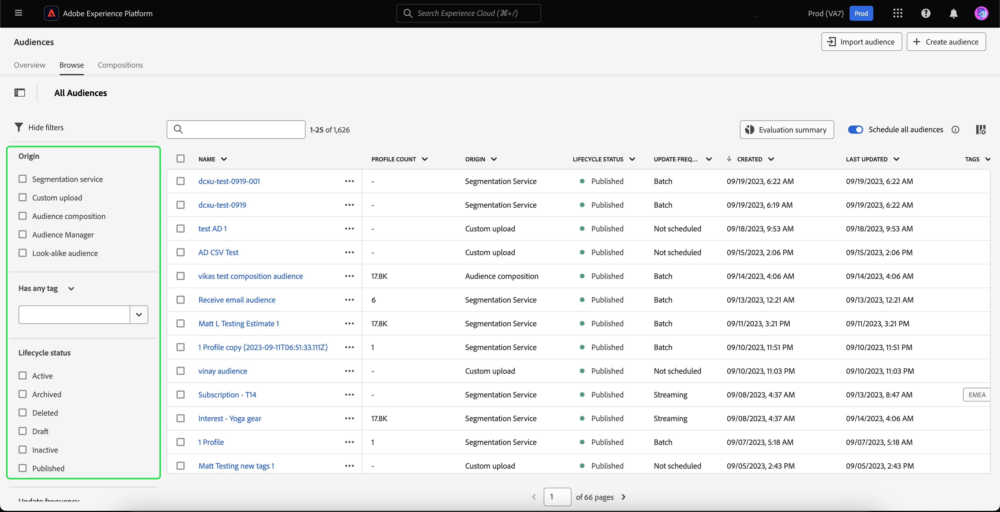
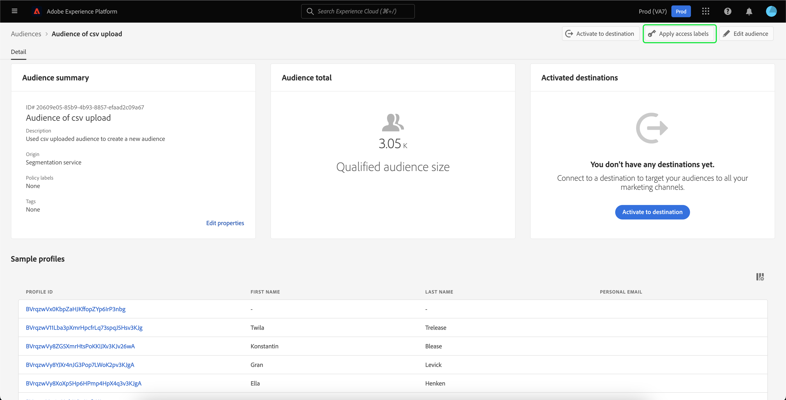
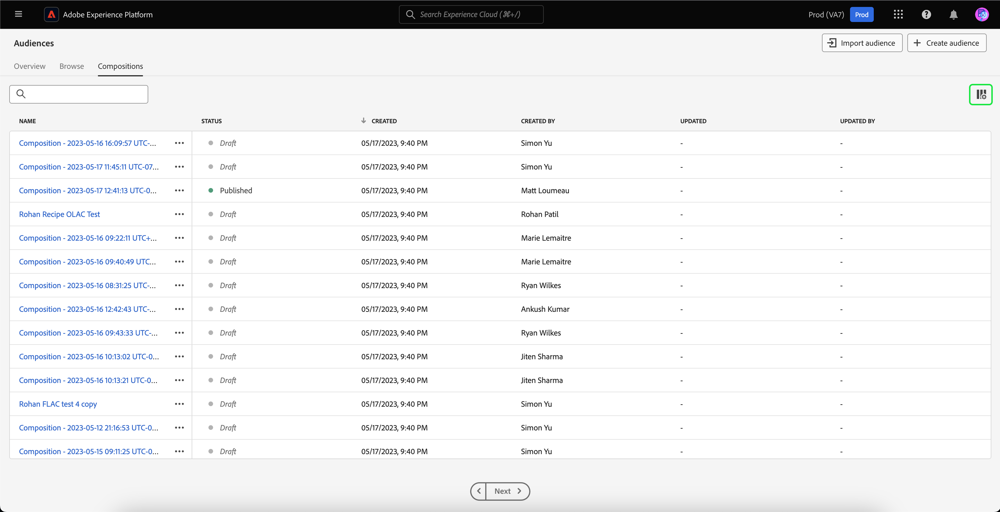

# Guía de IU del servicio de segmentación

[!DNL Adobe Experience Platform Segmentation Service] proporciona una interfaz de usuario para crear y administrar audiencias y definiciones de segmentos.

## Introducción

El trabajo con audiencias y definiciones de segmentos requiere comprender las distintas [!DNL Experience Platform] servicios relacionados con la segmentación. Antes de leer esta guía del usuario, consulte la documentación de los siguientes servicios:

- [[!DNL Segmentation Service]](../home.md): [!DNL Segmentation Service] le permite segmentar datos almacenados en [!DNL Experience Platform] que se relaciona con individuos (como clientes, clientes potenciales, usuarios u organizaciones) en grupos más pequeños.
- [[!DNL Real-Time Customer Profile]](../../profile/home.md): Proporciona un perfil de consumidor unificado y en tiempo real basado en los datos agregados de varias fuentes.
- [[!DNL Adobe Experience Platform Identity Service]](../../identity-service/home.md): Permite la creación de perfiles de clientes mediante el puente de identidades de fuentes de datos dispares que se están ingiriendo en [!DNL Platform].
- [[!DNL Experience Data Model (XDM)]](../../xdm/home.md): El marco estandarizado mediante el cual [!DNL Platform] organiza los datos de experiencia del cliente. Para utilizar mejor la segmentación, asegúrese de que sus datos se incorporan como perfiles y eventos según el [prácticas recomendadas para el modelado de datos](../../xdm/schema/best-practices.md).

También debe comprender dos términos clave que se utilizan en este documento y comprender la diferencia entre ellos:

- **Audiencia**: conjunto de personas que comparten comportamientos o características similares. Adobe Experience Platform puede generar esta colección de personas mediante las definiciones de segmentos o la composición de audiencias (audiencia generada por Platform), o a partir de fuentes externas como cargas personalizadas (audiencia generada externamente).
- **Definición del segmento**: Las reglas que utiliza Adobe Experience Platform para describir las características clave o el comportamiento de una audiencia objetivo.
- **Segmento**: Acto de separar Perfiles en audiencias.

## Información general

En la IU del Experience Platform, seleccione **[!UICONTROL Audiencias]** en la navegación izquierda para abrir **[!UICONTROL Información general]** que muestra la [!UICONTROL Audiencias] panel.

>[!NOTE]
>
>Si su organización es nueva en Platform y aún no ha creado conjuntos de datos de perfil o políticas de combinación activos, la variable [!UICONTROL Audiencias] el panel no es visible. En su lugar, la variable [!UICONTROL Información general] La pestaña muestra vínculos y documentación para ayudarle a empezar a usar las audiencias.

### [!UICONTROL Audiencias] tablero {#segments-dashboard}

El **[!UICONTROL Audiencias]** el tablero describe las métricas clave relacionadas con los datos de audiencia de su organización.

Para obtener más información, visite la [guía del panel de audiencias](../../dashboards/guides/audiences.md).

## Examinar {#browse}

>[!CONTEXTUALHELP]
>id="platform_segments_browse_churncolumnname"
>title="Pérdida"
>abstract="La pérdida representa el porcentaje de perfiles que cambian dentro de un público en comparación con la última vez que se ejecutó el trabajo del público."

>[!CONTEXTUALHELP]
>id="platform_segments_browse_evaluationmethodcolumnname"
>title="Método de evaluación"
>abstract="Los métodos de evaluación de públicos incluyen lote, streaming y Edge."

>[!CONTEXTUALHELP]
>id="platform_segments_browse_addallsegmentstoschedule"
>title="Añadir todos los públicos a la programación"
>abstract="Habilite la opción para incluir todos los públicos evaluados mediante la segmentación por lotes en la actualización programada diaria. Deshabilite para quitar todos los públicos de la actualización programada."

Seleccione el **[!UICONTROL Examinar]** para ver una lista de todas las audiencias de su organización. Esta vista muestra información sobre las audiencias, incluido el recuento de perfiles, el origen, la fecha de creación, la fecha de la última modificación, las etiquetas y el desglose.

Junto a cada audiencia hay un icono de puntos suspensivos. Al seleccionar esta opción, se muestra una lista de las acciones rápidas disponibles para la audiencia. Esta lista de acciones difiere según el origen de la audiencia.

![La lista de acciones rápidas se muestra para audiencias con el origen de [!UICONTROL Composición de audiencia].](../images/ui/overview/browse-audience-composition-details.png)

| Acción | Orígenes | Descripción |
| ------ | ------- | ----------- |
| [!UICONTROL Editar] | Servicio de segmentación | Abre el Generador de segmentos para editar la audiencia. Tenga en cuenta que si la audiencia se creó mediante la API, **no** poder editarlo con el Generador de segmentos. Para obtener más información sobre el uso del Generador de segmentos, lea la [Guía de IU del Generador de segmentos](./segment-builder.md). |
| [!UICONTROL Abrir composición] | Composición del público | Abre la composición Audiencia para ver su audiencia. Para obtener más información sobre la composición de audiencias, lea la [guía de IU de composición de audiencia](./audience-composition.md). |
| [!UICONTROL Activar en destino] | Servicio de segmentación | Activa la audiencia en un destino. Para obtener información más detallada sobre cómo activar una audiencia en un destino, lea la [información general de activación](../../destinations/ui/activation-overview.md). |
| [!UICONTROL Compartir con socios] | Composición de audiencias, carga personalizada, servicio de segmentación | Comparte la audiencia con otros usuarios de Platform. Para obtener más información acerca de esta funcionalidad, lea la [Resumen de coincidencia de segmentos](./segment-match/overview.md). |
| [!UICONTROL Administración de etiquetas] | Composición de audiencias, carga personalizada, servicio de segmentación | Administra las etiquetas definidas por el usuario que pertenecen a la audiencia. Para obtener más información acerca de esta funcionalidad, lea la sección sobre [filtrado y etiquetado](#manage-audiences). |
| [!UICONTROL Mover a carpeta] | Composición de audiencias, carga personalizada, servicio de segmentación | Administra a qué carpeta pertenece la audiencia. Para obtener más información acerca de esta funcionalidad, lea la sección sobre [filtrado y etiquetado](#manage-audiences). |
| [!UICONTROL Copiar] | Servicio de segmentación | Duplica la audiencia seleccionada. |
| [!UICONTROL Aplicar etiquetas de acceso] | Composición de audiencias, carga personalizada, servicio de segmentación | Administra las etiquetas de acceso que pertenecen a la audiencia. Para obtener más información sobre las etiquetas de acceso, lea la documentación sobre [administración de etiquetas](../../access-control/abac/ui/labels.md). |
| [!UICONTROL Publish] | Carga personalizada, servicio de segmentación | Publica la audiencia seleccionada. Para obtener más información sobre la administración del estado del ciclo vital, lea la [sección de estado del ciclo vital de las preguntas frecuentes sobre segmentación](../faq.md#lifecycle-states). |
| [!UICONTROL Desactivar] | Carga personalizada, servicio de segmentación | Desactiva la audiencia seleccionada. Para obtener más información sobre la administración del estado del ciclo vital, lea la [sección de estado del ciclo vital de las preguntas frecuentes sobre segmentación](../faq.md#lifecycle-states). |
| [!UICONTROL Eliminar] | Composición de audiencias, carga personalizada, servicio de segmentación | Elimina la audiencia seleccionada. Audiencias que se utilizan en destinos descendentes o que dependen de otras audiencias **no puede** se eliminarán. Para obtener más información sobre la eliminación de audiencias, lea la [preguntas frecuentes sobre segmentación](../faq.md#lifecycle-states). |
| [!UICONTROL Añadir a paquete] | Composición de audiencias, carga personalizada, servicio de segmentación | Mueve la audiencia entre zonas protegidas. Para obtener más información acerca de esta funcionalidad, lea la [guía de herramientas de zona protegida](../../sandboxes/ui/sandbox-tooling.md). |

En la parte superior de la página hay opciones para añadir todas las audiencias a una programación, importar una audiencia, crear una audiencia nueva y ver un desglose de la frecuencia de actualización.

Alternar **[!UICONTROL Programar todas las audiencias]** habilitará la segmentación programada. Encontrará más información sobre la segmentación programada en la [sección segmentación programada de esta guía del usuario](#scheduled-segmentation).

Seleccionar **[!UICONTROL Importar audiencia]** le permitirá importar una audiencia generada externamente. Para obtener más información sobre la importación de audiencias, lea la sección sobre [importación de una audiencia en la guía del usuario](#import-audience).

Seleccionar **[!UICONTROL Crear audiencia]** le permitirá crear una audiencia. Para obtener más información sobre la creación de audiencias, lea la sección sobre [creación de una audiencia en la guía del usuario](#create-audience).

Puede seleccionar **[!UICONTROL Actualizar resumen de frecuencia]** para mostrar un gráfico circular con la frecuencia de actualización.

Aparece un gráfico circular que muestra un desglose de las audiencias por frecuencia de actualización. El gráfico muestra la cantidad total de audiencias en el centro y el tiempo diario de evaluación por lotes en UTC en la parte inferior. Si pasa el ratón por encima de las diferentes partes de la audiencia, se mostrará el número de audiencias que pertenecen a cada tipo de frecuencia de actualización.

### Personalizar {#customize}

Puede añadir campos adicionales a la [!UICONTROL Examinar] página seleccionando . Estos campos adicionales incluyen el estado del ciclo vital, la frecuencia de actualización, la última actualización por, la descripción, la creación por y las etiquetas de acceso.

| Campo | Descripción |
| ----- | ----------- |
| [!UICONTROL Nombre] | El nombre de la audiencia. |
| [!UICONTROL Recuento de perfiles] | Número total de perfiles aptos para la audiencia. |
| [!UICONTROL Origen] | El origen de la audiencia. Indica de dónde proviene la audiencia. Los valores posibles incluyen Servicio de segmentación, Carga personalizada, Composición de audiencias y Audience Manager. |
| [!UICONTROL Estado del ciclo vital] | El estado de la audiencia. Los valores posibles para este campo incluyen `Draft`, `Inactive`, `Published`, y `Archived`. Para obtener más información sobre los estados del ciclo vital, incluidos el significado de los distintos estados y cómo mover audiencias a diferentes estados del ciclo vital, lea la [sección de estado del ciclo vital de las preguntas frecuentes sobre segmentación](../faq.md#lifecycle-status). |
| [!UICONTROL Frecuencia de actualización] | Un valor que indica la frecuencia con la que se actualizan los datos de la audiencia. Los valores posibles para este campo incluyen [!UICONTROL Lote], [!UICONTROL Transmisión], [!UICONTROL Edge], y [!UICONTROL No programado]. |
| [!UICONTROL Actualizado por última vez por] | El nombre de la persona que actualizó la audiencia por última vez. |
| [!UICONTROL Creado] | La fecha y la hora, en UTC, en que se creó la audiencia. |
| [!UICONTROL Última actualización] | La fecha y la hora, en UTC, en que se actualizó la audiencia por última vez. |
| [!UICONTROL Etiquetas] | Las etiquetas definidas por el usuario que pertenecen a la audiencia. Encontrará más información sobre estas etiquetas en la [sección sobre etiquetas](#tags). |
| [!UICONTROL Descripción] | La descripción de la audiencia. |
| [!UICONTROL Creado por] | El nombre de la persona que creó la audiencia. |
| [!UICONTROL Etiquetas de acceso] | Las etiquetas de acceso para la audiencia. Las etiquetas de acceso le permiten categorizar conjuntos de datos y campos según las políticas de uso que se aplican a esos datos. Estas etiquetas se pueden aplicar en cualquier momento, lo que proporciona flexibilidad en la forma en que se decide administrar los datos. Para obtener más información sobre las etiquetas de acceso, lea la documentación sobre [administración de etiquetas](../../access-control/abac/ui/labels.md). |
| [!UICONTROL Desglose] | El desglose del estado del perfil de la audiencia. A continuación, se puede encontrar una descripción más detallada de este desglose del estado del perfil. |

Si se selecciona desglose, la visualización muestra un gráfico de barras que describe el porcentaje de perfiles que pertenecen a cada uno de los siguientes estados de perfiles calculados: [!UICONTROL Realizado], [!UICONTROL Existente], y [!UICONTROL Saliendo]. Además, el desglose que se muestra en la [!UICONTROL Examinar] es el desglose más preciso del estado de la definición del segmento. Si este número difiere de lo que se indica en la variable [!UICONTROL Información general] , debe utilizar los números de la pestaña [!UICONTROL Examinar] como la fuente de información correcta, ya que la variable [!UICONTROL Información general] los números de las pestañas solo se actualizan una vez al día.

| Estado | Descripción |
| ------ | ----------- |
| [!UICONTROL Realizado] | El recuento de perfiles que **cualificado** para el segmento en las últimas 24 horas desde que se ejecutó el último trabajo de segmento por lotes. |
| [!UICONTROL Existente] | El recuento de perfiles que **permanecido** en el segmento en las últimas 24 horas desde que se ejecutó el último trabajo de segmento por lotes. |
| [!UICONTROL Saliendo] | El recuento de perfiles que **abandonado** el segmento en las últimas 24 horas desde que se ejecutó el último trabajo de segmento por lotes. |

Después de seleccionar los campos que desea mostrar, también puede cambiar el tamaño del ancho de las columnas mostradas. Para ello, arrastre el área entre las columnas o seleccione la opción  de la columna cuyo tamaño desea cambiar, seguido de **[!UICONTROL Cambiar tamaño de columna]**.

### Filtrado, carpetas y etiquetado {#manage-audiences}

Para mejorar la eficacia del trabajo, puede buscar audiencias existentes, añadir etiquetas definidas por el usuario a las audiencias, colocar audiencias en carpetas y filtrar las audiencias mostradas.

**Buscar** {#search}

Puede buscar audiencias existentes en hasta 9 idiomas diferentes con [!DNL Unified Search].

Para usar [!DNL Unified Search], añada el término que quiera buscar en la barra de búsqueda resaltada.

Para obtener más información acerca de [!DNL Unified Search], incluidas las funciones compatibles, lea la [Documentación de búsqueda unificada](https://experienceleague.adobe.com/docs/core-services/interface/services/search-experience-cloud.html).

**Etiquetas** {#tags}

Puede añadir etiquetas definidas por el usuario para describir, buscar y administrar mejor sus audiencias.

Para añadir una etiqueta, seleccione **[!UICONTROL Administración de etiquetas]** en la audiencia que desee etiquetar.

![El [!UICONTROL Administración de etiquetas] está seleccionado para una audiencia específica.](../images/ui/overview/browse-manage-tags.png)

El **[!UICONTROL Administración de etiquetas]** aparece la ventana emergente. En esta ventana emergente, puede seleccionar una etiqueta clasificada o una etiqueta sin clasificar.

| Tipo de etiqueta | Descripción |
| -------- | ----------- |
| Categorizado | Una etiqueta que crean y administran los administradores de su organización. |
| Sin categoría | Una etiqueta que se crea dentro de [!UICONTROL Administración de etiquetas] popover. Cualquiera puede crear o administrar este tipo de etiquetas. |

![El [!UICONTROL Administración de etiquetas] se muestra la ventana emergente. Se resaltan las opciones para elegir una categoría o una categoría sin clasificar.](../images/ui/overview/create-tag.png)

Después de añadir todas las etiquetas que desee adjuntar a la audiencia, seleccione **[!UICONTROL Guardar]**.

![En el [!UICONTROL Administración de etiquetas] En la ventana emergente, se resaltan las etiquetas añadidas.](../images/ui/overview/created-tags.png)

Para obtener más información sobre la creación y administración de etiquetas, lea la [Guía de administración de etiquetas](../../administrative-tags/ui/managing-tags.md).

**Carpetas** {#folders}

Puede colocar audiencias dentro de carpetas para mejorar la gestión de audiencias.

Para mover una audiencia a una carpeta, seleccione **[!UICONTROL Mover a carpeta]** en la audiencia que desee mover.

![El [!UICONTROL Mover a carpeta] está seleccionado para una audiencia específica.](../images/ui/overview/browse-move-to-folder.png)

El **Mover audiencia a carpeta** aparece la ventana emergente. Seleccione la carpeta a la que desee mover la audiencia y, a continuación, seleccione **[!UICONTROL Guardar]**.

Una vez que la audiencia está en una carpeta, puede elegir mostrar únicamente las audiencias que pertenecen a una carpeta específica.

**Filtrar** {#filter}

También puede filtrar las audiencias en función de diversos ajustes.

Para filtrar las audiencias disponibles, seleccione la .

Se muestra la lista de filtros disponibles.

| Filtro | Descripción |
| ------ | ----------- |
| [!UICONTROL Origen] | Le permite filtrar según el origen de la audiencia. Las opciones disponibles son Servicio de segmentación, Carga personalizada, Composición de audiencias y Audience Manager. |
| [!UICONTROL Tiene cualquier etiqueta] | Le permite filtrar por etiquetas. Puede seleccionar entre **[!UICONTROL Tiene cualquier etiqueta]** y **[!UICONTROL Tiene todas las etiquetas]**. Cuándo **[!UICONTROL Tiene cualquier etiqueta]** está seleccionada, las audiencias filtradas incluirán **cualquiera** de las etiquetas que ha agregado. Cuándo **[!UICONTROL Tiene todas las etiquetas]** está seleccionado, las audiencias filtradas deben incluir **todo** de las etiquetas que ha agregado. |
| [!UICONTROL Estado del ciclo vital] | Le permite filtrar según el estado del ciclo vital de la audiencia. Las opciones disponibles incluyen [!UICONTROL Eliminado], [!UICONTROL Borrador], [!UICONTROL Inactivo], y [!UICONTROL Publicado]. |
| [!UICONTROL Frecuencia de actualización] | Le permite filtrar según la frecuencia de actualización de la audiencia. Las opciones disponibles incluyen [!UICONTROL Programado], [!UICONTROL Continuo], y [!UICONTROL Bajo demanda]. |
| [!UICONTROL Creado por] | Le permite filtrar según la persona que creó la audiencia. |
| [!UICONTROL Fecha de creación] | Le permite filtrar según la fecha de creación de la audiencia. Puede elegir un intervalo de fechas para filtrar cuándo se creó la audiencia. |
| [!UICONTROL Fecha de modificación] | Le permite filtrar según la última fecha de modificación de la audiencia. Puede elegir un intervalo de fechas para filtrar cuándo se modificó la audiencia por última vez. |

**Acciones masivas** {#bulk-actions}

Además, puede seleccionar hasta 25 audiencias diferentes y realizar diversas acciones en estas audiencias. Estas acciones incluyen [mover a una carpeta](#folders), [edición o aplicación de una etiqueta](#tags), [aplicación de etiquetas de acceso](../../access-control/abac/ui/labels.md), y [eliminar](#browse).

Cuando se aplican acciones masivas a estas audiencias, se aplican las siguientes condiciones:

- Usted **lata** seleccione audiencias de diferentes páginas.
- Usted **no puede** elimine una audiencia que se esté usando en una activación de destino.
- Si selecciona un filtro, las audiencias seleccionadas **testamento** restablecer.

### Detalles de audiencia {#audience-details}

Para ver más detalles acerca de una audiencia específica, seleccione el nombre de una audiencia dentro de la **[!UICONTROL Examinar]** pestaña.

Aparecerá la página de detalles de la audiencia. En la parte superior, hay un resumen de la audiencia, información sobre el tamaño de audiencia cualificado, así como destinos para los que se activa el segmento.

**Resumen de audiencia** {#segment-summary}

El **[!UICONTROL Resumen de audiencia]** proporciona información como el ID, el nombre, la descripción, el origen y los detalles de los atributos.

Además, tiene la opción de activar la audiencia en un destino, aplicar etiquetas de acceso o editar/actualizar la audiencia.

Seleccionar **[!UICONTROL Activar en destino]** permite activar la audiencia en un destino. Para obtener información más detallada sobre cómo activar una audiencia en un destino, lea la [información general de activación](../../destinations/ui/activation-overview.md).

Seleccionar **[!UICONTROL Aplicar etiquetas de acceso]** permite administrar las etiquetas de acceso que pertenecen a la audiencia. Para obtener más información sobre las etiquetas de acceso, lea la documentación sobre [administración de etiquetas](../../access-control/abac/ui/labels.md).

>[!BEGINTABS]

>[!TAB Composición de público]

![Se muestra la página de detalles de la audiencia con la variable [!UICONTROL Abrir composición] botón resaltado.](../images/ui/overview/audience-details-open-composition.png)

Seleccionar **[!UICONTROL Abrir composición]** permite ver la audiencia en Composición de audiencias. Para obtener más información sobre la composición de la audiencia, lea la [Guía de IU de composición de audiencia](./audience-composition.md).

>[!TAB Carga personalizada]

![Se muestra la página de detalles de la audiencia con la variable [!UICONTROL Actualizar audiencia] botón resaltado.](../images/ui/overview/audience-details-update-audience.png)

Seleccionar **[!UICONTROL Actualizar audiencia]** permite volver a cargar una audiencia generada externamente. Para obtener más información sobre la importación de una audiencia generada externamente, lea la sección sobre [importación de una audiencia](#import-audience).

>[!TAB Servicio de segmentación]

![Se muestra la página de detalles de la audiencia con la variable [!UICONTROL Editar audiencia] botón resaltado.](../images/ui/overview/audience-details-edit-audience.png)

Seleccionar **[!UICONTROL Editar audiencia]** le permite editar su audiencia en el Generador de segmentos. Para obtener información más detallada sobre el uso de [!DNL Segment Builder] espacio de trabajo, lea la [[!DNL Segment Builder] guía del usuario](./segment-builder.md).

>[!ENDTABS]

Seleccionar **[!UICONTROL Editar propiedades]** le permitirá editar los detalles básicos de la audiencia, como el nombre, la descripción y las etiquetas.

**Audiencia total** {#audience-total}

El **[!UICONTROL Audiencia total]** Esta sección muestra el número total de perfiles aptos para la audiencia.

Las estimaciones se generan utilizando un tamaño de muestra de los datos de muestra de ese día. Si hay menos de 1 millón de entidades en su almacén de perfiles, se utiliza el conjunto de datos completo; para entre 1 y 20 millones de entidades, se utiliza 1 millón de entidades; y para más de 20 millones de entidades, se utiliza el 5% del total de entidades. Puede encontrar más información sobre la generación de estimaciones en la [sección de generación de estimaciones](../tutorials/create-a-segment.md#estimate-and-preview-an-audience) del tutorial de creación de audiencias.

**Destinos activados** {#activated-destinations}

El **[!UICONTROL Destinos activados]** Esta sección muestra los destinos para los que está activada esta audiencia.

>[!NOTE]
>
> Los destinos son una función disponible con [!DNL Adobe Real-Time Customer Data Platform]y permiten exportar datos a plataformas externas. Para obtener más información sobre los destinos, lea la [información general sobre destinos](../../destinations/home.md). Para obtener información sobre cómo activar un segmento en un destino, consulte [información general de activación](../../destinations/ui/activation-overview.md).

**Muestras de perfil** {#profile-samples}

A continuación se muestra un muestreo de perfiles aptos para el segmento, con información detallada, incluida la [!DNL Profile] ID, nombre, apellidos y correo electrónico personal.

La forma en que se activa el muestreo de datos depende del método de ingesta.

Para la ingesta por lotes, el almacén de perfiles se analiza automáticamente cada quince minutos para ver si un nuevo lote se ha ingerido correctamente desde que se ejecutó el último trabajo de muestreo. En ese caso, se analiza posteriormente el almacén de perfiles para ver si ha habido al menos un cambio del 5 % en el número de registros. Si se cumplen estas condiciones, se activa un nuevo trabajo de muestreo.

Para la ingesta de transmisión, el almacén de perfiles se analiza automáticamente cada hora para ver si ha habido al menos un cambio del 5 % en el número de registros. Si se cumple esta condición, se activa un nuevo trabajo de muestreo.

El tamaño de la muestra de la exploración depende del número total de entidades del almacén de perfiles. Estos tamaños de muestra se representan en la siguiente tabla:

| Entidades en el almacén de perfiles | Tamaño de muestra |
| ------------------------- | ----------- |
| Menos de 1 millón | Conjunto de datos completo |
| 1 a 20 millones | 1 millón |
| Más de 20 millones | 5 % del total |

Información más detallada sobre cada [!DNL Profile] se puede ver seleccionando la variable [!DNL Profile] ID. Para obtener más información sobre los detalles de un perfil, lea la [[!DNL Real-Time Customer Profile] guía del usuario](../../profile/ui/user-guide.md#profile-detail).

### Creación de una audiencia {#create-audience}

Puede seleccionar **[!UICONTROL Crear audiencia]** para crear una audiencia.

Aparece una ventana emergente que le permite elegir entre componer una audiencia o crear reglas.

**Composición de audiencia** {#audience-composition}

Seleccionar **[!UICONTROL Componer audiencias]** le lleva a Composición de audiencias. Este espacio de trabajo proporciona controles intuitivos para crear y editar audiencias, como mosaicos de arrastrar y soltar utilizados para representar diferentes acciones. Para obtener más información sobre la creación de audiencias, lea la [Guía de composición de audiencias](./audience-composition.md).

**Generador de segmentos** {#segment-builder}

Seleccionar **[!UICONTROL Generar regla]** le lleva al Generador de segmentos. Este espacio de trabajo proporciona controles intuitivos para crear y editar definiciones de segmentos, como mosaicos de arrastrar y soltar utilizados para representar las propiedades de datos. Para obtener más información sobre la creación de definiciones de segmentos, lea la [Guía del Generador de segmentos](./segment-builder.md)

### Importación de una audiencia {#import-audience}

Puede seleccionar **[!UICONTROL Importar audiencia]** para importar una audiencia generada externamente.

El **[!UICONTROL Importar CSV de audiencia]** flujo de trabajo aparece. Puede seleccionar un archivo CSV para importarlo como una audiencia generada externamente.

![En el [!UICONTROL Importar CSV de audiencia] flujo de trabajo, [!UICONTROL Arrastrar y soltar archivos] , que muestra dónde puede cargar la audiencia generada de forma externa.](../images/ui/overview/import-audience-csv.png)

>[!NOTE]
>
>La audiencia generada de forma externa **debe** estar en formato CSV, tener un **maximum** de 25 columnas y debe ser inferior a 1 GB.

Después de seleccionar el archivo CSV para importar, se muestra una lista de datos de ejemplo para esta audiencia generada externamente. Después de confirmar que los datos de ejemplo son correctos, seleccione **[!UICONTROL Siguiente]**.

El **[!UICONTROL Detalles de audiencia]** página. Puede agregar información sobre la audiencia, incluido su nombre, descripción, identidad principal y valor de área de nombres de identidad.

Al importar la audiencia generada externamente, debe seleccionar una de las columnas para que sea el campo de identidad principal y especificar el valor del área de nombres. Tenga en cuenta que se tendrán en cuenta todos los campos restantes **atributos de carga útil**. Estos atributos se tienen en cuenta **no duradero**, ya que solo se asocian a esta audiencia con fines de personalización, y son **no** conectado al perfil.

![El [!UICONTROL Detalles de audiencia] se muestra la página.](../images/ui/overview/import-audience-audience-details.png)

También puede añadir algunos detalles adicionales a la audiencia generada externamente, como asignarle un ID, definir su política de combinación o editar su tipo de datos de columna.

>[!NOTE]
>
>Si utiliza un ID de audiencia externa personalizado, debe cumplir las siguientes directrices:
>
> - It **debe** empiece por una letra (a-z o A-Z), un guion bajo (_) o un signo de dólar ($).
> - Los caracteres siguientes pueden ser alfanuméricos (a-z, A-Z, 0-9), guiones bajos (_) o signos de dólar ($).

Después de rellenar los detalles de la audiencia, seleccione **[!UICONTROL Siguiente]**.

![El [!UICONTROL Siguiente] botón resaltado en la [!UICONTROL Detalles de audiencia] página.](../images/ui/overview/import-audience-filled-details.png)

El **[!UICONTROL Revisar]** se muestra la página. Puede revisar los detalles de la audiencia recién importada y generada externamente.

![El [!UICONTROL Revisar] se muestra la página, con los detalles de la audiencia recién importada y generada externamente.](../images/ui/overview/import-audience-review-details.png)

Después de confirmar que los detalles son correctos, seleccione **[!UICONTROL Finalizar]** para importar la audiencia generada externamente en Adobe Experience Platform.

>[!IMPORTANT]
>
>De forma predeterminada, las audiencias generadas externamente tienen una caducidad de datos de 30 días. La caducidad de los datos se restablece si la audiencia se actualiza o modifica de alguna manera.
>
>Además, si la audiencia generada externamente contiene información confidencial o relacionada con la atención sanitaria, **debe** aplique las etiquetas de uso de datos necesarias antes de activarlo en cualquier destino. Para obtener más información sobre la aplicación de etiquetas de uso de datos, lea la documentación sobre [administración de etiquetas](../../access-control/abac/ui/labels.md).

## Segmentación programada {#scheduled-segmentation}

Una vez creadas las audiencias, puede evaluarlas mediante una evaluación bajo demanda o programada (continua). Evaluación significa mudarse [!DNL Real-Time Customer Profile] datos a través de trabajos de segmentos para producir las audiencias correspondientes. Una vez creadas, las audiencias se guardan y almacenan para que se puedan exportar con [!DNL Experience Platform] API.

La evaluación bajo demanda implica utilizar la API para realizar evaluaciones y generar audiencias según sea necesario, mientras que la evaluación programada (también conocida como &quot;segmentación programada&quot;) le permite crear una programación recurrente para evaluar audiencias a una hora específica (como máximo, una vez al día).

### Habilitar la segmentación programada {#enable-scheduled-segmentation}

La activación de las audiencias para la evaluación programada se puede realizar mediante la interfaz de usuario o la API. En la interfaz de usuario de, vuelva a **[!UICONTROL Examinar]** pestaña dentro de **[!UICONTROL Audiencias]** y activar **[!UICONTROL Programar todas las audiencias]**. Esto hará que todas las audiencias se evalúen según la programación establecida por su organización.

>[!NOTE]
>
>La evaluación programada se puede habilitar para zonas protegidas con un máximo de cinco (5) políticas de combinación para [!DNL XDM Individual Profile]. Si su organización tiene más de cinco políticas de combinación para [!DNL XDM Individual Profile] en un solo entorno de zona protegida, no podrá utilizar la evaluación programada.

Actualmente, los horarios solo se pueden crear con la API. Para ver los pasos detallados sobre la creación, edición y trabajo con programaciones mediante la API, siga el tutorial para evaluar y acceder a los resultados de la segmentación, específicamente la sección sobre [evaluación programada mediante la API](../tutorials/evaluate-a-segment.md#scheduled-evaluation).

## Composiciones {#compositions}

Seleccione el **[!UICONTROL Composiciones]** para ver una lista de todas las audiencias generadas a través de Composición de audiencias para su organización.

De forma predeterminada, esta vista muestra información sobre las audiencias, incluido el nombre, el estado, la fecha de creación, la fecha de creación, la fecha de última actualización y la fecha de última actualización.

Junto a cada audiencia hay un icono de puntos suspensivos. Al seleccionar esta opción, se muestra una lista de las acciones rápidas disponibles para la audiencia.

| Acción | Descripción |
| ------ | ----------- |
| Duplicar | Copia la audiencia seleccionada. |
| Administrar acceso | Administra las etiquetas de acceso que pertenecen a la audiencia. Para obtener más información sobre las etiquetas de acceso, lea la documentación sobre [administración de etiquetas](../../access-control/abac/ui/labels.md). |
| Eliminar | Elimina la audiencia seleccionada. Audiencias que se utilizan en destinos descendentes o que dependen de otras audiencias **no puede** se eliminarán. Para obtener más información sobre la eliminación de audiencias, lea la [preguntas frecuentes sobre segmentación](../faq.md#lifecycle-states). |

Puede seleccionar el  para cambiar los campos que se muestran.

Aparece una ventana emergente que enumera todos los campos que se pueden mostrar en la tabla.

| Campo | Descripción |
| ----- | ----------- | 
| [!UICONTROL Nombre] | El nombre de la audiencia. |
| [!UICONTROL Estado] | El estado de la audiencia. Los valores posibles para este campo incluyen `Draft`, `Inactive`, `Published`, y `Archived`. |
| [!UICONTROL Creado] | La hora y la fecha de creación de la audiencia. |
| [!UICONTROL Creado por] | El nombre de la persona que creó la audiencia. |
| [!UICONTROL Actualizado] | Fecha y hora en la que se actualizó la audiencia por última vez. |
| [!UICONTROL Actualizado por] | El nombre de la persona que actualizó la audiencia por última vez. |

Para ver la composición de la audiencia, seleccione el nombre de una audiencia dentro de la [!UICONTROL Audiencias] pestaña.

La página Composición de audiencia aparece con los componentes básicos que componen la audiencia. Para obtener más información sobre cómo utilizar Composición de audiencia, lea la [Guía de IU de composición de audiencia](./audience-composition.md).

## Segmentación de streaming {#streaming-segmentation}

La segmentación por streaming es la capacidad de segmentación de [!DNL Platform] en tiempo casi real, mientras se centra en la riqueza de datos. Con la segmentación por streaming, la calificación para la segmentación ahora se produce cuando los datos llegan a [!DNL Platform], aliviando la necesidad de programar y ejecutar trabajos de segmentación.

Encontrará más información sobre la segmentación de flujo continuo en la [guía del usuario de segmentación de streaming](./streaming-segmentation.md).

>[!NOTE]
>
>Para que la segmentación de streaming funcione, deberá habilitar la segmentación programada para la organización. Para obtener más información sobre la activación de la segmentación programada, consulte [la sección segmentación de streaming en esta guía del usuario](#scheduled-segmentation).

## Segmentación de Edge {#edge-segmentation}

La segmentación de Edge es la capacidad de evaluar audiencias en Platform de forma instantánea en Edge, lo que permite casos de uso de personalización de la misma página y de la siguiente.

Puede encontrar más información acerca de la segmentación de Edge en la [guía de IU de segmentación de Edge](./edge-segmentation.md)

## Infracciones de directiva

>[!NOTE]
>
>Las infracciones de directivas solo se aplican si se crea una audiencia que se ha asignado a un destino.

Una vez que haya terminado de crear su audiencia, el control de datos de Adobe Experience Platform analizará la audiencia para asegurarse de que no haya infracciones de directivas dentro de la audiencia. Consulte la [Resumen de gobernanza de datos](../../data-governance/home.md) para obtener más información.

## Pasos siguientes y recursos adicionales {#next-steps}

El [!DNL Segmentation Service] La interfaz de usuario de proporciona un flujo de trabajo enriquecido que le permite crear audiencias comercializables a partir de [!DNL Real-Time Customer Profile] datos.

Para obtener más información acerca de [!DNL Segmentation Service], siga leyendo la documentación. Para aprender a utilizar [!DNL Segmentation Service] API, lea la [[!DNL Segmentation Service] guía para desarrolladores](../api/overview.md).
