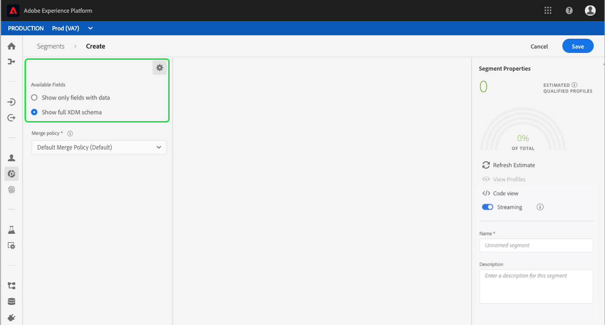

# Guía del usuario del Generador de segmentos

El servicio de segmentación de la plataforma de Adobe Experience Platform proporciona una API RESTful y una interfaz de usuario para crear definiciones de segmentos a partir de datos de Perfil del cliente en tiempo real.

## Primeros pasos

Trabajar con definiciones de segmentos requiere comprender los distintos servicios de la plataforma de experiencias que intervienen en la segmentación. Antes de leer esta guía del usuario, consulte la documentación de los siguientes servicios:

- [Servicio](../home.md)de segmentación: El servicio de segmentación permite dividir los datos almacenados en la plataforma de experiencia que se relacionan con personas (como clientes, clientes potenciales, usuarios u organizaciones) en grupos más pequeños que comparten características similares y responderán de manera similar a las estrategias de marketing.
- [Perfil](../../profile/home.md)del cliente en tiempo real: Proporciona un perfil de consumo unificado y en tiempo real basado en datos agregados de varias fuentes.
- [Servicio](../../identity-service/home.md)de identidad: Permite el Perfil del cliente en tiempo real al enlazar identidades de orígenes de datos dispares que se están ingeriendo en la plataforma.
- [Modelo de datos de experiencia (XDM)](../../xdm/home.md): El marco estandarizado por el cual Platform organiza los datos de experiencia del cliente.

También es importante conocer dos términos clave que se utilizan a través de este documento y comprender la diferencia entre ellos:
- **Definición** del segmento: Conjunto de reglas utilizado para describir las características o los comportamientos clave de una audiencia de destinatario.
- **Audiencia**: Conjunto resultante de perfiles que cumplen los criterios de una definición de segmento.

## Acceso a las definiciones de segmentos

Para empezar a trabajar con definiciones de segmentos en Adobe Experience Platform, haga clic en **Segmentos** en el panel de navegación izquierdo. Para ver todas las definiciones de segmentos de su organización, haga clic en la ficha *Examinar* . Esta vista lista información sobre la definición del segmento, incluido el método de evaluación, la fecha de creación y la fecha de la última modificación.

El método de evaluación puede ser de flujo continuo o por lotes. Los segmentos de flujo se evalúan constantemente a medida que los datos entran en el sistema. Los segmentos por lotes se evalúan según una programación establecida.

Los segmentos de lote tienen información adicional que muestra tanto la fecha de la última evaluación como la siguiente fecha de evaluación del lote.

Al hacer clic en **Crear segmento** en la esquina superior derecha se abre el espacio de trabajo del Generador de segmentos, donde puede empezar a crear una definición de segmento.

## Espacio de trabajo Generador de segmentos

El Generador de segmentos proporciona un espacio de trabajo enriquecido que le permite interactuar con elementos de datos de Perfil. El espacio de trabajo proporciona controles intuitivos para crear y editar reglas, como mosaicos de arrastrar y soltar utilizados para representar propiedades de datos.

## Componentes básicos de definición de segmentos

Los componentes básicos de las definiciones de segmentos son **Atributos** y **Eventos**. Además, los atributos y eventos contenidos en **Audiencias** existentes también pueden utilizarse como componentes para nuevas definiciones.

Puede ver estos bloques de creación en la sección *Campos* de la izquierda del espacio de trabajo del Generador de segmentos. *Campos* contiene una ficha para cada uno de los componentes principales: **Atributos**, **Eventos** y **Audiencias**.

### Atributos

La ficha **Atributos** permite examinar los atributos de Perfil que pertenecen a la clase de Perfil XDM Individual. Cada carpeta se puede expandir para mostrar atributos adicionales, donde cada atributo es un mosaico que se puede arrastrar al lienzo del generador de reglas en el centro del espacio de trabajo. El lienzo [del generador de](#rule-builder-canvas) reglas se describe con más detalle más adelante en esta guía.

### Eventos

La ficha **Eventos** le permite crear una audiencia basada en eventos o acciones que se hayan realizado con elementos de datos XDM ExperienceEvent. También puede encontrar Tipos de evento en la ficha **Eventos** , que son una colección de eventos de uso común que le permiten crear sus segmentos más rápidamente.

Además de poder buscar elementos de ExperienceEvent, también puede buscar Tipos de evento. Los Tipos de evento utilizan la misma lógica de codificación que ExperienceEvents, sin que sea necesario buscar en la clase ExperienceEvent XDM buscando el evento correcto. Por ejemplo: si se utiliza la barra de búsqueda para buscar &quot;carro&quot;, se devuelven los Tipos de evento &quot;AddCart&quot; y &quot;RemoveCart&quot;, que son dos acciones del carro de compras que se utilizan con mucha frecuencia al generar definiciones de segmentos.

Se puede buscar cualquier tipo de componente escribiendo su nombre en la barra de búsqueda, que utiliza la sintaxis [de búsqueda de](https://docs.microsoft.com/en-us/azure/search/query-lucene-syntax)Lucene. Los resultados de búsqueda comienzan a llenarse a medida que se ingresan palabras completas. Por ejemplo, para generar una regla basada en el campo XDM `ExperienceEvent.commerce.productViews`, escriba &quot;vistas de producto&quot; en el inicio de búsqueda. Una vez escrita la palabra &quot;producto&quot;, comienzan a aparecer los resultados de la búsqueda. Cada resultado incluye la jerarquía de objetos a la que pertenece.

>[!NOTE] Los campos de esquema personalizados definidos por su organización pueden tardar hasta 24 horas en aparecer y estar disponibles para su uso en la creación de reglas.

A continuación, puede arrastrar y soltar fácilmente eventos y Tipos de evento de experiencia en la definición del segmento.

De forma predeterminada, solo se muestran los campos de esquema rellenados del almacén de datos. Esto incluye Tipos de evento. Si la lista Tipos de evento no está visible o sólo puede seleccionar &quot;Cualquiera&quot; como Tipo de evento, haga clic en el icono de engranaje situado junto a *Campos* y, a continuación, seleccione **Mostrar esquema** XDM completo en Campos ** disponibles. Vuelva a hacer clic en el icono de engranaje para volver a la ficha *Campos* y debería poder realizar la vista de varios Tipos de evento y campos de esquema, independientemente de si contienen datos o no.

### Audiencias

La ficha **Audiencias** lista todas las audiencias importadas de fuentes externas, como Adobe Audiencia Manager, así como las audiencias creadas en Experience Platform.

En la ficha Audiencias, puede ver todos los orígenes disponibles como un grupo de carpetas. Al hacer clic en estas carpetas, se pueden ver las subcarpetas y audiencias disponibles. Además, puede hacer clic en el icono de la carpeta (como se muestra en la imagen de la parte extrema derecha) para vista de la estructura de la carpeta (una marca de verificación indica la carpeta en la que se encuentra actualmente) y volver a las carpetas fácilmente haciendo clic en el nombre de la carpeta en el árbol.

Puede pasar el ratón por encima del ⓘ junto a una audiencia para obtener información de vista sobre la audiencia, incluido su ID, descripción y la jerarquía de carpetas, para localizar la audiencia.

También puede buscar Audiencias mediante la barra de búsqueda, que utiliza la sintaxis [de búsqueda de](https://docs.microsoft.com/en-us/azure/search/query-lucene-syntax)Lucene. En la ficha *Audiencias* , al seleccionar una carpeta de nivel superior, aparece la barra de búsqueda, lo que le permite buscar dentro de esa carpeta. Los resultados de la búsqueda sólo comienzan a completarse una vez ingresadas las palabras completas. Por ejemplo, para buscar una Audiencia con el nombre `Online Shoppers`, escriba &quot;En línea&quot; en el inicio de búsqueda. Una vez que la palabra &quot;En línea&quot; se ha escrito en su totalidad, aparecen los resultados de búsqueda que contienen la palabra &quot;en línea&quot;.

## Lienzo del generador de reglas

Una definición de segmento es un conjunto de reglas que se utilizan para describir las características clave o el comportamiento de una audiencia de destinatario. Estas reglas se crean con el lienzo *del* generador de reglas, ubicado en el centro del Generador de segmentos.

Para agregar una nueva regla a la definición del segmento, arrastre un mosaico desde la ficha *Campos* y suéltelo en el lienzo del generador de reglas. A continuación, se le presentarán opciones específicas del contexto según el tipo de datos que se agrega. Los tipos de datos disponibles incluyen: cadenas, fechas, eventos de experiencia, Tipos de evento y Audiencias.

### Añadir audiencias

Puede arrastrar y soltar una audiencia de la ficha *Audiencia* en el lienzo del generador de reglas para hacer referencia a la pertenencia a la audiencia en la nueva definición del segmento. Esto le permite incluir o excluir la pertenencia a una audiencia como un atributo en la nueva regla de segmento.

Para las audiencias de plataforma creadas con el Generador de segmentos, se le ofrece la opción de convertir la audiencia en el conjunto de reglas que se utilizaron en la definición de segmento para esa audiencia. Esta conversión hace una copia de la lógica de regla, que se puede modificar sin afectar a la definición del segmento original.

>[!NOTE] Al agregar una audiencia desde un origen externo, solo se hace referencia a la pertenencia a la audiencia. No puede convertir la audiencia en reglas y, por lo tanto, las reglas utilizadas para crear la audiencia original no se pueden modificar en la nueva definición de segmento.

## Contenedores

Las reglas de segmentos se evalúan en el orden en que aparecen en la lista. Los Contenedores permiten controlar el orden de ejecución mediante el uso de consultas anidadas.

Una vez que haya agregado al menos un mosaico al lienzo del generador de reglas, puede empezar a agregar contenedores. Para crear un nuevo contenedor, haga clic en las elipses (...) en la esquina superior derecha del mosaico y, a continuación, haga clic en **Añadir contenedor**.

Un nuevo contenedor aparece como el secundario del primer contenedor, pero puede ajustar la jerarquía arrastrando y moviendo los contenedores. El comportamiento predeterminado de un contenedor es &quot;Incluir&quot; el atributo, el evento o la audiencia proporcionados. Puede configurar la regla en perfiles &quot;Excluir&quot; que coincidan con los criterios de contenedor haciendo clic en **Incluir** en la esquina superior izquierda del mosaico y seleccionando &quot;Excluir&quot;.

Un contenedor secundario también se puede extraer y agregar en línea al contenedor principal haciendo clic en &quot;Desajustar contenedor&quot; en el contenedor secundario. Haga clic en las elipses (...) en la esquina superior derecha del contenedor secundario para acceder a esta opción.

Una vez que haga clic en **Desajustar contenedor** , se eliminará el contenedor secundario y los criterios aparecerán en línea.

>[!NOTE] Al desajustar contenedores, tenga cuidado de que la lógica siga cumpliendo con la definición de segmento deseada.

## Combinar directivas

La plataforma de experiencias le permite reunir datos de varias fuentes y combinarlos para ver una vista completa de cada uno de sus clientes individuales. Al reunir estos datos, las políticas de combinación son las reglas que utiliza la Plataforma para determinar cómo se priorizarán los datos y qué datos se combinarán para crear un perfil.

Puede seleccionar una directiva de combinación que coincida con el propósito de marketing de esta audiencia o utilizar la directiva de combinación predeterminada proporcionada por Platform. Puede crear varias directivas de combinación exclusivas para su organización, incluida la creación de su propia directiva de combinación predeterminada. Para obtener instrucciones paso a paso sobre la creación de políticas de combinación para su organización, consulte el tutorial sobre el [trabajo con políticas de combinación mediante la interfaz de usuario](../../profile/ui/merge-policies.md).

Para seleccionar una directiva de combinación para la definición del segmento, haga clic en el icono de engranaje de la ficha *Campos* y, a continuación, utilice el menú *desplegable* Combinar directiva para seleccionar la directiva de combinación que desee utilizar.

## Propiedades del segmento

Al crear una definición de segmento, la sección Propiedades *del* segmento en el lado derecho del espacio de trabajo muestra una estimación del tamaño del segmento resultante, lo que le permite ajustar la definición del segmento según sea necesario antes de crear la propia audiencia.

En la sección Propiedades ** del segmento también puede especificar información importante sobre la definición del segmento, incluidos su *nombre* y *descripción*. Los nombres de definiciones de segmentos se utilizan para identificar el segmento entre los definidos por su organización y, por lo tanto, deben ser descriptivos, concisos y únicos.

A medida que siga generando la definición del segmento, puede realizar la vista de una previsualización paginada de la audiencia seleccionando Perfiles **de** Vista.

>[!NOTE] Las estimaciones de Audiencia se generan utilizando un tamaño de muestra de los datos de muestra de ese día. Si hay menos de un millón de entidades en el almacén de perfiles, se utiliza el conjunto completo de datos; para entre 1 y 20 millones de entidades se utilizan 1 millón de entidades; y para más de 20 millones de entidades se utiliza el 5% del total. Encontrará más información sobre la generación de estimaciones de segmentos en la sección [de generación de](../tutorials/create-a-segment.md#estimate-and-preview-an-audience) estimaciones del tutorial de creación de segmentos.

## Habilitar la segmentación programada

Una vez creadas las definiciones de segmentos, puede evaluarlas mediante una evaluación a pedido o programada (continua). La evaluación significa mover los datos de Perfil del cliente en tiempo real a través de definiciones de segmentos para producir las audiencias correspondientes. Una vez creadas, las audiencias se guardan y almacenan para que se puedan exportar mediante las API de la plataforma de experiencia.

La evaluación a petición implica el uso de la API para realizar evaluaciones y generar audiencias según sea necesario, mientras que la evaluación programada (también conocida como &#39;segmentación programada&#39;) permite crear una programación recurrente para evaluar definiciones de segmentos a una hora específica (como máximo, una vez al día).

La activación de las definiciones de segmentos para la evaluación programada se puede realizar mediante la interfaz de usuario o la API. En la interfaz de usuario, vuelva a la ficha *Examinar* dentro de **Segmentos** y seleccione **Evaluar todos los segmentos**. Esto hará que todos los segmentos se evalúen según la programación establecida por su organización.

>[!NOTE] La evaluación programada puede habilitarse para entornos limitados con un máximo de cinco (5) directivas de combinación para Perfiles individuales XDM. Si su organización cuenta con más de cinco directivas de combinación para Perfiles individuales XDM dentro de un solo entorno de simulador de pruebas, no podrá usar la evaluación programada.

Actualmente, las programaciones solo se pueden crear mediante la API. Para ver los pasos detallados sobre cómo crear, editar y trabajar con programaciones mediante la API, siga el tutorial para evaluar y acceder a los resultados del segmento, específicamente la sección sobre evaluación [programada mediante la API](../tutorials/evaluate-a-segment.md#scheduled-evaluation).

## Habilitar la segmentación de flujo continuo

>[!NOTE] La segmentación por flujo continuo es una función beta y está disponible bajo petición.

Además, se puede habilitar una definición de segmento para la segmentación de flujo continuo antes o después de que se haya creado. La segmentación por flujo continuo evalúa instantáneamente a un cliente en cuanto un evento entra en un grupo de segmentos en particular. Con esta capacidad, la mayoría de las reglas de segmentos ahora se pueden evaluar a medida que los datos se pasan a la plataforma, lo que significa que la pertenencia a segmentos se mantendrá actualizada sin ejecutar trabajos de segmentación programados. Para obtener información más detallada sobre la segmentación de flujo continuo, lea la documentación [de segmentación de](../api/streaming-segmentation.md)flujo continuo.

La activación de las definiciones de segmentos para flujo continuo se puede realizar mediante la interfaz de usuario o la API. Para activar una definición de segmento nueva o existente para flujo continuo en la interfaz de usuario, debe alternar la opción *Flujo* a **Activado**.

Una vez habilitada la segmentación de flujo, se debe establecer una línea de base (es la ejecución inicial después de la cual el segmento siempre estará actualizado). El sistema gestiona automáticamente el baseling, pero esto solo es posible si se ha habilitado la segmentación programada. Para obtener más información sobre cómo habilitar la segmentación programada, consulte [la sección anterior de esta guía](#enable-scheduled-segmentation)del usuario.

## Pasos siguientes

El Generador de segmentos proporciona un flujo de trabajo enriquecido que le permite aislar audiencias comercializables de los datos de Perfil del cliente en tiempo real. Después de leer esta guía, debería poder:

- Cree definiciones de segmentos mediante una combinación de atributos, eventos y audiencias existentes como componentes básicos.
- Utilice el lienzo y los contenedores del generador de reglas para controlar el orden en que se ejecutan las reglas de segmentos.
- Estimaciones de Vista de su audiencia potencial, permitiéndole ajustar las definiciones de segmentos según sea necesario.
- Habilite todas las definiciones de segmentos para la segmentación programada.
- Active las definiciones de segmentos especificadas para la segmentación de flujo continuo.

Para obtener instrucciones paso a paso sobre cómo trabajar con el servicio de segmentación mediante la API de Perfil del cliente en tiempo real, consulte el tutorial sobre la [creación de segmentos de audiencia mediante APIs](../tutorials/create-a-segment.md) .